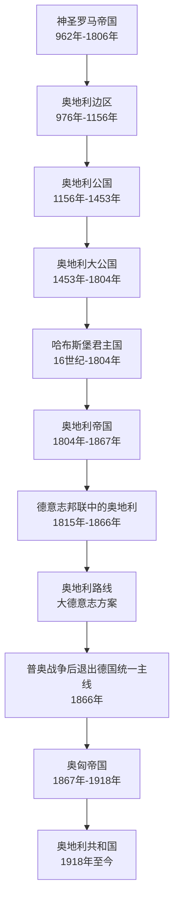

# 奥地利历史

[返回德意志历史](/%E4%BA%BA%E6%96%87%E7%A7%91%E5%AD%A6/%E5%8E%86%E5%8F%B2/%E6%AC%A7%E6%B4%B2/%E5%BE%B7%E6%84%8F%E5%BF%97/README.md)

奥地利是德意志世界的重要分支，长期处在神圣罗马帝国和德意志邦联的核心位置。1866年普奥战争后，奥地利被排除出普鲁士主导的德意志统一进程，随后转向奥匈帝国和现代奥地利共和国的发展路径。

| 顺序 | 阶段 | 时间 | 简要概括 |
| --- | --- | --- | --- |
| 1 | [奥地利边区](/%E4%BA%BA%E6%96%87%E7%A7%91%E5%AD%A6/%E5%8E%86%E5%8F%B2/%E6%AC%A7%E6%B4%B2/%E5%BE%B7%E6%84%8F%E5%BF%97/%E5%A5%A5%E5%9C%B0%E5%88%A9/%E5%A5%A5%E5%9C%B0%E5%88%A9%E8%BE%B9%E5%8C%BA.md) | 976年-1156年 | 神圣罗马帝国东部边区，是奥地利政治实体的早期形态。 |
| 2 | [奥地利公国](/%E4%BA%BA%E6%96%87%E7%A7%91%E5%AD%A6/%E5%8E%86%E5%8F%B2/%E6%AC%A7%E6%B4%B2/%E5%BE%B7%E6%84%8F%E5%BF%97/%E5%A5%A5%E5%9C%B0%E5%88%A9/%E5%A5%A5%E5%9C%B0%E5%88%A9%E5%85%AC%E5%9B%BD.md) | 1156年-1453年 | 奥地利由边区升格为公国。 |
| 3 | [奥地利大公国](/%E4%BA%BA%E6%96%87%E7%A7%91%E5%AD%A6/%E5%8E%86%E5%8F%B2/%E6%AC%A7%E6%B4%B2/%E5%BE%B7%E6%84%8F%E5%BF%97/%E5%A5%A5%E5%9C%B0%E5%88%A9/%E5%A5%A5%E5%9C%B0%E5%88%A9%E5%A4%A7%E5%85%AC%E5%9B%BD.md) | 1453年-1804年 | 哈布斯堡家族核心领地，长期影响神圣罗马帝国。 |
| 4 | [哈布斯堡君主国](/%E4%BA%BA%E6%96%87%E7%A7%91%E5%AD%A6/%E5%8E%86%E5%8F%B2/%E6%AC%A7%E6%B4%B2/%E5%BE%B7%E6%84%8F%E5%BF%97/%E5%A5%A5%E5%9C%B0%E5%88%A9/%E5%93%88%E5%B8%83%E6%96%AF%E5%A0%A1%E5%90%9B%E4%B8%BB%E5%9B%BD.md) | 16世纪-1804年 | 哈布斯堡家族统治下的复合君主国。 |
| 5 | [奥地利帝国](/%E4%BA%BA%E6%96%87%E7%A7%91%E5%AD%A6/%E5%8E%86%E5%8F%B2/%E6%AC%A7%E6%B4%B2/%E5%BE%B7%E6%84%8F%E5%BF%97/%E5%A5%A5%E5%9C%B0%E5%88%A9/%E5%A5%A5%E5%9C%B0%E5%88%A9%E5%B8%9D%E5%9B%BD.md) | 1804年-1867年 | 神圣罗马帝国末期建立，后在德意志邦联中与普鲁士竞争。 |
| 6 | [奥匈帝国](/%E4%BA%BA%E6%96%87%E7%A7%91%E5%AD%A6/%E5%8E%86%E5%8F%B2/%E6%AC%A7%E6%B4%B2/%E5%BE%B7%E6%84%8F%E5%BF%97/%E5%A5%A5%E5%9C%B0%E5%88%A9/%E5%A5%A5%E5%8C%88%E5%B8%9D%E5%9B%BD.md) | 1867年-1918年 | 普奥战争后奥地利转向多民族帝国路径。 |
| 7 | [奥地利共和国](/%E4%BA%BA%E6%96%87%E7%A7%91%E5%AD%A6/%E5%8E%86%E5%8F%B2/%E6%AC%A7%E6%B4%B2/%E5%BE%B7%E6%84%8F%E5%BF%97/%E5%A5%A5%E5%9C%B0%E5%88%A9/%E5%A5%A5%E5%9C%B0%E5%88%A9%E5%85%B1%E5%92%8C%E5%9B%BD.md) | 1918年至今 | 一战后形成现代奥地利国家。 |

## 完整世系与国家领导

- [奥地利统治者世系与国家领导表](/%E4%BA%BA%E6%96%87%E7%A7%91%E5%AD%A6/%E5%8E%86%E5%8F%B2/%E6%AC%A7%E6%B4%B2/%E5%BE%B7%E6%84%8F%E5%BF%97/%E5%A5%A5%E5%9C%B0%E5%88%A9/%E5%A5%A5%E5%9C%B0%E5%88%A9%E7%BB%9F%E6%B2%BB%E8%80%85%E4%B8%96%E7%B3%BB%E4%B8%8E%E5%9B%BD%E5%AE%B6%E9%A2%86%E5%AF%BC%E8%A1%A8.md)：从976年巴本堡边侯起，列出公爵、大公、哈布斯堡复合君主国、奥地利与奥匈皇帝，并把共和国国家元首、政府首脑、代理和吞并期权力断裂分表整理。

## 重要转折与时间节点

| 时间 | 转折 | 历史意义 |
| --- | --- | --- |
| 976 | 巴本堡获得东部边区 | 连续奥地利领地政治的起点。 |
| 1156 | 《小特权》 | 边区升为公国并取得特殊继承安排。 |
| 1246—1282 | 巴本堡绝嗣与继承争夺 | 奥托卡二世短暂控制后，哈布斯堡取得奥地利。 |
| 1453 | 大公称号确认 | 哈布斯堡提升奥地利世袭领等级。 |
| 1526 | 波希米亚、匈牙利王冠继承 | 复合君主国形成。 |
| 1618—1648 | 三十年战争 | 王朝在世袭领和波希米亚强化统治，帝国宪制更趋邦权化。 |
| 1683—1699 | 维也纳解围与大土耳其战争 | 哈布斯堡取得大部分匈牙利。 |
| 1740—1763 | 继承战争与七年战争 | 玛丽亚·特蕾西亚保住王位但失西里西亚，改革国家形成。 |
| 1804 / 1806 | 奥地利帝国与旧帝国终结 | 哈布斯堡以奥地利皇帝称号重组王朝合法性。 |
| 1848 | 革命与农奴义务废除 | 政治革命被镇压，社会制度不可逆改变。 |
| 1866 / 1867 | 普奥失败与奥匈折衷 | 退出德国统一，转为双元君主国。 |
| 1918 | 帝国解体 | 共和国建立。 |
| 1933—1938 | 威权统治与德国吞并 | 第一共和国民主崩溃，国家一度消失。 |
| 1945 / 1955 | 第二共和国、国家条约与中立 | 重建民主并恢复主权。 |
| 1995 | 加入欧洲联盟 | 中立国家进入欧洲法律经济一体化。 |
| 2025—2026 | 施托克尔政府 | 三党联盟执政；截至2026-07-14范德贝伦总统与施托克尔总理在任。 |
