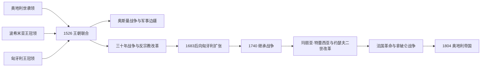

# 哈布斯堡君主国

## 时间

16世纪-1804年

## 概括

哈布斯堡君主国是哈布斯堡家族统治下由多块领地组成的复合君主国，不是单一民族国家。它以奥地利大公国为核心，逐步包括波希米亚、匈牙利、克罗地亚以及其他中欧和东南欧领地。

## 说明

- 哈布斯堡家族以奥地利为核心，在神圣罗马帝国内长期拥有皇帝地位。
- 1526年莫哈奇战役后，哈布斯堡取得波希米亚和匈牙利王冠，形成更大的中欧复合君主国。
- 哈布斯堡君主国包含德意志、捷克、匈牙利、克罗地亚、意大利等不同语言和法律传统的地区。
- 该君主国通过王朝继承、婚姻联盟、战争和条约维系，而不是通过统一民族国家制度维系。
- 18世纪玛丽亚·特蕾西亚和约瑟夫二世推行行政、军事和财政改革，增强中央控制。
- 拿破仑战争冲击神圣罗马帝国秩序，促使弗朗茨二世在1804年建立奥地利帝国。

## 关键君主

| 类型 | 人物 | 时间 | 说明 |
| --- | --- | --- | --- |
| 复合君主国奠基者 | 斐迪南一世 | 1526以后 | 取得波希米亚和匈牙利王冠，扩展中欧复合君主国。 |
| 改革时期君主 | 玛丽亚·特蕾西亚 | 1740-1780 | 推动行政、军事和财政改革。 |
| 改革时期君主 | 约瑟夫二世 | 1765-1790；1780后单独统治 | 启蒙专制改革的重要代表。 |
| 转型时期君主 | 弗朗茨二世 / 弗朗茨一世 | 1792-1804；1804后为奥地利皇帝 | 拿破仑战争中建立奥地利帝国。 |

## 演变关系

- 前一节点：[奥地利大公国](/%E4%BA%BA%E6%96%87%E7%A7%91%E5%AD%A6/%E5%8E%86%E5%8F%B2/%E6%AC%A7%E6%B4%B2/%E5%BE%B7%E6%84%8F%E5%BF%97/%E5%A5%A5%E5%9C%B0%E5%88%A9/%E5%A5%A5%E5%9C%B0%E5%88%A9%E5%A4%A7%E5%85%AC%E5%9B%BD.md)。
- 后一节点：[奥地利帝国](/%E4%BA%BA%E6%96%87%E7%A7%91%E5%AD%A6/%E5%8E%86%E5%8F%B2/%E6%AC%A7%E6%B4%B2/%E5%BE%B7%E6%84%8F%E5%BF%97/%E5%A5%A5%E5%9C%B0%E5%88%A9/%E5%A5%A5%E5%9C%B0%E5%88%A9%E5%B8%9D%E5%9B%BD.md)。
- 相关节点：[神圣罗马帝国](/%E4%BA%BA%E6%96%87%E7%A7%91%E5%AD%A6/%E5%8E%86%E5%8F%B2/%E6%AC%A7%E6%B4%B2/%E5%BE%B7%E6%84%8F%E5%BF%97/%E7%A5%9E%E5%9C%A3%E7%BD%97%E9%A9%AC%E5%B8%9D%E5%9B%BD/README.md)。

## 名称与建立机制

“哈布斯堡君主国”是后人概括，不是1526年颁布的统一国号。斐迪南一世分别凭奥地利世袭权、波希米亚等级选举及匈牙利继承主张统治多组领地；每组领地保留议会、法律、官职、税制和身份。共同点是同一王朝君主、宫廷外交、战争压力及逐渐扩大的中央机关。

匈牙利王位并未在1526年立即完整取得。扎波尧·亚诺什也获一部分等级选举，奥斯曼苏丹支持其政权；1541年后中部匈牙利由奥斯曼直接统治，哈布斯堡掌西北“王家匈牙利”，特兰西瓦尼亚保持附庸自治。军事边疆由国家直接组织定居军户，成为长期对奥斯曼防线。

## 宗教改革、波希米亚起义与三十年战争

新教在奥地利、波希米亚和匈牙利广泛传播，等级以纳税和承认继承换取宗教权利。斐迪南二世的强硬天主教化与波希米亚王位争端引发1618年起义。白山战役后王室处决、流放反对贵族，没收领地，1627年波希米亚新宪制强化世袭王权；战争随后扩展为欧洲冲突。

1648年和约限制皇帝在帝国内的集中化，却不阻止哈布斯堡在自己世袭领和波希米亚加强王权。复合君主国内部因此出现“帝国邦权受限、王朝领地较集中”的差异。

## 对奥斯曼战争与领土扩张

1683年维也纳解围后，哈布斯堡、波兰和威尼斯等组成神圣同盟。1699年《卡尔洛维茨和约》使大部分匈牙利转入哈布斯堡，1718年一度进一步扩张。新领地要恢复农业、安置移民、处理贵族权利与军事边疆，匈牙利等级反对中央化，1703—1711年拉科齐起义即为重要冲突。

## 继承危机与改革国家

查理六世缺乏男性继承人，以1713年《国事诏书》宣布领地不可分并允许女儿继承，花费数十年争取国内外承认。1740年玛丽亚·特蕾西亚继位仍引发战争，普鲁士夺取西里西亚。战争迫使她改革税务、军队、官僚和教育，使奥地利、波希米亚核心更紧密，却仍未取消匈牙利宪制。

约瑟夫二世试图以德语行政、宗教宽容、农奴改革和统一税制加速国家化，因忽视地方协商在匈牙利、尼德兰等地遇强烈抵抗，临终撤回多项法令。改革揭示复合君主国的根本张力：提高统一动员能力与维护多地合法特权之间难以同时满足。

## 重要事件与统治结构

| 时间 | 事件 | 长期影响 |
| --- | --- | --- |
| 1526 | 波希米亚与匈牙利继承 | 复合君主国形成。 |
| 1529 | 第一次维也纳围城 | 对奥斯曼军事边疆长期化。 |
| 1618—1620 | 波希米亚起义与白山战役 | 王权与天主教化加强，三十年战争爆发。 |
| 1683—1699 | 维也纳解围与大土耳其战争 | 哈布斯堡取得大部分匈牙利。 |
| 1703—1711 | 拉科齐起义 | 匈牙利特权以妥协方式保留。 |
| 1713 | 《国事诏书》 | 女系继承与领地不可分原则。 |
| 1740—1748 | 奥地利王位继承战争 | 玛丽亚·特蕾西亚保位，西里西亚归普鲁士。 |
| 1756—1763 | 七年战争 | 未能收复西里西亚，普奥双强格局固定。 |
| 1780—1790 | 约瑟夫改革 | 国家能力提升与地方反弹并存。 |
| 1792—1804 | 法国革命战争 | 旧帝国和复合称号面临生存压力。 |

## 崛起、鼎盛与转型原因

哈布斯堡崛起依靠婚姻继承、帝号声望、奥斯曼威胁下的共同防务和多地区资源互补。1683后取得匈牙利与18世纪改革构成鼎盛条件。结构弱点是领地法律繁复、中央税军不足、民族和等级利益不同、对外同时面对法国、普鲁士、奥斯曼与俄国。1804年转为奥地利帝国是面对拿破仑皇帝称号和神圣罗马帝国可能解体的预防性重组，而非王朝被推翻。完整共同君主见[奥地利统治者世系与国家领导表](/%E4%BA%BA%E6%96%87%E7%A7%91%E5%AD%A6/%E5%8E%86%E5%8F%B2/%E6%AC%A7%E6%B4%B2/%E5%BE%B7%E6%84%8F%E5%BF%97/%E5%A5%A5%E5%9C%B0%E5%88%A9/%E5%A5%A5%E5%9C%B0%E5%88%A9%E7%BB%9F%E6%B2%BB%E8%80%85%E4%B8%96%E7%B3%BB%E4%B8%8E%E5%9B%BD%E5%AE%B6%E9%A2%86%E5%AF%BC%E8%A1%A8.md)。
