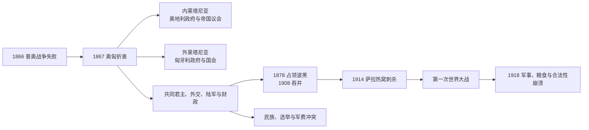

# 奥匈帝国

## 时间

1867年-1918年

## 概括

奥匈帝国是1867年奥地利-匈牙利妥协后形成的二元君主国，由奥地利帝国和匈牙利王国在同一君主下组成。它是多民族帝国，长期面临民族自治、帝国整合和巴尔干问题，最终在第一次世界大战后解体。

## 说明

- 1867年，奥地利与匈牙利达成妥协，建立奥匈二元君主国。
- 奥匈帝国由奥地利部分和匈牙利部分构成，共同拥有君主、外交、军事和部分财政事务。
- 帝国内有德意志人、匈牙利人、捷克人、斯洛伐克人、波兰人、乌克兰人、克罗地亚人、塞尔维亚人、罗马尼亚人、意大利人等多个民族。
- 奥匈帝国不再是德国统一主线的一部分，而是德意志世界中的奥地利分支转向中欧和东南欧帝国路径。
- 1908年奥匈吞并波斯尼亚和黑塞哥维那，加剧巴尔干紧张。
- 1914年萨拉热窝事件后，奥匈对塞尔维亚采取军事行动，引发第一次世界大战。
- 1918年战败后，帝国解体，奥地利、匈牙利、捷克斯洛伐克、南斯拉夫等国家或政治实体相继出现。

## 君主世系

| 顺序 | 君主 | 在位时间 | 说明 |
| ---: | --- | --- | --- |
| 1 | 弗朗茨·约瑟夫一世 | 1867-1916 | 奥匈二元君主国的长期皇帝兼国王。 |
| 2 | 卡尔一世 | 1916-1918 | 奥匈帝国末代君主。 |

## 政府首脑

| 类型 | 官职 | 时间 | 说明 |
| --- | --- | --- | --- |
| 奥地利政府首脑 | 奥地利首相 / 首相会议主席 | 1867-1918 | 负责帝国奥地利部分行政。 |
| 匈牙利政府首脑 | 匈牙利首相 | 1867-1918 | 负责匈牙利王国行政。 |
| 共同事务首脑 | 共同外交、军事、财政大臣 | 1867-1918 | 二元君主国只在外交、军事和部分财政上设共同机构。 |

## 演变关系

- 前一节点：[奥地利帝国](/%E4%BA%BA%E6%96%87%E7%A7%91%E5%AD%A6/%E5%8E%86%E5%8F%B2/%E6%AC%A7%E6%B4%B2/%E5%BE%B7%E6%84%8F%E5%BF%97/%E5%A5%A5%E5%9C%B0%E5%88%A9/%E5%A5%A5%E5%9C%B0%E5%88%A9%E5%B8%9D%E5%9B%BD.md)。
- 后一节点：[奥地利共和国](/%E4%BA%BA%E6%96%87%E7%A7%91%E5%AD%A6/%E5%8E%86%E5%8F%B2/%E6%AC%A7%E6%B4%B2/%E5%BE%B7%E6%84%8F%E5%BF%97/%E5%A5%A5%E5%9C%B0%E5%88%A9/%E5%A5%A5%E5%9C%B0%E5%88%A9%E5%85%B1%E5%92%8C%E5%9B%BD.md)。
- 分支关系：奥匈帝国与[德国](/%E4%BA%BA%E6%96%87%E7%A7%91%E5%AD%A6/%E5%8E%86%E5%8F%B2/%E6%AC%A7%E6%B4%B2/%E5%BE%B7%E6%84%8F%E5%BF%97/%E5%BE%B7%E5%9B%BD/README.md)主线分离，但同属德意志世界相关历史背景。

## 折衷的制度结构

1867年折衷并非把帝国分成两个独立国家，而是建立君主同一、宪制双元的复合体。弗朗茨·约瑟夫既是奥地利皇帝又以圣史蒂芬王冠加冕为匈牙利国王。莱塔河以西“内莱塔尼亚”有帝国议会和奥地利政府，以东“外莱塔尼亚”有匈牙利国会和政府；外交、共同陆军及其财政由三位共同部长负责，代表团分别审议预算而不组成共同议会。

关税、货币、中央银行等经济安排每十年谈判。共同军队之外，奥地利与匈牙利各有地方国防军。克罗地亚-斯拉沃尼亚通过1868年克匈协议在匈牙利王冠内获有限自治；波斯尼亚和黑塞哥维那1878年由共同财政部门管理，1908年正式吞并。

## 经济社会与民族政治

帝国铁路、共同市场、维也纳和布达佩斯金融促进工业与城市化。波希米亚、下奥地利工业较强，匈牙利粮食与食品加工发展，加利西亚和部分东南地区贫困且大量移民。教育、报刊和群众政党壮大捷克、南斯拉夫、波兰、乌克兰、罗马尼亚、意大利等民族诉求。

奥地利一半在1907年实行男性普选，议会却因语言和民族阻挠频繁瘫痪；政府依皇帝紧急条例维持。匈牙利选举权狭窄，马扎尔精英以行政和教育推动匈牙利化，拒绝给其他族群同等联邦地位。双元制满足奥地利德语精英与匈牙利马扎尔精英，却难以容纳斯拉夫多数的平等参与。

## 对外扩张与巴尔干危机

1878年柏林会议授权奥匈占领波黑，意在阻止塞尔维亚和俄国扩大影响。1908年吞并危机激化塞尔维亚民族主义和俄奥对立。帝国内军事领导担心民族主义瓦解国家，外交领导却在德国支持下采取高风险政策。巴尔干战争后，塞尔维亚扩大，维也纳将其视为生存威胁。

## 1914决策与战争崩溃

1914年6月弗朗茨·斐迪南在萨拉热窝被加夫里洛·普林齐普刺杀。奥匈获得德国“空白支票”，向塞尔维亚发出刻意严厉的最后通牒；局部战争通过俄国动员和联盟计划升级为欧洲战争。帝国军队在塞尔维亚和东线遭重创，越来越依赖德国指挥与援助。

1916年卡尔一世继位，秘密寻求和平并考虑改革，但无法摆脱德国联盟、国内精英否决与协约国民族承诺。封锁、征用、通胀和粮荒削弱城市，军队逃亡和民族委员会增多。1918年秋战线崩溃，捷克斯洛伐克、南斯拉夫与德奥、匈牙利政权相继宣布独立；卡尔退出国家事务，双元机关停止运行。

## 重要事件与兴衰分析

| 时间 | 事件 | 影响 |
| --- | --- | --- |
| 1867 | 折衷与加冕 | 恢复匈牙利宪政，建立双元制。 |
| 1868 | 克匈协议 | 克罗地亚有限自治，但南斯拉夫问题未解。 |
| 1878 | 占领波黑 | 巴尔干影响扩大，治理负担与民族冲突增加。 |
| 1907 | 奥地利男性普选 | 扩大参与，议会民族碎片仍在。 |
| 1908 | 吞并波黑 | 与塞尔维亚、俄国对立升级。 |
| 1914 | 七月危机 | 对塞宣战引发世界大战。 |
| 1916 | 卡尔一世继位 | 和平与联邦化尝试太迟。 |
| 1918 | 军事失败与民族独立 | 帝国解体，继承国建立。 |

双元制的崛起机制是1866失败后的精英妥协；鼎盛条件是共同市场、铁路、长期和平与多地区资源。结构性衰落来自双元安排排斥其他民族、两议会反复争执、军事财政不足和巴尔干安全困境。直接灭亡由世界大战伤亡、粮食与财政崩溃、德国失败、协约国支持民族独立和军队解体共同触发，不能简化为“多民族必然崩溃”。共同君主完整序列见[奥地利统治者世系与国家领导表](/%E4%BA%BA%E6%96%87%E7%A7%91%E5%AD%A6/%E5%8E%86%E5%8F%B2/%E6%AC%A7%E6%B4%B2/%E5%BE%B7%E6%84%8F%E5%BF%97/%E5%A5%A5%E5%9C%B0%E5%88%A9/%E5%A5%A5%E5%9C%B0%E5%88%A9%E7%BB%9F%E6%B2%BB%E8%80%85%E4%B8%96%E7%B3%BB%E4%B8%8E%E5%9B%BD%E5%AE%B6%E9%A2%86%E5%AF%BC%E8%A1%A8.md)。
