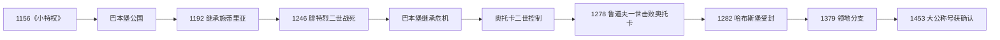

# 奥地利公国

## 时间

1156年-1453年

## 概括

奥地利公国是奥地利边区升格后的中世纪奥地利政权。它先由巴本堡家族统治，后转入哈布斯堡家族手中，成为哈布斯堡在中欧崛起的核心领地之一。

## 王朝世系 / 统治结构

| 阶段 / 统治者 | 时间 | 说明 |
|---|---|---|
| 巴本堡家族公爵 | 1156-1246 | 《小特权状》后奥地利升为公国，巴本堡家族为主要统治者。 |
| 腓特烈二世 | 1230-1246 | 巴本堡末代公爵，死后奥地利继承危机加剧。 |
| 普热米斯尔王朝影响 | 1250年代-1278 | 波希米亚国王奥托卡二世控制奥地利。 |
| 哈布斯堡家族 | 1278以后 | 鲁道夫一世击败奥托卡二世后，哈布斯堡逐渐取得奥地利统治。 |
| 鲁道夫四世 | 1358-1365 | 推动“大公”称号和奥地利地位提升。 |
| 奥地利大公国阶段 | 1453以后 | 哈布斯堡统治下，奥地利升格为大公国。 |

## 说明

- 1156年《小特权令》使奥地利从巴伐利亚体系中分离并升格为公国。
- 巴本堡家族统治期间，奥地利公国在多瑙河流域逐渐稳固。
- 1246年巴本堡家族男嗣绝嗣，引发奥地利继承争夺。
- 1278年，哈布斯堡的鲁道夫一世击败波希米亚国王奥托卡二世，取得奥地利及周边领地。
- 1282年，哈布斯堡家族正式获得奥地利公国，奥地利从此成为哈布斯堡家族核心领地。
- 1453年，奥地利公国被正式承认为奥地利大公国。

## 关键统治者

| 类型 | 人物 / 家族 | 时间 | 说明 |
| --- | --- | --- | --- |
| 首任公爵 | 亨利二世 | 1156-1177 | 《小特权令》后成为奥地利公爵。 |
| 统治家族 | 巴本堡家族 | 1156-1246 | 奥地利公国早期王朝。 |
| 争夺者 / 君主 | 奥托卡二世 | 1250年代-1278 | 巴本堡绝嗣后控制奥地利，后败于鲁道夫一世。 |
| 统治家族 | 哈布斯堡家族 | 1282以后 | 正式获得奥地利公国，开启哈布斯堡奥地利核心领地阶段。 |

## 演变关系

- 前一节点：[奥地利边区](/%E4%BA%BA%E6%96%87%E7%A7%91%E5%AD%A6/%E5%8E%86%E5%8F%B2/%E6%AC%A7%E6%B4%B2/%E5%BE%B7%E6%84%8F%E5%BF%97/%E5%A5%A5%E5%9C%B0%E5%88%A9/%E5%A5%A5%E5%9C%B0%E5%88%A9%E8%BE%B9%E5%8C%BA.md)。
- 后一节点：[奥地利大公国](/%E4%BA%BA%E6%96%87%E7%A7%91%E5%AD%A6/%E5%8E%86%E5%8F%B2/%E6%AC%A7%E6%B4%B2/%E5%BE%B7%E6%84%8F%E5%BF%97/%E5%A5%A5%E5%9C%B0%E5%88%A9/%E5%A5%A5%E5%9C%B0%E5%88%A9%E5%A4%A7%E5%85%AC%E5%9B%BD.md)。

## 巴本堡公国的发展

《小特权》使奥地利从巴伐利亚分出，公爵直属帝国，并在无男性后裔时允许女性继承和一定指定继承权。亨利二世把驻地转向维也纳，利奥波德五世通过《格奥尔根贝格协定》在1192年继承施蒂里亚。多瑙河贸易、十字军联系与城市发展使维也纳成为中欧枢纽。

利奥波德六世时期宫廷文化、修道院与商业达到巴本堡高峰。末代腓特烈二世与皇帝、匈牙利和邻邦冲突，1246年在莱塔河战役阵亡且无子，触发近三十年继承争夺。

## 继承危机与奥托卡统治

依据巴本堡女性继承权，葛楚德与玛格丽特均有主张。波希米亚王子奥托卡娶年长的玛格丽特，得到奥地利等级支持，继而控制施蒂里亚、卡林西亚和卡尼奥拉，建立从波希米亚到亚得里亚海的大领地。他推动城市和行政，却在1273年拒绝承认新选出的德意志国王鲁道夫一世对封地的审查。

鲁道夫宣布其封地失效，联合匈牙利及帝国诸侯。1278年摩拉维亚平原战役中奥托卡战死。1282年鲁道夫把奥地利和施蒂里亚授予儿子阿尔布雷希特与鲁道夫，哈布斯堡在奥地利连续统治由此开始，而非从帝国建立时即拥有此地。

## 哈布斯堡公国与分支

哈布斯堡逐步取得卡林西亚、卡尼奥拉、蒂罗尔等领地。鲁道夫四世伪造《大特权》以争取近似选侯的“大公”地位，创办维也纳大学并推动圣斯蒂芬教堂。1379年《诺伊贝格条约》把领地分为下奥地利与内奥地利 / 蒂罗尔等支系，形成多名公爵共治和监护，不能用单一平稳世系概括。

15世纪腓特烈三世先后接收绝嗣支系，并在1453年以皇帝身份确认“大公”头衔。完整公爵、共治与分支见[奥地利统治者世系与国家领导表](/%E4%BA%BA%E6%96%87%E7%A7%91%E5%AD%A6/%E5%8E%86%E5%8F%B2/%E6%AC%A7%E6%B4%B2/%E5%BE%B7%E6%84%8F%E5%BF%97/%E5%A5%A5%E5%9C%B0%E5%88%A9/%E5%A5%A5%E5%9C%B0%E5%88%A9%E7%BB%9F%E6%B2%BB%E8%80%85%E4%B8%96%E7%B3%BB%E4%B8%8E%E5%9B%BD%E5%AE%B6%E9%A2%86%E5%AF%BC%E8%A1%A8.md)。

## 重要事件与兴衰

| 时间 | 事件 | 影响 |
| --- | --- | --- |
| 1156 | 公国建立 | 脱离巴伐利亚，特殊继承获确认。 |
| 1192 | 继承施蒂里亚 | 奥地利由多瑙核心向阿尔卑斯扩展。 |
| 1246 | 巴本堡绝嗣 | 邻国、女性继承人与帝国王权争夺。 |
| 1251—1276 | 奥托卡控制 | 波希米亚—奥地利大国短暂形成。 |
| 1278 / 1282 | 哈布斯堡胜利与受封 | 新王朝核心转入奥地利。 |
| 1359 | 《大特权》 | 虽属伪造，却表达提升地位的长期目标。 |
| 1379 | 诺伊贝格分家 | 领地碎片化与共治加剧。 |
| 1453 | 大公称号确认 | 公爵阶段制度上升格。 |

公国的“衰落”主要是王朝绝嗣与分支继承危机，而非领地经济崩溃；1453年的终结同样属于等级与王朝结构升级。
