# 奥地利共和国

## 时间

1918年至今

## 概括

奥地利共和国是一战后奥匈帝国解体形成的现代奥地利国家。它经历第一共和国、纳粹德国吞并、二战后盟军占领、第二共和国和永久中立政策，最终发展为今天的奥地利共和国。

## 统治结构 / 国家元首

| 阶段 | 时间 | 国家元首 / 权力结构 | 说明 |
|---|---|---|---|
| 第一共和国 | 1918-1934 | 联邦总统、议会制政府 | 一战后哈布斯堡君主国解体，奥地利共和国建立。 |
| 奥地利联邦国 | 1934-1938 | 威权政府 | 议会民主中断，形成威权体制。 |
| 德奥合并时期 | 1938-1945 | 纳粹德国统治 | 奥地利被并入纳粹德国。 |
| 第二共和国 | 1945年至今 | 联邦总统、联邦总理、议会制共和国 | 战后重建，1955年恢复主权并确立永久中立。 |

## 说明

- 1918年奥匈帝国解体后，德意志奥地利共和国成立，后按战后条约改称奥地利共和国。
- 一战后奥地利失去庞大帝国腹地，成为以德语区为核心的小型共和国。
- 1934年后奥地利进入威权体制阶段，史称奥地利联邦国或“企业国家”。
- 1938年，纳粹德国吞并奥地利，奥地利国家独立中断。
- 1945年二战结束后，奥地利恢复国家地位，并被盟军分区占领。
- 1955年《奥地利国家条约》恢复奥地利完全主权，同年奥地利宣布永久中立。
- 第二共和国时期，奥地利形成议会民主制度和社会市场经济。
- 1995年，奥地利加入欧洲联盟。

## 国家元首

| 类型 | 人物 | 时间 | 说明 |
| --- | --- | --- | --- |
| 第一共和国国家元首 | 卡尔·赛茨 | 1919-1920 | 一战后共和国早期国家元首。 |
| 第二共和国国家元首 | 卡尔·伦纳 | 1945-1950 | 二战后恢复国家地位后的首任联邦总统。 |
| 现代联邦总统 | 亚历山大·范德贝伦 | 2017至今 | 2022年连任，第二任期至2028年。 |

## 政府首脑

| 类型 | 人物 | 时间 | 说明 |
| --- | --- | --- | --- |
| 第一共和国政府首脑 | 卡尔·伦纳 | 1918-1920 | 奥地利共和国早期政府首脑。 |
| 现代联邦总理 | 克里斯蒂安·施托克尔 | 2025-03-03至今 | 截至2026-07-14仍在任。 |

## 演变关系

- 前一节点：[奥匈帝国](/%E4%BA%BA%E6%96%87%E7%A7%91%E5%AD%A6/%E5%8E%86%E5%8F%B2/%E6%AC%A7%E6%B4%B2/%E5%BE%B7%E6%84%8F%E5%BF%97/%E5%A5%A5%E5%9C%B0%E5%88%A9/%E5%A5%A5%E5%8C%88%E5%B8%9D%E5%9B%BD.md)。
- 相关节点：[纳粹德国](/%E4%BA%BA%E6%96%87%E7%A7%91%E5%AD%A6/%E5%8E%86%E5%8F%B2/%E6%AC%A7%E6%B4%B2/%E5%BE%B7%E6%84%8F%E5%BF%97/%E5%BE%B7%E5%9B%BD/%E7%BA%B3%E7%B2%B9%E5%BE%B7%E5%9B%BD.md)、[德国统一](/%E4%BA%BA%E6%96%87%E7%A7%91%E5%AD%A6/%E5%8E%86%E5%8F%B2/%E6%AC%A7%E6%B4%B2/%E5%BE%B7%E6%84%8F%E5%BF%97/%E5%BE%B7%E5%9B%BD/%E5%BE%B7%E5%9B%BD%E7%BB%9F%E4%B8%80.md)。

```mermaid
flowchart LR
    Collapse["1918 帝国解体"] --> First["德意志奥地利 / 第一共和国"]
    First --> Crisis["经济危机、准军事对立与议会瘫痪"]
    Crisis --> Corporate["1933—1934 威权社团国家"]
    Corporate --> Anschluss["1938 纳粹德国吞并"]
    Anschluss --> Liberation["1945 重建第二共和国"]
    Liberation --> Treaty["1955 国家条约与永久中立"]
    Treaty --> SocialPartnership["大联合、社会伙伴与福利国家"]
    SocialPartnership --> EU["1995 加入欧洲联盟"]
    EU --> Coalition["多党联盟与欧洲政治"]
    Coalition --> Present["2026 范德贝伦总统 / 施托克尔总理"]
```

## 第一共和国：建国与边界困境

1918年德语地区代表宣布“德意志奥地利”为共和国并希望加入德国，但1919年《圣日耳曼和约》禁止合并，规定新边界和“奥地利共和国”国名。帝国共同市场瓦解，维也纳作为大首都失去广阔腹地，食品、货币与财政危机严重。1922年国际联盟贷款稳定货币，附带财政监督和裁员。

政治由社会民主党、基督教社会党和德意志民族派竞争。维也纳以公共住房、卫生和教育建设“红色维也纳”，乡村和联邦政府更保守；保安团与共和国保护联盟武装化。1927年沙滕多夫案无罪判决引发司法宫火灾与警察开枪，阵营信任崩溃。

## 威权国家与吞并

1933年议会程序危机时，陶尔斐斯宣布议会“自行解散”，以紧急法令统治，取缔共产党、纳粹党和后来社会民主党。1934年2月内战后建立天主教—社团主义“联邦国”，同年7月纳粹政变杀死陶尔斐斯但未夺权。舒施尼格依赖意大利保护，然而墨索里尼与希特勒结盟后奥地利孤立。

1938年希特勒迫使政府接纳纳粹并取消独立公投，德军3月12日进入，次日吞并法令生效。吞并获得部分群众热烈支持，同时纳粹立即迫害犹太人和反对者、没收财产并把奥地利纳入战争与大屠杀体系。战后“首个受害者”叙事有外交作用，却长期遮蔽众多奥地利人的参与和责任。

## 第二共和国、占领与国家条约

1945年苏军进入维也纳后，卡尔·伦纳组织临时政府，宣布恢复共和国和废除吞并。美英法苏四国分区占领奥地利与维也纳，但允许全国政府较早运作。人民党与社会党大联合、比例分配公职和工会—商会“社会伙伴”协商，意在避免第一共和国的阵营内战。

1955年国家条约恢复主权，禁止与德国合并；最后占领军撤出后，国会宣布永久中立。中立不是条约正文强加，而是奥地利为取得苏联同意所作的国内宪法承诺。冷战中奥地利不加入军事联盟，同时参与联合国维和、成为国际组织驻地并发展东西方外交。

## 社会国家、记忆与欧洲一体化

克赖斯基政府扩展教育、家庭法、社会福利和国家企业，同时石油危机和财政负担增加。1986年瓦尔德海姆总统竞选引发其战争经历国际争议，推动社会更深入讨论纳粹责任。1995年奥地利加入欧洲联盟，把经济和法律深度纳入欧洲；政府认为欧盟共同外交安全政策与军事中立可相容。

2000年人民党与自由党组阁，欧盟伙伴采取短期政治措施，标志右翼民粹成为常规联盟变量。2019年“伊比萨事件”导致政府垮台与首个不信任案罢免总理；其后看守政府、疫情、反腐调查、能源通胀与长期组阁使联盟格局更加多元。

## 现行权力结构与完整领导表

联邦总统全民直选，拥有任免政府、解散国民议会等重要宪法权力，但惯例上日常政策由对国民议会负责的联邦总理和内阁主导。九州通过联邦参议院参与，实际立法影响弱于德国联邦参议院。第一、第二共和国全部总统代行、联邦总理和吞并期权力断裂见[奥地利统治者世系与国家领导表](/%E4%BA%BA%E6%96%87%E7%A7%91%E5%AD%A6/%E5%8E%86%E5%8F%B2/%E6%AC%A7%E6%B4%B2/%E5%BE%B7%E6%84%8F%E5%BF%97/%E5%A5%A5%E5%9C%B0%E5%88%A9/%E5%A5%A5%E5%9C%B0%E5%88%A9%E7%BB%9F%E6%B2%BB%E8%80%85%E4%B8%96%E7%B3%BB%E4%B8%8E%E5%9B%BD%E5%AE%B6%E9%A2%86%E5%AF%BC%E8%A1%A8.md)。

截至2026-07-14，联邦总统为亚历山大·范德贝伦；联邦总理克里斯蒂安·施托克尔于2025-03-03宣誓就任，领导人民党、社会民主党与NEOS三党政府。

## 重要事件

| 时间 | 事件 | 长期影响 |
| --- | --- | --- |
| 1918—1920 | 共和国与联邦宪法 | 帝国核心转为小型联邦国家。 |
| 1922 | 国际联盟贷款 | 货币稳定但受外部监督。 |
| 1933—1934 | 议会终止、内战与社团国家 | 民主制度被国内威权政府摧毁。 |
| 1938 | 德奥合并 | 国家消失并参与纳粹统治。 |
| 1945 | 第二共和国重建 | 四国占领下恢复共同政府。 |
| 1955 | 国家条约与中立 | 恢复主权，形成现代外交身份。 |
| 1970年代 | 社会改革 | 福利国家、教育与社会自由化扩展。 |
| 1995 | 加入欧盟 | 经济法律深度欧洲化。 |
| 2019 | 伊比萨与不信任案 | 联盟政治重组，技术官僚看守政府出现。 |
| 2025 | 三党政府 | 结束长期组阁僵局，NEOS首次进入联邦政府。 |

## 兴衰与连续性

第一共和国失败由战后经济、宪制冲突、准军事暴力、民主精英妥协失败和外部法西斯压力共同造成；直接断裂是国内威权夺权和1938德国军事政治胁迫。第二共和国稳定来自大党合作、社会伙伴、经济增长、福利妥协、国际中立与欧洲整合。现代挑战包括老龄化、移民整合、能源与工业竞争、财政及极右翼支持，但这些是民主制度内的政策冲突，不等同20世纪30年代的制度崩溃。
