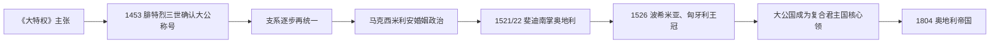

# 奥地利大公国

## 时间

1453年-1804年

## 概括

奥地利大公国是哈布斯堡家族在神圣罗马帝国内的核心世袭领地。它的“大公”称号强化了奥地利在帝国内高于普通公国的特殊地位，也为哈布斯堡长期掌握帝位和扩张中欧复合君主国提供基础。

## 王朝世系 / 统治结构

| 阶段 / 统治者 | 时间 | 说明 |
|---|---|---|
| 哈布斯堡大公 | 1453以后 | “奥地利大公”成为哈布斯堡核心头衔之一。 |
| 马克西米ilian一世时期 | 15世纪末-1519 | 通过婚姻和继承扩大家族势力。 |
| 查理五世与斐迪南一世分支 | 16世纪 | 哈布斯堡分为西班牙和奥地利两大支系，奥地利支系控制中欧核心领地。 |
| 奥地利哈布斯堡君主 | 16-18世纪 | 同时持有神圣罗马皇帝、波希米亚国王、匈牙利国王等身份。 |
| 1804年后 | 1804-1806 | 奥地利帝国建立，神圣罗马帝国终结前后，大公国成为帝国内核心领地。 |

## 说明

- “大公国”称号源于哈布斯堡家族提升奥地利地位的政治努力。
- 1453年，奥地利大公国地位得到正式承认。
- 1438年以后，神圣罗马帝位长期由哈布斯堡家族掌握，奥地利成为帝国内最重要的家族核心领地。
- 奥地利大公国本身只是哈布斯堡复合领地的一部分，但具有象征和政治中心地位。
- 哈布斯堡通过婚姻、继承和战争取得波希米亚、匈牙利、西班牙、尼德兰等关联领地。
- 1804年，弗朗茨二世建立奥地利帝国，奥地利大公国进入更大的帝国框架。

## 关键君主

| 类型 | 人物 / 家族 | 时间 | 说明 |
| --- | --- | --- | --- |
| 大公 / 统治家族 | 哈布斯堡家族 | 1453-1804 | 奥地利大公国长期为哈布斯堡核心世袭领地。 |
| 关键君主 | 腓特烈三世 | 15世纪 | 推动奥地利大公称号获得正式承认。 |
| 复合君主国统治者 | 查理五世、斐迪南一世等 | 16世纪 | 哈布斯堡领地扩张后，大公国成为更大复合统治的一部分。 |
| 末期君主 | 弗朗茨二世 / 弗朗茨一世 | 1792-1804；1804后为奥地利皇帝 | 建立奥地利帝国后，大公国进入帝国框架。 |

## 演变关系

- 前一节点：[奥地利公国](/%E4%BA%BA%E6%96%87%E7%A7%91%E5%AD%A6/%E5%8E%86%E5%8F%B2/%E6%AC%A7%E6%B4%B2/%E5%BE%B7%E6%84%8F%E5%BF%97/%E5%A5%A5%E5%9C%B0%E5%88%A9/%E5%A5%A5%E5%9C%B0%E5%88%A9%E5%85%AC%E5%9B%BD.md)。
- 后一节点：[哈布斯堡君主国](/%E4%BA%BA%E6%96%87%E7%A7%91%E5%AD%A6/%E5%8E%86%E5%8F%B2/%E6%AC%A7%E6%B4%B2/%E5%BE%B7%E6%84%8F%E5%BF%97/%E5%A5%A5%E5%9C%B0%E5%88%A9/%E5%93%88%E5%B8%83%E6%96%AF%E5%A0%A1%E5%90%9B%E4%B8%BB%E5%9B%BD.md)、[奥地利帝国](/%E4%BA%BA%E6%96%87%E7%A7%91%E5%AD%A6/%E5%8E%86%E5%8F%B2/%E6%AC%A7%E6%B4%B2/%E5%BE%B7%E6%84%8F%E5%BF%97/%E5%A5%A5%E5%9C%B0%E5%88%A9/%E5%A5%A5%E5%9C%B0%E5%88%A9%E5%B8%9D%E5%9B%BD.md)。

## 大公称号与领地范围

“大公”最初来自鲁道夫四世伪造的《大特权》，目的在于让奥地利享有接近选侯的不可分割、司法与继承特权。皇帝查理四世不承认，但1453年哈布斯堡皇帝腓特烈三世确认家族称号。奥地利大公国狭义上主要指恩斯河上下的奥地利本土，不等于所有哈布斯堡领地；蒂罗尔、施蒂里亚、波希米亚、匈牙利各有自身法统与等级。

腓特烈三世与马克西米利安一世通过绝嗣继承、勃艮第婚姻及子女联姻扩大王朝网络。1519年查理五世继承庞大领地后，把奥地利世袭领交给弟弟斐迪南，1521—1522年协议形成奥地利支系。

## 1526年后的核心地位

莫哈奇战役后，斐迪南凭与雅盖隆王室婚姻当选波希米亚国王，并争取匈牙利王位。匈牙利被哈布斯堡、奥斯曼与特兰西瓦尼亚三分，维也纳成为长期边防和财政协调中心。大公国提供王朝驻地、官僚和部分税源，但哈布斯堡君主仍须分别向各地等级取得税款与兵员。

宗教改革在奥地利贵族和城市传播，16世纪末不少等级为新教。斐迪南二世以内奥地利反宗教改革经验重建天主教统治；三十年战争后，新教贵族被流放或改宗，教会、修会与巴洛克文化成为统治支柱。

## 行政、经济与社会

| 领域 | 发展 | 局限 |
| --- | --- | --- |
| 王朝行政 | 宫廷会议、财政和战争机关逐步常设化 | 各王冠领法律与税制不同。 |
| 边防 | 维也纳成为对奥斯曼战争协调中心 | 军费长期依赖等级批准与外债。 |
| 宗教 | 反宗教改革建立天主教教育和文化网络 | 造成新教人口外流与强制整合。 |
| 城市经济 | 维也纳宫廷、手工业、贸易与消费增长 | 农村庄园义务和区域差异持续。 |
| 王位继承 | 1713年《国事诏书》谋求领地不可分与女系继承 | 1740年仍引发欧洲战争。 |

## 重要事件

| 时间 | 事件 | 意义 |
| --- | --- | --- |
| 1453 | 大公称号获确认 | 王朝政治主张成为正式头衔。 |
| 1493 | 马克西米利安继位 | 婚姻与帝国政治扩大哈布斯堡网络。 |
| 1521/22 | 奥地利领地交斐迪南 | 奥地利哈布斯堡支系形成。 |
| 1526 | 取得波希米亚、匈牙利王位 | 大公国成为复合君主国核心。 |
| 1529 / 1683 | 两次维也纳围城 | 奥斯曼战争塑造军政财政。 |
| 1618—1648 | 三十年战争 | 王朝重新控制波希米亚并强化反宗教改革。 |
| 1713 / 1740 | 国事诏书与继承战争 | 女系继承获守住，但失去西里西亚。 |
| 1804 | 奥地利皇帝称号 | 在拿破仑压力下建立新的总括帝号。 |

大公国没有在1804年被取消，而是作为奥地利帝国内的历史领地继续；分期名称改变的是整体国家框架。统治者与分支世系见[奥地利统治者世系与国家领导表](/%E4%BA%BA%E6%96%87%E7%A7%91%E5%AD%A6/%E5%8E%86%E5%8F%B2/%E6%AC%A7%E6%B4%B2/%E5%BE%B7%E6%84%8F%E5%BF%97/%E5%A5%A5%E5%9C%B0%E5%88%A9/%E5%A5%A5%E5%9C%B0%E5%88%A9%E7%BB%9F%E6%B2%BB%E8%80%85%E4%B8%96%E7%B3%BB%E4%B8%8E%E5%9B%BD%E5%AE%B6%E9%A2%86%E5%AF%BC%E8%A1%A8.md)。
