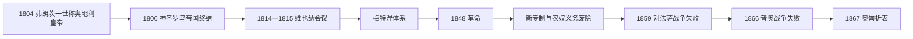

# 奥地利帝国

## 时间

1804年-1867年

## 概括

奥地利帝国是哈布斯堡君主国在拿破仑战争时期重组后的帝国形式。它在神圣罗马帝国解体前夕建立，随后成为德意志邦联的主席国，但在1866年普奥战争后被排除出德国统一进程。

## 说明

- 1804年，弗朗茨二世建立奥地利帝国，自称奥地利皇帝弗朗茨一世。
- 1806年神圣罗马帝国解体后，奥地利帝国成为哈布斯堡统治的主要帝国框架。
- 奥地利帝国包含奥地利、波希米亚、匈牙利、克罗地亚、加利西亚、达尔马提亚等多民族地区。
- 1815年后，奥地利帝国在德意志邦联中担任主席国，是大德意志方案的核心。
- 1848年革命冲击奥地利帝国，多民族问题和自由主义诉求同时爆发。
- 1859年奥地利在意大利战场失利，削弱其在欧洲的地位。
- 1866年普奥战争失败后，奥地利退出德意志事务主导地位。
- 1867年，奥地利与匈牙利达成妥协，改组为奥匈帝国。

## 君主世系

| 顺序 | 君主 | 在位时间 | 说明 |
| ---: | --- | --- | --- |
| 1 | 弗朗茨一世 | 1804-1835 | 建立奥地利帝国；此前为神圣罗马皇帝弗朗茨二世。 |
| 2 | 斐迪南一世 | 1835-1848 | 1848年革命后退位。 |
| 3 | 弗朗茨·约瑟夫一世 | 1848-1867 | 1867年奥匈妥协后继续作为奥匈共同君主。 |

## 政府首脑

| 类型 | 人物 | 时间 | 说明 |
| --- | --- | --- | --- |
| 首相 / 政治首脑 | 克莱门斯·冯·梅特涅 | 1821-1848 | 帝国前期保守秩序和维也纳体系的重要政治首脑。 |

## 演变关系

- 前一节点：[哈布斯堡君主国](/%E4%BA%BA%E6%96%87%E7%A7%91%E5%AD%A6/%E5%8E%86%E5%8F%B2/%E6%AC%A7%E6%B4%B2/%E5%BE%B7%E6%84%8F%E5%BF%97/%E5%A5%A5%E5%9C%B0%E5%88%A9/%E5%93%88%E5%B8%83%E6%96%AF%E5%A0%A1%E5%90%9B%E4%B8%BB%E5%9B%BD.md)。
- 并列节点：[德意志邦联](/%E4%BA%BA%E6%96%87%E7%A7%91%E5%AD%A6/%E5%8E%86%E5%8F%B2/%E6%AC%A7%E6%B4%B2/%E5%BE%B7%E6%84%8F%E5%BF%97/%E5%BE%B7%E6%84%8F%E5%BF%97%E9%82%A6%E8%81%94.md)。
- 后一节点：[奥匈帝国](/%E4%BA%BA%E6%96%87%E7%A7%91%E5%AD%A6/%E5%8E%86%E5%8F%B2/%E6%AC%A7%E6%B4%B2/%E5%BE%B7%E6%84%8F%E5%BF%97/%E5%A5%A5%E5%9C%B0%E5%88%A9/%E5%A5%A5%E5%8C%88%E5%B8%9D%E5%9B%BD.md)。

## 建立与拿破仑战争

1804年拿破仑称法国皇帝后，弗朗茨二世为保障哈布斯堡领地及王朝等级，宣布为奥地利皇帝弗朗茨一世；1806年放弃神圣罗马帝号。奥地利帝国仍是奥地利、波希米亚、匈牙利、加利西亚、意大利领地等的复合君主国，新帝号提供总括称谓，却没有立即统一内部宪法。

1805、1809年败于法国，失去多片领土并被迫联姻。1813年梅特涅在拿破仑俄国失败后转入反法联盟，奥地利成为维也纳会议主办国，恢复意大利北部控制并主持德意志邦联。其欧洲领导来自外交平衡，而非绝对军事优势。

## 梅特涅体系与社会经济

政府以审查、警察、邦联干预压制民族自由运动，同时依贵族庄园、地方等级与官僚管理多族群领土。工业化集中在波希米亚、下奥地利和部分城市，匈牙利以农业为主，交通和关税整合缓慢。知识界和地方精英提出德意志、意大利、匈牙利、捷克、克罗地亚等不同政治计划，帝国难以用单一民族主义整合。

## 1848革命的多重战场

维也纳示威迫使梅特涅出逃，政府承诺宪法并废除农民封建义务；匈牙利议会建立责任政府，布拉格与意大利也出现自治和民族运动。各运动目标并不一致，匈牙利马扎尔政府与克罗地亚、罗马尼亚、斯洛伐克等族群发生冲突，皇室得以联合保守军队和部分少数族群逐个镇压。

1848年末弗朗茨·约瑟夫继位，1849年俄军协助击败匈牙利。农奴义务废除成为不可逆成果，但议会承诺被收回，巴赫新专制以统一官僚、德语行政、警察和税制集中统治。

## 军事失败与宪制转型

1859年对法国和撒丁战争失败，失去伦巴第，财政危机迫使皇帝试行十月文告和二月专利，引入帝国议会，但匈牙利拒绝接受中央安排。1866年奥地利与普鲁士因德意志领导权和石勒苏益格问题开战，在萨多瓦败北，退出德国政治，威尼斯也归意大利。

帝国再无资源单方面压服匈牙利精英。1867年折衷建立奥地利与匈牙利两套政府议会，共同君主及外交、陆军和共同财政；奥地利帝国阶段转为奥匈帝国。

## 统治结构与事件

| 层面 | 1804—1848 | 1848—1867 |
| --- | --- | --- |
| 君主 | 弗朗茨一世、斐迪南一世 | 弗朗茨·约瑟夫一世。 |
| 中央治理 | 宫廷国务会议、梅特涅协调，地方历史法并存 | 新专制后有限宪政，帝国议会代表问题突出。 |
| 匈牙利 | 独立等级议会与法律体系 | 1849后中央化，1860年代消极抵抗，最终折衷。 |
| 德意志事务 | 主持德意志邦联 | 与普鲁士竞争，1866被排除。 |
| 意大利事务 | 统治伦巴第-威尼斯并影响诸邦 | 1859失伦巴第，1866失威尼斯。 |

| 时间 | 事件 | 结果 |
| --- | --- | --- |
| 1804 / 1806 | 帝号建立、旧帝国终结 | 奥地利成为王朝总括称号。 |
| 1815 | 维也纳会议 | 欧洲大国与德意志邦联主席地位恢复。 |
| 1819 | 卡尔斯巴德决议 | 保守压制制度化。 |
| 1848—1849 | 多中心革命 | 封建义务废除，政治革命被镇压。 |
| 1859 | 索尔费里诺战争失败 | 失去伦巴第，专制财政与军事信誉受损。 |
| 1866 | 普奥战争 | 退出德意志、失去威尼斯。 |
| 1867 | 奥匈折衷 | 双元君主国取代单一帝国框架。 |

帝国衰落来自财政军力落后于普法两强、多民族代表难题、匈牙利抵抗和意大利统一；直接触发是1866军事失败。皇帝序列见[奥地利统治者世系与国家领导表](/%E4%BA%BA%E6%96%87%E7%A7%91%E5%AD%A6/%E5%8E%86%E5%8F%B2/%E6%AC%A7%E6%B4%B2/%E5%BE%B7%E6%84%8F%E5%BF%97/%E5%A5%A5%E5%9C%B0%E5%88%A9/%E5%A5%A5%E5%9C%B0%E5%88%A9%E7%BB%9F%E6%B2%BB%E8%80%85%E4%B8%96%E7%B3%BB%E4%B8%8E%E5%9B%BD%E5%AE%B6%E9%A2%86%E5%AF%BC%E8%A1%A8.md)。
