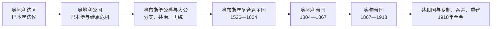

# 奥地利统治者世系与国家领导表

## 范围与原则

本表从976年巴本堡家族获得奥地利边区起，依次整理边侯、公爵、大公、复合君主国君主、奥地利皇帝、奥匈皇帝以及共和国国家元首和政府首脑。中世纪共同统治与哈布斯堡领地分支较多，表中按奥地利本土实际控制与法定头衔标注；“哈布斯堡君主国”不是单一法定国号，1526年以后必须同时看到奥地利世袭领、波希米亚王冠领和匈牙利王冠领的分别继承与共同君主。

## 巴本堡边侯

| 顺序 | 边侯 | 在位 | 与前任关系 | 关键事件 |
| ---: | --- | --- | --- | --- |
| 1 | **利奥波德一世** | 976-994 | 巴本堡在奥地利的始祖 | 奥托二世授予东部边区，建立家族统治基础。 |
| 2 | 亨利一世 | 994-1018 | 利奥波德一世之子 | “Ostarrîchi”名称见于996年文书。 |
| 3 | 阿达尔贝特 | 1018-1055 | 亨利一世之弟 | 面对匈牙利战争，向莱塔河方向巩固边境。 |
| 4 | 恩斯特 | 1055-1075 | 阿达尔贝特之子 | 参加帝国东部战争。 |
| 5 | 利奥波德二世 | 1075-1095 | 恩斯特之子 | 授职权斗争中由支持皇帝转向教皇派。 |
| 6 | **利奥波德三世** | 1095-1136 | 利奥波德二世之子 | 与萨利安王室联姻，克洛斯特新堡成为核心，后被尊为奥地利守护圣人。 |
| 7 | 利奥波德四世 | 1136-1141 | 利奥波德三世之子 | 一度兼巴伐利亚公爵。 |
| 8 | **亨利二世** | 1141-1156（边侯） | 利奥波德四世之弟 | 1156年《小特权》使奥地利升为公国。 |

## 奥地利公爵：巴本堡与继承危机

| 顺序 | 公爵 | 在位 | 继承关系 | 关键事件 |
| ---: | --- | --- | --- | --- |
| 1 | **亨利二世** | 1156-1177 | 由边侯升格 | 维也纳成为公爵驻地，公国可经女性继承。 |
| 2 | 利奥波德五世 | 1177-1194 | 亨利二世之子 | 参加十字军并拘押英王理查一世；取得施蒂里亚继承。 |
| 3 | 腓特烈一世 | 1194-1198 | 利奥波德五世长子 | 奥地利公爵；死于十字军途中。 |
| 4 | 利奥波德六世 | 1198-1230 | 腓特烈一世之弟 | 兼施蒂里亚公爵，宫廷文化与贸易发展。 |
| 5 | **腓特烈二世** | 1230-1246 | 利奥波德六世之子 | 与邻国和皇帝冲突；战死后巴本堡男系绝嗣。 |
| 争位 | 赫尔曼六世·巴登 | 1248-1250 | 娶巴本堡女继承人葛楚德 | 权力基础薄弱，未能稳定控制公国。 |
| 争位 | **奥托卡二世·波希米亚** | 1251/1254-1276；1278败亡 | 娶玛格丽特取得继承主张 | 控制奥地利、施蒂里亚等地；被鲁道夫一世剥夺并在摩拉维亚平原战败。 |

## 哈布斯堡时期的奥地利公爵与大公

| 阶段 | 统治者 | 奥地利统治时间 | 关系与备注 |
| --- | --- | --- | --- |
| 建立 | **阿尔布雷希特一世、鲁道夫二世** | 1282-1283共治；阿尔布雷希特延续至1308 | 鲁道夫一世之子；1283年《莱茵费尔登家规》使阿尔布雷希特主要执政。 |
| 早期共治 | 鲁道夫三世 | 1298-1307 | 阿尔布雷希特一世长子；兼波希米亚国王。 |
| 早期共治 | 腓特烈“美男子”、利奥波德一世 | 1308-1330；1308-1326 | 阿尔布雷希特一世之子，共同继承；腓特烈争夺德意志王位。 |
| 扩展 | 阿尔布雷希特二世、奥托 | 1330-1358；1330-1339 | 兄弟共治；卡林西亚、卡尼奥拉等并入家族领地。 |
| 大公称号 | **鲁道夫四世** | 1358-1365 | 阿尔布雷希特二世之子；伪造《大特权》，自称大公，兴建维也纳大学。 |
| 分家前共治 | 阿尔布雷希特三世、利奥波德三世 | 1365-1379共治 | 鲁道夫四世之弟；1379年《诺伊贝格条约》分为阿尔布雷希特与利奥波德两系。 |
| 阿尔布雷希特系 | 阿尔布雷希特三世 | 1379-1395 | 掌下奥地利。 |
| 阿尔布雷希特系 | 阿尔布雷希特四世 | 1395-1404 | 阿尔布雷希特三世之子。 |
| 阿尔布雷希特系 | 阿尔布雷希特五世 | 1404-1439 | 后为德意志国王阿尔布雷希特二世；联结波希米亚、匈牙利王位。 |
| 阿尔布雷希特系 | 拉迪斯劳斯“遗腹子” | 1440-1457 | 幼年由亲属监护；死后该系绝嗣。 |
| 利奥波德系 | 利奥波德三世 | 1379-1386 | 掌内奥地利、蒂罗尔等；森帕赫战役阵亡。 |
| 利奥波德系共治 | 威廉、利奥波德四世 | 1386-1406；1386-1411 | 兄弟与幼弟分管领地，统治边界多次调整。 |
| 内奥地利系 | **恩斯特“铁公爵”** | 1406-1424 | 采用大公称号；统治施蒂里亚、卡林西亚、卡尼奥拉。 |
| 内奥地利系 | 腓特烈五世、阿尔布雷希特六世 | 1424-1493；1424-1463 | 腓特烈五世即皇帝腓特烈三世；兄弟冲突后逐步再统一。 |
| 蒂罗尔系 | 腓特烈四世 | 1406-1439 | 统治前奥地利和蒂罗尔。 |
| 蒂罗尔系 | 西吉斯蒙德 | 1439-1490 | 财政困难，1490年把领地让给马克西米利安。 |
| 再统一 | **腓特烈三世** | 1457起接收下奥地利；1463后更广泛统一 | 1453年确认大公称号，哈布斯堡奥地利核心重整。 |
| 再统一 | **马克西米利安一世** | 1493-1519 | 通过婚姻与继承扩张哈布斯堡网络，开启欧洲复合王朝格局。 |
| 分支安排 | 查理五世 | 1519-1521/22 | 把奥地利世袭领交给弟弟斐迪南，形成奥地利哈布斯堡支系。 |

## 哈布斯堡复合君主国共同君主

| 顺序 | 君主 | 统治期 | 继承关系与统治重点 |
| ---: | --- | --- | --- |
| 1 | **斐迪南一世** | 奥地利1521/22-1564；波希米亚、匈牙利1526起 | 查理五世之弟；莫哈奇战役后取得两王冠继承主张，与奥斯曼及扎波尧争夺匈牙利。 |
| 2 | 马克西米利安二世 | 1564-1576 | 斐迪南一世之子；宗教政策相对温和。 |
| 3 | 鲁道夫二世 | 1576-1612 | 马克西米利安二世之子；迁居布拉格，宗教与家族危机加剧。 |
| 4 | 马蒂亚斯 | 1612-1619 | 鲁道夫二世之弟；继承冲突与波希米亚危机通向三十年战争。 |
| 5 | **斐迪南二世** | 1619-1637 | 内奥地利支系；推动反宗教改革，镇压波希米亚起义。 |
| 6 | 斐迪南三世 | 1637-1657 | 斐迪南二世之子；在战争后期寻求和解，接受《威斯特伐利亚和约》。 |
| 7 | **利奥波德一世** | 1657-1705 | 对奥斯曼战争与法国竞争；1683年维也纳解围后向匈牙利扩张。 |
| 8 | 约瑟夫一世 | 1705-1711 | 利奥波德一世长子；西班牙王位继承战争中早逝。 |
| 9 | 查理六世 | 1711-1740 | 约瑟夫一世之弟；颁布《国事诏书》保障女系继承。 |
| 10 | **玛丽亚·特蕾西亚** | 1740-1780 | 查理六世之女；继承战争后保住核心领地，实施财政、军事与教育改革。 |
| 共治 | 约瑟夫二世 | 1765-1780与母共治；1780-1790独掌 | 玛丽亚·特蕾西亚之子；开明专制改革广泛但阻力强。 |
| 12 | 利奥波德二世 | 1790-1792 | 约瑟夫二世之弟；撤回部分激进改革，稳定君主国。 |
| 13 | **弗朗茨二世 / 弗朗茨一世** | 1792-1835；1804起奥地利皇帝 | 面对法国革命与拿破仑；1806放弃神圣罗马皇帝称号。 |

## 奥地利皇帝与奥匈皇帝

| 顺序 | 皇帝 | 在位 | 王朝与关系 | 关键事件 |
| ---: | --- | --- | --- | --- |
| 1 | **弗朗茨一世** | 1804-1835 | 哈布斯堡-洛林；复合君主国原君主 | 拿破仑战争、维也纳会议、梅特涅体系。 |
| 2 | 斐迪南一世 | 1835-1848 | 弗朗茨一世之子 | 1848年革命中退位，实政长期由国务会议承担。 |
| 3 | **弗朗茨·约瑟夫一世** | 1848-1916 | 斐迪南一世之侄 | 新专制、1867折衷、民族问题、巴尔干危机和第一次世界大战。 |
| 4 | **卡尔一世** | 1916-1918 | 弗朗茨·约瑟夫一世侄孙 | 尝试议和与联邦化；帝国瓦解后退出国家事务，未正式宣布退位。 |

## 第一共和国与威权时期国家元首

| 顺序 | 国家元首 | 任期 | 制度说明 |
| ---: | --- | --- | --- |
| 1 | 卡尔·赛茨 | 1918-11-12—1920-12-09 | 临时国民议会主席团成员、后制宪国民议会议长，集体元首体系的主要代表。 |
| 2 | **米夏埃尔·海尼施** | 1920-12-09—1928-12-10 | 联邦宪法下首任联邦总统。 |
| 3 | **威廉·米克拉斯** | 1928-12-10—1938-03-13 | 经历议会民主瓦解、社团国家与德奥合并危机；在压力下不任命纳粹提名者后失去权力。 |
| 吞并期 | 无奥地利独立国家元首 | 1938-03—1945-04 | 奥地利并入德国；帝国总督、各大区长官与纳粹党机构行使统治。 |

## 第一共和国与威权时期政府首脑

| 顺序 | 总理 / 联邦总理 | 任期 | 关键事件 |
| ---: | --- | --- | --- |
| 1 | **卡尔·伦纳** | 1918-10-30—1920-07-07 | 临时国家建立、圣日耳曼和约与共和国制度奠基。 |
| 2 | 米夏埃尔·迈尔 | 1920-07-07—1921-06-21 | 联邦宪法实施；联盟因对德合并问题破裂。 |
| 3 | 约翰·绍贝尔（第一次） | 1921-06-21—1922-01-26 | 无党派警务官僚政府。 |
| 代理 | 瓦尔特·布赖斯基 | 1922-01-26—1922-01-27 | 一日代理。 |
| 4 | 约翰·绍贝尔（第二次） | 1922-01-27—1922-05-31 | 财政危机中的短期复任。 |
| 5 | **伊格纳茨·赛佩尔（第一次）** | 1922-05-31—1924-11-20 | 日内瓦贷款与财政稳定，强化保守阵营。 |
| 6 | 鲁道夫·拉梅克 | 1924-11-20—1926-10-20 | 继续稳定政策。 |
| 7 | 伊格纳茨·赛佩尔（第二次） | 1926-10-20—1929-04-04 | 准军事政治对立加深。 |
| 8 | 恩斯特·施特雷鲁维茨 | 1929-05-04—1929-09-26 | 经济与宪法冲突中的短命内阁。 |
| 9 | 约翰·绍贝尔（第三次） | 1929-09-26—1930-09-30 | 1929年宪法修正强化总统权。 |
| 10 | 卡尔·福戈因 | 1930-09-30—1930-12-04 | 右翼少数政府。 |
| 11 | 奥托·恩德尔 | 1930-12-04—1931-06-20 | 经济危机与德奥关税同盟争议。 |
| 12 | 卡尔·布雷施 | 1931-06-20—1932-05-20 | 信贷危机与财政紧缩。 |
| 13 | **恩格尔伯特·陶尔斐斯** | 1932-05-20—1934-07-25 | 1933年架空议会，建立威权社团国家；纳粹政变中被杀。 |
| 14 | 库尔特·舒施尼格 | 1934-07-29—1938-03-11 | 延续威权统治；在希特勒压力下辞职。 |
| 15 | 阿图尔·赛斯-英夸特 | 1938-03-11—1938-03-13 | 纳粹支持的末任短期总理，推动德国吞并。 |

## 第二共和国联邦总统

| 顺序 | 联邦总统 / 代行者 | 任期 | 说明 |
| ---: | --- | --- | --- |
| 1 | **卡尔·伦纳** | 1945-12-20—1950-12-31 | 重建国家与四国占领下首任总统。 |
| 代行 | 联邦政府集体代行 | 1950-12-31—1951-06-21 | 总统空缺至首次全民直选完成。 |
| 2 | 特奥多尔·克尔纳 | 1951-06-21—1957-01-04 | 首位全民直选总统。 |
| 代行 | 联邦政府集体代行 | 1957-01-04—1957-05-22 | 克尔纳去世后的过渡。 |
| 3 | 阿道夫·谢尔夫 | 1957-05-22—1965-02-28 | 连任；大联合政府时期。 |
| 代行 | 联邦政府集体代行 | 1965-02-28—1965-06-09 | 谢尔夫去世后的过渡。 |
| 4 | 弗朗茨·约纳斯 | 1965-06-09—1974-04-24 | 连任；单党政府更替时期。 |
| 代行 | 联邦总理布鲁诺·克赖斯基等 | 1974-04-24—1974-07-08 | 依法集体代行。 |
| 5 | 鲁道夫·基希施莱格 | 1974-07-08—1986-07-08 | 无党派外交官，两任。 |
| 6 | 库尔特·瓦尔德海姆 | 1986-07-08—1992-07-08 | 战时经历争议导致外交孤立。 |
| 7 | 托马斯·克莱斯蒂尔 | 1992-07-08—2004-07-06 | 任内去世。 |
| 代行 | 国民议会议长团 | 2004-07-06—2004-07-08 | 两日集体代行。 |
| 8 | 海因茨·菲舍尔 | 2004-07-08—2016-07-08 | 两任。 |
| 代行 | 国民议会议长团 | 2016-07-08—2017-01-26 | 总统选举重投期间集体代行。 |
| 9 | **亚历山大·范德贝伦** | 2017-01-26—至今 | 2023年开始第二任；截至2026-07-14在任。 |

## 第二共和国联邦总理

| 顺序 | 联邦总理 | 任期 | 政治阶段 |
| ---: | --- | --- | --- |
| 1 | **卡尔·伦纳** | 1945-04-27—1945-12-20 | 苏军进入后组织临时政府，获四国承认。 |
| 2 | 利奥波德·菲格尔 | 1945-12-20—1953-04-02 | 大联合政府、战后重建。 |
| 3 | **尤利乌斯·拉布** | 1953-04-02—1961-04-11 | 1955年国家条约与永久中立。 |
| 4 | 阿尔丰斯·戈尔巴赫 | 1961-04-11—1964-04-02 | 大联合政府晚期。 |
| 5 | 约瑟夫·克劳斯 | 1964-04-02—1970-04-21 | 1966后人民党单独执政。 |
| 6 | **布鲁诺·克赖斯基** | 1970-04-21—1983-05-24 | 社会改革、中立外交与福利国家扩张。 |
| 7 | 弗雷德·西诺瓦茨 | 1983-05-24—1986-06-16 | 社民党—自由党联盟。 |
| 8 | 弗朗茨·弗拉尼茨基 | 1986-06-16—1997-01-28 | 重建大联合，加入欧洲联盟。 |
| 9 | 维克托·克利马 | 1997-01-28—2000-02-04 | 社民党—人民党政府。 |
| 10 | 沃尔夫冈·许塞尔 | 2000-02-04—2007-01-11 | 人民党—自由党/未来联盟；欧盟伙伴曾采取政治措施。 |
| 11 | 阿尔弗雷德·古森鲍尔 | 2007-01-11—2008-12-02 | 大联合政府。 |
| 12 | 维尔纳·法伊曼 | 2008-12-02—2016-05-09 | 金融危机、欧债与难民问题；辞职。 |
| 代理 | 莱因霍尔德·米特莱纳 | 2016-05-09—2016-05-17 | 副总理代理。 |
| 13 | 克里斯蒂安·克恩 | 2016-05-17—2017-12-18 | 大联合政府末期。 |
| 14 | 塞巴斯蒂安·库尔茨（第一次） | 2017-12-18—2019-05-28 | 人民党—自由党；伊比萨事件后不信任案下台。 |
| 代理 | 哈特维希·勒格尔 | 2019-05-28—2019-06-03 | 短期过渡。 |
| 15 | 布丽吉特·比尔莱因 | 2019-06-03—2020-01-07 | 无党派看守政府，首位女总理。 |
| 16 | 塞巴斯蒂安·库尔茨（第二次） | 2020-01-07—2021-10-11 | 人民党—绿党；调查压力下辞职。 |
| 17 | 亚历山大·沙伦贝格（第一次） | 2021-10-11—2021-12-06 | 短期接任。 |
| 18 | 卡尔·内哈默 | 2021-12-06—2025-01-10 | 疫情后、能源与通胀危机；组阁僵局中辞职。 |
| 代理 | 亚历山大·沙伦贝格（第二次） | 2025-01-10—2025-03-03 | 看守总理。 |
| 19 | **克里斯蒂安·施托克尔** | 2025-03-03—至今 | 人民党—社民党—NEOS联盟；截至2026-07-14在任。 |

## 继承与制度辨析

- 巴本堡绝嗣后的奥地利不是立即自动转入哈布斯堡；波希米亚普热米斯尔王朝、巴登与匈牙利势力均曾参与争夺。
- 1359年前后鲁道夫四世自称“大公”，但头衔到1453年才获皇帝正式确认，因此早期“大公”须理解为王朝政治主张。
- 1867年以后奥地利皇帝同时为匈牙利国王，奥地利与匈牙利各有政府和议会，共同外交、陆军及相应财政由共同部长负责。
- 共和国联邦总统与联邦总理分属国家元首和政府首脑；实际日常行政由对国民议会负责的政府主导。
- 分期详见[奥地利边区](/%E4%BA%BA%E6%96%87%E7%A7%91%E5%AD%A6/%E5%8E%86%E5%8F%B2/%E6%AC%A7%E6%B4%B2/%E5%BE%B7%E6%84%8F%E5%BF%97/%E5%A5%A5%E5%9C%B0%E5%88%A9/%E5%A5%A5%E5%9C%B0%E5%88%A9%E8%BE%B9%E5%8C%BA.md)、[奥地利公国](/%E4%BA%BA%E6%96%87%E7%A7%91%E5%AD%A6/%E5%8E%86%E5%8F%B2/%E6%AC%A7%E6%B4%B2/%E5%BE%B7%E6%84%8F%E5%BF%97/%E5%A5%A5%E5%9C%B0%E5%88%A9/%E5%A5%A5%E5%9C%B0%E5%88%A9%E5%85%AC%E5%9B%BD.md)、[奥地利大公国](/%E4%BA%BA%E6%96%87%E7%A7%91%E5%AD%A6/%E5%8E%86%E5%8F%B2/%E6%AC%A7%E6%B4%B2/%E5%BE%B7%E6%84%8F%E5%BF%97/%E5%A5%A5%E5%9C%B0%E5%88%A9/%E5%A5%A5%E5%9C%B0%E5%88%A9%E5%A4%A7%E5%85%AC%E5%9B%BD.md)、[哈布斯堡君主国](/%E4%BA%BA%E6%96%87%E7%A7%91%E5%AD%A6/%E5%8E%86%E5%8F%B2/%E6%AC%A7%E6%B4%B2/%E5%BE%B7%E6%84%8F%E5%BF%97/%E5%A5%A5%E5%9C%B0%E5%88%A9/%E5%93%88%E5%B8%83%E6%96%AF%E5%A0%A1%E5%90%9B%E4%B8%BB%E5%9B%BD.md)、[奥地利帝国](/%E4%BA%BA%E6%96%87%E7%A7%91%E5%AD%A6/%E5%8E%86%E5%8F%B2/%E6%AC%A7%E6%B4%B2/%E5%BE%B7%E6%84%8F%E5%BF%97/%E5%A5%A5%E5%9C%B0%E5%88%A9/%E5%A5%A5%E5%9C%B0%E5%88%A9%E5%B8%9D%E5%9B%BD.md)、[奥匈帝国](/%E4%BA%BA%E6%96%87%E7%A7%91%E5%AD%A6/%E5%8E%86%E5%8F%B2/%E6%AC%A7%E6%B4%B2/%E5%BE%B7%E6%84%8F%E5%BF%97/%E5%A5%A5%E5%9C%B0%E5%88%A9/%E5%A5%A5%E5%8C%88%E5%B8%9D%E5%9B%BD.md)与[奥地利共和国](/%E4%BA%BA%E6%96%87%E7%A7%91%E5%AD%A6/%E5%8E%86%E5%8F%B2/%E6%AC%A7%E6%B4%B2/%E5%BE%B7%E6%84%8F%E5%BF%97/%E5%A5%A5%E5%9C%B0%E5%88%A9/%E5%A5%A5%E5%9C%B0%E5%88%A9%E5%85%B1%E5%92%8C%E5%9B%BD.md)。
