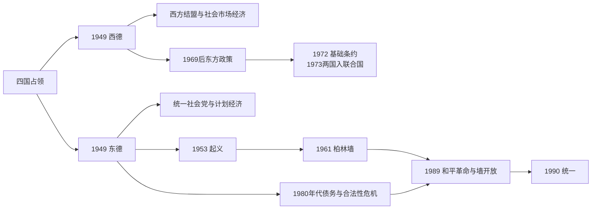

# 东德西德

## 时间

1949年-1990年

## 正式名称

- 西德：德意志联邦共和国
- 东德：德意志民主共和国

## 概括

东德西德指冷战时期德国分裂为两个国家的格局。西德属于西方阵营，实行议会民主和市场经济；东德属于苏联阵营，实行社会主义一党主导体制。1990年，两德通过统一进程重新合并。

## 说明

- 1949年，西方占领区成立德意志联邦共和国，通常称西德。
- 1949年，苏联占领区成立德意志民主共和国，通常称东德。
- 西德加入西方阵营，1955年加入北约，并在战后经济重建中形成“经济奇迹”。
- 东德加入社会主义阵营，1955年成为华沙条约组织成员。
- 柏林成为冷战前线，1961年东德修建柏林墙，强化东西隔绝。
- 1970年代，西德推行东方政策，改善与东德和东欧国家关系。
- 1989年东欧剧变和柏林墙开放推动统一进程。
- 1990年10月3日，两德统一。

## 国家元首

| 政治实体 | 类型 | 人物 | 时间 | 说明 |
| --- | --- | --- | --- | --- |
| 西德 | 联邦总统 | 特奥多尔·豪斯 | 1949-1959 | 德意志联邦共和国首任联邦总统。 |
| 东德 | 总统 | 威廉·皮克 | 1949-1960 | 德意志民主共和国首任总统。 |

## 政府首脑

| 政治实体 | 类型 | 人物 | 时间 | 说明 |
| --- | --- | --- | --- | --- |
| 西德 | 联邦总理 | 康拉德·阿登纳 | 1949-1963 | 西德首任联邦总理。 |
| 西德 | 统一时期总理 | 赫尔穆特·科尔 | 1982-1998 | 两德统一时的西德政府首脑。 |
| 东德 | 部长会议主席 | 奥托·格罗提渥 | 1949-1964 | 东德首任部长会议主席。 |

## 实际最高领导人

| 政治实体 | 人物 | 时间 | 说明 |
| --- | --- | --- | --- |
| 东德 | 瓦尔特·乌布利希、埃里希·昂纳克 | 1949-1989 | 东德长期由统一社会党最高领导层主导。 |

## 演变关系

- 前一节点：[盟军占领德国](/%E4%BA%BA%E6%96%87%E7%A7%91%E5%AD%A6/%E5%8E%86%E5%8F%B2/%E6%AC%A7%E6%B4%B2/%E5%BE%B7%E6%84%8F%E5%BF%97/%E5%BE%B7%E5%9B%BD/%E7%9B%9F%E5%86%9B%E5%8D%A0%E9%A2%86%E5%BE%B7%E5%9B%BD.md)。
- 后一节点：[德国统一](/%E4%BA%BA%E6%96%87%E7%A7%91%E5%AD%A6/%E5%8E%86%E5%8F%B2/%E6%AC%A7%E6%B4%B2/%E5%BE%B7%E6%84%8F%E5%BF%97/%E5%BE%B7%E5%9B%BD/%E5%BE%B7%E5%9B%BD%E7%BB%9F%E4%B8%80.md)。

## 两国建立与不同制度

西德《基本法》建立联邦议会民主：联邦议院选总理，联邦参议院代表各州，联邦宪法法院审查法律，联邦总统主要承担礼仪与宪法保障。阿登纳坚持“西方结盟”，加入欧洲煤钢共同体、北约和欧洲经济共同体；社会市场经济、货币稳定、马歇尔援助、全球需求及熟练劳动力共同推动“经济奇迹”。

东德宪法表面保留议会与多党联盟，实际由统一社会党通过政治局、干部名单和国家安全机构掌权。1952年州被专区取代，农业集体化、国有工业和中央计划推进。完整法定国家元首、部长会议主席与党最高领导必须分读，见[德国国家元首与政府首脑表](/%E4%BA%BA%E6%96%87%E7%A7%91%E5%AD%A6/%E5%8E%86%E5%8F%B2/%E6%AC%A7%E6%B4%B2/%E5%BE%B7%E6%84%8F%E5%BF%97/%E5%BE%B7%E5%9B%BD/%E5%BE%B7%E5%9B%BD%E5%9B%BD%E5%AE%B6%E5%85%83%E9%A6%96%E4%B8%8E%E6%94%BF%E5%BA%9C%E9%A6%96%E8%84%91%E8%A1%A8.md)。

## 冷战危机与柏林墙

1953年提高劳动定额引发东柏林工人罢工并扩展全国，苏军和东德警察镇压。此后大量人口经西柏林离开，尤其是青年和专业人员，威胁经济与政权稳定。1961年8月东德封锁边界、修建柏林墙；逃亡者遭拘捕甚至射杀。墙稳定了劳动力，却成为政权缺乏自由选择的全球象征。

西德1950—1960年代在再武装、纳粹过去处理和社会现代化之间发展。1968年前后学生运动质疑前纳粹精英、紧急状态法和保守文化。勃兰特政府与苏联、波兰、东德签约，承认现实边界并以“接近促成改变”改善人员往来；1972年基础条约使两德建立正常关系，1973年同时加入联合国，但双方仍不互认对方为传统意义上的外国。

## 社会、经济和实际生活

| 领域 | 西德 | 东德 |
| --- | --- | --- |
| 政治 | 竞争性选举、联盟政府、独立法院和联邦制 | 统一社会党领导、集团党受控、国家安全部监视。 |
| 经济 | 社会市场经济、出口工业、福利与劳资协商 | 计划经济、全民就业与补贴并存，创新和外汇受限。 |
| 社会政策 | 养老金、共同决定、教育扩张，地区与阶级差异仍存 | 托幼、女性就业、住房补贴突出，消费短缺和旅行限制明显。 |
| 外交安全 | 北约与欧洲一体化 | 华约与经互会。 |
| 记忆政治 | 从早期有限清算逐步转向公开承担纳粹责任 | 以“反法西斯国家”自我定位，常把社会共犯问题外部化。 |

## 1989和平革命

苏联戈尔巴乔夫改革削弱武力干预预期，匈牙利开放边境使东德人经中欧出走。莱比锡周一示威、教会和平网络与城市群众要求旅行自由、言论和选举改革。10月昂纳克被克伦茨替代仍不能恢复信任。11月9日沙博夫斯基误读立即生效的旅行规定，边防在群众压力下开放检查站，柏林墙实际失效。

圆桌会议监督国家安全机构解散与选举准备。1990年3月首次自由人民议院选举由主张快速统一的联盟获胜。货币、经济和社会联盟7月生效，东德制度迅速转向西德框架，既回应多数人的统一愿望，也带来企业关闭、失业、财产归属与精英更替冲击。

## 两国领导与权力结构

西德历任总统、总理，东德法定元首、政府首脑和统一社会党最高领导的完整连续表见[德国国家元首与政府首脑表](/%E4%BA%BA%E6%96%87%E7%A7%91%E5%AD%A6/%E5%8E%86%E5%8F%B2/%E6%AC%A7%E6%B4%B2/%E5%BE%B7%E6%84%8F%E5%BF%97/%E5%BE%B7%E5%9B%BD/%E5%BE%B7%E5%9B%BD%E5%9B%BD%E5%AE%B6%E5%85%83%E9%A6%96%E4%B8%8E%E6%94%BF%E5%BA%9C%E9%A6%96%E8%84%91%E8%A1%A8.md)。不能把乌布利希、昂纳克只列在国家元首表：他们的核心权力首先来自党职；也不能把西德总统等同政府首脑。

## 统一条件

两德统一需要国内民意、东德政权瓦解、西德财政与制度承接能力、苏联接受、波兰边界保证以及美英法苏放弃四国权利共同满足。1989革命是直接启动因素，长期背景则包括东德债务和生产率问题、信息封锁失效、代际合法性下降、东方政策积累的联系与冷战结构转变。
