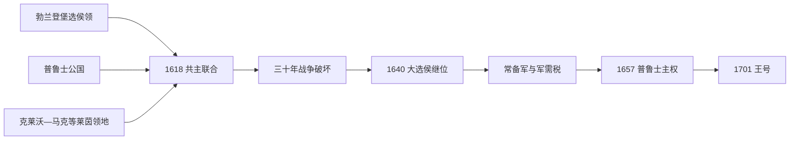

# 勃兰登堡-普鲁士

## 时间

1618年-1701年

## 概括

勃兰登堡-普鲁士是霍亨索伦家族同时统治勃兰登堡选侯国和普鲁士公国后形成的复合国家。它把神圣罗马帝国内的勃兰登堡与帝国外的普鲁士结合起来，成为普鲁士王国的直接前身。

## 说明

- 1618年，勃兰登堡选侯继承普鲁士公国，形成勃兰登堡-普鲁士。
- 这个国家不是单一连续领土，而是由分散领地组成的复合君主国。
- 三十年战争严重破坏勃兰登堡地区，也促使统治者加强军队和财政集中化。
- “大选侯”腓特烈·威廉推动军政改革，强化常备军和行政体系。
- 勃兰登堡-普鲁士在波兰、瑞典、神圣罗马帝国之间周旋，逐步取得普鲁士公国完全主权。
- 1701年，腓特烈三世在柯尼斯堡加冕为“普鲁士国王”，勃兰登堡-普鲁士进入普鲁士王国阶段。

## 关键君主

| 类型 | 人物 | 时间 | 说明 |
| --- | --- | --- | --- |
| 共主统治者 | 约翰·西吉斯蒙德 | 1618-1619 | 继承普鲁士公国，形成勃兰登堡-普鲁士。 |
| 改革君主 / 大选侯 | 腓特烈·威廉 | 1640-1688 | 强化军队、财政和中央行政。 |
| 升格君主 | 腓特烈三世 / 腓特烈一世 | 1688-1701；1701后为普鲁士国王 | 在柯尼斯堡加冕为普鲁士国王。 |

## 演变关系

- 前一节点：[勃兰登堡侯国](/%E4%BA%BA%E6%96%87%E7%A7%91%E5%AD%A6/%E5%8E%86%E5%8F%B2/%E6%AC%A7%E6%B4%B2/%E5%BE%B7%E6%84%8F%E5%BF%97/%E5%BE%B7%E5%9B%BD/%E5%8B%83%E5%85%B0%E7%99%BB%E5%A0%A1%E4%BE%AF%E5%9B%BD.md)、[普鲁士公国](/%E4%BA%BA%E6%96%87%E7%A7%91%E5%AD%A6/%E5%8E%86%E5%8F%B2/%E6%AC%A7%E6%B4%B2/%E5%BE%B7%E6%84%8F%E5%BF%97/%E5%BE%B7%E5%9B%BD/%E6%99%AE%E9%B2%81%E5%A3%AB%E5%85%AC%E5%9B%BD.md)。
- 后一节点：[普鲁士王国](/%E4%BA%BA%E6%96%87%E7%A7%91%E5%AD%A6/%E5%8E%86%E5%8F%B2/%E6%AC%A7%E6%B4%B2/%E5%BE%B7%E6%84%8F%E5%BF%97/%E5%BE%B7%E5%9B%BD/%E6%99%AE%E9%B2%81%E5%A3%AB%E7%8E%8B%E5%9B%BD.md)。

## 复合国家的领土问题

1618年的共同君主统治包括勃兰登堡、普鲁士以及莱茵河畔克莱沃、马克、拉文斯贝格等飞地，稍后又取得东波美拉尼亚部分和马格德堡等地。各领地拥有不同等级会议、税法、宗教结构和对外法地位：勃兰登堡是帝国选侯领，普鲁士是波兰封国，莱茵领地接近荷兰与法国。这种分散性迫使王朝发展机动军队和跨领地行政，也使“统一国家”形成缓慢。

## 三十年战争与大选侯改革

格奥尔格·威廉缺乏可靠军队，既受皇帝又受瑞典压力，领地被征粮驻军。1640年腓特烈·威廉继位后先停战整顿，再利用瑞典、波兰与荷兰之间的矛盾扩大领土。他要求各领地长期缴纳军需税，建立由中央掌握的常备军和战争总署；贵族以保有庄园司法、农民依附和军官职位交换财政合作，形成君主—容克联盟。

1656年华沙战役显示军队能力，但真正成果来自外交转换：先联瑞典、后联波兰，以条约取得普鲁士主权。1675年费尔贝林战役击败瑞典军队，虽和约所得有限，却提升“大选侯”声望。接纳法国胡格诺派等移民，为柏林、手工业和财政带来人口与技术。

## 统治者与政策阶段

完整次序见[勃兰登堡与普鲁士统治者世系表](/%E4%BA%BA%E6%96%87%E7%A7%91%E5%AD%A6/%E5%8E%86%E5%8F%B2/%E6%AC%A7%E6%B4%B2/%E5%BE%B7%E6%84%8F%E5%BF%97/%E5%BE%B7%E5%9B%BD/%E5%8B%83%E5%85%B0%E7%99%BB%E5%A0%A1%E4%B8%8E%E6%99%AE%E9%B2%81%E5%A3%AB%E7%BB%9F%E6%B2%BB%E8%80%85%E4%B8%96%E7%B3%BB%E8%A1%A8.md)。

| 君主 | 政策重点 | 结果 |
| --- | --- | --- |
| 约翰·西吉斯蒙德 | 继承普鲁士与莱茵领地，改宗加尔文宗 | 建立复合领土，但宗教差异增加。 |
| 格奥尔格·威廉 | 在三十年战争中谨慎摇摆 | 无军队保护导致严重破坏。 |
| **腓特烈·威廉** | 常备军、税务集中、移民、联盟外交 | 取得普鲁士主权，国家能力显著增强。 |
| 腓特烈三世 | 宫廷文化、对皇帝军事支持、追求王号 | 1701年成为腓特烈一世。 |

## 1701年升格

腓特烈三世支持哈布斯堡参加西班牙王位继承战争，换取皇帝承认其在帝国外主权领地使用“在普鲁士的国王”称号。1701年1月18日，他在柯尼斯堡自行加冕。称号的地理限定避免宣称对波兰所辖王室普鲁士拥有主权，也避免在帝国内把选侯擅自升为国王。此后王号提升外交地位，但勃兰登堡等帝国内领地仍按旧法存在。

## 崛起与局限

| 因素 | 作用 |
| --- | --- |
| 地缘分散 | 造成防务困难，却迫使王朝发展军队与统一协调机关。 |
| 王朝继承 | 通过婚姻取得普鲁士、莱茵领地，无需一次全面征服。 |
| 战争压力 | 三十年战争提供集中征税的政治理由。 |
| 等级妥协 | 贵族接受君主军税，换取庄园和农民控制权。 |
| 外交灵活 | 在瑞典、波兰、皇帝、荷兰间转换联盟以换取主权。 |
| 结构弱点 | 经济基础有限、财政高度军事化、各领地法律仍不统一。 |
