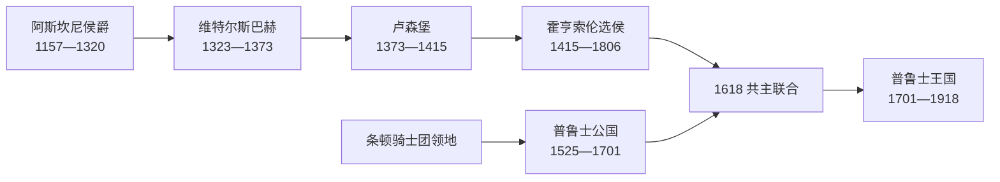

# 勃兰登堡与普鲁士统治者世系表

## 范围

本表连接勃兰登堡侯国、普鲁士公国、勃兰登堡-普鲁士和普鲁士王国。勃兰登堡属于神圣罗马帝国，普鲁士公国最初是波兰王冠封地且不在帝国内；1618年以后两地由同一位霍亨索伦君主统治，但法律身份仍不同。1701年君主只能在帝国外的普鲁士使用王号，直到1772年后称号才由“在普鲁士的国王”转为“普鲁士国王”。

## 阿斯坎尼家族勃兰登堡侯爵

| 顺序 | 侯爵 | 在位 | 继承与备注 |
| ---: | --- | --- | --- |
| 1 | **阿尔布雷希特一世“熊公”** | 1157-1170 | 从斯拉夫统治者雅克萨手中重夺勃兰登堡，确立侯国。 |
| 2 | 奥托一世 | 1170-1184 | 阿尔布雷希特一世之子。 |
| 3 | 奥托二世 | 1184-1205 | 奥托一世之子。 |
| 4 | 阿尔布雷希特二世 | 1205-1220 | 奥托二世之弟。 |
| 5 | 约翰一世 | 1220-1266 | 阿尔布雷希特二世之子；与弟共治，后形成施滕达尔支。 |
| 6 | 奥托三世 | 1220-1267 | 约翰一世之弟；后形成萨尔茨韦德尔支。 |
| 共治 | 约翰二世 | 1266-1281 | 约翰一世之子，施滕达尔支。 |
| 共治 | 康拉德一世 | 1266-1304 | 约翰一世之子。 |
| 共治 | 奥托四世“带箭者” | 1266-1308 | 约翰一世之子；与马格德堡争战。 |
| 共治 | 亨利一世“无地者” | 1266-1318 | 约翰一世之子。 |
| 共治 | 奥托五世“高个” | 1267-1298 | 奥托三世之子，萨尔茨韦德尔支。 |
| 共治 | 阿尔布雷希特三世 | 1267-1300 | 奥托三世之子。 |
| 共治 | 奥托六世“矮个” | 1267-1286 | 奥托三世之子，后放弃世俗统治。 |
| 共治 | 赫尔曼 | 1298-1308 | 奥托五世之子。 |
| 共治 | 约翰五世 | 1308-1317 | 赫尔曼之子，萨尔茨韦德尔支绝嗣。 |
| 末期 | **瓦尔德马** | 1308-1319 | 康拉德一世之子；重新集中多数领地。 |
| 末代 | 亨利二世“幼童” | 1319-1320 | 亨利一世之子；幼年去世，阿斯坎尼男系终结。 |

## 维特尔斯巴赫与卢森堡时期

| 家族 | 侯爵 / 选侯 | 在位 | 说明 |
| --- | --- | --- | --- |
| 维特尔斯巴赫 | 路易一世“勃兰登堡人” | 1323-1351 | 皇帝路易四世之子；由父授予空缺侯国。 |
| 维特尔斯巴赫 | 路易二世“罗马人” | 1351-1365 | 路易一世之弟；1356年成为法定选侯。 |
| 维特尔斯巴赫 | 奥托七世“懒人” | 1365-1373 | 路易二世之弟；把侯国让给查理四世。 |
| 卢森堡 | 瓦茨拉夫 | 1373-1378 | 查理四世之子；后为罗马人的国王。 |
| 卢森堡 | 西吉斯蒙德（第一次） | 1378-1388 | 瓦茨拉夫之弟；财政困难而抵押领地。 |
| 卢森堡 | 约布斯特·摩拉维亚 | 1388-1411 | 以抵押权实际统治，后短暂当选德意志国王。 |
| 卢森堡 | 西吉斯蒙德（复掌） | 1411-1415 | 为恢复秩序任命霍亨索伦腓特烈为总督，继而授选侯领。 |

## 霍亨索伦勃兰登堡选侯

| 顺序 | 选侯 | 在位 | 与前任关系 | 关键事件 |
| ---: | --- | --- | --- | --- |
| 1 | **腓特烈一世** | 1415/1417-1440 | 纽伦堡伯爵，受西吉斯蒙德授领 | 镇压地方贵族，建立霍亨索伦统治。 |
| 2 | 腓特烈二世“铁牙” | 1440-1470 | 腓特烈一世之子 | 强化柏林—科恩王权，迫使城市服从。 |
| 3 | 阿尔布雷希特“阿喀琉斯” | 1470-1486 | 腓特烈二世之弟 | 1473年制定继承规则，防止选侯领分割。 |
| 4 | 约翰“西塞罗” | 1486-1499 | 阿尔布雷希特之子 | 以勃兰登堡为常驻核心。 |
| 5 | 约阿希姆一世“涅斯托尔” | 1499-1535 | 约翰之子 | 反对宗教改革，设高等法院。 |
| 6 | 约阿希姆二世“赫克托耳” | 1535-1571 | 约阿希姆一世之子 | 1539年转向路德宗；王朝债务上升。 |
| 7 | 约翰·格奥尔格 | 1571-1598 | 约阿希姆二世之子 | 整顿财政与行政。 |
| 8 | 约阿希姆·腓特烈 | 1598-1608 | 约翰·格奥尔格之子 | 建立枢密院，准备普鲁士继承。 |
| 9 | **约翰·西吉斯蒙德** | 1608-1619 | 约阿希姆·腓特烈之子 | 1614取得克莱沃等莱茵领地，1618继承普鲁士公国。 |
| 10 | 格奥尔格·威廉 | 1619-1640 | 约翰·西吉斯蒙德之子 | 三十年战争中摇摆，领地遭反复占领。 |
| 11 | **腓特烈·威廉“大选侯”** | 1640-1688 | 格奥尔格·威廉之子 | 常备军、税务与枢密行政；1657取得普鲁士主权。 |
| 12 | **腓特烈三世** | 1688-1713 | 腓特烈·威廉之子 | 1701在普鲁士加冕为腓特烈一世；选侯身份继续至死。 |
| 13 | 腓特烈·威廉一世 | 1713-1740 | 腓特烈三世之子 | 同时为普鲁士国王；军政国家建设。 |
| 14 | 腓特烈二世 | 1740-1786 | 腓特烈·威廉一世之子 | 夺取西里西亚，跻身欧洲强国。 |
| 15 | 腓特烈·威廉二世 | 1786-1797 | 腓特烈二世之侄 | 参与瓜分波兰与法国革命战争。 |
| 16 | **腓特烈·威廉三世** | 1797-1806（选侯地位终止） | 腓特烈·威廉二世之子 | 1806神圣罗马帝国解体，勃兰登堡作为普鲁士王国省份继续存在。 |

## 普鲁士公爵

| 顺序 | 公爵 | 在位 | 宗主关系与继承 |
| ---: | --- | --- | --- |
| 1 | **阿尔布雷希特** | 1525-1568 | 条顿骑士团大团长世俗化；向波兰国王行臣属礼。 |
| 2 | 阿尔布雷希特·腓特烈 | 1568-1618 | 阿尔布雷希特之子；长期失去理政能力，由亲属摄政。 |
| 3 | **约翰·西吉斯蒙德** | 1618-1619 | 阿尔布雷希特·腓特烈女婿家系继承；兼勃兰登堡选侯。 |
| 4 | 格奥尔格·威廉 | 1619-1640 | 约翰·西吉斯蒙德之子。 |
| 5 | **腓特烈·威廉** | 1640-1688 | 1657—1660条约取得脱离波兰宗主权的主权地位。 |
| 6 | **腓特烈三世** | 1688-1701 | 1701以腓特烈一世身份成为“在普鲁士的国王”。 |

## 普鲁士国王

| 顺序 | 国王 | 在位 | 与前任关系 | 关键事件 |
| ---: | --- | --- | --- | --- |
| 1 | **腓特烈一世** | 1701-1713 | 原选侯腓特烈三世 | 获皇帝承认在普鲁士称王，建设宫廷与学术机构。 |
| 2 | **腓特烈·威廉一世** | 1713-1740 | 腓特烈一世之子 | 强化常备军、军需税与官僚体系。 |
| 3 | **腓特烈二世“大帝”** | 1740-1786 | 腓特烈·威廉一世之子 | 西里西亚战争、七年战争、第一次瓜分波兰。 |
| 4 | 腓特烈·威廉二世 | 1786-1797 | 腓特烈二世之侄 | 继续向东扩张，参与反法战争。 |
| 5 | 腓特烈·威廉三世 | 1797-1840 | 腓特烈·威廉二世之子 | 1806失败、施泰因—哈登贝格改革、解放战争。 |
| 6 | 腓特烈·威廉四世 | 1840-1861 | 腓特烈·威廉三世长子 | 1848年革命，拒绝法兰克福议会皇位。 |
| 7 | **威廉一世** | 1861-1888 | 腓特烈·威廉四世之弟 | 军制改革、统一战争，1871兼德意志皇帝。 |
| 8 | 腓特烈三世 | 1888-03-09—1888-06-15 | 威廉一世之子 | “三皇之年”中短暂统治。 |
| 9 | **威廉二世** | 1888-06-15—1918-11-09 | 腓特烈三世之子 | 末代普鲁士国王和德意志皇帝；革命中退位。 |

## 连续性辨析

- 1701年后勃兰登堡选侯没有消失，国王仍以选侯身份参与帝国；1806年帝国解体才终止该法定地位。
- “勃兰登堡-普鲁士”描述复合统治，不是一个在某日颁布统一宪法的新国号。
- 普鲁士王国1871年后仍是德意志帝国内最大成员邦，国王与德国皇帝由同一人兼任，但普鲁士政府、议会和行政区没有立即被帝国机关取代。
- 各阶段叙事见[勃兰登堡侯国](/%E4%BA%BA%E6%96%87%E7%A7%91%E5%AD%A6/%E5%8E%86%E5%8F%B2/%E6%AC%A7%E6%B4%B2/%E5%BE%B7%E6%84%8F%E5%BF%97/%E5%BE%B7%E5%9B%BD/%E5%8B%83%E5%85%B0%E7%99%BB%E5%A0%A1%E4%BE%AF%E5%9B%BD.md)、[普鲁士公国](/%E4%BA%BA%E6%96%87%E7%A7%91%E5%AD%A6/%E5%8E%86%E5%8F%B2/%E6%AC%A7%E6%B4%B2/%E5%BE%B7%E6%84%8F%E5%BF%97/%E5%BE%B7%E5%9B%BD/%E6%99%AE%E9%B2%81%E5%A3%AB%E5%85%AC%E5%9B%BD.md)、[勃兰登堡-普鲁士](/%E4%BA%BA%E6%96%87%E7%A7%91%E5%AD%A6/%E5%8E%86%E5%8F%B2/%E6%AC%A7%E6%B4%B2/%E5%BE%B7%E6%84%8F%E5%BF%97/%E5%BE%B7%E5%9B%BD/%E5%8B%83%E5%85%B0%E7%99%BB%E5%A0%A1-%E6%99%AE%E9%B2%81%E5%A3%AB.md)和[普鲁士王国](/%E4%BA%BA%E6%96%87%E7%A7%91%E5%AD%A6/%E5%8E%86%E5%8F%B2/%E6%AC%A7%E6%B4%B2/%E5%BE%B7%E6%84%8F%E5%BF%97/%E5%BE%B7%E5%9B%BD/%E6%99%AE%E9%B2%81%E5%A3%AB%E7%8E%8B%E5%9B%BD.md)。
