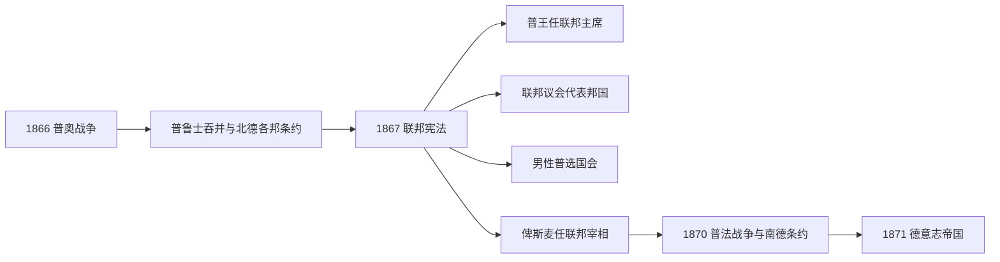

# 北德意志邦联

## 时间

1867年-1871年

## 概括

北德意志邦联是普鲁士在1866年普奥战争后主导建立的北部德意志联邦国家。它取代德意志邦联中普鲁士控制的北德部分，是1871年德意志帝国的直接制度前身。

## 统治结构

| 机构 / 职位 | 人物 / 主体 | 说明 |
|---|---|---|
| 联邦主席 | 普鲁士国王威廉一世 | 邦联由普鲁士主导，联邦主席由普鲁士国王担任。 |
| 联邦宰相 | 奥托·冯·俾斯麦 | 负责邦联政府运作，是德意志统一的关键政治人物。 |
| 联邦议会 | 各成员邦代表 | 体现成员邦参与，但普鲁士影响最大。 |
| 帝国议会 / 国会 | 男性普选产生 | 提供全国性议会框架，为1871年德意志帝国宪制奠基。 |

## 说明

- 1866年普奥战争后，德意志邦联解体，奥地利被排除出德国统一进程。
- 1867年，普鲁士联合北部德意志诸邦建立北德意志邦联。
- 邦联具有较强的联邦国家性质，不再只是松散邦联。
- 普鲁士国王为邦联主席，俾斯麦担任联邦宰相。
- 北德意志邦联建立了联邦议会、帝国议会、共同军队和统一外交政策。
- 1870-1871年普法战争后，南德诸邦加入统一进程，北德意志邦联扩展为德意志帝国。

## 国家元首

| 类型 | 人物 | 时间 | 说明 |
| --- | --- | --- | --- |
| 邦联主席 | 威廉一世 | 1867-1871 | 普鲁士国王兼任北德意志邦联主席。 |

## 政府首脑

| 类型 | 人物 | 时间 | 说明 |
| --- | --- | --- | --- |
| 联邦宰相 | 奥托·冯·俾斯麦 | 1867-1871 | 北德意志邦联制度和统一进程的核心首脑。 |

## 议会机构

| 机构 | 时间 | 说明 |
| --- | --- | --- |
| 联邦议会、帝国议会 | 1867-1871 | 共同构成北德意志邦联的联邦制度框架。 |

## 演变关系

- 前一节点：[德意志邦联](/%E4%BA%BA%E6%96%87%E7%A7%91%E5%AD%A6/%E5%8E%86%E5%8F%B2/%E6%AC%A7%E6%B4%B2/%E5%BE%B7%E6%84%8F%E5%BF%97/%E5%BE%B7%E6%84%8F%E5%BF%97%E9%82%A6%E8%81%94.md)、[普鲁士王国](/%E4%BA%BA%E6%96%87%E7%A7%91%E5%AD%A6/%E5%8E%86%E5%8F%B2/%E6%AC%A7%E6%B4%B2/%E5%BE%B7%E6%84%8F%E5%BF%97/%E5%BE%B7%E5%9B%BD/%E6%99%AE%E9%B2%81%E5%A3%AB%E7%8E%8B%E5%9B%BD.md)。
- 后一节点：[德意志帝国](/%E4%BA%BA%E6%96%87%E7%A7%91%E5%AD%A6/%E5%8E%86%E5%8F%B2/%E6%AC%A7%E6%B4%B2/%E5%BE%B7%E6%84%8F%E5%BF%97/%E5%BE%B7%E5%9B%BD/%E5%BE%B7%E6%84%8F%E5%BF%97%E5%B8%9D%E5%9B%BD.md)。

## 建立过程

1866年普奥战争后，普鲁士没有吞并所有盟邦。汉诺威、黑森-卡塞尔、拿骚和法兰克福因站在奥地利一方且具有战略价值被直接并入；萨克森、梅克伦堡、各图林根邦和汉萨城市则以条约加入新联邦。1866年8月同盟条约先建立军事政治框架，制宪国会于1867年讨论俾斯麦方案，7月宪法生效。

这是联邦国家而非旧式邦联：外交、陆军、海军、关税、邮政和重要经济法律归共同机关。普鲁士国王以“联邦主席”身份代表邦联、统帅军队并任命宰相；宰相是唯一联邦大臣，对主席负责而非由国会信任产生。

## 宪制中的平衡

| 机关 | 产生方式 | 权限 | 权力现实 |
| --- | --- | --- | --- |
| 联邦主席 | 由普鲁士国王当然兼任 | 对外代表、宣战与统帅、任免宰相 | 普鲁士王朝权力核心。 |
| 联邦议会 | 各邦政府派代表，合计43票 | 与国会共同立法，可否决宪法变更 | 普鲁士17票足以阻止需三分之二的宪法修改。 |
| 帝国国会 | 25岁以上男性普选 | 通过法律与预算 | 不能选免宰相；选举仍创造全国政治公众。 |
| 联邦宰相 | 主席任命 | 主持联邦议会、执行政策 | 俾斯麦同时为普鲁士首相，连接两套权力。 |
| 成员邦 | 各自君主、议会和行政 | 教育、地方行政等保留事务 | 军事协定使普鲁士掌握关键力量。 |

## 南德关系与帝国转化

巴伐利亚、符腾堡、巴登、黑森南部在1866年后未立即加入，但与普鲁士签有秘密攻守同盟，并进入关税议会。1870年西班牙王位候选与埃姆斯电报危机引发普法战争，法国宣战使南德按同盟出兵。战争中的民族动员与安全需求为加入创造条件，俾斯麦分别谈判，允许巴伐利亚、符腾堡保留邮政、铁路或军队管理等若干特权。

1870年11月条约把联邦扩大到南德；1871年1月18日普鲁士国王获“德意志皇帝”称号，4月修订宪法正式实施。帝国在法律上是北德意志邦联的扩大和改名，而非完全从零创立，因此机关、宪法文本、宰相与国会具有连续性。

## 关键事件与成败原因

| 时间 | 事件 | 意义 |
| --- | --- | --- |
| 1866-08 | 北德同盟条约 | 把军事联盟与制宪承诺结合。 |
| 1867-02—04 | 制宪国会 | 自由派修正预算、权利和法律条文，但未实现议会政府。 |
| 1867-07-01 | 宪法生效 | 联邦国家正式运作。 |
| 1867—1870 | 法律与经济统一 | 统一护照、度量衡、商业和关税制度。 |
| 1870-07 | 普法战争 | 南北共同作战，民族统一加速。 |
| 1870-11—1871-04 | 加入条约与帝国宪法 | 邦联扩展为德意志帝国。 |

北德意志邦联成功在于普鲁士军事胜利、关税网络、对被吞并邦与保留邦采取不同安排、普选国会提供民族合法性。它的局限是行政对君主和宰相负责、普鲁士权重过大、波兰与丹麦少数族群问题未解决。其“终结”是制度升级与领土扩大，而非战败灭亡。
