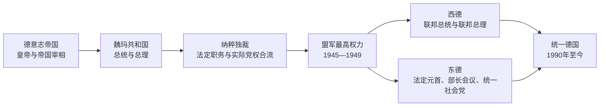

# 德国国家元首与政府首脑表

## 范围与读法

本表把1871年以来德国的国家元首、政府首脑与实际党权分开。德意志帝国的皇帝兼普鲁士国王，但帝国宰相并非议会多数产生；魏玛共和国实行总统—议会混合结构；纳粹时期法定职务被“领袖原则”吞并；1949—1990年必须区分西德的议会民主与东德的法定国家机关、政府和德国统一社会党领导；1990年后延续德意志联邦共和国的国家连续性。

## 德意志帝国皇帝

| 顺序 | 皇帝 | 在位 | 与前任关系 | 关键事件 |
| ---: | --- | --- | --- | --- |
| 1 | **威廉一世** | 1871-01-18—1888-03-09 | 首任；普鲁士国王 | 在凡尔赛获拥立；俾斯麦时期完成帝国制度建设。 |
| 2 | 腓特烈三世 | 1888-03-09—1888-06-15 | 威廉一世之子 | 患病在位九十九日，未能实施自由派改革设想。 |
| 3 | **威廉二世** | 1888-06-15—1918-11-09 | 腓特烈三世之子 | 迫使俾斯麦辞职，推行世界政策；一战失败与革命中退位。 |

## 德意志帝国宰相

| 顺序 | 帝国宰相 | 任期 | 形成与终止 | 关键事件 |
| ---: | --- | --- | --- | --- |
| 1 | **奥托·冯·俾斯麦** | 1871-03-21—1890-03-20 | 由皇帝任命；与威廉二世冲突后辞职 | 文化斗争、反社会主义法、社会保险、联盟外交。 |
| 2 | 莱奥·冯·卡普里维 | 1890-03-20—1894-10-26 | 取代俾斯麦；失去宫廷与保守派支持 | “新路线”、商业条约、军制调整。 |
| 3 | 克洛德维希·祖·霍恩洛厄-席林斯菲尔斯特 | 1894-10-29—1900-10-17 | 高龄过渡型宰相 | 海军扩张起步、世界政策形成。 |
| 4 | 伯恩哈德·冯·比洛 | 1900-10-17—1909-07-14 | 皇帝倚重；财政与议会危机后辞职 | 海军竞赛、殖民政策、比洛集团。 |
| 5 | 特奥巴尔德·冯·贝特曼·霍尔韦格 | 1909-07-14—1917-07-13 | 七月危机后领导战时政府；被军政压力迫退 | 1914年决策、国内“城堡和平”、无限制潜艇战争争论。 |
| 6 | 格奥尔格·米夏埃利斯 | 1917-07-14—1917-11-01 | 军方支持的短期任命 | 议会和平决议与最高统帅部权力扩张。 |
| 7 | 格奥尔格·冯·赫特林 | 1917-11-01—1918-09-30 | 保守派联合；军事败局中辞职 | 布列斯特和约、战局逆转。 |
| 8 | **马克斯·冯·巴登** | 1918-10-03—1918-11-09 | 为议会化与停战而组阁；革命中移交权力 | 十月改革、宣布皇帝退位、把总理职位交给艾伯特。 |

## 魏玛共和国国家元首

| 顺序 | 国家元首 | 任期 | 身份 | 说明 |
| ---: | --- | --- | --- | --- |
| 1 | 弗里德里希·艾伯特 | 1918-11-09—1919-02-11 | 人民代表委员会主席 | 革命过渡期实际国家领导；与军方达成维持秩序的安排。 |
| 2 | **弗里德里希·艾伯特** | 1919-02-11—1925-02-28 | 帝国总统 | 制宪共和国首任总统，多次动用紧急权力处理暴动与危机。 |
| 3 | 汉斯·路德 | 1925-02-28—1925-03-12 | 总理代行元首职权 | 艾伯特去世后的第一段代理。 |
| 4 | 瓦尔特·西蒙斯 | 1925-03-12—1925-05-12 | 帝国法院院长代行 | 依法律安排代理至新总统就职。 |
| 5 | **保罗·冯·兴登堡** | 1925-05-12—1934-08-02 | 帝国总统 | 1930年后支持总统内阁；1933年任命希特勒为总理，死后总统职权被合并。 |

## 魏玛共和国政府首脑

| 顺序 | 总理 | 任期 | 联盟或性质 | 关键事件 / 备注 |
| ---: | --- | --- | --- | --- |
| 1 | 菲利普·谢德曼 | 1919-02-13—1919-06-20 | 魏玛联盟 | 不愿承担签署《凡尔赛条约》责任而辞职。 |
| 2 | 古斯塔夫·鲍尔 | 1919-06-21—1920-03-26 | 社民党主导 | 签署和约；卡普政变后改组。 |
| 3 | 赫尔曼·穆勒（第一次） | 1920-03-27—1920-06-08 | 魏玛联盟 | 首次国会选举前后短期执政。 |
| 4 | 康斯坦丁·费伦巴赫 | 1920-06-25—1921-05-04 | 中间派少数政府 | 赔款谈判失败后辞职。 |
| 5 | 约瑟夫·维尔特 | 1921-05-10—1922-11-14 | 中间派—社民党 | 履约政策、拉帕洛条约、政治暗杀危机。 |
| 6 | 威廉·库诺 | 1922-11-22—1923-08-12 | 无党派保守政府 | 鲁尔危机“消极抵抗”与恶性通胀。 |
| 7 | **古斯塔夫·施特雷泽曼** | 1923-08-13—1923-11-30 | 大联合政府 | 结束消极抵抗、稳定货币、平息地方危机。 |
| 8 | 威廉·马克思（第一次） | 1923-11-30—1925-01-15 | 中间派联盟 | 道威斯计划与相对稳定开端。 |
| 9 | 汉斯·路德 | 1925-01-15—1926-05-12 | 无党派中间—右翼 | 洛迦诺条约；国旗争议后辞职。 |
| 10 | 威廉·马克思（第二次） | 1926-05-17—1928-06-12 | 中间—右翼 | 德国加入国际联盟，处理军队与共和国关系。 |
| 11 | 赫尔曼·穆勒（第二次） | 1928-06-28—1930-03-27 | 大联合政府 | 失业保险财政分歧使最后一个议会多数政府瓦解。 |
| 12 | 海因里希·布吕宁 | 1930-03-30—1932-05-30 | 总统内阁 | 紧缩、紧急法令、议会权威衰退。 |
| 13 | 弗朗茨·冯·帕彭 | 1932-06-01—1932-11-17 | 总统内阁 | “普鲁士政变”、解除纳粹冲锋队禁令。 |
| 14 | 库尔特·冯·施莱谢尔 | 1932-12-03—1933-01-28 | 总统内阁 | 分化纳粹与工会的方案失败。 |
| 15 | 阿道夫·希特勒 | 1933-01-30起 | 纳粹—保守联盟，迅速转为独裁 | 1933年3月《授权法》后共和国宪政实质终止。 |

## 纳粹统治末期的法定职务

| 职位 | 人物 | 任期 | 实际权力 |
| --- | --- | --- | --- |
| 帝国总统 | 兴登堡 | 1933-01-30—1934-08-02 | 保留形式元首权；任命希特勒后制衡迅速消失。 |
| 帝国总理、后“元首兼帝国总理” | **阿道夫·希特勒** | 1933-01-30—1945-04-30 | 党、国家、军队最高决策者；1934年合并元首职权。 |
| 帝国总统 | 卡尔·邓尼茨 | 1945-04-30—1945-05-23 | 依希特勒遗嘱组成弗伦斯堡政府，权力仅及残余控制区。 |
| 帝国总理 | 约瑟夫·戈培尔 | 1945-04-30—1945-05-01 | 一日后自杀。 |
| “首席部长” | 卢茨·格拉夫·什未林·冯·克罗西克 | 1945-05-02—1945-05-23 | 邓尼茨政府行政首脑；盟军逮捕后终止。 |

## 西德与统一德国联邦总统

| 顺序 | 联邦总统 | 任期 | 说明 |
| ---: | --- | --- | --- |
| 1 | 特奥多尔·豪斯 | 1949-09-13—1959-09-12 | 建立礼仪性总统职位的民主惯例。 |
| 2 | 海因里希·吕布克 | 1959-09-13—1969-06-30 | 两任；因健康和争议提前离任。 |
| 3 | 古斯塔夫·海涅曼 | 1969-07-01—1974-06-30 | 强调公民民主与反省历史。 |
| 4 | 瓦尔特·谢尔 | 1974-07-01—1979-06-30 | 前外长；东方政策一代人物。 |
| 5 | 卡尔·卡斯滕斯 | 1979-07-01—1984-06-30 | 保守派总统。 |
| 6 | **里夏德·冯·魏茨泽克** | 1984-07-01—1994-06-30 | 统一时国家元首；以历史责任讲话著称。 |
| 7 | 罗曼·赫尔佐克 | 1994-07-01—1999-06-30 | 统一后首位全程任职总统。 |
| 8 | 约翰内斯·劳 | 1999-07-01—2004-06-30 | 推动社会和解。 |
| 9 | 霍斯特·克勒 | 2004-07-01—2010-05-31 | 连任后辞职。 |
| 代理 | 延斯·伯恩森 | 2010-05-31—2010-06-30 | 以联邦参议院议长身份代行。 |
| 10 | 克里斯蒂安·武尔夫 | 2010-06-30—2012-02-17 | 因政治与司法争议辞职。 |
| 代理 | 霍斯特·泽霍费尔 | 2012-02-17—2012-03-18 | 以联邦参议院议长身份代行。 |
| 11 | 约阿希姆·高克 | 2012-03-18—2017-03-18 | 原东德公民权利活动者。 |
| 12 | **弗兰克-瓦尔特·施泰因迈尔** | 2017-03-19—至今 | 2022年连任；截至2026-07-14在任。 |

## 西德与统一德国联邦总理

| 顺序 | 联邦总理 | 任期 | 政党 / 联盟 | 关键事件 |
| ---: | --- | --- | --- | --- |
| 1 | **康拉德·阿登纳** | 1949-09-15—1963-10-16 | 基民盟，联盟政府 | 西方结盟、社会市场经济、主权恢复。 |
| 2 | 路德维希·艾哈德 | 1963-10-16—1966-12-01 | 基民盟 | 经济奇迹象征；联盟破裂后辞职。 |
| 3 | 库尔特·格奥尔格·基辛格 | 1966-12-01—1969-10-21 | 基民盟—社民党大联合 | 应对经济衰退，推动紧急状态法。 |
| 4 | **维利·勃兰特** | 1969-10-21—1974-05-07 | 社民党—自民党 | 东方政策、华沙条约；间谍案后辞职。 |
| 代理 | 瓦尔特·谢尔 | 1974-05-07—1974-05-16 | 自民党 | 副总理临时主持政府。 |
| 5 | 赫尔穆特·施密特 | 1974-05-16—1982-10-01 | 社民党—自民党 | 石油危机、恐怖主义、北约双轨决定。 |
| 6 | **赫尔穆特·科尔** | 1982-10-01—1998-10-27 | 基民盟—自民党 | 建设性不信任案上台；两德统一、欧洲一体化。 |
| 7 | 格哈德·施罗德 | 1998-10-27—2005-11-22 | 社民党—绿党 | “2010议程”、科索沃与阿富汗政策。 |
| 8 | **安格拉·默克尔** | 2005-11-22—2021-12-08 | 基民盟，多种联盟 | 欧债、难民、能源与新冠危机；首位女总理。 |
| 9 | 奥拉夫·朔尔茨 | 2021-12-08—2025-05-06 | 社民党—绿党—自民党，后少数政府 | 俄乌战争后的“时代转折”；联盟破裂并提前选举。 |
| 10 | **弗里德里希·默茨** | 2025-05-06—至今 | 基民盟/基社盟—社民党 | 2025年组阁；截至2026-07-14在任。 |

## 东德法定国家元首

| 顺序 | 职位与人物 | 任期 | 说明 |
| ---: | --- | --- | --- |
| 1 | 总统 威廉·皮克 | 1949-10-11—1960-09-07 | 唯一一任东德总统。 |
| 2 | 国务委员会主席 **瓦尔特·乌布利希** | 1960-09-12—1973-08-01 | 同时长期掌握统一社会党最高权力。 |
| 代理 | 国务委员会代理主席 弗里德里希·艾伯特 | 1973-08-01—1973-10-03 | 乌布利希去世后的过渡。 |
| 3 | 国务委员会主席 维利·斯多夫 | 1973-10-03—1976-10-29 | 后回任部长会议主席。 |
| 4 | 国务委员会主席 **埃里希·昂纳克** | 1976-10-29—1989-10-24 | 党和国家最高职位合一。 |
| 5 | 国务委员会主席 埃贡·克伦茨 | 1989-10-24—1989-12-06 | 和平革命中迅速失势。 |
| 6 | 国务委员会主席 曼弗雷德·格拉赫 | 1989-12-06—1990-04-05 | 非统一社会党人士，过渡期元首。 |
| 7 | 人民议院主席 萨宾娜·贝格曼-波尔 | 1990-04-05—1990-10-02 | 国务委员会废除后代行国家元首职能。 |

## 东德政府首脑

| 顺序 | 政府首脑 | 任期 | 说明 |
| ---: | --- | --- | --- |
| 1 | 奥托·格罗提渥 | 1949-10-12—1964-09-21 | 首任部长会议主席，实际受统一社会党领导。 |
| 2 | 维利·斯多夫（第一次） | 1964-09-24—1973-10-03 | 经济管理与制度稳定阶段。 |
| 3 | 霍斯特·辛德曼 | 1973-10-03—1976-10-29 | 与昂纳克政策配合。 |
| 4 | 维利·斯多夫（第二次） | 1976-10-29—1989-11-07 | 长期政府首脑，危机中辞职。 |
| 代理 | 沃尔夫冈·劳赫富斯 | 1989-11-08—1989-11-13 | 内阁更替短暂代理。 |
| 5 | 汉斯·莫德罗 | 1989-11-13—1990-04-12 | 圆桌会议、开放政治和统一谈判起步。 |
| 6 | **洛塔尔·德迈齐埃** | 1990-04-12—1990-10-02 | 首次自由选举后组阁，完成货币与国家统一谈判。 |

## 东德实际党领导

| 顺序 | 统一社会党最高领导 | 任期 | 说明 |
| ---: | --- | --- | --- |
| 1 | 威廉·皮克、奥托·格罗提渥（共同主席） | 1946-1950 | 苏占区社会民主党与共产党合并后的双主席制。 |
| 2 | **瓦尔特·乌布利希** | 1950-1971 | 总书记、后第一书记；建设计划经济与柏林墙。 |
| 3 | **埃里希·昂纳克** | 1971-1989-10 | 第一书记、后总书记；福利承诺与经济停滞并存。 |
| 4 | 埃贡·克伦茨 | 1989-10—1989-12 | 危机中的最后一任统一社会党总书记。 |
| 5 | 格雷戈尔·吉西 | 1989-12起 | 改组后的党主席；此时一党垄断已经瓦解。 |

## 制度辨析

- 联邦总统不是政府首脑；联邦总理由联邦议院选举并决定政府政策总方针。
- 东德部长会议处理行政，但重大路线由统一社会党中央政治局决定，故法定职务与实际党领导必须分表。
- 1990年统一并非新建第三个国家，而是东德各州依《基本法》加入联邦共和国；联邦总统和联邦总理序列因此从西德连续到统一德国。
- 详细过程分别见[德意志帝国](/%E4%BA%BA%E6%96%87%E7%A7%91%E5%AD%A6/%E5%8E%86%E5%8F%B2/%E6%AC%A7%E6%B4%B2/%E5%BE%B7%E6%84%8F%E5%BF%97/%E5%BE%B7%E5%9B%BD/%E5%BE%B7%E6%84%8F%E5%BF%97%E5%B8%9D%E5%9B%BD.md)、[魏玛共和国](/%E4%BA%BA%E6%96%87%E7%A7%91%E5%AD%A6/%E5%8E%86%E5%8F%B2/%E6%AC%A7%E6%B4%B2/%E5%BE%B7%E6%84%8F%E5%BF%97/%E5%BE%B7%E5%9B%BD/%E9%AD%8F%E7%8E%9B%E5%85%B1%E5%92%8C%E5%9B%BD.md)、[纳粹德国](/%E4%BA%BA%E6%96%87%E7%A7%91%E5%AD%A6/%E5%8E%86%E5%8F%B2/%E6%AC%A7%E6%B4%B2/%E5%BE%B7%E6%84%8F%E5%BF%97/%E5%BE%B7%E5%9B%BD/%E7%BA%B3%E7%B2%B9%E5%BE%B7%E5%9B%BD.md)、[东德西德](/%E4%BA%BA%E6%96%87%E7%A7%91%E5%AD%A6/%E5%8E%86%E5%8F%B2/%E6%AC%A7%E6%B4%B2/%E5%BE%B7%E6%84%8F%E5%BF%97/%E5%BE%B7%E5%9B%BD/%E4%B8%9C%E5%BE%B7%E8%A5%BF%E5%BE%B7.md)与[德国统一](/%E4%BA%BA%E6%96%87%E7%A7%91%E5%AD%A6/%E5%8E%86%E5%8F%B2/%E6%AC%A7%E6%B4%B2/%E5%BE%B7%E6%84%8F%E5%BF%97/%E5%BE%B7%E5%9B%BD/%E5%BE%B7%E5%9B%BD%E7%BB%9F%E4%B8%80.md)。
