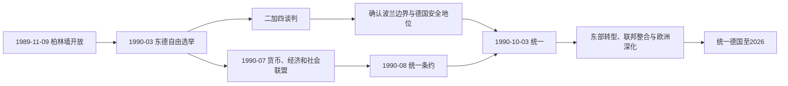

# 德国统一

## 时间

1990年至今

## 概括

德国统一指1990年德意志民主共和国并入德意志联邦共和国，结束冷战时期德国分裂，形成今天统一的德国。统一后的德国继承西德宪政框架，并在欧洲联盟和北约体系中继续发展。

## 说明

- 1989年东欧剧变削弱东德政权，柏林墙在11月9日开放。
- 1990年3月，东德举行自由选举，统一成为主要政治议题。
- “二加四条约”由两个德国与美、苏、英、法四个占领权国家达成，解决统一德国的国际地位问题。
- 1990年10月3日，东德正式加入德意志联邦共和国，德国实现统一。
- 统一后的德国首都重新确定为柏林。
- 统一初期面临东部经济转型、社会融合、产业重组和人口迁移等问题。
- 统一德国成为欧洲联盟中人口和经济规模最大的国家之一。

## 国家元首

| 类型 | 人物 | 时间 | 说明 |
| --- | --- | --- | --- |
| 统一时期联邦总统 | 里夏德·冯·魏茨泽克 | 1984-1994 | 两德统一时的德国联邦总统。 |
| 现代联邦总统 | 弗兰克-瓦尔特·施泰因迈尔 | 2017至今 | 截至2026-07-14仍在任。 |

## 政府首脑

| 类型 | 人物 | 时间 | 说明 |
| --- | --- | --- | --- |
| 统一时期联邦总理 | 赫尔穆特·科尔 | 1982-1998 | 推动两德统一的关键政府首脑。 |
| 现代联邦总理 | 弗里德里希·默茨 | 2025-05-06至今 | 截至2026-07-14仍在任。 |

## 演变关系

- 前一节点：[东德西德](/%E4%BA%BA%E6%96%87%E7%A7%91%E5%AD%A6/%E5%8E%86%E5%8F%B2/%E6%AC%A7%E6%B4%B2/%E5%BE%B7%E6%84%8F%E5%BF%97/%E5%BE%B7%E5%9B%BD/%E4%B8%9C%E5%BE%B7%E8%A5%BF%E5%BE%B7.md)。
- 后一节点：现代德国。

## 统一的法律与外交过程

东德3月选举后，德迈齐埃政府选择依《基本法》旧第23条由恢复的五个州加入联邦共和国，而非两国共同制定全新宪法。7月西德马克成为东德货币，社会保险、市场和财政规则同步引入。8月31日统一条约处理州、议会席位、行政、教育、财产、档案和法律过渡，东德人民议院随后表决加入日期。

国际上，“二加四”由两个德国与美、苏、英、法谈判。统一德国确认现有边界、放弃领土要求、限制军队规模并接受北约成员身份；苏军分期撤出，四国权利终止。德国另与波兰签订边界条约，确认奥得—尼斯线。10月3日东德法律人格终止，联邦共和国的国际与宪法连续性延伸至东部。

## 转型与社会后果

国有企业由托管局私有化、关闭或重组，生产链因货币升值、旧市场崩溃和竞争骤增而断裂。基础设施、城市、环境和通信得到大规模投资，但失业、人口外流、财富与工资差距形成长期“东部经验”。原所有者返还、租户保障、农业合作社和公共职位审查造成复杂冲突。国家安全部档案开放支持受害者查阅和学术研究，也引发隐私与合作责任争论。

统一不是简单把“落后地区现代化”：东德的托幼、女性就业、教育经历和社会网络也影响统一社会。世代记忆、对转型公正的评价与政党格局长期呈东西差异。

## 1990年以来政治阶段

| 阶段 | 政府与重点 | 主要转折 |
| --- | --- | --- |
| 1990—1998 | 科尔政府 | 统一执行、欧洲货币联盟、波斯尼亚后安全角色讨论。 |
| 1998—2005 | 施罗德政府 | 红绿联盟、国籍改革、科索沃与阿富汗行动、2010议程。 |
| 2005—2021 | 默克尔政府 | 多种联盟，欧债、能源转型、2015难民、新冠危机。 |
| 2021—2025 | 朔尔茨政府 | 三党联盟，俄乌战争后“时代转折”、能源替代；联盟破裂。 |
| 2025—至今 | 默茨政府 | 基民盟/基社盟—社民党联盟，经济、国防、移民与欧洲协调；截至2026-07-14仍执政。 |

## 欧洲与国际角色

统一与欧洲一体化相互绑定：德国支持《马斯特里赫特条约》、欧元和欧盟扩员，以多边制度降低邻国对新大国的担忧。1994年宪法法院为境外部署设定议会批准框架，德国逐步参与巴尔干、阿富汗等任务。2022年俄乌战争后政府宣布“时代转折”，提高国防投入并摆脱对俄能源依赖；政策执行又受到财政、产业与联盟政治限制。

## 现代制度与现任领导

德国为十六州联邦议会共和国。联邦总统履行代表、任命和宪法审查等职能；联邦总理由联邦议院选举，通过“建设性不信任案”才能被替代。州经联邦参议院参与立法，宪法法院保障基本权利与权力边界。

截至2026-07-14，联邦总统为弗兰克-瓦尔特·施泰因迈尔，2017年就任、2022年连任；联邦总理为弗里德里希·默茨，2025-05-06就任。1871年以来完整领导序列见[德国国家元首与政府首脑表](/%E4%BA%BA%E6%96%87%E7%A7%91%E5%AD%A6/%E5%8E%86%E5%8F%B2/%E6%AC%A7%E6%B4%B2/%E5%BE%B7%E6%84%8F%E5%BF%97/%E5%BE%B7%E5%9B%BD/%E5%BE%B7%E5%9B%BD%E5%9B%BD%E5%AE%B6%E5%85%83%E9%A6%96%E4%B8%8E%E6%94%BF%E5%BA%9C%E9%A6%96%E8%84%91%E8%A1%A8.md)。

## 统一的成就、矛盾与长期意义

统一成功消除欧洲核心分裂、建立共同民主法律和交通财政体系，并与欧洲联盟深化相容。持续矛盾包括地区生产率和财富差距、人口老龄化、移民整合、能源与工业转型、极右翼和政治不信任。理解这些问题需区分1990年的直接制度选择、全球化与技术变化、各届政府政策，不能把全部差异简单归因于“东德遗产”。
