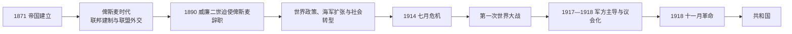

# 德意志帝国

## 时间

1871年-1918年

## 概括

德意志帝国是1871年普鲁士主导德意志统一后建立的联邦制帝国，以普鲁士国王兼任德意志皇帝为核心。它不是完全消灭各邦的单一制国家，而是由若干保留本地君主、政府传统和地方身份的成员邦组成。

## 说明

- 德意志帝国由普鲁士主导完成统一，是小德意志方案的结果。
- 帝国共有25个成员邦，另有阿尔萨斯-洛林作为帝国直辖领。
- 普鲁士王国是帝国中面积和人口最大的邦国，也是帝国政治和军事结构的主导力量。
- 巴伐利亚、萨克森、符腾堡等王国在统一后仍保留一定地方身份和王室传统。
- 汉堡、吕贝克、不来梅延续汉萨自由市传统，在帝国内属于共和制城市邦。
- 阿尔萨斯-洛林不是普通成员邦，而是普法战争后由帝国直接管理的帝国直辖领。

## 君主世系

| 顺序 | 君主 | 在位时间 | 说明 |
| ---: | --- | --- | --- |
| 1 | 威廉一世 | 1871-1888 | 德意志帝国首任皇帝，同时为普鲁士国王。 |
| 2 | 腓特烈三世 | 1888 | 在位时间很短。 |
| 3 | 威廉二世 | 1888-1918 | 德意志帝国末代皇帝，1918年退位。 |

## 政府首脑

| 类型 | 人物 | 时间 | 说明 |
| --- | --- | --- | --- |
| 帝国宰相 | 奥托·冯·俾斯麦 | 1871-1890 | 帝国首任宰相，统一后制度和外交秩序的核心人物。 |
| 末任帝国宰相 | 马克斯·冯·巴登 | 1918 | 德国革命前后短暂任宰相。 |

## 邦国结构

| 类型 | 数量 | 成员 |
| --- | ---: | --- |
| 王国 | 4 | 普鲁士、巴伐利亚、萨克森、符腾堡 |
| 大公国 | 6 | 巴登、梅克伦堡-什未林、黑森、奥尔登堡、萨克森-魏玛-艾森纳赫、梅克伦堡-施特雷利茨 |
| 公国 | 5 | 不伦瑞克、萨克森-迈宁根、安哈尔特、萨克森-科堡-哥达、萨克森-阿尔滕堡 |
| 亲王国 | 7 | 利珀、瓦尔德克、施瓦茨堡-鲁多尔施塔特、施瓦茨堡-松德斯豪森、罗伊斯幼系、绍姆堡-利珀、罗伊斯长系 |
| 汉萨自由市 | 3 | 汉堡、吕贝克、不来梅 |
| 帝国直辖领 | 1 | 阿尔萨斯-洛林 |

## 演变关系

- 前一节点：[北德意志邦联](/%E4%BA%BA%E6%96%87%E7%A7%91%E5%AD%A6/%E5%8E%86%E5%8F%B2/%E6%AC%A7%E6%B4%B2/%E5%BE%B7%E6%84%8F%E5%BF%97/%E5%BE%B7%E5%9B%BD/%E5%8C%97%E5%BE%B7%E6%84%8F%E5%BF%97%E9%82%A6%E8%81%94.md)。
- 后一节点：[魏玛共和国](/%E4%BA%BA%E6%96%87%E7%A7%91%E5%AD%A6/%E5%8E%86%E5%8F%B2/%E6%AC%A7%E6%B4%B2/%E5%BE%B7%E6%84%8F%E5%BF%97/%E5%BE%B7%E5%9B%BD/%E9%AD%8F%E7%8E%9B%E5%85%B1%E5%92%8C%E5%9B%BD.md)。
- 相关节点：[普鲁士王国](/%E4%BA%BA%E6%96%87%E7%A7%91%E5%AD%A6/%E5%8E%86%E5%8F%B2/%E6%AC%A7%E6%B4%B2/%E5%BE%B7%E6%84%8F%E5%BF%97/%E5%BE%B7%E5%9B%BD/%E6%99%AE%E9%B2%81%E5%A3%AB%E7%8E%8B%E5%9B%BD.md)。

## 建立过程与联邦结构

1870—1871年普法战争中，南德诸邦与北德意志邦联共同作战。俾斯麦分别与巴伐利亚、符腾堡、巴登和黑森南部谈判加入条件。1871年1月18日诸侯在凡尔赛拥立威廉一世，4月帝国宪法生效。帝国法律上延续北德意志邦联：联邦议会代表成员政府，国会由男性普选产生，皇帝任免宰相，宰相不必获得国会信任。

普鲁士在联邦议会拥有17票，可阻止宪法修正；国王兼皇帝，首相常兼宰相，军队构成帝国军事核心。巴伐利亚、符腾堡等保留部分邮政、铁路和军队管理权。国会能批准法律和预算，普选促进政党全国化，却不能组织议会政府；这造成广泛选举参与与行政不对议会负责并存。

## 俾斯麦时代

俾斯麦先以自由派支持统一法制、货币、中央银行和商业规则。1870年代“文化斗争”试图限制天主教会与中央党，因政治反弹和反社会主义需要而收缩。1878年后保护关税形成容克农业与重工业联盟；反社会主义法压制组织，却未阻止社民党选票增长。疾病、工伤和养老保险开创国家社会保险，既回应工业风险，也意在把工人纳入国家。

外交上俾斯麦力图孤立法国、避免奥俄冲突拖累德国，通过三皇同盟、德奥同盟与再保险条约维持欧洲均势。1880年代德国取得非洲和太平洋殖民地，殖民统治伴随强制劳动、土地剥夺和暴力；西南非洲对赫雷罗与纳马人的战争发展为种族灭绝。

## 威廉时代与社会变迁

1890年威廉二世迫使俾斯麦辞职。工业、城市、科学教育和大企业快速扩张，德国成为主要工业强国；工人阶级、天主教徒、波兰人、女性运动与中产社团形成多元社会。政治制度却仍保留普鲁士三等级选举、皇帝军事权和精英官僚，改革速度慢于社会变化。

“世界政策”追求殖民、海军与全球地位，提尔皮茨海军法加剧英德竞争。摩洛哥危机、巴尔干联盟体系与军备竞赛缩小外交回旋空间，但战争并非由单一德国海军政策自动造成，各大国安全困境和帝国竞争相互强化。

## 第一次世界大战与崩溃过程

1914年萨拉热窝事件后，德国向奥匈提供“空白支票”，支持对塞尔维亚强硬；施里芬—毛奇计划使对俄动员迅速转为入侵比利时和法国。西线陷入堑壕，海上封锁造成物资短缺。1916年兴登堡和鲁登道夫领导最高统帅部，控制军需、劳工与外交，形成近似军事独裁。

1917年无限制潜艇战促使美国参战；国会通过和平决议，却缺乏迫使政府转向的权力。1918年春季攻势失败、盟军反攻和盟友崩溃后，军方要求新政府求和。十月改革使宰相对国会负责，但来得太迟。基尔水兵兵变扩散为工兵委员会运动，11月9日马克斯·冯·巴登宣布皇帝退位并移交权力，帝国君主制终结。

## 重要事件

| 时间 | 事件 | 过程与影响 |
| --- | --- | --- |
| 1871 | 帝国成立 | 小德意志统一，联邦君主制建立。 |
| 1873—1878 | 文化斗争 | 国家与天主教会冲突，中央党反而巩固。 |
| 1878—1890 | 反社会主义法与社会保险 | 压制与整合并用，社民党仍成长。 |
| 1884—1885 | 殖民扩张 | 德国正式取得海外殖民地。 |
| 1890 | 俾斯麦辞职 | 联盟外交和内政协调方式改变。 |
| 1898—1912 | 海军法 | 英德海军竞赛与财政政治冲突。 |
| 1904—1908 | 西南非洲战争 | 殖民军实施大规模杀戮与集中营政策。 |
| 1914 | 七月危机与参战 | 欧洲联盟危机发展为总体战。 |
| 1917 | 无限潜艇战与国会和平决议 | 美国参战，国内议会化压力上升。 |
| 1918 | 战败与革命 | 军事崩溃、饥荒和政治合法性危机共同推翻君主制。 |

## 兴衰分析

帝国崛起依赖普鲁士军政能力、工业化、铁路、关税整合、民族动员与俾斯麦孤立对手。鼎盛条件包括教育科研、统一市场、银行工业协作和人口增长。衰落不是“某位皇帝性格”单因：宪制缺乏负责政府、军方决策权过大、社会代表冲突、海军与殖民竞争、联盟僵化共同增加风险；总体战资源消耗、封锁、美国参战、1918战场失败和革命构成直接终结链。皇帝与全部宰相见[德国国家元首与政府首脑表](/%E4%BA%BA%E6%96%87%E7%A7%91%E5%AD%A6/%E5%8E%86%E5%8F%B2/%E6%AC%A7%E6%B4%B2/%E5%BE%B7%E6%84%8F%E5%BF%97/%E5%BE%B7%E5%9B%BD/%E5%BE%B7%E5%9B%BD%E5%9B%BD%E5%AE%B6%E5%85%83%E9%A6%96%E4%B8%8E%E6%94%BF%E5%BA%9C%E9%A6%96%E8%84%91%E8%A1%A8.md)。
