# 普鲁士王国

## 时间

1701年-1918年

## 概括

普鲁士王国由勃兰登堡-普鲁士发展而来，是18-19世纪德意志世界中最重要的军事和政治强国之一。它在与奥地利的竞争中胜出，主导北德意志邦联和1871年德意志帝国的建立。

## 说明

- 1701年，腓特烈一世在柯尼斯堡加冕为普鲁士国王。
- 腓特烈·威廉一世强化军队和官僚体系，使普鲁士成为高度军事化的国家。
- 腓特烈二世时期，普鲁士通过西里西亚战争和七年战争跻身欧洲强国行列。
- 1815年后，普鲁士成为德意志邦联内与奥地利竞争的另一核心力量。
- 1866年普奥战争后，普鲁士排除奥地利，主导北德意志邦联。
- 1871年，普鲁士国王威廉一世在凡尔赛宫被拥立为德意志皇帝。
- 德意志帝国建立后，普鲁士王国仍是帝国内最大的成员邦和主导力量。
- 1918年德国革命后，君主制被废除，普鲁士王国终结。

## 君主世系

本表按在位时间顺序整理普鲁士王国历代国王。

| 顺序 | 君主 | 在位时间 | 说明 |
| ---: | --- | --- | --- |
| 1 | **腓特烈一世** | 1701-1713 | 由勃兰登堡-普鲁士升格为普鲁士王国。 |
| 2 | **腓特烈·威廉一世** | 1713-1740 | 强化常备军和官僚体系。 |
| 3 | **腓特烈二世** | 1740-1786 | 又称腓特烈大帝，普鲁士跻身欧洲强国。 |
| 4 | 腓特烈·威廉二世 | 1786-1797 | 法国革命战争时期君主。 |
| 5 | 腓特烈·威廉三世 | 1797-1840 | 拿破仑战争和维也纳会议时期君主。 |
| 6 | 腓特烈·威廉四世 | 1840-1861 | 1848年革命时期君主。 |
| 7 | **威廉一世** | 1861-1888 | 1871年兼任德意志皇帝。 |
| 8 | 腓特烈三世 | 1888 | 在位时间很短，同时为德意志皇帝。 |
| 9 | **威廉二世** | 1888-1918 | 普鲁士末代国王，德国革命后退位。 |

## 政府首脑

| 类型 | 人物 | 时间 | 说明 |
| --- | --- | --- | --- |
| 普鲁士首相 | 奥托·冯·俾斯麦 | 1862-1890 | 德意志统一时期的核心政府首脑。 |

## 演变关系

- 前一节点：[勃兰登堡-普鲁士](/%E4%BA%BA%E6%96%87%E7%A7%91%E5%AD%A6/%E5%8E%86%E5%8F%B2/%E6%AC%A7%E6%B4%B2/%E5%BE%B7%E6%84%8F%E5%BF%97/%E5%BE%B7%E5%9B%BD/%E5%8B%83%E5%85%B0%E7%99%BB%E5%A0%A1-%E6%99%AE%E9%B2%81%E5%A3%AB.md)。
- 后一节点：[北德意志邦联](/%E4%BA%BA%E6%96%87%E7%A7%91%E5%AD%A6/%E5%8E%86%E5%8F%B2/%E6%AC%A7%E6%B4%B2/%E5%BE%B7%E6%84%8F%E5%BF%97/%E5%BE%B7%E5%9B%BD/%E5%8C%97%E5%BE%B7%E6%84%8F%E5%BF%97%E9%82%A6%E8%81%94.md)、[德意志帝国](/%E4%BA%BA%E6%96%87%E7%A7%91%E5%AD%A6/%E5%8E%86%E5%8F%B2/%E6%AC%A7%E6%B4%B2/%E5%BE%B7%E6%84%8F%E5%BF%97/%E5%BE%B7%E5%9B%BD/%E5%BE%B7%E6%84%8F%E5%BF%97%E5%B8%9D%E5%9B%BD.md)。
- 相关节点：[德意志邦联](/%E4%BA%BA%E6%96%87%E7%A7%91%E5%AD%A6/%E5%8E%86%E5%8F%B2/%E6%AC%A7%E6%B4%B2/%E5%BE%B7%E6%84%8F%E5%BF%97/%E5%BE%B7%E6%84%8F%E5%BF%97%E9%82%A6%E8%81%94.md)。

```mermaid
flowchart LR
    Crown["1701 腓特烈一世称王"] --> SoldierKing["腓特烈·威廉一世<br/>军政财政"]
    SoldierKing --> Frederick["腓特烈二世<br/>西里西亚与七年战争"]
    Frederick --> Napoleon["1806 对法惨败"]
    Napoleon --> Reform["施泰因—哈登贝格改革"]
    Reform --> Vienna["1815 莱茵—威斯特法伦领地"]
    Vienna --> Zollverein["关税同盟"]
    Zollverein --> Wars["1864、1866、1870—71统一战争"]
    Wars --> Empire["德意志帝国中的主导邦"]
    Empire --> Revolution["1918 革命废除王国"]
```

## 建国与军政国家

腓特烈一世以宫廷、学术与文化展示王权，代价是高额开支。其子腓特烈·威廉一世压缩宫廷、扩大常备军，以军需总署整合税收、军需和地方行政，建立“兵役区”补充军队。容克贵族控制庄园、担任军官和官僚，王室获得服役与税收；这种交换提高国家动员力，也加深易北河以东农民依附。

腓特烈二世即位后迅速入侵哈布斯堡的西里西亚。奥地利王位继承战争使普鲁士获得富裕工业区，七年战争虽一度濒临失败，但凭军队、英国补贴、对手协调困难及俄国政策转折保住领土。普鲁士成为欧洲强国，代价是高军费、人口伤亡和对君主个人决策的依赖。

## 瓜分波兰、拿破仑失败与改革

1772、1793、1795年三次瓜分波兰使普鲁士连接东西领地并获得大量波兰人口。“普鲁士”由波罗的海王国名称扩展为多民族大陆国家。1806年耶拿—奥尔施泰特战败暴露旧军官体系与行政僵化，提尔西特和约使领土人口大减。

施泰因、哈登贝格、沙恩霍斯特等推动城市自治、农奴人身义务改革、职业开放、军队改组和教育改革。改革受贵族利益限制，农民取得自由常以失地为代价；但国家能力与民族动员增强。1813年普鲁士转入反法战争，1815年维也纳会议获得莱茵兰、威斯特法伦和萨克森部分，形成资源丰富却东西分离的新结构。

## 关税同盟、1848与统一战争

1818年普鲁士内部关税统一，1834年关税同盟覆盖多数德意志邦，铁路和鲁尔工业提高普鲁士经济权重。1848年柏林街垒战迫使国王让步，随后军队恢复控制；腓特烈·威廉四世拒绝法兰克福议会的德国皇位，但普鲁士保留宪法和两院议会。

1862年军制预算冲突中，威廉一世任命俾斯麦为首相。政府在未获议会批准下征税推进改革，随后以1864对丹麦、1866对奥地利、1870—1871对法国的战争改变德意志秩序。战争胜利不仅来自“铁血”，也依赖铁路、总参谋部、兵役制、外交孤立对手和民族政治动员。

## 帝国内的普鲁士

1871年后普鲁士占帝国约三分之二领土和人口，国王兼皇帝，首相通常兼帝国宰相。普鲁士邦议会三等级选举制按税额分配选举权，保守贵族和富裕阶层影响远大于帝国国会的男性普选。普鲁士军队在帝国军制中保持核心，外交与行政精英也大量重叠；但巴伐利亚等邦仍有保留权，帝国并非简单改名后的普鲁士。

完整国王表见[勃兰登堡与普鲁士统治者世系表](/%E4%BA%BA%E6%96%87%E7%A7%91%E5%AD%A6/%E5%8E%86%E5%8F%B2/%E6%AC%A7%E6%B4%B2/%E5%BE%B7%E6%84%8F%E5%BF%97/%E5%BE%B7%E5%9B%BD/%E5%8B%83%E5%85%B0%E7%99%BB%E5%A0%A1%E4%B8%8E%E6%99%AE%E9%B2%81%E5%A3%AB%E7%BB%9F%E6%B2%BB%E8%80%85%E4%B8%96%E7%B3%BB%E8%A1%A8.md)。

## 重要事件

| 时间 | 事件 | 影响 |
| --- | --- | --- |
| 1701 | 王号建立 | 提高霍亨索伦外交等级。 |
| 1740—1763 | 西里西亚与七年战争 | 取得西里西亚，成为欧洲强国。 |
| 1772—1795 | 瓜分波兰 | 领土连接，多民族统治扩大。 |
| 1806—1815 | 惨败、改革、解放战争 | 旧军政体系重塑，取得西部工业区。 |
| 1834 | 关税同盟 | 排除奥地利的经济整合平台。 |
| 1848—1850 | 革命与埃尔福特联盟失败 | 宪法保留，但立即统一未成。 |
| 1866 | 普奥战争 | 吞并北德诸邦，排除奥地利。 |
| 1871 | 德意志帝国建立 | 普鲁士成为联邦帝国主导邦。 |
| 1918 | 十一月革命 | 威廉二世退位，王国改为普鲁士自由邦。 |

## 兴衰分析

普鲁士崛起基于可持续征税、常备军、官僚教育、贵族服役、领土扩张、工业化与关税领导，而非单一“军事精神”。其结构弱点包括政治代表不平等、波兰地区民族冲突、军方和君主不受议会充分控制、国家与帝国职务重叠。1918年一战失败、军队纪律瓦解和全国革命直接废除君主制；普鲁士作为地方政治体仍以“自由邦”存续至1930年代被纳粹中央化架空，并在1947年由盟国正式撤销。
