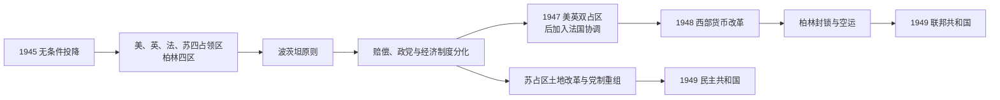

# 盟军占领德国

## 时间

1945年-1949年

## 概括

盟军占领德国是第二次世界大战结束后，德国由美国、英国、法国和苏联分区占领的时期。占领政策从共同管制逐渐转向冷战对立，最终在1949年形成西德和东德两个国家。

## 说明

- 1945年德国无条件投降，纳粹德国灭亡。
- 德国被划分为美、英、法、苏四个占领区，柏林也被分为四区。
- 盟军初期目标包括非军事化、去纳粹化、民主化、分权化和经济重建。
- 苏占区与西方占领区在政治制度、经济政策和安全利益上逐渐分化。
- 1948年西方占领区币制改革和柏林封锁加剧东西方对立。
- 1949年，西方占领区成立德意志联邦共和国，苏占区成立德意志民主共和国。

## 占领管制机构与行政首脑

| 类型 | 人物 / 机构 | 时间 | 说明 |
| --- | --- | --- | --- |
| 最高管制机构 | 盟国管制委员会 | 1945-1948/1949 | 美、英、法、苏共同承担德国最高管制权，冷战后实际运作弱化。 |
| 占领区行政首脑 | 四个占领区军事长官 | 1945-1949 | 各占领区由对应盟军军事政府管理。 |
| 西方占领区政治首脑 | 西方盟军军事政府与德国地方机构 | 1945-1949 | 逐步推动西德建国。 |
| 苏占区政治首脑 | 苏联军事管理机构与德国社会主义统一党 | 1945-1949 | 逐步推动东德建国。 |

## 演变关系

- 前一节点：[纳粹德国](/%E4%BA%BA%E6%96%87%E7%A7%91%E5%AD%A6/%E5%8E%86%E5%8F%B2/%E6%AC%A7%E6%B4%B2/%E5%BE%B7%E6%84%8F%E5%BF%97/%E5%BE%B7%E5%9B%BD/%E7%BA%B3%E7%B2%B9%E5%BE%B7%E5%9B%BD.md)。
- 后一节点：[东德西德](/%E4%BA%BA%E6%96%87%E7%A7%91%E5%AD%A6/%E5%8E%86%E5%8F%B2/%E6%AC%A7%E6%B4%B2/%E5%BE%B7%E6%84%8F%E5%BF%97/%E5%BE%B7%E5%9B%BD/%E4%B8%9C%E5%BE%B7%E8%A5%BF%E5%BE%B7.md)。

## 主权真空与占领机构

1945年5月国防军签署无条件投降，5月23日盟军逮捕邓尼茨政府。6月四国声明承担德国最高权力，不是承认某一德国中央政府继续运作。盟国管制委员会要求重大决定一致，各占领区军事长官在本区执行政策；柏林虽位于苏占区内，也分为四个扇区并由盟国司令部管理。

波茨坦会议提出非军事化、去纳粹化、民主化、分权化和处理战争赔偿。德国东部边界暂按奥得—尼斯线管理，原东部领土转由波兰和苏联管辖，德意志人口大规模逃亡、被驱逐或安置；占领区粮食、住房和难民危机严重。

## 四区政策差异

| 占领区 | 行政与政治 | 经济和赔偿 | 建国方向 |
| --- | --- | --- | --- |
| 美国区 | 推动地方选举、州宪法和去纳粹审查 | 初期限制工业，后转向复苏 | 与英国合并双占区，支持议会委员会。 |
| 英国区 | 依地方德国行政并重建工会政党 | 控制鲁尔，财政负担促成经济合并 | 与美国形成双占区。 |
| 法国区 | 强调分权，另设若干州 | 对本区资源和安全要求较强 | 1948后参与西部建国和三占区合作。 |
| 苏联区 | 土地改革、没收企业；共产党与社民党在压力下合并为统一社会党 | 大规模拆迁赔偿，后建国有企业 | 德国经济委员会等机构发展为东德政府。 |

## 去纳粹化与司法

纽伦堡国际军事法庭审判主要战犯，后续审判处理医生、法官、工业家与军方。占领区以问卷、法庭和职业审查清理纳粹成员，但人员规模、冷战需求与行政连续性使执行逐渐宽松。去纳粹化不仅是惩罚，还包括废除纳粹法律、重建政党、新闻、教育和地方自治；东区则把反法西斯叙事与社会主义所有制重组结合。

## 冷战分裂的形成

1946年美英认为必须恢复经济，1947年建立双占区，1948年法国逐渐加入协调。马歇尔计划、西部货币改革和伦敦六国会议推动西部国家框架。苏联反对在其未同意下建西部政权，封锁西柏林陆路；西方以空运维持城市。封锁在1949年解除，但政治分裂已固定。

西部各州议会代表组成议会委员会，1949年5月通过《基本法》，强调是临时安排并保留统一目标；9月联邦机构成立。苏占区人民委员会制定宪法，10月成立德意志民主共和国。分裂不是1945年预先写定的唯一结局，而是赔偿、安全、经济制度、德国问题和欧洲冷战升级逐步叠加的结果。

## 重要事件

| 时间 | 事件 | 长期影响 |
| --- | --- | --- |
| 1945-05 | 投降与中央政府终止 | 四国承担最高权力。 |
| 1945-07—08 | 波茨坦会议 | 确立占领原则和边界处理框架。 |
| 1945-11起 | 纽伦堡审判 | 发展个人国际刑事责任原则。 |
| 1946-04 | 苏占区统一社会党成立 | 东部一党主导结构形成。 |
| 1947-01 | 双占区 | 西部经济行政趋向统一。 |
| 1948-06 | 西部货币改革 | 分区经济断裂公开化。 |
| 1948-06—1949-05 | 柏林封锁与空运 | 冷战对抗与西方联盟巩固。 |
| 1949-05 / 10 | 两个德国成立 | 占领期转为受限制主权的两国阶段。 |

## 占领何时结束

1949年并非所有占领权消失。西德受盟国高级委员会和占领法规约束，1955年大体恢复主权；东德在苏联控制委员会之后也到1955年获主权声明，苏军继续驻扎。柏林与德国整体的四国权利一直影响统一谈判，直至1990年“二加四条约”解决。因而本页把1945—1949作为建国前的直接阶段，但须理解占领遗产延续更久。
