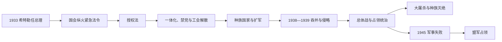

# 纳粹德国

## 时间

1933年-1945年

## 概括

纳粹德国是希特勒和国家社会主义德国工人党建立的极权独裁政权。它通过一党专政、领袖原则、种族主义政策和对外扩张发动第二次世界大战，并实施系统性的迫害和大屠杀，最终在1945年战败崩溃。

## 说明

- 1933年，希特勒被任命为德国总理，随后利用国会纵火案和《授权法》建立独裁统治。
- 纳粹政权取消多党政治、压制工会和反对派，将国家制度纳入一党控制。
- 政权以极端民族主义、反犹主义、种族主义和反共主义为核心意识形态。
- 1935年《纽伦堡法》剥夺犹太人公民权，国家迫害逐步制度化。
- 1938年吞并奥地利，并在慕尼黑协定后占领苏台德地区。
- 1939年德国入侵波兰，第二次世界大战在欧洲爆发。
- 纳粹德国在战争中实施大屠杀和大规模战争罪行。
- 1945年德国战败，希特勒自杀，纳粹政权崩溃。

## 国家元首

| 类型 | 人物 | 时间 | 说明 |
| --- | --- | --- | --- |
| 元首 | 阿道夫·希特勒 | 1934-1945 | 兴登堡去世后合并总统和总理权力。 |
| 末期国家元首 | 卡尔·邓尼茨 | 1945 | 希特勒自杀后短暂主持弗伦斯堡政府。 |

## 政府首脑

| 类型 | 人物 | 时间 | 说明 |
| --- | --- | --- | --- |
| 总理 | 阿道夫·希特勒 | 1933-1945 | 1933年被任命为总理，随后建立独裁统治。 |

## 实际掌权者

| 类型 | 人物 / 机构 | 时间 | 说明 |
| --- | --- | --- | --- |
| 党政实际领导核心 | 纳粹党领导层 | 1933-1945 | 国家制度被纳入一党控制。 |

## 演变关系

- 前一节点：[魏玛共和国](/%E4%BA%BA%E6%96%87%E7%A7%91%E5%AD%A6/%E5%8E%86%E5%8F%B2/%E6%AC%A7%E6%B4%B2/%E5%BE%B7%E6%84%8F%E5%BF%97/%E5%BE%B7%E5%9B%BD/%E9%AD%8F%E7%8E%9B%E5%85%B1%E5%92%8C%E5%9B%BD.md)。
- 后一节点：[盟军占领德国](/%E4%BA%BA%E6%96%87%E7%A7%91%E5%AD%A6/%E5%8E%86%E5%8F%B2/%E6%AC%A7%E6%B4%B2/%E5%BE%B7%E6%84%8F%E5%BF%97/%E5%BE%B7%E5%9B%BD/%E7%9B%9F%E5%86%9B%E5%8D%A0%E9%A2%86%E5%BE%B7%E5%9B%BD.md)。

## 夺权过程

希特勒获任命时尚未拥有绝对权力。1933年2月国会纵火后，总统紧急法令暂停人身、言论、通信与结社权，警方大规模逮捕共产党人与其他反对者。3月《授权法》在冲锋队恐吓、共产党议员缺席与中央党妥协下通过，内阁可不经国会立法。各邦议会与政府被“协调”，工会在5月被取缔，政党到7月只剩纳粹党。

1934年“长刀之夜”清洗冲锋队领导和保守派对手，军队接受希特勒对暴力垄断的保证。兴登堡去世后，总统与总理职权合并，军人向希特勒个人宣誓。党和国家没有形成整齐单一官僚制，而是党机关、部委、党卫队、军方与经济机构围绕“领袖意志”竞争，激进政策在累积竞争中升级。

## 经济、社会控制与战争准备

政权用公共工程、征兵和军备订单降低失业，工会由“德意志劳工阵线”取代，工资与流动受控制。沙赫特的新计划缓解外汇短缺，1936年四年计划把经济转向战争与自给，但原料、外汇和消费品不足加深对扩张掠夺的依赖。宣传、青年组织、教育和文化审查塑造“民族共同体”，同时把犹太人、罗姆人、残障者、同性恋者、政治反对者等排除和迫害。

## 种族政策与大屠杀

1933年起职业排除、抵制与剥夺权利逐步制度化，1935年《纽伦堡法》以血统界定公民资格和婚姻。1938年“水晶之夜”把暴力、拘禁和财产掠夺推向全国。战争中，特别行动队在东欧大规模枪杀，隔都、饥饿、强迫劳动与驱逐同时展开。1942年万湖会议协调“最终解决”行政过程，奥斯维辛-比克瑙、特雷布林卡等灭绝营实施工业化屠杀。约六百万犹太人遇害，另有数百万战争俘虏、罗姆人、残障者、波兰与苏联平民等被杀害；这是国家机关、党卫队、军警、铁路与合作者共同实施的跨欧洲犯罪。

## 扩张与战争阶段

| 阶段 | 过程 | 转折 |
| --- | --- | --- |
| 1933—1936 | 退出裁军框架、秘密与公开扩军、莱茵兰再军事化 | 英法未军事阻止，政权风险策略获利。 |
| 1938—1939 | 吞并奥地利、慕尼黑协定取得苏台德、占领捷克地区 | 从修订边界转向公开征服。 |
| 1939—1941 | 入侵波兰、西欧胜利、巴尔干战役、进攻苏联 | 闪击胜利扩大领土，也把战争变为种族灭绝战。 |
| 1941—1943 | 莫斯科受阻、美国参战、斯大林格勒失败 | 速胜破产，资源与工业对比逆转。 |
| 1943—1945 | 总体战、盟军轰炸、东西两线推进 | 1944年政变失败，政权以恐怖延续至柏林陷落。 |

## 统治结构

| 层面 | 法定职位 | 实际权力 |
| --- | --- | --- |
| 国家元首 | 1934年前兴登堡总统；后希特勒合并职权 | 领袖个人决定具有最高地位。 |
| 政府 | 帝国总理与各部 | 部委权限被党、党卫队和特别机构切割。 |
| 党 | 纳粹党领袖、副领袖、党区长官 | 控制干部、地方动员、宣传与社会组织。 |
| 镇压 | 警察、盖世太保、党卫队、安全总局 | 无司法保障的拘禁、集中营与种族政策核心。 |
| 军事 | 国防军最高统帅部与各军种 | 1938后希特勒直接掌控；军方参与侵略与战争罪行。 |

1945年希特勒自杀后，邓尼茨政府只存在数周，完整法定职位见[德国国家元首与政府首脑表](/%E4%BA%BA%E6%96%87%E7%A7%91%E5%AD%A6/%E5%8E%86%E5%8F%B2/%E6%AC%A7%E6%B4%B2/%E5%BE%B7%E6%84%8F%E5%BF%97/%E5%BE%B7%E5%9B%BD/%E5%BE%B7%E5%9B%BD%E5%9B%BD%E5%AE%B6%E5%85%83%E9%A6%96%E4%B8%8E%E6%94%BF%E5%BA%9C%E9%A6%96%E8%84%91%E8%A1%A8.md)。

## 灭亡原因与直接过程

结构上，政权把合法性、经济和资源供应绑在持续扩张上；对占领人口的残酷政策阻止稳定统治，也促成抵抗。外部压力来自英美工业与海权、苏联人口和纵深、全球联盟资源。直接军事转折包括不列颠空战受挫、莫斯科失败、美国参战、斯大林格勒与北非失利、诺曼底登陆和苏军攻入德国。1945年5月德国无条件投降，盟军逮捕弗伦斯堡政府，纳粹国家消失。德国人口和城市遭巨大破坏，东部领土转属波兰与苏联，数百万德意志人逃亡或被驱逐。
