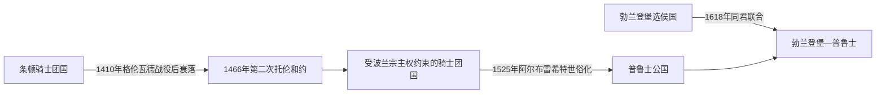

# 骑士团国世俗化与普鲁士形成

## 时间

1410年—1618年；重点为1466—1525年

## 概括

本页保留德意志—普鲁士演进视角：条顿骑士团国在军事失败和波兰宗主权压力下逐步收缩，末代普鲁士大团长阿尔布雷希特于1525年将其领地世俗化为普鲁士公国。这里不是条顿骑士团完整通史，而是解释骑士团国怎样转入霍亨索伦家族统治并连接勃兰登堡—普鲁士国家线。

## 演进图

## 从骑士团国到普鲁士公国

- 条顿骑士团在普鲁士建立的国家原以修会总会、大团长、地方长官和城堡网络组织领地。
- 1410年格伦瓦德战役后，骑士团在与波兰和立陶宛的竞争中失去主动。
- 1466年第二次托伦和约后，王室普鲁士归波兰直接控制，骑士团保留的东部领地承认波兰宗主权。
- 阿尔布雷希特出身霍亨索伦家族，1510年出任大团长。
- 1525年，他改宗路德宗并把修会领地改为世袭的普鲁士公国，向波兰国王行臣属礼。
- 1618年，普鲁士公国与勃兰登堡选侯国形成同君联合，成为后来勃兰登堡—普鲁士发展的基础。

## 统治结构变化

| 阶段 | 权力结构 | 变化 |
|---|---|---|
| 条顿骑士团国 | 大团长、修会总会与地方长官 | 领地属于修会共同体，不按普通王朝世袭。 |
| 受波兰宗主权约束时期 | 大团长保留内部统治，外交空间受限 | 骑士团国由区域强权转为波兰宗主体系内政权。 |
| 普鲁士公国 | 霍亨索伦家族世袭公爵 | 宗教修会领地转为新教世袭公国。 |
| 勃兰登堡—普鲁士 | 选侯兼任普鲁士公爵 | 分散领地由同一王朝统治，逐渐加强行政和军事整合。 |

## 与完整通史的分工

- 条顿骑士团的成立、圣地活动和北方十字军过程，见[条顿骑士团](/%E4%BA%BA%E6%96%87%E7%A7%91%E5%AD%A6/%E5%8E%86%E5%8F%B2/%E6%AC%A7%E6%B4%B2/_%E9%80%9A%E5%8F%B2/%E5%8D%81%E5%AD%97%E5%86%9B%E4%B8%9C%E5%BE%81/%E5%B9%BF%E4%B9%89%E5%8D%81%E5%AD%97%E5%86%9B%E8%BF%90%E5%8A%A8/%E6%9D%A1%E9%A1%BF%E9%AA%91%E5%A3%AB%E5%9B%A2.md)。
- 骑士团征服古普鲁士人及其与波兰、立陶宛和利沃尼亚的关系，见[条顿骑士团国与波罗的海秩序](/%E4%BA%BA%E6%96%87%E7%A7%91%E5%AD%A6/%E5%8E%86%E5%8F%B2/%E6%AC%A7%E6%B4%B2/%E6%B3%A2%E7%BD%97%E7%9A%84%E6%B5%B7/%E6%9D%A1%E9%A1%BF%E9%AA%91%E5%A3%AB%E5%9B%A2%E5%9B%BD%E4%B8%8E%E6%B3%A2%E7%BD%97%E7%9A%84%E6%B5%B7%E7%A7%A9%E5%BA%8F.md)。

## 演变关系

- 前一节点：[条顿骑士团](/%E4%BA%BA%E6%96%87%E7%A7%91%E5%AD%A6/%E5%8E%86%E5%8F%B2/%E6%AC%A7%E6%B4%B2/_%E9%80%9A%E5%8F%B2/%E5%8D%81%E5%AD%97%E5%86%9B%E4%B8%9C%E5%BE%81/%E5%B9%BF%E4%B9%89%E5%8D%81%E5%AD%97%E5%86%9B%E8%BF%90%E5%8A%A8/%E6%9D%A1%E9%A1%BF%E9%AA%91%E5%A3%AB%E5%9B%A2.md)。
- 后一节点：[普鲁士公国](/%E4%BA%BA%E6%96%87%E7%A7%91%E5%AD%A6/%E5%8E%86%E5%8F%B2/%E6%AC%A7%E6%B4%B2/%E5%BE%B7%E6%84%8F%E5%BF%97/%E5%BE%B7%E5%9B%BD/%E6%99%AE%E9%B2%81%E5%A3%AB%E5%85%AC%E5%9B%BD.md)。
- 相关节点：[神圣罗马帝国](/%E4%BA%BA%E6%96%87%E7%A7%91%E5%AD%A6/%E5%8E%86%E5%8F%B2/%E6%AC%A7%E6%B4%B2/%E5%BE%B7%E6%84%8F%E5%BF%97/%E7%A5%9E%E5%9C%A3%E7%BD%97%E9%A9%AC%E5%B8%9D%E5%9B%BD/README.md)、[勃兰登堡侯国](/%E4%BA%BA%E6%96%87%E7%A7%91%E5%AD%A6/%E5%8E%86%E5%8F%B2/%E6%AC%A7%E6%B4%B2/%E5%BE%B7%E6%84%8F%E5%BF%97/%E5%BE%B7%E5%9B%BD/%E5%8B%83%E5%85%B0%E7%99%BB%E5%A0%A1%E4%BE%AF%E5%9B%BD.md)。
