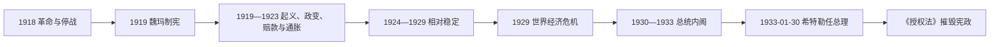

# 魏玛共和国

## 时间

1918年-1933年

## 概括

魏玛共和国是第一次世界大战后德国建立的共和政体，因制宪会议在魏玛召开而得名。它在民主宪政、社会文化和外交恢复方面有重要发展，但长期受到战败赔款、政治极化、经济危机和反共和国势力冲击，最终被纳粹德国取代。

## 统治结构 / 国家元首

| 阶段 / 职位 | 时间 | 人物 / 机构 | 说明 |
|---|---|---|---|
| 临时共和国 | 1918-1919 | 人民代表委员会 | 德意志帝国崩溃后的过渡政府。 |
| 总统 | 1919-1925 | 弗里德里希·艾伯特 | 魏玛共和国首任总统。 |
| 总统 | 1925-1934 | 保罗·冯·兴登堡 | 任命希特勒为总理，魏玛体制最终崩溃。 |
| 总理与议会 | 1919-1933 | 国会、多党内阁 | 议会民主频繁受经济危机、极端政治和总统紧急权力冲击。 |

## 说明

- 1918年德国革命后，德意志帝国君主制崩溃，威廉二世退位。
- 1919年魏玛宪法建立共和国，规定总统、议会和内阁制度。
- 《凡尔赛条约》给德国带来领土损失、军备限制和赔款压力，成为国内政治冲突焦点。
- 1923年鲁尔危机和恶性通货膨胀严重削弱共和国合法性。
- 1924年后在道威斯计划、外交调整和经济恢复下出现相对稳定时期。
- 1929年世界经济危机后，失业和政治极化迅速扩大，纳粹党和共产党力量上升。
- 1933年希特勒被任命为总理，随后通过国会纵火案和《授权法》摧毁共和制度。

## 国家元首

| 类型 | 人物 | 时间 | 说明 |
| --- | --- | --- | --- |
| 总统 | 弗里德里希·艾伯特 | 1919-1925 | 魏玛共和国首任总统。 |
| 总统 | 保罗·冯·兴登堡 | 1925-1934 | 任内任命希特勒为总理。 |

## 政府首脑

| 类型 | 人物 | 时间 | 说明 |
| --- | --- | --- | --- |
| 总理 | 菲利普·谢德曼 | 1919 | 魏玛共和国早期政府首脑。 |
| 总理 | 古斯塔夫·施特雷泽曼 | 1923 | 危机和相对稳定转折期的重要政治人物。 |
| 末任共和政府首脑 | 库尔特·冯·施莱谢尔 | 1932-1933 | 希特勒上台前最后一任总理。 |

## 演变关系

- 前一节点：[德意志帝国](/%E4%BA%BA%E6%96%87%E7%A7%91%E5%AD%A6/%E5%8E%86%E5%8F%B2/%E6%AC%A7%E6%B4%B2/%E5%BE%B7%E6%84%8F%E5%BF%97/%E5%BE%B7%E5%9B%BD/%E5%BE%B7%E6%84%8F%E5%BF%97%E5%B8%9D%E5%9B%BD.md)。
- 后一节点：[纳粹德国](/%E4%BA%BA%E6%96%87%E7%A7%91%E5%AD%A6/%E5%8E%86%E5%8F%B2/%E6%AC%A7%E6%B4%B2/%E5%BE%B7%E6%84%8F%E5%BF%97/%E5%BE%B7%E5%9B%BD/%E7%BA%B3%E7%B2%B9%E5%BE%B7%E5%9B%BD.md)。

## 革命、制宪与早期暴力

1918年11月工兵委员会迫使君主制退出，社会民主党领袖艾伯特主张尽快选举制宪议会并维持行政、军队和经济运转。艾伯特—格勒纳协议以军方支持政府交换反对激进革命；政府依自由军团镇压斯巴达克起义和地方苏维埃，造成左翼分裂与长期不信任。1919年国民议会在较安全的魏玛开会，女性首次获得全国选举权。

宪法确立基本权利、比例代表国会、对国会负责的总理及全民直选总统。总统可任命总理、解散国会并依第48条采取紧急措施；这一安排本想应对危机，后来在议会多数破碎时成为总统内阁的法律入口。

## 1919—1923年危机链

《凡尔赛条约》规定领土割让、裁军、赔款和战争责任条款。多数德国人视其为强加，但政府缺乏继续战争能力。1920年卡普政变靠总罢工失败，随后鲁尔红军又被镇压；1921—1922年埃茨贝格、拉特瑙遇刺显示右翼地下组织威胁。

1923年法国、比利时因赔款违约占领鲁尔，政府资助“消极抵抗”，货币发行与财政崩溃造成恶性通胀。储蓄者、固定收入者受重创，债务人和实物资产持有者受益不一。施特雷泽曼政府结束抵抗、发行地租马克并镇压萨克森、图林根左翼与希特勒啤酒馆政变，稳定国家。

## 相对稳定及其脆弱性

1924年道威斯计划重组赔款并引入美国贷款，工业恢复，住房、福利、电影、建筑与科学文化繁荣。施特雷泽曼以洛迦诺条约、加入国际联盟和《柏林条约》恢复外交地位。1928年大联合政府看似扩大民主基础。

稳定仍依赖短期外资，农业与中小企业困境持续，政府联盟易因宗教、教育、税收和福利分裂。军队、司法、官僚中保守精英对共和国忠诚有限，地方普鲁士政府虽成为民主支柱，全国反共和国组织仍活跃。

## 大萧条与民主解体

1929年美国资金撤回，银行和企业危机使失业激增。1930年穆勒联盟因失业保险分摊破裂，兴登堡任命布吕宁，在缺乏多数下以紧急法令紧缩。国会否决后总统解散国会，纳粹与共产党选票上升。1932年帕彭发动“普鲁士政变”，罢免最大邦民主政府；连续选举和街头暴力耗尽议会治理能力。

保守精英误以为可在内阁中控制希特勒。帕彭说服兴登堡于1933年1月30日任命希特勒，内阁最初纳粹仅占少数。国会纵火后的紧急法令暂停权利，3月选举在恐吓中进行，《授权法》以压制共产党、逮捕反对者和争取中央党支持通过，使政府可绕过国会立法；共和国被从内部法律形式与外部暴力共同摧毁。

## 总理序列

本页保留阶段分析，1919—1933年全部总统代理与总理逐任表见[德国国家元首与政府首脑表](/%E4%BA%BA%E6%96%87%E7%A7%91%E5%AD%A6/%E5%8E%86%E5%8F%B2/%E6%AC%A7%E6%B4%B2/%E5%BE%B7%E6%84%8F%E5%BF%97/%E5%BE%B7%E5%9B%BD/%E5%BE%B7%E5%9B%BD%E5%9B%BD%E5%AE%B6%E5%85%83%E9%A6%96%E4%B8%8E%E6%94%BF%E5%BA%9C%E9%A6%96%E8%84%91%E8%A1%A8.md)，不再以“后期总统内阁”等合并项替代。

## 兴衰原因

| 类别 | 支撑因素 | 侵蚀因素 | 直接触发 |
| --- | --- | --- | --- |
| 宪政 | 普选、基本权利、联邦制、活跃政党 | 比例碎片、总统紧急权、反民主精英 | 1930后以法令取代议会多数。 |
| 经济 | 1924后货币与外资稳定 | 赔款争议、短期外债、农业危机 | 1929大萧条与银行失业危机。 |
| 社会 | 工会、社团、地方民主与现代文化 | 战争创伤、阶级与教派分裂、政治暴力 | 纳粹以群众动员与准军事恐吓扩大。 |
| 权力精英 | 普鲁士等民主政府可维持秩序 | 军队、总统顾问、保守派绕过议会 | 兴登堡任命希特勒，授权法完成夺权。 |

不能把崩溃归因于“凡尔赛条约必然导致希特勒”。共和国曾在1920年代恢复，最终失败源于全球经济冲击、宪法权力使用方式、保守精英策略、纳粹组织能力和对反对力量的暴力镇压共同作用。
