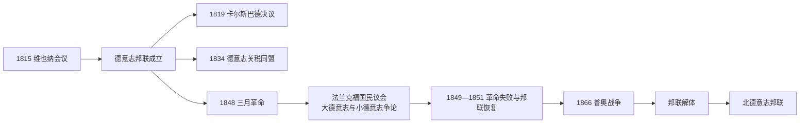

# 德意志邦联

## 时间

1815年-1866年

## 概括

德意志邦联是1815年维也纳会议后建立的德意志诸邦联盟，取代拿破仑时期的莱茵邦联，并在1866年普奥战争后解体。它不是统一国家，而是奥地利、普鲁士以及一批德意志王国、大公国、公国、亲王国和自由城市组成的松散邦联。

## 说明

- 德意志邦联成立于1815年，解体于1866年。
- 邦联范围大体承接神圣罗马帝国旧德意志地区，但不包括已经走向独立邦联国家道路的[瑞士](/%E4%BA%BA%E6%96%87%E7%A7%91%E5%AD%A6/%E5%8E%86%E5%8F%B2/%E6%AC%A7%E6%B4%B2/%E5%BE%B7%E6%84%8F%E5%BF%97/%E7%91%9E%E5%A3%AB/README.md)，也不包括荷兰、比利时和北意大利等地区。
- 奥地利帝国和普鲁士王国都是邦联核心成员，但它们并非全部领土都属于邦联范围。
- 邦联内部存在奥地利主导的“大德意志方案”和普鲁士主导的“小德意志方案”竞争。
- 1866年普奥战争后，邦联解体；普鲁士路线发展为[北德意志邦联](/%E4%BA%BA%E6%96%87%E7%A7%91%E5%AD%A6/%E5%8E%86%E5%8F%B2/%E6%AC%A7%E6%B4%B2/%E5%BE%B7%E6%84%8F%E5%BF%97/%E5%BE%B7%E5%9B%BD/%E5%8C%97%E5%BE%B7%E6%84%8F%E5%BF%97%E9%82%A6%E8%81%94.md)，奥地利路线转向[奥匈帝国](/%E4%BA%BA%E6%96%87%E7%A7%91%E5%AD%A6/%E5%8E%86%E5%8F%B2/%E6%AC%A7%E6%B4%B2/%E5%BE%B7%E6%84%8F%E5%BF%97/%E5%A5%A5%E5%9C%B0%E5%88%A9/%E5%A5%A5%E5%8C%88%E5%B8%9D%E5%9B%BD.md)。

## 成员邦

### 帝国

| 成员 | 说明 |
| --- | --- |
| 奥地利帝国 | 邦联主席国；只有部分帝国领土属于德意志邦联，不包括匈牙利、特兰西瓦尼亚、克罗地亚-斯拉沃尼亚、伦巴第-威尼斯、布科维纳、达尔马提亚、加利西亚等非德意志部分。 |

奥地利帝国内属于邦联范围的重要领地包括：奥地利大公国、波希米亚王国、摩拉维亚侯国、萨尔茨堡、卡林西亚公国、卡尼奥拉公国、上下西里西亚公国、施蒂里亚公国、奥地利滨海区、蒂罗尔、福拉尔贝格。

### 王国

| 成员 | 说明 |
| --- | --- |
| 普鲁士王国 | 邦联内最重要的北德强国之一；波森、东普鲁士和西普鲁士等领土不在邦联范围内。 |
| 巴伐利亚王国 | 南德主要王国。 |
| 汉诺威王国 | 1837年前与英国处于共主邦联关系。 |
| 萨克森王国 | 中东部德意志重要王国。 |
| 符腾堡王国 | 西南德重要王国。 |

普鲁士在邦联内的重要部分包括：勃兰登堡、波美拉尼亚、莱茵省、萨克森省、西里西亚省、西发利亚省。

### 选侯国与大公国

| 成员 | 类型 | 说明 |
| --- | --- | --- |
| 黑森选侯国 | 选侯国 | 又称黑森-卡塞尔。 |
| 巴登大公国 | 大公国 | 西南德重要成员。 |
| 黑森大公国 | 大公国 | 又称黑森-达姆施塔特。 |
| 卢森堡大公国 | 大公国 | 与荷兰联合；1839年后因领土变化牵涉林堡公国加入邦联。 |
| 梅克伦堡-什未林大公国 | 大公国 | 北德成员。 |
| 梅克伦堡-施特雷利茨大公国 | 大公国 | 北德成员。 |
| 奥尔登堡大公国 | 大公国 | 北德成员。 |
| 萨克森-魏玛-艾森纳赫大公国 | 大公国 | 恩斯特系萨克森诸邦之一。 |

### 公国

| 成员 | 说明 |
| --- | --- |
| 不伦瑞克公国 | 原不伦瑞克-沃尔芬比特尔公国。 |
| 荷尔斯泰因公国 | 与丹麦王国联合；属于邦联成员。 |
| 林堡公国 | 1839年成为与荷兰联合的邦联成员。 |
| 拿骚公国 | 西部德意志公国。 |
| 萨克森-科堡-萨尔费尔德公国 | 1826年后形成萨克森-科堡-哥达。 |
| 萨克森-哥达-阿尔滕堡公国 | 1826年后调整为萨克森-阿尔滕堡。 |
| 萨克森-希尔德布格豪森公国 | 1826年解散，领土并入萨克森-迈宁根。 |
| 萨克森-劳恩堡公国 | 与丹麦王国合并。 |
| 萨克森-迈宁根公国 | 恩斯特系萨克森诸邦之一。 |
| 安哈尔特-贝恩堡公国 | 1863年并入安哈尔特公国。 |
| 安哈尔特-德绍公国 | 后与安哈尔特诸支合并。 |
| 安哈尔特-克滕公国 | 后并入安哈尔特-德绍。 |

### 亲王国 / 侯国

| 成员 | 说明 |
| --- | --- |
| 霍亨索伦-黑兴根亲王国 | 1850年并入普鲁士。 |
| 霍亨索伦-西格马林根亲王国 | 1850年并入普鲁士。 |
| 列支敦士登亲王国 | 邦联成员，后来保持独立。 |
| 利珀亲王国 | 小型德意志邦国。 |
| 罗伊斯幼系亲王国 | 罗伊斯系邦国之一。 |
| 罗伊斯-格赖茨亲王国 | 罗伊斯长系邦国。 |
| 绍姆堡-利珀亲王国 | 小型德意志邦国。 |
| 施瓦茨堡-鲁多尔施塔特亲王国 | 施瓦茨堡系邦国之一。 |
| 施瓦茨堡-松德斯豪森亲王国 | 施瓦茨堡系邦国之一。 |
| 瓦尔代克和皮尔蒙特亲王国 | 小型德意志邦国。 |
| 黑森-洪堡伯国 | 1817年成为成员，1866年并入黑森大公国。 |

### 自由城市

| 成员 | 说明 |
| --- | --- |
| 美因河畔法兰克福自由城 | 邦联议会所在地。 |
| 不来梅自由汉萨市 | 北德汉萨自由市。 |
| 汉堡自由汉萨城 | 北德汉萨自由市。 |
| 吕贝克自由汉萨市 | 汉萨传统重要城市。 |

## 邦联机构与主导君主

| 类型 | 人物 / 机构 | 时间 | 说明 |
| --- | --- | --- | --- |
| 邦联主席国君主 | 奥地利皇帝 | 1815-1866 | 奥地利帝国长期担任邦联主席国。 |
| 邦联议会 | 法兰克福邦联议会 | 1815-1866 | 邦联共同机构，代表各成员邦协商事务。 |
| 主要竞争者 | 普鲁士国王 | 1815-1866 | 普鲁士与奥地利竞争德意志主导权。 |
| 解体时期首脑 | 弗朗茨·约瑟夫一世、威廉一世、俾斯麦 | 1860年代 | 普奥战争后邦联解体，北德意志邦联形成。 |

## 演变关系

- 前一节点：[莱茵邦联](/%E4%BA%BA%E6%96%87%E7%A7%91%E5%AD%A6/%E5%8E%86%E5%8F%B2/%E6%AC%A7%E6%B4%B2/%E5%BE%B7%E6%84%8F%E5%BF%97/%E8%8E%B1%E8%8C%B5%E9%82%A6%E8%81%94.md)。
- 后一节点：[北德意志邦联](/%E4%BA%BA%E6%96%87%E7%A7%91%E5%AD%A6/%E5%8E%86%E5%8F%B2/%E6%AC%A7%E6%B4%B2/%E5%BE%B7%E6%84%8F%E5%BF%97/%E5%BE%B7%E5%9B%BD/%E5%8C%97%E5%BE%B7%E6%84%8F%E5%BF%97%E9%82%A6%E8%81%94.md)、[奥匈帝国](/%E4%BA%BA%E6%96%87%E7%A7%91%E5%AD%A6/%E5%8E%86%E5%8F%B2/%E6%AC%A7%E6%B4%B2/%E5%BE%B7%E6%84%8F%E5%BF%97/%E5%A5%A5%E5%9C%B0%E5%88%A9/%E5%A5%A5%E5%8C%88%E5%B8%9D%E5%9B%BD.md)。
- 相关节点：[神圣罗马帝国的邦国](/%E4%BA%BA%E6%96%87%E7%A7%91%E5%AD%A6/%E5%8E%86%E5%8F%B2/%E6%AC%A7%E6%B4%B2/%E5%BE%B7%E6%84%8F%E5%BF%97/%E7%A5%9E%E5%9C%A3%E7%BD%97%E9%A9%AC%E5%B8%9D%E5%9B%BD/%E7%A5%9E%E5%9C%A3%E7%BD%97%E9%A9%AC%E5%B8%9D%E5%9B%BD%E7%9A%84%E9%82%A6%E5%9B%BD.md)、[德意志帝国](/%E4%BA%BA%E6%96%87%E7%A7%91%E5%AD%A6/%E5%8E%86%E5%8F%B2/%E6%AC%A7%E6%B4%B2/%E5%BE%B7%E6%84%8F%E5%BF%97/%E5%BE%B7%E5%9B%BD/%E5%BE%B7%E6%84%8F%E5%BF%97%E5%B8%9D%E5%9B%BD.md)。

## 建立与宪制

1815年6月《德意志邦联法》把三十九个君主国和自由城市组成“不可解散的联盟”，目的首先是对外安全与内部秩序，而非建立民族国家。常设邦联议会设在法兰克福，由奥地利代表主持；它既有全体会议，也有较小的常务会议，各邦投票权不等。邦联没有由公民直选的政府、统一税收或常备军，军事力量按邦分配为若干军团。

成员身份附着于领土而非君主本人，因此出现共主关系：英国国王兼汉诺威国王至1837年，荷兰国王兼卢森堡大公并一度以林堡加入，丹麦国王以荷尔斯泰因和劳恩堡公爵身份进入。奥地利和普鲁士也只有部分领土属于邦联；匈牙利、加利西亚、东普鲁士等不在其中。这些交错身份说明邦联是旧帝国领土法与近代主权国家之间的过渡结构。

## 保守秩序与民族自由运动

1817年瓦特堡节和大学社团把民族统一、宪政和反复辟联系起来。1819年作家科策布遇刺后，梅特涅推动《卡尔斯巴德决议》，加强大学监督、新闻审查和对革命组织的调查。1830年法国七月革命波及德意志，一些邦国获宪法；1832年汉巴赫节公开展示黑红金旗，要求民族统一与公民权。

1848年法国革命消息引发德意志“三月革命”。各邦君主被迫任命自由派大臣，邦联议会同意召开国民议会。法兰克福国民议会起草权利和宪法，争论是否把哈布斯堡全部领地纳入“大德意志”，还是排除奥地利、由普鲁士主导“小德意志”。1849年议会把世袭皇位授予普鲁士国王腓特烈·威廉四世，但国王拒绝由革命议会赋予的皇冠；奥地利、普鲁士及诸邦军队镇压余波，议会失败。

## 经济整合与普奥竞争

普鲁士以本国关税改革为基础，1834年建立德意志关税同盟，逐步覆盖多数德意志邦国而排除奥地利。关税同盟取消内部关卡、协调外部关税、促进铁路和市场整合，使普鲁士获得制度性领导资源，但经济统一并不会自动决定政治统一，南德邦和汉萨城市仍有自身利益。

1849—1850年普鲁士尝试建立埃尔福特联盟，遭奥地利和俄国压力，在奥尔米茨退让。1851年邦联正式恢复。此后克里米亚战争、意大利统一和普鲁士军制改革改变力量平衡；俾斯麦把议会预算冲突与王朝外交结合，准备排除奥地利。

## 石勒苏益格—荷尔斯泰因与终结

1848—1851年第一次石勒苏益格战争已暴露丹麦王国、德意志民族主义和两公国继承法的冲突。1863年丹麦新宪法把石勒苏益格更紧密纳入王国，普鲁士与奥地利在1864年共同击败丹麦；随后两强分别管理石勒苏益格和荷尔斯泰因，管理争议成为俾斯麦制造决裂的工具。

1866年普鲁士提出改革邦联并控制军事，奥地利把争端提交邦联议会。普鲁士宣布邦联法被破坏并出兵，七周战争以萨多瓦战役决定。布拉格和约规定邦联解散，普鲁士吞并汉诺威、黑森-卡塞尔、拿骚和法兰克福，建立北德意志邦联；奥地利退出德国国家统一主线，转而以1867年折衷重组为奥匈帝国。

## 1848年革命的阶段过程

| 阶段 | 时间 | 过程 | 结果 |
| --- | --- | --- | --- |
| 地方起义 | 1848年2—3月 | 集会要求新闻自由、陪审制、国民军和统一；君主任命“三月内阁”。 | 旧邦联秩序暂时失去主动。 |
| 预备议会 | 1848年3—5月 | 自由派与民主派讨论全国选举办法。 | 以广泛男性选举产生法兰克福国民议会。 |
| 制宪与战争 | 1848年5月—1849年初 | 议会制定基本权利，同时处理石勒苏益格战争和中央权力。 | 对军队、财政依赖各邦，权威受挫。 |
| 皇位方案 | 1849年3—4月 | 通过小德意志宪法，向普王献皇冠。 | 腓特烈·威廉四世拒绝。 |
| 镇压 | 1849年5—7月 | 萨克森、普法尔茨、巴登等保卫宪法的起义被军队镇压。 | 革命组织瓦解，部分成果以后由邦国改革吸收。 |

## 兴衰分析

| 维度 | 维持因素 | 结构性弱点 | 直接终结因素 |
| --- | --- | --- | --- |
| 安全 | 大国协调、邦联军与共同堡垒 | 指挥分散，普奥战略冲突 | 1866年成员分裂为交战阵营。 |
| 合法性 | 君主制与维也纳秩序 | 民族、自由诉求无代表渠道 | 改革议案无法在旧议会内解决。 |
| 经济 | 邦国市场发展、铁路联通 | 关税同盟排除奥地利，形成双轨 | 普鲁士把经济优势转为军事外交优势。 |
| 大国关系 | 俄国长期支持奥地利秩序 | 1850年代后俄奥疏远、法国保持中立 | 普鲁士取得意大利盟友并迅速击败奥地利。 |
