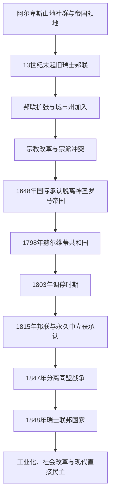

# 瑞士历史

## 概括

瑞士由阿尔卑斯山地、城市和乡村州形成的旧邦联发展而来。其历史包括与哈布斯堡及神圣罗马帝国的冲突和联系、宗教改革与宗派分裂、法国革命时期的赫尔维蒂共和国，以及1848年建立的现代联邦国家。

## 目录定位

本页放在“德意志”历史目录，是因为旧瑞士邦联形成于神圣罗马帝国的政治空间，并与哈布斯堡和德意志诸邦长期互动。这一位置只表达早期政治演进和跨区域联系，不表示多语言的现代瑞士属于德国国家史或单一德意志民族国家。

## 演变关系

## 统治结构与政治阶段

| 阶段 | 时间 | 统治结构 |
|---|---|---|
| 旧瑞士邦联 | 约13世纪末—1798年 | 各州通过盟约合作，中央机构薄弱，城市州与乡村州结构不同。 |
| 赫尔维蒂共和国 | 1798—1803年 | 法国支持的中央集权共和国，受到战争和地方反抗冲击。 |
| 调停与复辟邦联 | 1803—1848年 | 州权恢复，1815年后邦联扩大并获得永久中立的国际承认。 |
| 瑞士联邦 | 1848年至今 | 联邦制共和国，联邦议会、联邦委员会、州权与公民投票共同构成政治体系。 |

## 重要事件

- 13世纪末的山地盟约传统成为旧邦联形成的重要象征，邦联随后吸纳更多城市和州。
- 1499年施瓦本战争后，邦联在帝国内获得更大实际独立；1648年其独立地位获国际承认。
- 苏黎世和日内瓦等地宗教改革推动新教发展，也引发州际宗派冲突。
- 1798年法国入侵后建立赫尔维蒂共和国，中央集权实验因战争和内部矛盾难以维持。
- 1847年分离同盟战争结束后，1848年宪法建立现代联邦国家。
- 瑞士在两次世界大战中保持武装中立，但经济往来、难民政策和战时金融仍存在争议。

## 关键辨析

- 瑞士中立是长期形成并由国际政治保障的政策，不等于对外部战争完全没有联系。
- 旧邦联不是现代联邦国家，州际关系更接近盟约联合。
- 瑞士具有德语、法语、意大利语和罗曼什语等多语言传统，不是单一德语国家。

## 相关入口

- [德意志历史](/%E4%BA%BA%E6%96%87%E7%A7%91%E5%AD%A6/%E5%8E%86%E5%8F%B2/%E6%AC%A7%E6%B4%B2/%E5%BE%B7%E6%84%8F%E5%BF%97/README.md)
- [神圣罗马帝国](/%E4%BA%BA%E6%96%87%E7%A7%91%E5%AD%A6/%E5%8E%86%E5%8F%B2/%E6%AC%A7%E6%B4%B2/%E5%BE%B7%E6%84%8F%E5%BF%97/%E7%A5%9E%E5%9C%A3%E7%BD%97%E9%A9%AC%E5%B8%9D%E5%9B%BD/README.md)
- [中欧历史空间](/%E4%BA%BA%E6%96%87%E7%A7%91%E5%AD%A6/%E5%8E%86%E5%8F%B2/%E6%AC%A7%E6%B4%B2/_%E9%80%9A%E5%8F%B2/%E4%B8%AD%E6%AC%A7%E5%8E%86%E5%8F%B2%E7%A9%BA%E9%97%B4.md)

## 形成背景：帝国山口、城市与乡村

中世纪瑞士地区由策林根、萨伏依、哈布斯堡等贵族、修道院、帝国自由城市和山谷共同体交错控制。圣哥达山口开通提高乌里、施维茨、下瓦尔登的战略价值，皇帝给予部分社群帝国直属地位。哈布斯堡试图恢复领主权，促使山地共同体以盟约互助；1291年盟约是重要存世文本，但旧邦联不是在某一天一次性建国，而是多份联盟逐步重叠。

1315年摩根加滕战役、1386年森帕赫战役加强邦联军事声望。卢塞恩、苏黎世、格拉鲁斯、楚格、伯尔尼等加入后形成“八州邦联”。城市州拥有受其支配的乡村领地，共管领地由多个州轮流派总督；邦联议事会须代表协商，缺乏常设行政和共同税军，内部并不平等。

## 扩张、佣兵与帝国关系

15世纪邦联在勃艮第战争中击败大胆查理，军队声誉推动雇佣兵服务欧洲君主。1481年弗里堡和索洛图恩加入，调停城市与乡村州矛盾的《施坦斯协议》暂时维持合作。1499年施瓦本战争后，巴塞尔和约使帝国法院与税负对邦联实际难以执行；1513年形成十三州。

1515年马里尼亚诺战败结束在伦巴第持续扩张，1516年与法国达成长期和平。佣兵收入、军役伤亡与外国年金继续影响州政治。1648年《威斯特伐利亚和约》正式确认邦联脱离帝国法权，这一承认是对长期事实独立的法律化。

## 宗教改革与宗派共存

1519年慈运理在苏黎世推动以圣经为中心的改革，城市政府改组礼仪、教产与社会纪律。伯尔尼、巴塞尔等转向新教，而森林州保持天主教。1531年第二次卡佩尔战争中慈运理战死，和约确认州选择宗教并在混合地区设安排。日内瓦虽非当时十三州成员，却在加尔文时期成为改革宗国际中心。

宗教分裂与城市—乡村竞争叠加，1656和1712年两次维尔梅根战争改变共同领地权力分配。邦联没有像法国那样建立中央宗教统一，而以州主权和脆弱妥协共存；宗派政治一直影响19世纪建国冲突。

## 赫尔维蒂共和国、调停与1815秩序

1798年法国军队入侵，扶植单一中央制赫尔维蒂共和国，取消州属臣民地位与封建特权，宣布法律平等。新制度面对法国征敛、联军战争、财政崩溃和联邦派反抗，数年内多次政变。拿破仑1803年《调停法》恢复州权并保留平等改革，新增原附属地区为州。

1815年维也纳会议承认瑞士永久中立和领土完整，日内瓦、瓦莱、纳沙泰尔加入，形成二十二州。复辟盟约强化州权，部分州恢复精英政治；1830年代“再生运动”通过州宪法扩大代表权，自由派要求更强联邦。

## 分离同盟战争与1848建国

天主教保守州反对自由派关闭修道院和中央化，1845年组成分离同盟并寻求外援。邦联议事会认定其违约，1847年由杜富尔指挥联邦军发动短期战争。军方控制伤亡并迅速击败同盟，避免欧洲列强及时干预。

1848年宪法借鉴美国两院制：国民院按人口选出，联邦院每州平等代表；七人联邦委员会为集体政府，联邦法院、关税、货币和邮政逐步统一，州保留教育、警察等广泛权限。1874年修宪扩大联邦权力和可选公投，1891年引入公民倡议，直接民主成为现代制度核心。

## 工业化、社会整合与战争

瑞士缺乏煤矿却利用水力、技术教育、金融和出口网络发展纺织、机械、化工、钟表与制药。铁路统一市场，工人运动和1918年全国总罢工推动比例代表制、工时和社会政策。语言、宗派与地区差异通过联邦制、政党联盟和民兵制度逐渐整合。

两次世界大战中瑞士动员军队并保持中立。二战“国家堡垒”威慑与对轴心国经济交易并存，政府接纳大量难民，也以“种族理由”等拒绝许多受迫害者；战后研究揭示黄金交易、难民和休眠账户等责任。中立因此是安全政策和外交选择，不是道德上置身事外。

## 战后至2026

1959年主要政党按“魔术公式”分享联邦委员会席位，协商民主与公投限制单一多数。1971年联邦层面女性获得选举权，内阿彭策州直到1990年才经法院实现州级女性投票。1979年法语天主教地区从伯尔尼分出汝拉州。瑞士1992年公投否决加入欧洲经济区，2002年加入联合国，以双边协定与欧盟保持深度经济联系。

## 现代权力结构与现任人员

| 角色 | 产生方式 | 权力性质 | 截至2026-07-14 |
| --- | --- | --- | --- |
| 联邦委员会 | 联邦议会选出的七人集体政府 | 各委员领导部门，共同决策；没有单一总理 | 七人委员会为国家与政府集体领导。 |
| 联邦主席 | 联邦议会从委员中按年度选出 | 主持会议与代表国家，是“同僚中的第一人”，不是强势总统 | **居伊·帕姆兰**，2026年度主席；伊尼亚齐奥·卡西斯为副主席。 |
| 联邦总理 | 联邦议会选举 | 联邦委员会参谋与行政协调首长，不是政府首脑 | **维克托·罗西**，2024年起任职。 |
| 联邦议会 | 国民院与联邦院 | 立法、预算、选举联邦委员与总理 | 两院须共同通过法律。 |
| 公民与州 | 强制 / 可选公投、公民倡议、州多数 | 对修宪、条约和法律拥有直接制衡 | 联邦修宪须人民与州双重多数。 |

瑞士每年更换联邦主席，因此不能把主席表当作历任政府首脑表；国家连续性主要由七人委员会和联邦制度维持。

## 重要事件与因果

| 时间 | 事件 | 背景与影响 |
| --- | --- | --- |
| 1291及14世纪 | 山地盟约与反哈布斯堡战争 | 多个社群逐步形成防务联盟。 |
| 1481 / 1513 | 盟约扩展 | 城市、乡村州协调形成十三州邦联。 |
| 1499 / 1648 | 实际与法律脱离帝国 | 从帝国政治空间转为独立邦联。 |
| 1515—1531 | 对外扩张受挫与宗教改革 | 军事方向和内部教派结构改变。 |
| 1798—1815 | 法国入侵、中央制、调停与复辟 | 法律平等保留，州权重新安排，中立获承认。 |
| 1847—1848 | 分离同盟战争与联邦宪法 | 短战解决宪制冲突，建立现代联邦国家。 |
| 1874 / 1891 | 公投与倡议 | 直接民主制度化。 |
| 1918 / 1919 | 总罢工与比例代表制 | 工人政治进入联邦协商。 |
| 1971 | 女性联邦投票权 | 民主范围扩大，但明显晚于多数欧洲国家。 |
| 2002 | 加入联合国 | 在保持中立下扩大多边参与。 |

## 长期兴盛与制度张力

瑞士稳定来自山地防御和列强承认中立、州自治、两院平衡、直接民主、职业教育与出口产业、跨宗派政党分享权力。制度成本是改革缓慢、公投可能压缩少数权利、低税和金融政策承受外部压力。其历史不是一条不间断的“自由农民民主线”：旧邦联有属地和寡头，1798外来入侵、1847内战、女性投票权延迟都说明现代民主经过冲突和重建。
