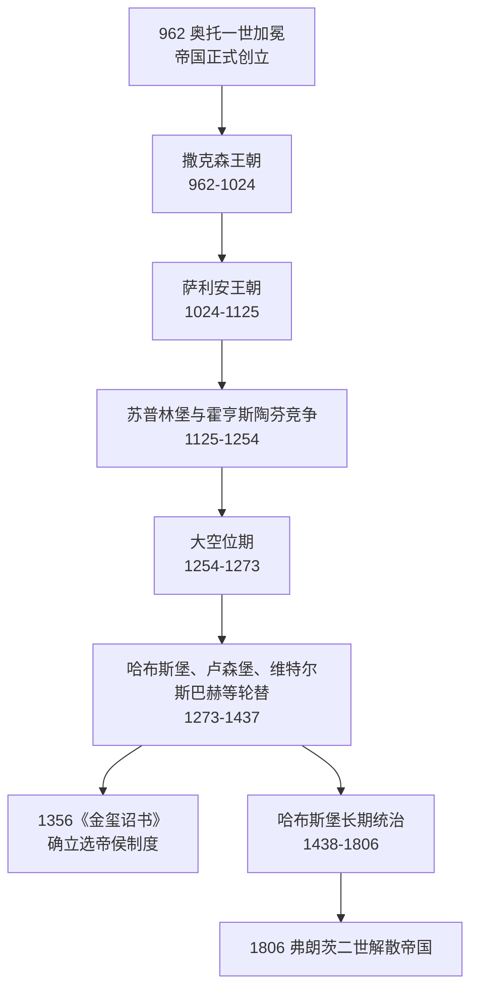

# 神圣罗马帝国

[返回德意志历史](/%E4%BA%BA%E6%96%87%E7%A7%91%E5%AD%A6/%E5%8E%86%E5%8F%B2/%E6%AC%A7%E6%B4%B2/%E5%BE%B7%E6%84%8F%E5%BF%97/README.md)

神圣罗马帝国是中世纪到近代早期中欧以德意志地区为核心的复合型帝国，通常以962年奥托一世被教皇加冕为皇帝作为正式开端，以1806年弗朗茨二世解散帝国为终点。它名义上延续罗马帝国与基督教皇帝传统，但实际政治结构长期依赖德意志诸侯、教会领地、自由城市和皇帝家族之间的权力平衡。

## 核心脉络

| 主题 | 概括 |
| --- | --- |
| 时间 | 962-1806。 |
| 地域核心 | 德意志地区，并长期牵涉意大利、波希米亚、奥地利等地区。 |
| 政治性质 | 皇帝、诸侯、教会领地和城市共同构成的松散复合体，不是近代意义上的中央集权国家。 |
| 皇帝来源 | 前期经历撒克森、萨利安、霍亨斯陶芬、卢森堡等家族；1438年后长期由哈布斯堡掌握。 |
| 选举机制 | 皇帝/德意志国王由选帝侯选出，1356年查理四世《金玺诏书》确立七大选帝侯制度。 |
| 终结 | 1806年，弗朗茨二世解散神圣罗马帝国，并以奥地利皇帝身份延续哈布斯堡统治。 |

## 目录导航

- [德意志国王与皇帝对照表](/%E4%BA%BA%E6%96%87%E7%A7%91%E5%AD%A6/%E5%8E%86%E5%8F%B2/%E6%AC%A7%E6%B4%B2/%E5%BE%B7%E6%84%8F%E5%BF%97/%E7%A5%9E%E5%9C%A3%E7%BD%97%E9%A9%AC%E5%B8%9D%E5%9B%BD/%E5%BE%B7%E6%84%8F%E5%BF%97%E5%9B%BD%E7%8E%8B%E4%B8%8E%E7%9A%87%E5%B8%9D%E5%AF%B9%E7%85%A7%E8%A1%A8.md)：按年代整理962-1806年的德意志国王、皇帝加冕情况、家族与备注。
- [选帝侯](/%E4%BA%BA%E6%96%87%E7%A7%91%E5%AD%A6/%E5%8E%86%E5%8F%B2/%E6%AC%A7%E6%B4%B2/%E5%BE%B7%E6%84%8F%E5%BF%97/%E7%A5%9E%E5%9C%A3%E7%BD%97%E9%A9%AC%E5%B8%9D%E5%9B%BD/%E9%80%89%E5%B8%9D%E4%BE%AF.md)：说明神圣罗马帝国中负责选举国王/皇帝的七大选侯及其宗教、世俗构成。
- [神圣罗马帝国的邦国](/%E4%BA%BA%E6%96%87%E7%A7%91%E5%AD%A6/%E5%8E%86%E5%8F%B2/%E6%AC%A7%E6%B4%B2/%E5%BE%B7%E6%84%8F%E5%BF%97/%E7%A5%9E%E5%9C%A3%E7%BD%97%E9%A9%AC%E5%B8%9D%E5%9B%BD/%E7%A5%9E%E5%9C%A3%E7%BD%97%E9%A9%AC%E5%B8%9D%E5%9B%BD%E7%9A%84%E9%82%A6%E5%9B%BD.md)：整理帝国内亲王国、伯国、公国、采邑主教区、帝国自由市等复合邦国体系。

## 时间线概览

## 阅读建议

1. 先读本页，抓住神圣罗马帝国的性质：它是中欧复合型政治秩序，而不是单一民族国家。
2. 再读[德意志国王与皇帝对照表](/%E4%BA%BA%E6%96%87%E7%A7%91%E5%AD%A6/%E5%8E%86%E5%8F%B2/%E6%AC%A7%E6%B4%B2/%E5%BE%B7%E6%84%8F%E5%BF%97/%E7%A5%9E%E5%9C%A3%E7%BD%97%E9%A9%AC%E5%B8%9D%E5%9B%BD/%E5%BE%B7%E6%84%8F%E5%BF%97%E5%9B%BD%E7%8E%8B%E4%B8%8E%E7%9A%87%E5%B8%9D%E5%AF%B9%E7%85%A7%E8%A1%A8.md)，按王朝和家族变化看帝位传承。
3. 最后读[选帝侯](/%E4%BA%BA%E6%96%87%E7%A7%91%E5%AD%A6/%E5%8E%86%E5%8F%B2/%E6%AC%A7%E6%B4%B2/%E5%BE%B7%E6%84%8F%E5%BF%97/%E7%A5%9E%E5%9C%A3%E7%BD%97%E9%A9%AC%E5%B8%9D%E5%9B%BD/%E9%80%89%E5%B8%9D%E4%BE%AF.md)，理解皇帝为什么需要被选出，以及诸侯权力如何限制帝国中央化。

## 建立背景与帝国观念

962年奥托一世加冕并非凭空创立新国家。东法兰克王国在加洛林分裂后形成萨克森、法兰克尼亚、士瓦本、巴伐利亚等公国联盟；奥托王朝以对马扎尔人的军事胜利、主教体系与意大利王位建立跨阿尔卑斯权威。皇帝称号连接罗马、基督教普世秩序和法兰克帝国遗产，但帝国实际统治必须依赖德意志诸侯、北意大利城市、教会和王朝领地。

“神圣罗马帝国”这一完整称呼在中世纪后期才稳定。帝国边界与成员身份随封建继承和战争改变，不能等同现代德国：波希米亚是帝国内王国，北意大利长期属于帝国法权范围，瑞士和尼德兰逐渐脱离，而普鲁士公国一度在帝国外。

## 分阶段发展

### 奥托—萨利安时期：教会帝国与授职权斗争

奥托诸帝把主教和修道院长作为治理伙伴，因为教会职位不按通常方式世袭。萨利安皇帝一度能影响教皇任免，但教会改革运动反对世俗君主任命主教。亨利四世与格里高利七世冲突、卡诺莎与诸侯反王使皇权受损；1122年《沃尔姆斯宗教协定》区分宗教授职与世俗权利，结束最尖锐冲突，却确认皇帝必须与教会和诸侯妥协。

### 霍亨斯陶芬时期：意大利、教皇与诸侯特权

腓特烈一世试图恢复意大利王权，与伦巴第城市联盟及教皇长期作战。腓特烈二世以西西里为统治中心，在德意志为获得诸侯支持而承认更多司法和领地权利。1250年代霍亨斯陶芬崩溃与对立国王造成“大空位”，诸侯领地的制度化程度加深，皇帝越来越依赖自家王朝资源。

### 晚期中世纪：选举制度化与王朝竞争

1273年鲁道夫一世结束大空位并取得奥地利，为哈布斯堡奠基。卢森堡、维特尔斯巴赫和哈布斯堡竞争帝位。1356年查理四世《金玺诏书》规定七选侯、法兰克福选举与多数原则，使选举冲突有较稳定程序，也确认选侯领不可分割和高度自治。帝国不是因此“空壳化”，而是形成皇帝、选侯、诸侯、城市和法院共治的多层秩序。

### 帝国改革与宗教分裂

1495年沃尔姆斯帝国议会宣布“永久和平”，建立帝国最高法院并发展帝国行政圈，试图用司法和集体安全减少私战。1517年路德争论赎罪券，引发宗教改革；1521年沃尔姆斯议会宣布路德受禁，但萨克森等诸侯保护新教。施马尔卡尔登战争后，皇帝仍无法统一宗教。1555年《奥格斯堡和约》以“教随君定”承认天主教与路德宗，保留教会领与宗教少数问题，未解决加尔文宗地位。

### 三十年战争与威斯特伐利亚秩序

1618年波希米亚掷出窗外事件引爆反哈布斯堡起义。战争依次经历波希米亚—普法尔茨、丹麦、瑞典和法国—瑞典阶段，从帝国内宗教与宪制冲突扩展为欧洲大国战争。军队靠地方征敛维持，德意志多地人口、农业和城镇受重创，但破坏程度因地区而异。

1648年和约承认加尔文宗，把1624年作为宗教财产基准，确认邦国在不反对帝国与皇帝的前提下缔结对外同盟的能力，并承认荷兰、瑞士脱离帝国。它没有把帝国拆成完全主权国家，而是把多层权利写入共同宪制，使帝国议会、帝国法院和行政圈继续运作。

### 18世纪双强与拿破仑终结

哈布斯堡皇帝以奥地利、波希米亚和匈牙利资源维持帝位，勃兰登堡-普鲁士则通过常备军和官僚财政崛起。奥地利王位继承战争与七年战争把普奥竞争推向欧洲层面。1803年帝国代表会议主要决议大规模世俗化、调停化；1806年莱茵邦联成立后，多邦脱离，弗朗茨二世放弃帝号，帝国法律人格终止。

## 统治结构

| 机构 / 层级 | 构成与权限 | 限制 |
| --- | --- | --- |
| 皇帝 | 保护帝国、召集议会、授予封爵、执行帝国判决，凭王朝领地提供资源 | 非世袭自动继承；需选侯与诸侯合作。 |
| 选帝侯团 | 选举国王，拥有高级帝国职务和领地特权 | 构成随战争与和约调整。 |
| 帝国议会 | 选侯院、诸侯院、帝国城市院协商立法、战争、税赋与和约 | 表决复杂，执行依成员。 |
| 帝国最高法院 / 宫廷法院 | 处理成员争端、臣民上诉与帝国法 | 管辖重叠、案件缓慢，仍提供非军事争端渠道。 |
| 帝国行政圈 | 地区性执行、军队配额、税款和治安协调 | 奥地利、勃艮第等圈参与程度不一。 |
| 邦国与帝国等级 | 世俗诸侯、教会领、伯爵、自由市等拥有领地统治 | 受帝国法、法院与等级秩序约束。 |

## 重要事件与转折

| 时间 | 事件 | 过程与影响 |
| --- | --- | --- |
| 962 | 奥托一世加冕 | 建立德意志王权与罗马帝号的长期结合。 |
| 1075—1122 | 授职权斗争 | 皇帝与教皇争夺主教任命；诸侯政治空间扩大。 |
| 1150—1180年代 | 腓特烈一世意大利战争 | 皇帝无法持续控制伦巴第城市，转向妥协。 |
| 1250年代—1273 | 大空位 | 多名对立国王并存，领地诸侯巩固权力。 |
| 1356 | 《金玺诏书》 | 选帝制度和选侯特权成文化。 |
| 1495—1512 | 帝国改革 | 永久和平、帝国法院和行政圈逐步形成。 |
| 1517—1555 | 宗教改革与宗教战争 | 帝国分裂为不同信仰邦国；《奥格斯堡和约》暂时妥协。 |
| 1618—1648 | 三十年战争 | 宗教、宪制与大国竞争叠加；威斯特伐利亚秩序重定帝国。 |
| 1740—1763 | 普奥竞争升级 | 普鲁士夺取西里西亚，帝国内出现双强。 |
| 1803—1806 | 世俗化、调停化与解体 | 帝国结构被拿破仑重组，皇帝放弃帝号。 |

## 崛起、长期维持与灭亡原因

| 类别 | 内容 |
| --- | --- |
| 崛起机制 | 东法兰克军事王权、主教网络、对意大利王位的控制及罗马加冕结合。 |
| 长期维持 | 共同法、法院、议会、等级和封建荣誉为大小政治体提供安全框架；成员不必在中央集权与完全无政府之间二选一。 |
| 结构性限制 | 皇帝缺乏统一税军，王朝重心常在帝国外缘或世袭领；宗教与地区差异使政策需复杂协商。 |
| 外部压力 | 法国、奥斯曼、瑞典及后来的革命法国不断介入；普奥双强把帝国机构工具化。 |
| 直接灭亡 | 法国军事胜利、1803领地重组、莱茵邦联成员退出，使共同防务和法权基础崩溃；弗朗茨二世于1806年宣布解散。 |

## 帝国遗产

帝国没有直接“统一成德国”。拿破仑整并保留了许多中型邦，1815年建立的是[德意志邦联](/%E4%BA%BA%E6%96%87%E7%A7%91%E5%AD%A6/%E5%8E%86%E5%8F%B2/%E6%AC%A7%E6%B4%B2/%E5%BE%B7%E6%84%8F%E5%BF%97/%E5%BE%B7%E6%84%8F%E5%BF%97%E9%82%A6%E8%81%94.md)。帝国的联邦协商、地方国家、司法多元与宗教共存传统也影响后来的德国、奥地利、瑞士、捷克和低地国家。皇帝完整序列见[德意志国王与皇帝对照表](/%E4%BA%BA%E6%96%87%E7%A7%91%E5%AD%A6/%E5%8E%86%E5%8F%B2/%E6%AC%A7%E6%B4%B2/%E5%BE%B7%E6%84%8F%E5%BF%97/%E7%A5%9E%E5%9C%A3%E7%BD%97%E9%A9%AC%E5%B8%9D%E5%9B%BD/%E5%BE%B7%E6%84%8F%E5%BF%97%E5%9B%BD%E7%8E%8B%E4%B8%8E%E7%9A%87%E5%B8%9D%E5%AF%B9%E7%85%A7%E8%A1%A8.md)。
