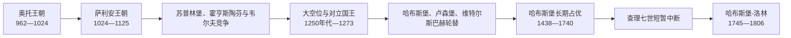

# 德意志国王与皇帝对照表

## 读表说明

神圣罗马帝国的统治者通常先由诸侯选为“罗马人的国王”（通称德意志国王），再由教皇加冕为皇帝；并非每位国王都完成皇帝加冕。1508年马克西米利安一世开始使用“当选的罗马皇帝”，1558年后皇帝称号随选举承认而成立，不再以赴罗马加冕为必要条件。表中把对立国王、共同国王、复位与空位单独列出，避免把竞争性选举写成平稳世袭。

## 奥托与萨利安王朝

| 顺序 | 罗马人的国王 / 德意志国王 | 王位期 | 皇帝及帝号期 | 家族 | 继承与关键事件 |
| ---: | --- | --- | --- | --- | --- |
| 1 | **奥托一世** | 936-973 | 962-973 | 柳多尔芬 / 奥托 | 东法兰克萨克森王朝国王；962年在罗马加冕，通常作为帝国起点。 |
| 2 | 奥托二世 | 961年共王；973-983独掌 | 967-983 | 奥托 | 奥托一世之子；生前加冕确保继承。 |
| 3 | 奥托三世 | 983-1002 | 996-1002 | 奥托 | 奥托二世之子；幼年摄政，谋求罗马—基督教普世帝国。 |
| 4 | **亨利二世** | 1002-1024 | 1014-1024 | 奥托 | 旁系继承；无嗣，奥托王朝终结。 |
| 5 | **康拉德二世** | 1024-1039 | 1027-1039 | 萨利安 | 选举开启萨利安王朝；取得勃艮第王位。 |
| 6 | 亨利三世 | 1028年共王；1039-1056独掌 | 1046-1056 | 萨利安 | 皇权高峰，深度干预教皇继承。 |
| 7 | **亨利四世** | 1054年共王；1056-1105 | 1084-1105 | 萨利安 | 幼年摄政、授职权斗争、卡诺莎与诸侯反叛；被儿子迫退。 |
| 8 | 亨利五世 | 1099年共王；1105-1125 | 1111-1125 | 萨利安 | 1122年《沃尔姆斯宗教协定》；无嗣，王朝终结。 |

## 选举王权与霍亨斯陶芬—韦尔夫竞争

| 顺序 | 国王 | 王位期 | 皇帝期 | 家族 | 继承与关键事件 |
| ---: | --- | --- | --- | --- | --- |
| 9 | 洛泰尔三世 | 1125-1137 | 1133-1137 | 苏普林堡 | 诸侯越过萨利安近亲选出，强化选举原则。 |
| 10 | 康拉德三世 | 1138-1152 | 未加冕 | 霍亨斯陶芬 | 首位霍亨斯陶芬国王；与韦尔夫家族竞争。 |
| 11 | **腓特烈一世“巴巴罗萨”** | 1152-1190 | 1155-1190 | 霍亨斯陶芬 | 重建皇权，反复远征意大利；第三次十字军途中溺亡。 |
| 12 | 亨利六世 | 1169年共王；1190-1197 | 1191-1197 | 霍亨斯陶芬 | 兼西西里国王，试图把帝位世袭化。 |
| 对立 | 菲利普·士瓦本 | 1198-1208 | 未加冕 | 霍亨斯陶芬 | 双重选举中的一方，遇刺身亡。 |
| 对立 / 13 | 奥托四世 | 1198-1215 | 1209-1215 | 韦尔夫 | 得教皇支持后加冕，因意大利政策转而被教皇反对；布汶战败后失势。 |
| 14 | **腓特烈二世** | 1212-1250 | 1220-1250 | 霍亨斯陶芬 | 兼西西里国王；与教皇长期冲突，统治重心在意大利。 |
| 共王 | 亨利（七世） | 1220-1235 | 未加冕 | 霍亨斯陶芬 | 腓特烈二世之子、共同国王；反父后被废。 |
| 共王 / 15 | 康拉德四世 | 1237年共王；1250-1254 | 未加冕 | 霍亨斯陶芬 | 腓特烈二世之子；死后统一王权长期中断。 |

## 大空位与王权恢复

| 类型 / 顺序 | 国王 | 王位期 | 皇帝期 | 家族 | 说明 |
| --- | --- | --- | --- | --- | --- |
| 对立后主要国王 | 威廉·荷兰 | 1247-1256 | 未加冕 | 格鲁尔芬根 | 最初反对腓特烈二世及康拉德四世；康拉德死后仍未获全境服从。 |
| 双重选举 | 理查·康沃尔 | 1257-1272 | 未加冕 | 金雀花 | 英王之弟，多次赴德但缺乏持续统治。 |
| 双重选举 | 阿方索十世·卡斯蒂利亚 | 1257-1275（主张） | 未加冕 | 伊夫雷亚 | 几乎未赴德国；1275年放弃主张。 |
| 16 | **鲁道夫一世** | 1273-1291 | 未加冕 | 哈布斯堡 | 诸侯选举结束大空位；击败奥托卡二世，奠定哈布斯堡奥地利领地。 |
| 17 | 阿道夫·拿骚 | 1292-1298 | 未加冕 | 拿骚 | 因政策与诸侯冲突被废，战败身亡。 |
| 18 | 阿尔布雷希特一世 | 1298-1308 | 未加冕 | 哈布斯堡 | 鲁道夫一世之子；遇刺。 |
| 19 | **亨利七世** | 1308-1313 | 1312-1313 | 卢森堡 | 恢复意大利远征，首位卢森堡皇帝。 |
| 对立 / 20 | 路易四世 | 1314-1347 | 1328-1347 | 维特尔斯巴赫 | 击败对立国王腓特烈；未经教皇主持在罗马加冕。 |
| 对立 | 腓特烈“美男子” | 1314-1322争位；1325-1330名义共王 | 未加冕 | 哈布斯堡 | 1322年战败被俘，和解后名义共治。 |
| 21 | **查理四世** | 1346-1378 | 1355-1378 | 卢森堡 | 1356年《金玺诏书》制度化七选侯与选举程序。 |
| 22 | 瓦茨拉夫 | 1376年共王；1378-1400 | 未加冕 | 卢森堡 | 诸侯以失政为由废黜，但本人不承认。 |
| 23 | 鲁普雷希特 | 1400-1410 | 未加冕 | 维特尔斯巴赫 | 对立于瓦茨拉夫，意大利行动失败。 |
| 短期对立 | 约布斯特·摩拉维亚 | 1410-1411 | 未加冕 | 卢森堡 | 双重选举后不久去世。 |
| 24 | **西吉斯蒙德** | 1411-1437 | 1433-1437 | 卢森堡 | 结束西方教会大分裂，面对胡斯战争；卢森堡男系终结。 |

## 哈布斯堡长期占优

| 顺序 | 国王 | 王位期 | 皇帝期 / 称号 | 家族 | 关键事件 |
| ---: | --- | --- | --- | --- | --- |
| 25 | 阿尔布雷希特二世 | 1438-1439 | 未加冕 | 哈布斯堡 | 西吉斯蒙德女婿；兼匈牙利、波希米亚王。 |
| 26 | **腓特烈三世** | 1440-1493 | 1452-1493 | 哈布斯堡 | 最后一位在罗马由教皇亲自加冕者；以婚姻扩大家族前景。 |
| 27 | **马克西米利安一世** | 1486年共王；1493-1519 | 1508起“当选的罗马皇帝” | 哈布斯堡 | 未赴罗马；帝国改革、婚姻政治与勃艮第遗产。 |
| 28 | **查理五世** | 1519-1556 | 1530-1556；退位手续至1558确认 | 哈布斯堡 | 兼西班牙诸王国；宗教改革、法国与奥斯曼战争；最后一位由教皇加冕。 |
| 共王 / 29 | 斐迪南一世 | 1531年共王；1556/1558-1564 | 1558-1564 | 哈布斯堡 | 查理五世之弟；奥地利支系与西班牙支系分开。 |
| 30 | 马克西米利安二世 | 1562年共王；1564-1576 | 1564-1576 | 哈布斯堡 | 宗教政策相对温和。 |
| 31 | 鲁道夫二世 | 1575年共王；1576-1612 | 1576-1612 | 哈布斯堡 | 迁居布拉格；宗教与家族矛盾加剧。 |
| 32 | 马蒂亚斯 | 1612-1619 | 1612-1619 | 哈布斯堡 | 波希米亚危机与王朝继承安排通向三十年战争。 |
| 33 | **斐迪南二世** | 1619-1637 | 1619-1637 | 哈布斯堡 | 镇压波希米亚起义，推动反宗教改革；三十年战争前中期。 |
| 34 | 斐迪南三世 | 1636年共王；1637-1657 | 1637-1657 | 哈布斯堡 | 接受1648年《威斯特伐利亚和约》，帝国邦权进一步制度化。 |
| 35 | **利奥波德一世** | 1658-1705 | 1658-1705 | 哈布斯堡 | 对法与对奥斯曼战争，1683年维也纳解围。 |
| 共王 / 36 | 约瑟夫一世 | 1690年共王；1705-1711 | 1705-1711 | 哈布斯堡 | 西班牙王位继承战争时期。 |
| 37 | 查理六世 | 1711-1740 | 1711-1740 | 哈布斯堡 | 无男性继承人，推动《国事诏书》。 |
| 空位 | 皇位空缺 | 1740-1742 | 无 | — | 哈布斯堡继承战争中选举延迟。 |
| 38 | 查理七世 | 1742-1745 | 1742-1745 | 维特尔斯巴赫 | 1438年以来唯一非哈布斯堡皇帝；本土巴伐利亚一度被占。 |
| 39 | 弗朗茨一世 | 1745-1765 | 1745-1765 | 洛林 / 哈布斯堡-洛林 | 玛丽亚·特蕾西亚之夫；王朝政治实权多由妻子掌握。 |
| 共王 / 40 | **约瑟夫二世** | 1764年共王；1765-1790 | 1765-1790 | 哈布斯堡-洛林 | 在奥地利世袭领推行开明专制改革。 |
| 41 | 利奥波德二世 | 1790-1792 | 1790-1792 | 哈布斯堡-洛林 | 法国革命初期短暂统治。 |
| 42 | **弗朗茨二世** | 1792-1806 | 1792-1806 | 哈布斯堡-洛林 | 1804兼称奥地利皇帝弗朗茨一世；1806解散帝国。 |

## 选举、加冕与实际权力

| 层面 | 机制 | 历史变化 |
| --- | --- | --- |
| 王位产生 | 早期由主要公爵与教会诸侯协商选举，王朝可通过生前选举儿子增加继承概率。 | 世袭惯例从未完全取代选举；对立国王反映诸侯联盟分裂。 |
| 皇帝称号 | 通常需教皇在罗马加冕。 | 1508后逐步不再赴罗马，1558后选出的国王直接采用皇帝称号。 |
| 领地基础 | 皇帝主要依赖自家世袭领、教会网络与盟友。 | 没有统一帝国财政和官僚体系，强弱取决于王朝资源与诸侯合作。 |
| 退位与废黜 | 诸侯可能宣布国王失政，教皇也曾主张废黜权。 | 亨利四世、阿道夫、瓦茨拉夫、查理五世等体现不同形式的被迫退位、废黜或主动让位。 |
| 终结 | 拿破仑重组德意志诸邦，莱茵邦联成员脱离。 | 弗朗茨二世于1806年放弃帝号，避免拿破仑夺取或重塑该称号。 |

## 相关笔记

- 帝国的结构、战争与兴衰见[神圣罗马帝国](/%E4%BA%BA%E6%96%87%E7%A7%91%E5%AD%A6/%E5%8E%86%E5%8F%B2/%E6%AC%A7%E6%B4%B2/%E5%BE%B7%E6%84%8F%E5%BF%97/%E7%A5%9E%E5%9C%A3%E7%BD%97%E9%A9%AC%E5%B8%9D%E5%9B%BD/README.md)。
- 选举团的构成与变化见[选帝侯](/%E4%BA%BA%E6%96%87%E7%A7%91%E5%AD%A6/%E5%8E%86%E5%8F%B2/%E6%AC%A7%E6%B4%B2/%E5%BE%B7%E6%84%8F%E5%BF%97/%E7%A5%9E%E5%9C%A3%E7%BD%97%E9%A9%AC%E5%B8%9D%E5%9B%BD/%E9%80%89%E5%B8%9D%E4%BE%AF.md)。
- 诸侯、教会领、自由市与帝国行政圈见[神圣罗马帝国的邦国](/%E4%BA%BA%E6%96%87%E7%A7%91%E5%AD%A6/%E5%8E%86%E5%8F%B2/%E6%AC%A7%E6%B4%B2/%E5%BE%B7%E6%84%8F%E5%BF%97/%E7%A5%9E%E5%9C%A3%E7%BD%97%E9%A9%AC%E5%B8%9D%E5%9B%BD/%E7%A5%9E%E5%9C%A3%E7%BD%97%E9%A9%AC%E5%B8%9D%E5%9B%BD%E7%9A%84%E9%82%A6%E5%9B%BD.md)。
