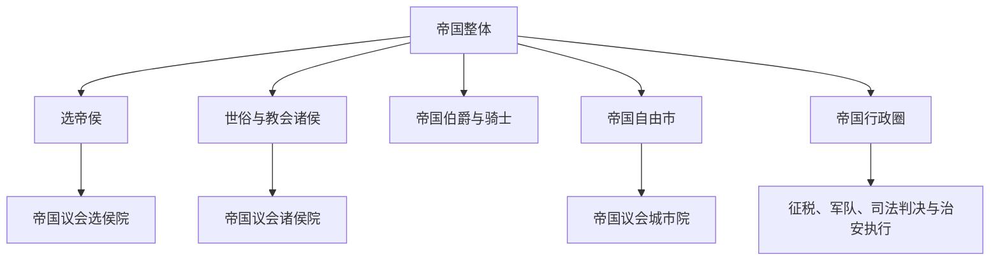

# 神圣罗马帝国的邦国

## 时间

962年-1806年

## 概括

神圣罗马帝国的邦国不是近代意义上的完全主权国家，而是帝国内拥有不同程度领土权力、帝国直辖权或封建地位的政治实体。它们共同构成了帝国长期松散、复合和地方分权的政治结构。

神圣罗马帝国的领地数量在不同时期变化很大，18世纪时甚至包含大量帝国骑士家族的小庄园。因此这里列出的是学习和辨识时最重要、最常见的邦国与类型，不是穷尽全部微型领地。

## 统治结构 / 主要类型

| 类型 | 说明 | 例子 |
| --- | --- | --- |
| 选帝侯领 | 拥有选举德意志国王 / 皇帝资格的核心邦国。 | 美因茨、特里尔、科隆、波希米亚、普法尔茨、萨克森、勃兰登堡 |
| 世俗诸侯领 | 由公爵、侯爵、伯爵、亲王等世俗统治者掌握的领地。 | 巴伐利亚、萨克森、勃兰登堡、奥地利、符腾堡、黑森 |
| 教会诸侯领 | 由主教、大主教、修道院长兼具宗教和世俗权力的领地。 | 美因茨大主教区、特里尔大主教区、科隆大主教区、萨尔茨堡大主教区 |
| 帝国自由市 | 直属皇帝并享有城市自治传统的城市。 | 法兰克福、纽伦堡、奥格斯堡、乌尔姆、雷根斯堡、汉堡、吕贝克、不来梅 |
| 帝国骑士领 | 直属皇帝的骑士家族小领地。 | 法兰肯、施瓦本、莱茵地区的骑士领地 |
| 帝国行政圈 | 帝国为税收、军事、司法协调形成的区域框架。 | 奥地利圈、巴伐利亚圈、弗兰肯圈、施瓦本圈、上莱茵圈、下莱茵-威斯特法伦圈等 |

## 选帝侯

1356年《金玺诏书》确立七大选帝侯，它们是神圣罗马帝国最重要的核心邦国之一。

| 类型 | 邦国 / 职位 | 说明 |
| --- | --- | --- |
| 教会选帝侯 | 美因茨大主教区 | 美因茨大主教兼帝国大书记官，长期居于选帝侯首位。 |
| 教会选帝侯 | 特里尔大主教区 | 莱茵地区重要教会领。 |
| 教会选帝侯 | 科隆大主教区 | 莱茵地区重要教会领。 |
| 世俗选帝侯 | 波希米亚王国 | 帝国内少数具有王国地位的重要领地。 |
| 世俗选帝侯 | 普法尔茨伯国 | 莱茵地区重要世俗诸侯领。 |
| 世俗选帝侯 | 萨克森公国 / 萨克森选侯国 | 德意志东部重要世俗诸侯领。 |
| 世俗选帝侯 | 勃兰登堡侯国 | 后来普鲁士国家形成线的重要核心。 |

后来巴伐利亚、汉诺威等也进入选帝侯体系。关于选帝侯制度，见：[选帝侯](/%E4%BA%BA%E6%96%87%E7%A7%91%E5%AD%A6/%E5%8E%86%E5%8F%B2/%E6%AC%A7%E6%B4%B2/%E5%BE%B7%E6%84%8F%E5%BF%97/%E7%A5%9E%E5%9C%A3%E7%BD%97%E9%A9%AC%E5%B8%9D%E5%9B%BD/%E9%80%89%E5%B8%9D%E4%BE%AF.md)。

## 重要世俗邦国

| 邦国 | 类型 | 说明 |
| --- | --- | --- |
| 波希米亚王国 | 王国 / 选帝侯 | 帝国内重要王国，长期与卢森堡、哈布斯堡等家族相关。 |
| 巴伐利亚公国 / 选侯国 | 公国、后为选侯国 | 南德重要诸侯领，维特尔斯巴赫家族核心领地之一。 |
| 萨克森公国 / 选侯国 | 公国、选侯国 | 东部德意志重要诸侯领，后分化出多个萨克森系邦国。 |
| 勃兰登堡侯国 | 侯国、选侯国 | 后来与普鲁士结合，成为普鲁士王国和德国统一主线的关键。 |
| 奥地利公国 / 大公国 | 公国、大公国 | 哈布斯堡家族核心领地，后来发展为奥地利帝国。 |
| 普法尔茨伯国 | 伯国、选侯国 | 莱茵地区重要诸侯领。 |
| 符腾堡 | 伯爵领、公国、后为王国 | 西南德重要邦国。 |
| 黑森 | 伯爵领、后分化为多个邦国 | 中部德意志重要领地。 |
| 勃艮第相关领地 | 公国 / 帝国边缘复合领地 | 与帝国、法国、哈布斯堡关系复杂。 |
| 梅克伦堡 | 公国 | 北德意志重要诸侯领。 |
| 不伦瑞克-吕讷堡 / 汉诺威 | 公国、后为选侯国 | 后来与汉诺威选侯国、英国汉诺威王朝相关。 |

## 重要教会领

| 教会领 | 类型 | 说明 |
| --- | --- | --- |
| 美因茨大主教区 | 教会选帝侯 | 帝国最重要的教会选侯之一。 |
| 特里尔大主教区 | 教会选帝侯 | 莱茵地区重要教会领。 |
| 科隆大主教区 | 教会选帝侯 | 莱茵地区重要教会领。 |
| 萨尔茨堡大主教区 | 采邑大主教区 | 奥地利和巴伐利亚之间的重要教会领。 |
| 明斯特主教区 | 采邑主教区 | 威斯特法伦地区重要教会领。 |
| 维尔茨堡主教区 | 采邑主教区 | 弗兰肯地区重要教会领。 |
| 班贝格主教区 | 采邑主教区 | 弗兰肯地区重要教会领。 |
| 施派尔主教区 | 采邑主教区 | 莱茵地区教会领。 |
| 奥格斯堡主教区 | 采邑主教区 | 施瓦本地区教会领。 |

## 重要帝国自由市

| 城市 | 说明 |
| --- | --- |
| 法兰克福 | 帝国选举和加冕传统中的重要城市。 |
| 纽伦堡 | 帝国城市和商业中心。 |
| 奥格斯堡 | 商业、金融和宗教改革时期的重要城市。 |
| 雷根斯堡 | 帝国议会长期召开地之一。 |
| 乌尔姆 | 施瓦本地区重要自由市。 |
| 斯特拉斯堡 | 上莱茵地区重要自由市。 |
| 汉堡 | 北德重要自由市，后进入德意志帝国汉萨自由市体系。 |
| 吕贝克 | 汉萨同盟核心城市之一。 |
| 不来梅 | 北德重要自由市。 |

## 帝国行政圈

1500年和1512年前后，帝国逐步形成若干行政圈，用于军事、税收、司法和秩序协调。常见行政圈包括：

| 行政圈 | 大致范围 / 说明 |
| --- | --- |
| 奥地利圈 | 哈布斯堡奥地利相关领地。 |
| 巴伐利亚圈 | 巴伐利亚及周边南德地区。 |
| 弗兰肯圈 | 弗兰肯地区诸侯和教会领。 |
| 施瓦本圈 | 西南德施瓦本地区诸邦。 |
| 上莱茵圈 | 莱茵上游一带诸邦。 |
| 下莱茵-威斯特法伦圈 | 莱茵下游和威斯特法伦地区。 |
| 上萨克森圈 | 萨克森、勃兰登堡等东北德地区。 |
| 下萨克森圈 | 北德地区诸邦。 |
| 勃艮第圈 | 勃艮第和低地国家相关领地。 |
| 莱茵选侯圈 | 莱茵地区选侯领。 |

## 演变关系

- 所属节点：[神圣罗马帝国](/%E4%BA%BA%E6%96%87%E7%A7%91%E5%AD%A6/%E5%8E%86%E5%8F%B2/%E6%AC%A7%E6%B4%B2/%E5%BE%B7%E6%84%8F%E5%BF%97/%E7%A5%9E%E5%9C%A3%E7%BD%97%E9%A9%AC%E5%B8%9D%E5%9B%BD/README.md)。
- 相关节点：[选帝侯](/%E4%BA%BA%E6%96%87%E7%A7%91%E5%AD%A6/%E5%8E%86%E5%8F%B2/%E6%AC%A7%E6%B4%B2/%E5%BE%B7%E6%84%8F%E5%BF%97/%E7%A5%9E%E5%9C%A3%E7%BD%97%E9%A9%AC%E5%B8%9D%E5%9B%BD/%E9%80%89%E5%B8%9D%E4%BE%AF.md)、[德意志国王与皇帝对照表](/%E4%BA%BA%E6%96%87%E7%A7%91%E5%AD%A6/%E5%8E%86%E5%8F%B2/%E6%AC%A7%E6%B4%B2/%E5%BE%B7%E6%84%8F%E5%BF%97/%E7%A5%9E%E5%9C%A3%E7%BD%97%E9%A9%AC%E5%B8%9D%E5%9B%BD/%E5%BE%B7%E6%84%8F%E5%BF%97%E5%9B%BD%E7%8E%8B%E4%B8%8E%E7%9A%87%E5%B8%9D%E5%AF%B9%E7%85%A7%E8%A1%A8.md)。
- 后续影响：帝国诸邦结构影响了[德意志邦联](/%E4%BA%BA%E6%96%87%E7%A7%91%E5%AD%A6/%E5%8E%86%E5%8F%B2/%E6%AC%A7%E6%B4%B2/%E5%BE%B7%E6%84%8F%E5%BF%97/%E5%BE%B7%E6%84%8F%E5%BF%97%E9%82%A6%E8%81%94.md)、[德国](/%E4%BA%BA%E6%96%87%E7%A7%91%E5%AD%A6/%E5%8E%86%E5%8F%B2/%E6%AC%A7%E6%B4%B2/%E5%BE%B7%E6%84%8F%E5%BF%97/%E5%BE%B7%E5%9B%BD/README.md)与[奥地利](/%E4%BA%BA%E6%96%87%E7%A7%91%E5%AD%A6/%E5%8E%86%E5%8F%B2/%E6%AC%A7%E6%B4%B2/%E5%BE%B7%E6%84%8F%E5%BF%97/%E5%A5%A5%E5%9C%B0%E5%88%A9/README.md)两条分支。

## 帝国等级与“直属”原则

能在帝国议会占有席位或集体表决权的政治体称帝国等级。其核心条件通常是直接隶属皇帝和帝国而非另一位领主，但“直属”不等于现代完全主权：成员仍受帝国法、法院判决、共同战争决定和封建义务约束。许多伯爵、修道院与城市以集体票参与，不能简单按地图面积推断政治权重。

## 邦国形成机制

- 王朝分家使萨克森、黑森、梅克伦堡、安哈尔特、罗伊斯等产生多个同姓邦国；继承法既造成碎片化，也形成稳定的地方朝廷。
- 教会领由教会法选出的主教或修道院长统治，职位不世袭；其世俗领地与宗教教区边界不一定相同。
- 帝国自由市通过皇帝特许、赎买或历史惯例摆脱地方领主，商业城市内部常由行会与城市贵族竞争。
- 帝国骑士直接隶属皇帝但通常没有帝国议会席位，集中于弗兰肯、施瓦本和莱茵。
- 战争、婚姻和调停化不断改变地位；同一统治者可同时拥有帝国内与帝国外领土。

## 宗教改革后的地区差异

北部和中部许多世俗邦转向路德宗，莱茵部分地区出现加尔文宗，巴伐利亚、奥地利和多数教会领保持天主教。诸侯通过教会财产、学校和行政建立“教派国家”；臣民迁徙与少数信仰保护成为帝国法院的重要议题。宗教边界并非单纯南北分割，例如天主教教会领与新教自由市常相邻。

## 1803—1806年的大重组

法国取得莱茵左岸后，1803年决议以教会领和自由市补偿失地诸侯。除少数外，采邑主教区被世俗化，数十自由市失去地位；小领主被“调停”到较大邦国。1806年莱茵邦联进一步吸收帝国骑士领。帝国终结时的地图因此已不同于1648年，后来的德意志邦联继承的是重组后的约四十邦格局。

## 制度功能与局限

| 功能 | 实际作用 | 局限 |
| --- | --- | --- |
| 集体安全 | 宣布帝国战争、分配军队名额、设共同堡垒 | 成员执行不一，大邦有独立外交。 |
| 司法 | 为小邦、城市、贵族与臣民提供超领地法院 | 审理缓慢，强邦可能拖延执行。 |
| 身份秩序 | 确认爵位、席位、继承和边界 | 复杂特权妨碍快速统一改革。 |
| 地区协调 | 行政圈征税、铸币、治安和军务 | 圈的能力差异大，部分领地不纳入。 |
| 多样性保护 | 小政治体借帝国法避免被邻国立即吞并 | 也使领土碎片和关税壁垒长期存在。 |
