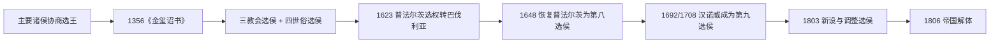

# 选帝侯

选帝侯是神圣罗马帝国中拥有选举德意志国王、进而影响皇帝继承权的特殊诸侯。1356年，查理四世颁布《金玺诏书》，正式确立七大选帝侯制度。

## 构成

七大选帝侯由三位教会选侯和四位世俗选侯组成。

- 三个总教区是德意志境内最古老且具有权势的主教教座，自东法兰克四大公爵时代就承袭重要职务。
- 四大世俗诸侯则代表东法兰克王国时期的四大民族：法兰克人（弗兰肯公国）、萨克森人（萨克森公国）、苏维汇人（施瓦本公国）、巴伐利亚人（巴伐利亚公国）。

## 七大选侯

| 类型 | 选侯 | 身份说明 | 家徽 |
| --- | --- | --- | --- |
| 教会选侯 | 美因茨总教区总主教 | 王公主教，同时拥有宗教权威和帝国政治地位。 |  |
| 教会选侯 | 特里尔总教区总主教 | 王公主教，同时拥有宗教权威和帝国政治地位。 |  |
| 教会选侯 | 科隆总教区总主教 | 王公主教，同时拥有宗教权威和帝国政治地位。 |  |
| 世俗选侯 | 波希米亚国王 | 帝国内拥有选帝权的世俗诸侯。 |  |
| 世俗选侯 | 莱茵-普法尔茨伯爵 | 帝国内拥有选帝权的世俗诸侯。 |  |
| 世俗选侯 | 萨克森-维滕贝格公爵 | 帝国内拥有选帝权的世俗诸侯。 |  |
| 世俗选侯 | 勃兰登堡藩侯 | 帝国内拥有选帝权的世俗诸侯。 |  |

## 1618年七大选侯封地

七大选侯在帝国内所辖封地如下：

| 颜色 | 代表封地 |
| --- | --- |
| 红 / 粉色 | 波希米亚王国 |
| 蓝色 | 普法尔茨 |
| 黄色 | 萨克森选侯国 |
| 黑色 | 勃兰登堡选侯国 |
| 橙色 | 科隆总主教 |
| 紫色 | 特里尔总主教 |
| 绿色 | 美因茨总主教 |

## 相关笔记

- [神圣罗马帝国](/%E4%BA%BA%E6%96%87%E7%A7%91%E5%AD%A6/%E5%8E%86%E5%8F%B2/%E6%AC%A7%E6%B4%B2/%E5%BE%B7%E6%84%8F%E5%BF%97/%E7%A5%9E%E5%9C%A3%E7%BD%97%E9%A9%AC%E5%B8%9D%E5%9B%BD/README.md)
- [德意志国王与皇帝对照表](/%E4%BA%BA%E6%96%87%E7%A7%91%E5%AD%A6/%E5%8E%86%E5%8F%B2/%E6%AC%A7%E6%B4%B2/%E5%BE%B7%E6%84%8F%E5%BF%97/%E7%A5%9E%E5%9C%A3%E7%BD%97%E9%A9%AC%E5%B8%9D%E5%9B%BD/%E5%BE%B7%E6%84%8F%E5%BF%97%E5%9B%BD%E7%8E%8B%E4%B8%8E%E7%9A%87%E5%B8%9D%E5%AF%B9%E7%85%A7%E8%A1%A8.md)

## 选举程序与高级职务

1356年后，美因茨大主教负责召集选举，选侯在法兰克福集会，以多数票选出罗马人的国王。国王传统上在亚琛加冕，后多在法兰克福；是否再赴罗马由教皇加冕为皇帝，随时代而变化。每位选侯拥有象征性帝国高级职务，在加冕礼承担礼仪角色，并以此表达帝国由教会与世俗等级共同组成。

| 选侯 | 帝国高级职务 | 领地特点 |
| --- | --- | --- |
| 美因茨大主教 | 德意志大书记官 | 召集并主持选举，常为选侯团首位。 |
| 特里尔大主教 | 勃艮第 / 高卢大书记官 | 莱茵西部教会领。 |
| 科隆大主教 | 意大利大书记官 | 传统上参与国王加冕。 |
| 波希米亚国王 | 大斟酒官 | 唯一王爵世俗选侯；早期在某些争议中曾被排除。 |
| 莱茵普法尔茨伯爵 | 大膳食官，后职务调整 | 维特尔斯巴赫家族莱茵支；宗教改革后转加尔文宗。 |
| 萨克森选侯 | 大元帅 | 维滕贝格支；宗教改革早期保护路德。 |
| 勃兰登堡选侯 | 大内侍 | 1415年起霍亨索伦掌握，后与普鲁士结合。 |

## 选侯团的变化

1619年波希米亚等级反叛并选出普法尔茨选侯腓特烈五世为王。皇帝胜利后，1623年把普法尔茨选权和高级职务授予巴伐利亚公爵。1648年《威斯特伐利亚和约》没有简单撤销巴伐利亚选权，而为恢复的普法尔茨另设第八席。1692年皇帝许诺不伦瑞克-吕讷堡（汉诺威）选权，1708年获帝国议会承认，形成第九席。

1777年巴伐利亚主系绝嗣，普法尔茨选侯继承巴伐利亚，两席合并。1803年世俗化使科隆、特里尔的选侯地位消失，美因茨选权转移至雷根斯堡，同时新设萨尔茨堡、符腾堡、巴登、黑森-卡塞尔等选侯；这些新选侯尚未来得及参加皇帝选举，帝国即于1806年解体。

## 选举中的权力交易

候选人须以“选举投降书”承诺尊重帝国法、选侯特权、议会和宗教安排。选举往往伴随外交联盟、婚姻、金钱贷款和职位保证；1519年查理五世与法王弗朗索瓦一世竞争尤其显示欧洲金融和大国政治的作用。选举并非现代民主，但它阻止帝位无条件世袭，也使王朝必须取得跨地区联盟。

## 选侯与宗教冲突

萨克森、勃兰登堡和普法尔茨先后支持不同新教派，而三位大主教与巴伐利亚构成天主教重心。选侯席位变化因此不仅是家族继承问题，也影响宗教阵营票数。三十年战争后，选举团与帝国议会的宗教事务采用教派分别协商方式，避免简单多数永久压倒另一方。

## 常见误解

- 七选侯并非从帝国建立时就固定存在；《金玺诏书》把既有惯例制度化。
- “选皇帝”在中世纪通常先选罗马人的国王，皇帝加冕是第二步骤。
- 选侯拥有高度领地权力但仍是帝国成员，其臣民可在特定条件下向帝国法院申诉。
- 汉诺威国王兼英国国王时，共主不意味着英国成为帝国成员；参加帝国的是汉诺威选侯领。
- 1803年新增选侯不是后来德国的自动建国委员会，帝国解体后头衔很快转为王国或大公国等级。
