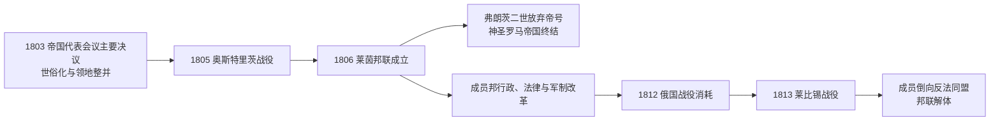

# 莱茵邦联

## 时间

1806年-1813年

## 概括

莱茵邦联是拿破仑主导下由一批德意志诸邦组成的联盟。它的建立直接促成神圣罗马帝国在1806年解体，也成为德意志诸邦从旧帝国秩序进入近代邦联重组的重要过渡阶段。

## 说明

- 1806年，多个德意志诸邦脱离神圣罗马帝国，加入由拿破仑保护的莱茵邦联。
- 同年，弗朗茨二世宣布放弃神圣罗马皇帝称号，神圣罗马帝国终结。
- 莱茵邦联成员在拿破仑体系中获得领土调整、等级提升和制度改革机会，但也需要向法国提供军事支持。
- 巴伐利亚、符腾堡、萨克森等邦国在拿破仑时期地位上升，其中巴伐利亚和符腾堡成为王国。
- 莱茵邦联削弱了旧帝国中大量小领地和教会领地，为后来的德意志邦联和德意志国家整合提供前置条件。
- 1813年莱比锡战役后，拿破仑在德意志的控制瓦解，莱茵邦联解体。

## 保护者与成员邦君主

| 类型 | 人物 / 机构 | 时间 | 说明 |
| --- | --- | --- | --- |
| 保护者 | 拿破仑一世 | 1806-1813 | 莱茵邦联由法国皇帝拿破仑主导和保护。 |
| 成员邦君主 | 巴伐利亚、符腾堡、萨克森等邦君主 | 1806-1813 | 邦联不是统一国家，各成员邦保留本地君主。 |
| 末期政治节点 | 莱比锡战役后的成员邦倒向反法同盟 | 1813 | 拿破仑在德意志控制瓦解后，莱茵邦联解体。 |

## 演变关系

- 前一节点：[神圣罗马帝国](/%E4%BA%BA%E6%96%87%E7%A7%91%E5%AD%A6/%E5%8E%86%E5%8F%B2/%E6%AC%A7%E6%B4%B2/%E5%BE%B7%E6%84%8F%E5%BF%97/%E7%A5%9E%E5%9C%A3%E7%BD%97%E9%A9%AC%E5%B8%9D%E5%9B%BD/README.md)。
- 后一节点：[德意志邦联](/%E4%BA%BA%E6%96%87%E7%A7%91%E5%AD%A6/%E5%8E%86%E5%8F%B2/%E6%AC%A7%E6%B4%B2/%E5%BE%B7%E6%84%8F%E5%BF%97/%E5%BE%B7%E6%84%8F%E5%BF%97%E9%82%A6%E8%81%94.md)。
- 相关节点：[神圣罗马帝国的邦国](/%E4%BA%BA%E6%96%87%E7%A7%91%E5%AD%A6/%E5%8E%86%E5%8F%B2/%E6%AC%A7%E6%B4%B2/%E5%BE%B7%E6%84%8F%E5%BF%97/%E7%A5%9E%E5%9C%A3%E7%BD%97%E9%A9%AC%E5%B8%9D%E5%9B%BD/%E7%A5%9E%E5%9C%A3%E7%BD%97%E9%A9%AC%E5%B8%9D%E5%9B%BD%E7%9A%84%E9%82%A6%E5%9B%BD.md)。

## 建立背景

18世纪末的帝国已经承受法国革命战争的军事和财政压力。法国占领莱茵河左岸后，1803年帝国代表会议主要决议以世俗化教会领、取消大量自由市和合并小领地补偿失地诸侯；德意志政治地图由数百个单位压缩为较少的中型邦国。1805年奥斯特里茨战役击败奥地利与俄国，拿破仑获得重组中欧秩序的决定性优势。

1806年7月，巴伐利亚、符腾堡、巴登等十六邦签署《莱茵邦联条约》，宣布脱离帝国并承认拿破仑为“保护者”。成员须提供军队，法国则保障其领土和等级。弗朗茨二世判断旧帝国已无法维持，于8月放弃神圣罗马皇帝称号，避免帝号被法国控制；这不是邦联继承帝国，而是旧帝国法律秩序与拿破仑保护体系的断裂。

## 扩张与成员结构

邦联从1806年的十六邦逐步扩大，鼎盛时覆盖除奥地利、普鲁士、丹麦所辖荷尔斯泰因和瑞典波美拉尼亚等以外的大部分德意志地区，人口超过一千万。主要成员包括巴伐利亚、符腾堡、萨克森、威斯特法伦、巴登、黑森-达姆施塔特、贝格等。美因茨大主教达尔贝格先任“首席亲王”，后为法兰克福大公；然而邦联议会从未真正形成，拿破仑通过条约、外交和军事需求控制整体方向。

| 层级 | 代表成员 | 地位变化 | 对法国义务 |
| --- | --- | --- | --- |
| 王国 | 巴伐利亚、符腾堡、萨克森、威斯特法伦 | 部分由选侯或公爵升格为国王 | 提供大批军队并配合法国大陆体系。 |
| 大公国 | 巴登、黑森、贝格、维尔茨堡、法兰克福 | 吸收周边小领地，强化中央政府 | 军事、外交受法国体系约束。 |
| 公国与亲王国 | 拿骚、安哈尔特、萨克森诸公国等 | 通过“调停化”兼并骑士领和小邦 | 按人口分担兵员与费用。 |
| 名义中央 | 保护者、首席亲王 | 没有有效共同政府或财政 | 拿破仑拥有最终政治影响。 |

## 改革与社会影响

- 巴伐利亚、符腾堡、巴登等推进官僚分区、税制整合、常备军、司法统一和贵族特权调整，国家能力显著增强。
- 威斯特法伦王国以拿破仑法典、法律平等、取消部分封建义务作为示范，但沉重征兵、税收和大陆封锁削弱认同。
- 教会领世俗化改变土地与教育资源分配；“调停化”使许多帝国骑士、伯爵和自由市失去直接政治地位。
- 改革并非单纯由法国强加：成员邦统治者也利用法国保护扩大领土、消除内部飞地并建设集中化国家。
- 军事负担造成长期反作用。德意志部队参与西班牙、奥地利和俄国战争，1812年俄国远征损失尤其严重。

## 解体过程

1813年俄国战役失败后，普鲁士转入反法阵营。10月莱比锡“民族会战”使拿破仑失去德意志军事优势，巴伐利亚等成员在保证领土与王位的条件下改投反法同盟；邦联随成员退出而瓦解。1814—1815年维也纳会议没有恢复1806年前的帝国，也没有撤销全部拿破仑时期整并，而是在保留中型邦国的基础上建立德意志邦联。

## 崛起、运作与灭亡原因

| 层面 | 形成 / 维持因素 | 衰落因素 | 直接触发 |
| --- | --- | --- | --- |
| 军事 | 法国在奥斯特里茨后的压倒优势 | 长期战争与征兵损耗 | 1812俄国战败、1813莱比锡失败。 |
| 邦国利益 | 王位升格、领土扩张、行政集中 | 法国要求超过保护收益 | 反法同盟承诺承认既得领土。 |
| 制度 | 旧帝国小单位被整并 | 缺乏真正邦联机关和共同合法性 | 成员逐一退盟即令体系失效。 |
| 社会经济 | 法律与官僚改革提高国家能力 | 大陆封锁、税负、征用引发不满 | 法国军事保护能力崩溃。 |
