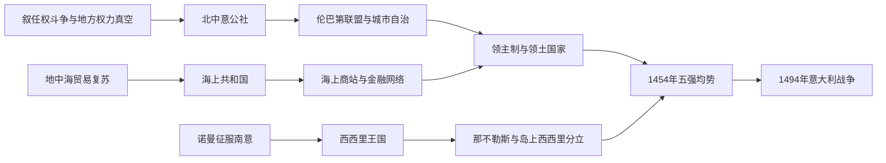

# 中世纪城邦与海上共和国时期

## 时间

11世纪-15世纪

## 演变图

## 概括

中世纪中后期的意大利没有形成统一王国。北中部城市借商业、行会、主教权力真空和帝国—教皇冲突建立公社，威尼斯、热那亚、比萨和阿马尔菲经营海上网络；南部则形成诺曼—霍亨斯陶芬—安茹—阿拉贡的王国传统。城市自治催生金融、法律和公共文化，也因阶级冲突、派系战争与雇佣军政治逐渐转向寡头或领主制。

## 政体与统治结构

诺曼、霍亨斯陶芬、安茹、阿拉贡及岛陆两条南意王权完整顺序见[南意大利与西西里统治者及总督表](/%E4%BA%BA%E6%96%87%E7%A7%91%E5%AD%A6/%E5%8E%86%E5%8F%B2/%E6%AC%A7%E6%B4%B2/%E6%84%8F%E5%A4%A7%E5%88%A9/%E5%8D%97%E6%84%8F%E5%A4%A7%E5%88%A9%E4%B8%8E%E8%A5%BF%E8%A5%BF%E9%87%8C%E7%BB%9F%E6%B2%BB%E8%80%85%E5%8F%8A%E6%80%BB%E7%9D%A3%E8%A1%A8.md)。米兰从维斯孔蒂领主到公国、斯福尔扎和外国总督的完整顺序见[米兰公国统治者与总督表](/%E4%BA%BA%E6%96%87%E7%A7%91%E5%AD%A6/%E5%8E%86%E5%8F%B2/%E6%AC%A7%E6%B4%B2/%E6%84%8F%E5%A4%A7%E5%88%A9/%E7%B1%B3%E5%85%B0%E5%85%AC%E5%9B%BD%E7%BB%9F%E6%B2%BB%E8%80%85%E4%B8%8E%E6%80%BB%E7%9D%A3%E8%A1%A8.md)。教皇国的长世系不在并立政权页重复，完整顺序见[教皇国教宗世系表](/%E4%BA%BA%E6%96%87%E7%A7%91%E5%AD%A6/%E5%8E%86%E5%8F%B2/%E6%AC%A7%E6%B4%B2/%E6%84%8F%E5%A4%A7%E5%88%A9/%E6%95%99%E7%9A%87%E5%9B%BD%E6%95%99%E5%AE%97%E4%B8%96%E7%B3%BB%E8%A1%A8.md)；表中只解释其在本阶段的治理机制。

| 政体 / 地区 | 主要机构与权力 | 崛起基础 | 中后期变化 |
|---|---|---|---|
| 威尼斯共和国 | 总督、贵族大议会、元老院及多个监督机构 | 潟湖防御、拜占庭联系、亚得里亚海与东方贸易 | 1297年后参政资格封闭化，形成稳定贵族寡头；15世纪扩张大陆领地。 |
| 热那亚共和国 | 执政官、后来的总督、贵族家族与商人金融集团 | 西地中海航运、黑海据点、信贷与海军 | 家族派争和外部保护反复，仍保持强大商业网络。 |
| 比萨共和国 | 执政官、公社议会与商人集团 | 第勒尼安海航运，对撒丁、科西嘉及十字军航线的参与 | 1284年梅洛里亚海战后海权衰退，1406年被佛罗伦萨控制。 |
| 阿马尔菲 | 公爵 / 城市贵族与商人 | 早期地中海商业、海法和跨文化贸易 | 诺曼扩张及比萨袭击后失去独立海上地位。 |
| 佛罗伦萨共和国 | 行会、公社议会、执政团；党争中常设特别委员会 | 羊毛业、银行、远距贸易和托斯卡纳腹地 | 美第奇通过庇护和金融网络控制共和国，后转为公爵政体。 |
| 米兰 | 公社、执政官，后由维斯孔蒂与斯福尔扎领主统治 | 波河交通、制造业、富饶农业腹地 | 1395年成为公国，建立较集中领土国家。 |
| 教皇国与中部城市 | 教皇使节、地方贵族、公社和佣兵队长并存 | 教会领地和宗教法统 | 教廷驻阿维尼翁时期地方自主增强，15世纪教皇重新整合领地。 |
| 西西里与南意王国 | 诺曼国王、官僚、封建贵族和城市特权 | 诺曼征服整合多族群行政，控制地中海中央航道 | 1282年后分裂为岛上西西里与大陆那不勒斯，两者受阿拉贡、安茹竞争。 |

## 崛起过程

11世纪人口和农业恢复扩大市场，城墙内的商人、手工业者、法律家与小贵族要求共同管理税收、司法和防务。帝国皇帝与教皇争夺主教任命，使许多城市可以迫使主教或伯爵分享权力。公社最初由执政官领导，后因派系冲突聘请外地“波德斯塔”主持司法；行会进一步争取参政，形成不同程度的公民共和国。

海上共和国把造船、护航、商站、殖民据点和信用工具结合起来。十字军东征扩大东方贸易，1204年第四次十字军攻占君士坦丁堡使威尼斯获得港口和岛屿。城市繁荣又支撑大学、罗马法复兴、公证制度、复式簿记前身和公共建筑。

## 党争、领主制与领土国家

“归尔甫派—吉伯林派”最初关联教皇与皇帝阵营，后来常成为地方家族竞争的标签。公社内部还有贵族与平民、富裕大行会与小行会、城市与乡村的利益冲突。长期战争需要职业军队，政府越来越依赖雇佣兵队长；强势家族借财政、庇护或军权成为“僭主”与世袭领主。到14至15世纪，米兰公国、威尼斯大陆领地、佛罗伦萨、美第奇影响下的托斯卡纳、教皇国和那不勒斯王国构成较稳定的区域国家。

## 重要事件

1. 1059年教皇选举改革和随后叙任权斗争削弱皇帝对意大利主教的稳定控制。
2. 1071年诺曼人夺取巴里，拜占庭在意大利的主要统治终结；1130年西西里王国建立。
3. 1158年腓特烈一世在龙卡利亚会议主张帝国权利，引发北意城市反抗。
4. 1167年伦巴第联盟形成；1176年莱尼亚诺战役阻止皇帝压服公社。
5. 1183年《康斯坦茨和约》承认城市在帝国法统下拥有广泛自治。
6. 1204年威尼斯深度参与第四次十字军并取得东方据点。
7. 1220-1250年腓特烈二世统治西西里并与教皇长期冲突，南部官僚王权增强。
8. 1282年“西西里晚祷”推翻岛上安茹统治，南部王国长期分裂。
9. 1284年热那亚在梅洛里亚海战击败比萨，西地中海力量对比改变。
10. 1297年威尼斯“大议会封闭”使贵族政治趋于世袭。
11. 1348年黑死病重创人口、劳动力和财政，也改变工资与土地关系。
12. 1378年佛罗伦萨梳毛工起义暴露行会共和国的社会排斥。
13. 1378-1381年基奥贾战争后威尼斯击败热那亚，巩固亚得里亚海优势。
14. 1395年维斯孔蒂获米兰公爵称号，领主制正式王朝化。
15. 1454年《洛迪和约》结束米兰—威尼斯战争，形成五大势力均势。

## 鼎盛条件

城市密集、农业腹地富庶、亚欧贸易路线交汇、罗马法与公证制度发达，以及多国竞争防止单一君主吞并全半岛，共同支持商业繁荣。共和机构虽多由精英控制，却提供了公开议事、税务信用和集体融资的框架。

## 衰落与转型

城邦并非都“衰落”，更多是从城市共和国转为领土国家。结构因素包括寡头封闭、贫富冲突、乡村受支配和雇佣军成本；外部压力来自奥斯曼扩张使东方据点受损、葡萄牙开辟绕非航路，以及法国与哈布斯堡能够投入更大常备军。直接政治转折是15世纪末意大利均势破裂，城市与公国无法共同阻止外国大军介入。

## 演变关系

- 前一节点：[加洛林与神圣罗马帝国影响时期](/%E4%BA%BA%E6%96%87%E7%A7%91%E5%AD%A6/%E5%8E%86%E5%8F%B2/%E6%AC%A7%E6%B4%B2/%E6%84%8F%E5%A4%A7%E5%88%A9/%E5%8A%A0%E6%B4%9B%E6%9E%97%E4%B8%8E%E7%A5%9E%E5%9C%A3%E7%BD%97%E9%A9%AC%E5%B8%9D%E5%9B%BD%E5%BD%B1%E5%93%8D%E6%97%B6%E6%9C%9F.md)。
- 后一节点：[文艺复兴与意大利战争时期](/%E4%BA%BA%E6%96%87%E7%A7%91%E5%AD%A6/%E5%8E%86%E5%8F%B2/%E6%AC%A7%E6%B4%B2/%E6%84%8F%E5%A4%A7%E5%88%A9/%E6%96%87%E8%89%BA%E5%A4%8D%E5%85%B4%E4%B8%8E%E6%84%8F%E5%A4%A7%E5%88%A9%E6%88%98%E4%BA%89%E6%97%B6%E6%9C%9F.md)。
- 所属总览：[意大利历史](/%E4%BA%BA%E6%96%87%E7%A7%91%E5%AD%A6/%E5%8E%86%E5%8F%B2/%E6%AC%A7%E6%B4%B2/%E6%84%8F%E5%A4%A7%E5%88%A9/README.md)。
