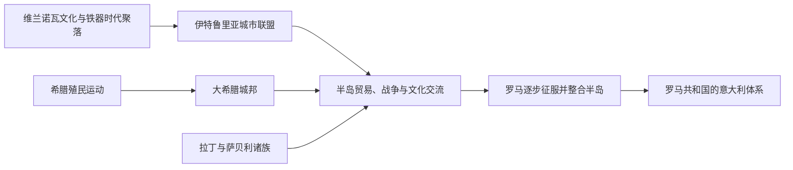

# 伊特鲁里亚与大希腊时期

## 时间

约前9世纪-前3世纪

## 演变图

## 概括

罗马统一半岛之前，意大利并不是伊特鲁里亚与希腊两方对峙，而是伊特鲁里亚城邦、大希腊诸城、腓尼基—迦太基据点以及众多意大利本土族群并存的多中心世界。伊特鲁里亚人控制中部重要矿产和陆海通道，希腊殖民城邦连接爱琴海与西地中海；双方又通过贸易、战争和技术传播深刻影响拉丁诸城与早期罗马。

## 政治与社会结构

| 势力 | 核心区域 | 统治结构 | 主要优势 |
|---|---|---|---|
| 伊特鲁里亚诸城 | 今托斯卡纳、北拉齐奥、翁布里亚西部，并一度扩展到波河流域和坎帕尼亚 | 独立城邦；早期常见王权，后多转为贵族寡头；“十二城联盟”主要承担宗教与协商功能，不是统一国家 | 铁、铜等矿产、金属加工、港口贸易、城市工程与骑兵 |
| 大希腊诸城 | 南意大利沿海；西西里希腊城邦通常另称“西西里希腊人” | 各自独立的城邦，实行贵族制、僭主制或公民政治，与母邦保有宗教和贸易联系 | 航海、铸币、文字、重装步兵、农业殖民和跨地中海商业 |
| 腓尼基—迦太基势力 | 西西里西部、撒丁岛及西地中海航路 | 商站、殖民城市及迦太基霸权 | 海运网络、港口和金属贸易 |
| 意大利本土诸族 | 拉齐奥、亚平宁山区、亚得里亚海沿岸与南部内陆 | 城邦、部落联盟和山地共同体并存 | 山地兵源、牧业网络、区域联盟与对平原城市的持续压力 |

## 崛起机制与文化交流

- 伊特鲁里亚城市依托埃尔巴岛和托斯卡纳矿产、精良金属工艺及第勒尼安海航线，在前8至前6世纪扩张。它们没有形成统一帝国，强盛依赖城市间合作和港口节点。
- 希腊人在前8世纪起建立皮特库萨、库迈、塔兰托、叙巴里斯、克罗顿、洛克里、雷吉翁等城市。殖民并非由一个“希腊国家”策划，而是多个母邦分别组织的迁居、土地占有和贸易行动。
- 优卑亚希腊字母经伊特鲁里亚人和拉丁人吸收，成为伊特鲁里亚字母与拉丁字母的重要来源；宗教图像、神话、宴饮习俗、建筑和军事装备也在各社群间重新组合。
- 大希腊的哲学、医学、数学和艺术传统通过毕达哥拉斯学派、南意工坊和商业网络传入罗马世界；伊特鲁里亚的占卜、王权象征、城市规划和排水技术同样被罗马吸收。

## 重要事件

1. 约前9世纪，伊特鲁里亚历史区域的铁器时代城市中心开始清晰形成。
2. 约前8世纪中期，皮特库萨与库迈等早期希腊据点建立，南意大利殖民活动加速。
3. 前7至前6世纪，伊特鲁里亚势力向波河平原和坎帕尼亚扩展，并对早期罗马产生显著影响。
4. 约前540年，阿拉利亚海战反映伊特鲁里亚—迦太基与希腊航海势力对西地中海路线的竞争。
5. 前509年传统纪年，罗马驱逐末代国王；这并不意味着伊特鲁里亚影响立即消失。
6. 前474年，库迈海战削弱伊特鲁里亚在坎帕尼亚海域的力量。
7. 前5至前4世纪，萨莫奈等山地集团扩张，挤压部分伊特鲁里亚与希腊城市的内陆控制。
8. 前396年，罗马攻占伊特鲁里亚重镇维爱，开始成为中意大利主导力量。
9. 前280-前275年，塔兰托邀请伊庇鲁斯国王皮洛士参战；皮洛士撤退后，罗马加速控制南意。
10. 前272年塔兰托降服；前3世纪中叶，半岛多数城邦被纳入罗马联盟体系。西西里希腊城市则在随后布匿战争中陆续受罗马控制。

## 鼎盛、衰落与被整合

伊特鲁里亚和大希腊的衰落都不是文化突然消失。结构上，城邦之间缺乏持久统一指挥；外部又面对凯尔特人、萨莫奈人、迦太基、叙拉古和罗马等竞争者。罗马利用殖民地、道路、不同等级盟约和持续动员，把逐一击败的城市纳入更大的军事联盟。直接转折包括维爱陷落、皮洛士战争与塔兰托投降。此后伊特鲁里亚语和希腊语社群仍长期存在，其宗教、艺术和制度被罗马选择性继承。

## 演变关系

- 前一节点：[史前与意大利诸民族时期](/%E4%BA%BA%E6%96%87%E7%A7%91%E5%AD%A6/%E5%8E%86%E5%8F%B2/%E6%AC%A7%E6%B4%B2/%E6%84%8F%E5%A4%A7%E5%88%A9/%E5%8F%B2%E5%89%8D%E4%B8%8E%E6%84%8F%E5%A4%A7%E5%88%A9%E8%AF%B8%E6%B0%91%E6%97%8F%E6%97%B6%E6%9C%9F.md)。
- 后一节点：[罗马王政与共和国时期](/%E4%BA%BA%E6%96%87%E7%A7%91%E5%AD%A6/%E5%8E%86%E5%8F%B2/%E6%AC%A7%E6%B4%B2/%E6%84%8F%E5%A4%A7%E5%88%A9/%E7%BD%97%E9%A9%AC%E7%8E%8B%E6%94%BF%E4%B8%8E%E5%85%B1%E5%92%8C%E5%9B%BD%E6%97%B6%E6%9C%9F.md)。
- 跨区域锚点：[古希腊](/%E4%BA%BA%E6%96%87%E7%A7%91%E5%AD%A6/%E5%8E%86%E5%8F%B2/%E6%AC%A7%E6%B4%B2/_%E9%80%9A%E5%8F%B2/%E5%8F%A4%E5%B8%8C%E8%85%8A/README.md)、[古罗马](/%E4%BA%BA%E6%96%87%E7%A7%91%E5%AD%A6/%E5%8E%86%E5%8F%B2/%E6%AC%A7%E6%B4%B2/_%E9%80%9A%E5%8F%B2/%E5%8F%A4%E7%BD%97%E9%A9%AC/README.md)。
- 所属总览：[意大利历史](/%E4%BA%BA%E6%96%87%E7%A7%91%E5%AD%A6/%E5%8E%86%E5%8F%B2/%E6%AC%A7%E6%B4%B2/%E6%84%8F%E5%A4%A7%E5%88%A9/README.md)。
