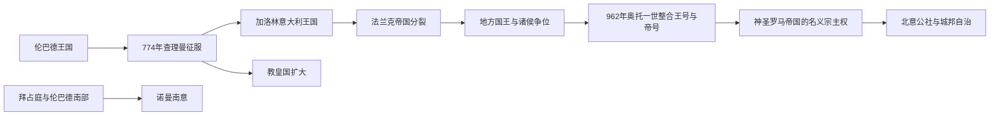

# 加洛林与神圣罗马帝国影响时期

## 时间

774年-11世纪

## 演变图

## 概括

查理曼征服伦巴德王国后，“意大利王国”成为加洛林及后来神圣罗马帝国权利体系的一部分，但皇帝从未统一控制整个半岛。北中部的国王—伯爵体系、教皇国、地方主教和诸侯相互制约；南部则长期并存伦巴德公国、拜占庭军区、穆斯林西西里和新兴海港城市。帝国名义与地方实际权力之间的落差，是中世纪意大利城邦自治得以发展的重要背景。

## 王朝世系 / 统治结构

萨伏依从阿尔卑斯伯国到近代王国的连续世系见[萨伏依—撒丁王朝世系表](/%E4%BA%BA%E6%96%87%E7%A7%91%E5%AD%A6/%E5%8E%86%E5%8F%B2/%E6%AC%A7%E6%B4%B2/%E6%84%8F%E5%A4%A7%E5%88%A9/%E8%90%A8%E4%BC%8F%E4%BE%9D%E2%80%94%E6%92%92%E4%B8%81%E7%8E%8B%E6%9C%9D%E4%B8%96%E7%B3%BB%E8%A1%A8.md)。教皇国从形成到1870年终结的完整公认教宗序列、争位与实际控制说明见[教皇国教宗世系表](/%E4%BA%BA%E6%96%87%E7%A7%91%E5%AD%A6/%E5%8E%86%E5%8F%B2/%E6%AC%A7%E6%B4%B2/%E6%84%8F%E5%A4%A7%E5%88%A9/%E6%95%99%E7%9A%87%E5%9B%BD%E6%95%99%E5%AE%97%E4%B8%96%E7%B3%BB%E8%A1%A8.md)。

完整加洛林君主与神圣罗马皇帝世系分别由[法兰克王国](/%E4%BA%BA%E6%96%87%E7%A7%91%E5%AD%A6/%E5%8E%86%E5%8F%B2/%E6%AC%A7%E6%B4%B2/_%E9%80%9A%E5%8F%B2/%E5%90%8E%E7%BD%97%E9%A9%AC%E6%97%B6%E4%BB%A3%E7%9A%84%E6%97%A5%E8%80%B3%E6%9B%BC%E8%AF%B8%E5%9B%BD/%E6%B3%95%E5%85%B0%E5%85%8B%E7%8E%8B%E5%9B%BD/README.md)和[神圣罗马帝国](/%E4%BA%BA%E6%96%87%E7%A7%91%E5%AD%A6/%E5%8E%86%E5%8F%B2/%E6%AC%A7%E6%B4%B2/%E5%BE%B7%E6%84%8F%E5%BF%97/%E7%A5%9E%E5%9C%A3%E7%BD%97%E9%A9%AC%E5%B8%9D%E5%9B%BD/README.md)维护。本页按意大利实际权力链条整理：

| 阶段 / 势力 | 时间 | 权力结构 | 实际控制 |
|---|---|---|---|
| 加洛林意大利 | 774-888 | 查理曼及其继承者兼任伦巴德 / 意大利国王，以帕维亚为象征中心，伯爵与侯爵治理地方 | 主要覆盖北中部；教皇领地和南部不在日常直接统治之下。 |
| 教皇国 | 8-11世纪 | 教皇依靠教会地产、罗马贵族和法兰克保护 | 控制范围随地方家族、皇帝和邻近诸侯力量反复变化。 |
| 诸侯争夺意大利王位 | 888-962 | 弗留利、斯波莱托、普罗旺斯、勃艮第等家族相互竞逐 | 国王需依赖主教、侯爵和城市精英，权力高度分散。 |
| 奥托与神圣罗马帝国秩序 | 951/962年以后 | 德意志国王取得意大利王冠，再由教皇加冕为皇帝 | 皇帝拥有法统与任命影响，但跨阿尔卑斯统治具有间歇性。 |
| 南部伦巴德诸侯 | 774年以后 | 贝内文托、萨莱诺、卡普阿等公国 / 亲王国 | 在法兰克、拜占庭和地方家族间维持自主。 |
| 拜占庭南意 | 9-11世纪 | 以巴里为中心的军政长官区，地方官与军队代表皇帝 | 一度恢复普利亚、卡拉布里亚等地，受伦巴德人、穆斯林和诺曼人挑战。 |
| 穆斯林西西里 | 827-1091 | 阿格拉布、法蒂玛及卡尔比王朝的埃米尔与地方统治者 | 逐步征服西西里，发展灌溉、农业与地中海贸易；11世纪被诺曼人取代。 |

## 建立与发展过程

774年查理曼攻占帕维亚后保留“伦巴德国王”称号和部分伦巴德法律、官职，没有把意大利简单改造为法兰克行省。800年教皇利奥三世为查理曼加冕，形成皇帝保护教会、教皇提供宗教合法性的互赖关系。843年帝国分割后，意大利王位与中部法兰克王国相连；路易二世主要在意大利经营，并试图打击南部穆斯林据点。

888年胖子查理被废后，意大利王位成为地方大贵族竞争目标。贝伦加尔一世、斯波莱托的圭多与兰贝托、普罗旺斯的路易、勃艮第的鲁道夫二世和于格等先后争位，国王无法建立稳定世袭中央权力。951年德意志国王奥托一世进入意大利并娶阿德莱德，962年在罗马加冕为皇帝，意大利王冠此后通常与德意志王位和帝号相联。

## 重要事件

1. 774年，查理曼征服伦巴德王国并兼任国王。
2. 800年，查理曼在罗马由教皇加冕为皇帝，西欧帝权与罗马教会重新结合。
3. 843年，《凡尔登条约》分割帝国，意大利成为中部王国的重要组成。
4. 846年，阿拉伯袭击者劫掠罗马城外圣殿，暴露中部防务薄弱。
5. 849年，意大利南部海上城市联盟在奥斯提亚附近击败穆斯林舰队。
6. 875年，路易二世去世而无男性继承人，意大利王位争夺加剧。
7. 888年，胖子查理被废，地方王位竞争全面展开。
8. 902年，陶尔米纳陷落，穆斯林基本完成对西西里的征服。
9. 951年，奥托一世进入意大利；962年在罗马加冕为皇帝。
10. 996年，奥托三世首次加冕，试图以罗马为更新帝国的中心，但计划随其1002年早逝终止。
11. 1002-1015年，伊夫雷亚的阿尔杜因挑战德意志君主的意大利王位，最终失败。
12. 1024年萨利安王朝开始后，皇帝继续依靠主教与北意贵族；11世纪中后期叙任权斗争则使帝国与教皇冲突公开化。
13. 11世纪，诺曼雇佣兵在南意建立领地，逐步取代拜占庭、伦巴德和穆斯林政权。

## 统治机制与地方化

加洛林和奥托君主依靠伯爵、侯爵、主教和修道院管理道路、司法与军役。把权利授予主教可暂时绕开世袭贵族，却也让城市教会拥有独立财政和司法资源。皇帝长期不在意大利时，地方贵族、主教座堂团体和城市居民共同处理治安、市场与城墙事务，成为后来公社自治的组织基础。

## 衰落与阶段终结

这一阶段不是某个国家在11世纪突然灭亡，而是跨阿尔卑斯王权的直接行政控制逐渐被多层权力取代。结构上，山地交通和皇帝巡回统治限制了持续控制；王位选举与德意志事务分散注意；教皇改革又反对皇帝任命主教。外部上，穆斯林、拜占庭、伦巴德和诺曼势力使南部长期保持另一套格局。直接转折是11世纪叙任权斗争和城市公社兴起：帝国法统仍在，城市却开始以集体机构行使日常主权。

## 演变关系

- 前一节点：[东哥特、拜占庭与伦巴德时期](/%E4%BA%BA%E6%96%87%E7%A7%91%E5%AD%A6/%E5%8E%86%E5%8F%B2/%E6%AC%A7%E6%B4%B2/%E6%84%8F%E5%A4%A7%E5%88%A9/%E4%B8%9C%E5%93%A5%E7%89%B9%E3%80%81%E6%8B%9C%E5%8D%A0%E5%BA%AD%E4%B8%8E%E4%BC%A6%E5%B7%B4%E5%BE%B7%E6%97%B6%E6%9C%9F.md)。
- 后一节点：[中世纪城邦与海上共和国时期](/%E4%BA%BA%E6%96%87%E7%A7%91%E5%AD%A6/%E5%8E%86%E5%8F%B2/%E6%AC%A7%E6%B4%B2/%E6%84%8F%E5%A4%A7%E5%88%A9/%E4%B8%AD%E4%B8%96%E7%BA%AA%E5%9F%8E%E9%82%A6%E4%B8%8E%E6%B5%B7%E4%B8%8A%E5%85%B1%E5%92%8C%E5%9B%BD%E6%97%B6%E6%9C%9F.md)。
- 对读：[神圣罗马帝国](/%E4%BA%BA%E6%96%87%E7%A7%91%E5%AD%A6/%E5%8E%86%E5%8F%B2/%E6%AC%A7%E6%B4%B2/%E5%BE%B7%E6%84%8F%E5%BF%97/%E7%A5%9E%E5%9C%A3%E7%BD%97%E9%A9%AC%E5%B8%9D%E5%9B%BD/README.md)。
- 所属总览：[意大利历史](/%E4%BA%BA%E6%96%87%E7%A7%91%E5%AD%A6/%E5%8E%86%E5%8F%B2/%E6%AC%A7%E6%B4%B2/%E6%84%8F%E5%A4%A7%E5%88%A9/README.md)。
