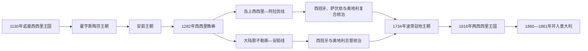

# 南意大利与西西里统治者及总督表

## 时间

1130年-1861年

## 概括

1130年建立的西西里王国同时覆盖岛屿和南意大陆。1282年西西里晚祷后，阿拉贡控制岛屿，安茹仍控制大陆；双方长期都使用“西西里国王”称号，后世为便于辨识常把大陆国家称为那不勒斯王国。1442年阿方索一度兼有两地，1501年后又重新分治并由外国王室以总督治理。1734年波旁旁支建立驻地王朝，1816年正式合并为两西西里王国，1861年被并入意大利王国。

本表把岛、陆两条合法性分开。王号序数因同一人物在阿拉贡、西班牙、那不勒斯和西西里使用不同编号而容易混淆，故以常用姓名并在备注中说明。总督表包含临时、代行、共治与直接统治，不能把总督等同于主权君主。

## 演变图

## 统一西西里王国君主完整表（1130-1282）

| 顺序 | 君主 | 王朝 / 身份 | 在位 | 继承与关键说明 |
|---:|---|---|---|---|
| 1 | **鲁杰罗二世** | 欧特维尔 | 1130-1154 | 把西西里、普利亚和卡拉布里亚合为王国；以多语言官僚和王室法庭统治。 |
| 2 | 古列尔莫一世 | 欧特维尔 | 1154-1166 | 鲁杰罗二世之子；应对贵族叛乱和拜占庭进攻。 |
| 3 | 古列尔莫二世 | 欧特维尔 | 1166-1189 | 前任之子；幼年由母亲纳瓦拉的玛格丽特摄政，无子。 |
| 4 | 坦克雷迪 | 欧特维尔旁支 | 1189-1194 | 鲁杰罗二世非婚生孙；贵族拥立，与康斯坦丝—亨利六世争位。 |
| 4a | 鲁杰罗三世 | 欧特维尔旁支 | 1193 | 坦克雷迪之子、共治国王；先于父亲去世。 |
| 5 | 古列尔莫三世 | 欧特维尔旁支 | 1194 | 坦克雷迪幼子；短暂继位后向亨利六世投降。 |
| 6 | 康斯坦丝一世 | 欧特维尔 | 1194-1198 | 鲁杰罗二世之女；以合法继承人身份与丈夫共同夺位。 |
| 6a | 亨利六世 | 霍亨斯陶芬、共治 | 1194-1197 | 康斯坦丝之夫、神圣罗马皇帝；军事征服王国。 |
| 7 | **腓特烈一世（皇帝腓特烈二世）** | 霍亨斯陶芬 | 1198-1250 | 前两人之子；幼年摄政混乱，成年后以《梅尔菲宪章》强化王权。 |
| 8 | 康拉德一世 | 霍亨斯陶芬 | 1250-1254 | 腓特烈之子；兼德意志国王，主要依靠代理人处理南意。 |
| 9 | 康拉丁（康拉德二世） | 霍亨斯陶芬 | 1254-1258，名义 | 康拉德一世幼子；未成年时由曼弗雷迪摄政，后试图复国失败并被处决。 |
| 10 | 曼弗雷迪 | 霍亨斯陶芬旁支 | 1258-1266 | 腓特烈二世非婚生子；从摄政转为称王，在贝内文托战死。 |
| 11 | 夏尔一世·德·安茹 | 安茹 | 1266-1285；1282年后仅控制大陆 | 教宗授封并击败曼弗雷迪；高税与法国官员引发西西里晚祷。 |

## 大陆那不勒斯君主与政体完整表（1282-1816）

| 顺序 | 君主 / 政体 | 王朝 / 身份 | 在位 / 实控 | 继承与关键说明 |
|---:|---|---|---|---|
| 1 | 夏尔一世·德·安茹 | 安茹 | 1282-1285 | 晚祷后失去岛屿，仍使用西西里国王称号并控制大陆。 |
| 2 | 夏尔二世 | 安茹 | 1285-1309 | 前任之子；早年被阿拉贡俘虏，1295年获释复位。 |
| 3 | 罗贝尔 | 安茹 | 1309-1343 | 前任之子；那不勒斯成为归尔甫派与地中海文化中心。 |
| 4 | 乔万娜一世 | 安茹 | 1343-1382 | 罗贝尔孙女；继承、婚姻和教会大分裂引发长期争位，最终被杀。 |
| 5 | 卡洛三世 | 安茹—杜拉佐 | 1382-1386 | 乔万娜的旁支亲属与对手；夺位后在匈牙利遇刺。 |
| 6 | 拉迪斯劳 | 安茹—杜拉佐 | 1386-1414 | 前任之子；幼年由母亲摄政，扩张中意。 |
| 7 | 乔万娜二世 | 安茹—杜拉佐 | 1414-1435 | 前任之姐；无嗣，先后收养阿方索与安茹的路易，制造继承冲突。 |
| 8 | 勒内·德·安茹 | 安茹—瓦卢瓦 | 1435-1442 | 乔万娜二世指定继承线；被阿方索击败。 |
| 9 | **阿方索一世** | 阿拉贡—特拉斯塔马拉 | 1442-1458 | 阿拉贡的阿方索五世；征服那不勒斯并一度重合岛陆王号。 |
| 10 | 费兰特一世 | 那不勒斯阿拉贡旁支 | 1458-1494 | 阿方索非婚生子；平定男爵叛乱。 |
| 11 | 阿方索二世 | 那不勒斯阿拉贡旁支 | 1494-1495 | 前任之子；法国入侵时退位。 |
| 12 | 费兰迪诺（费迪南多二世） | 那不勒斯阿拉贡旁支 | 1495-1496，中有法国占领 | 前任之子；查理八世短占那不勒斯后，在西班牙援助下复位。 |
| — | 查理八世 | 法国瓦卢瓦、占领者 | 1495年2月-7月 | 依据安茹主张入城并受冠，撤军后失去实际控制。 |
| 13 | 费代里科 | 那不勒斯阿拉贡旁支 | 1496-1501 | 费兰特一世之子；被法国与西班牙秘密瓜分协议推翻。 |
| — | 路易十二 | 法国瓦卢瓦 | 1501-1504 | 一度控制那不勒斯；在同西班牙的战争中失败。 |
| 14 | 斐迪南“天主教王” | 阿拉贡 | 1504-1516 | 西班牙军获胜后以总督治理；在那不勒斯常编号费迪南多三世。 |
| 15 | 胡安娜 | 特拉斯塔马拉 | 1516-1555，名义共治 | 斐迪南之女；与儿子查理共享法统，实际不亲政。 |
| 16 | 查理五世 | 哈布斯堡 | 1516-1554/1556 | 胡安娜之子；皇帝兼复合君主，以总督和意大利委员会治理。 |
| 17 | 腓力二世 | 西班牙哈布斯堡 | 1554/1556-1598 | 查理之子；那不勒斯地方序号与西班牙序号不完全相同。 |
| 18 | 腓力三世 | 西班牙哈布斯堡 | 1598-1621 | 前任之子。 |
| 19 | 腓力四世 | 西班牙哈布斯堡 | 1621-1665 | 前任之子；1647年马萨涅洛起义与共和国危机。 |
| 20 | 卡洛斯二世 | 西班牙哈布斯堡 | 1665-1700 | 前任之子；无嗣导致西班牙王位继承战争。 |
| 21 | 腓力五世 | 西班牙波旁 | 1700-1707，事实至奥军占领 | 依据遗嘱继位；奥地利军队夺取那不勒斯。 |
| 22 | 查理六世 | 奥地利哈布斯堡 | 1707-1734 | 先为西班牙王位竞争者，后以皇帝身份经总督治理。 |
| 23 | **卡洛·迪·波旁** | 波旁 | 1734-1759 | 西班牙王子；征服南意后建立独立宫廷，后继承西班牙王位并让位给儿子。 |
| 24 | 费迪南多四世 | 波旁 | 1759-1799、1799-1806、1815-1816 | 卡洛之子；幼年摄政。1799年共和国、1806年法军和1815年复辟三度改变大陆实控。 |
| — | 帕特诺珀共和国 | 共和国 | 1799年1月-6月 | 法军支持建立，波旁军复辟后终结。 |
| — | 朱塞佩·波拿巴 | 拿破仑任命的那不勒斯国王 | 1806-1808 | 法军占领大陆；费迪南仍控制西西里。 |
| — | 若阿尚·缪拉 | 拿破仑任命的那不勒斯国王 | 1808-1815 | 实行改革并试图在拿破仑崩溃后保位，后被处决。 |

## 岛上西西里君主完整表（1282-1816）

| 顺序 | 君主 | 王朝 / 身份 | 在位 | 继承与关键说明 |
|---:|---|---|---|---|
| 1 | 彼得罗一世（阿拉贡的佩德罗三世） | 阿拉贡 | 1282-1285 | 西西里议会在晚祷后拥立，妻子康斯坦丝为曼弗雷迪之女。 |
| 2 | 贾科莫一世（阿拉贡的海梅二世） | 阿拉贡 | 1285-1295 | 前任之子；继承阿拉贡后准备按条约交还岛屿，引发西西里抵抗。 |
| 3 | **费代里科二世** | 阿拉贡西西里支系 | 1295-1337 | 贾科莫之弟；1302年和约以“特里纳克里亚国王”名义获承认。 |
| 4 | 彼得罗二世 | 阿拉贡西西里支系 | 1337-1342 | 前任之子。 |
| 5 | 路易吉 | 阿拉贡西西里支系 | 1342-1355 | 前任幼子；摄政与贵族派争显著。 |
| 6 | 费代里科三世 | 阿拉贡西西里支系 | 1355-1377 | 路易吉之弟；1372年和约缓和同那不勒斯争战。 |
| 7 | 玛丽亚 | 阿拉贡西西里支系 | 1377-1401 | 前任之女；幼年被贵族集团争夺，后同马蒂诺共治。 |
| 7a | 马蒂诺一世 | 阿拉贡支系、共治 | 1392-1409 | 玛丽亚之夫；1401年后单独统治，无存活合法子嗣。 |
| 8 | 马蒂诺二世（阿拉贡的马丁一世） | 阿拉贡 | 1409-1410 | 前任之父；岛屿王位并入阿拉贡王冠。 |
| 9 | 费迪南多一世 | 特拉斯塔马拉 | 1412-1416 | 卡斯佩妥协后为阿拉贡王，并兼西西里。 |
| 10 | 阿方索一世 | 特拉斯塔马拉 | 1416-1458 | 即阿拉贡的阿方索五世；1442年又征服那不勒斯。 |
| 11 | 乔万尼一世 | 特拉斯塔马拉 | 1458-1479 | 前任之弟；岛屿王号随阿拉贡王冠继承。 |
| 12 | 费迪南多二世“天主教王” | 特拉斯塔马拉 | 1479-1516 | 乔万尼之子；与卡斯蒂利亚伊莎贝拉联姻，后征服那不勒斯。 |
| 13 | 胡安娜 | 特拉斯塔马拉 | 1516-1555，名义共治 | 费迪南之女；与儿子查理共享法统。 |
| 14 | 查理五世 | 哈布斯堡 | 1516-1556 | 以驻岛总督治理。 |
| 15 | 腓力二世 | 西班牙哈布斯堡 | 1554/1556-1598 | 查理之子；地方王号序数常与西班牙不同。 |
| 16 | 腓力三世 | 西班牙哈布斯堡 | 1598-1621 | 前任之子。 |
| 17 | 腓力四世 | 西班牙哈布斯堡 | 1621-1665 | 前任之子。 |
| 18 | 卡洛斯二世 | 西班牙哈布斯堡 | 1665-1700 | 无嗣，触发王位继承战争。 |
| 19 | 腓力五世 | 西班牙波旁 | 1700-1713 | 《乌得勒支和约》把西西里交给萨伏依。 |
| 20 | 维托里奥·阿梅迪奥二世 | 萨伏依 | 1713-1720 | 由公爵升为西西里国王；四国同盟战争后以西西里交换撒丁。 |
| 21 | 查理六世 | 奥地利哈布斯堡 | 1720-1734 | 通过总督治理，1734年被波旁军击败。 |
| 22 | 卡洛·迪·波旁 | 波旁 | 1734-1759 | 同时统治那不勒斯与西西里，但两国法制和行政分开。 |
| 23 | 费迪南多三世 | 波旁 | 1759-1816 | 即那不勒斯的费迪南多四世；1806年后留在西西里，1816年合并两国。 |

## 两西西里王国君主完整表（1816-1861）

| 顺序 | 君主 | 在位 | 继承与关键说明 |
|---:|---|---|---|
| 1 | **费迪南多一世** | 1816-1825 | 由那不勒斯费迪南多四世、西西里费迪南多三世改用新编号；合并两套王号和行政。 |
| 2 | 弗朗切斯科一世 | 1825-1830 | 前任之子；保守统治。 |
| 3 | 费迪南多二世 | 1830-1859 | 前任之子；早期改革，1848年宪政危机后加强专制。 |
| 4 | 弗朗切斯科二世 | 1859-1861 | 前任之子；千人远征、内乱和撒丁军入侵中失国。 |

## 那不勒斯总督完整表（1501-1734）

那不勒斯的总督代表法国、阿拉贡—西班牙或奥地利王室，主持军事、司法、财政与同地方贵族和城市机构的协商。短期代行也列入，以维持行政连续性；1734年卡洛·迪·波旁建立驻地宫廷后，总督制终结。

| 顺序 | 宗主阶段 | 总督 / 代行者 | 任期 | 权力与备注 |
|---:|---|---|---|---|
| 1 | 法国统治 | Louis of Armagnac, Duke of Nemours | 1501–1503 | 代表法国国王路易十二；在切里尼奥拉战役中阵亡。 |
| 2 | 法国统治 | Ludovico II, Marquess of Saluzzo | 1503–1504 | 代表法国国王路易十二；履行驻地军政、财政与司法代表职能。 |
| 3 | 阿拉贡—西班牙王室 | Gonzalo Fernández de Córdoba (1453–1515) | 1504–1507 | 代表阿拉贡—西班牙王室；履行驻地军政、财政与司法代表职能。 |
| 4 | 阿拉贡—西班牙王室 | Juan de Aragón y de Jonqueras, 2nd count of Ribagorza | 1507–1509 | 代表阿拉贡—西班牙王室；履行驻地军政、财政与司法代表职能。 |
| 5 | 阿拉贡—西班牙王室 | Antonio de Guevara | 1509 | 代表阿拉贡—西班牙王室；履行驻地军政、财政与司法代表职能。 |
| 6 | 阿拉贡—西班牙王室 | Ramón de Cardona | 1509–1511 | 代表阿拉贡—西班牙王室；履行驻地军政、财政与司法代表职能。 |
| 7 | 阿拉贡—西班牙王室 | Cardinal Francisco de Remolins | 1511–1513 | 代表阿拉贡—西班牙王室；同时强调教廷封地法统。 |
| 8 | 阿拉贡—西班牙王室 | Ramón de Cardona | 1513–1522 | 代表阿拉贡—西班牙王室；履行驻地军政、财政与司法代表职能。 |
| 9 | 阿拉贡—西班牙王室 | Charles de Lannoy, | 1522–1523 | 代表阿拉贡—西班牙王室；履行驻地军政、财政与司法代表职能。 |
| 10 | 阿拉贡—西班牙王室 | Andrea Carafa | 1523–1526 | 代表阿拉贡—西班牙王室；履行驻地军政、财政与司法代表职能。 |
| 11 | 阿拉贡—西班牙王室 | Ludovico Montalto | 1526–1527 | 代表阿拉贡—西班牙王室；履行驻地军政、财政与司法代表职能。 |
| 12 | 阿拉贡—西班牙王室 | Hugo of Moncada | 1527 – May 1528 | 代表阿拉贡—西班牙王室；履行驻地军政、财政与司法代表职能。 |
| 13 | 阿拉贡—西班牙王室 | Philibert of Châlon, Prince of Orange | 1528–3 August 1530 | 代表阿拉贡—西班牙王室；履行驻地军政、财政与司法代表职能。 |
| 14 | 阿拉贡—西班牙王室 | Pompeo Colonna | 1530–1532 | 代表阿拉贡—西班牙王室；履行驻地军政、财政与司法代表职能。 |
| 15 | 阿拉贡—西班牙王室 | Pedro Álvarez de Toledo | 1532–1553 | 代表阿拉贡—西班牙王室；履行驻地军政、财政与司法代表职能。 |
| 16 | 阿拉贡—西班牙王室 | Luis Álvarez de Toledo y Osorio | February – May 1553 | 代表阿拉贡—西班牙王室；以中将或临时代行身份主持政务。 |
| 17 | 阿拉贡—西班牙王室 | Pedro Pacheco Ladrón de Guevara | 1553–1556 | 代表阿拉贡—西班牙王室；履行驻地军政、财政与司法代表职能。 |
| 18 | 阿拉贡—西班牙王室 | Fernando Álvarez de Toledo | 1556–1558 | 代表阿拉贡—西班牙王室；履行驻地军政、财政与司法代表职能。 |
| 19 | 阿拉贡—西班牙王室 | Juan Fernandez Manrique de Lara | 6 June – 10 October 1558 | 代表阿拉贡—西班牙王室；履行驻地军政、财政与司法代表职能。 |
| 20 | 阿拉贡—西班牙王室 | Pedro Afán de Ribera | 1559–1571 | 代表阿拉贡—西班牙王室；履行驻地军政、财政与司法代表职能。 |
| 21 | 阿拉贡—西班牙王室 | Antoine Perrenot de Granvelle | 1571–1575 | 代表阿拉贡—西班牙王室；履行驻地军政、财政与司法代表职能。 |
| 22 | 阿拉贡—西班牙王室 | Íñigo López de Mendoza y Mendoza | 1575–1579 | 代表阿拉贡—西班牙王室；履行驻地军政、财政与司法代表职能。 |
| 23 | 阿拉贡—西班牙王室 | Juan de Zúñiga y Requesens | 1579–1582 | 代表阿拉贡—西班牙王室；履行驻地军政、财政与司法代表职能。 |
| 24 | 阿拉贡—西班牙王室 | Pedro Girón, 1st Duke of Osuna | 1582–1586 | 代表阿拉贡—西班牙王室；履行驻地军政、财政与司法代表职能。 |
| 25 | 阿拉贡—西班牙王室 | Juan de Zúñiga y Avellaneda | 1586–1595 | 代表阿拉贡—西班牙王室；履行驻地军政、财政与司法代表职能。 |
| 26 | 阿拉贡—西班牙王室 | Enrique de Guzmán, 2nd Count of Olivares | 1595–1598 | 代表阿拉贡—西班牙王室；履行驻地军政、财政与司法代表职能。 |
| 27 | 阿拉贡—西班牙王室 | Fernando Ruiz de Castro Andrade y Portugal | 1599–1601 | 代表阿拉贡—西班牙王室；履行驻地军政、财政与司法代表职能。 |
| 28 | 阿拉贡—西班牙王室 | Francisco Ruiz de Castro | 1601–1603 | 代表阿拉贡—西班牙王室；履行驻地军政、财政与司法代表职能。 |
| 29 | 阿拉贡—西班牙王室 | Juan Alonso Pimentel de Herrera, 5th Duke of Benavente | 1603–1610 | 代表阿拉贡—西班牙王室；履行驻地军政、财政与司法代表职能。 |
| 30 | 阿拉贡—西班牙王室 | Pedro Fernández de Castro Andrade y Portugal | 1610–1616 | 代表阿拉贡—西班牙王室；履行驻地军政、财政与司法代表职能。 |
| 31 | 阿拉贡—西班牙王室 | Pedro Téllez-Girón, 3rd Duke of Osuna | 1616–1620 | 代表阿拉贡—西班牙王室；履行驻地军政、财政与司法代表职能。 |
| 32 | 阿拉贡—西班牙王室 | Gaspar Cardinal Borgia | June – December 1620 | 代表阿拉贡—西班牙王室；以中将或临时代行身份主持政务。 |
| 33 | 阿拉贡—西班牙王室 | Antonio Zapata y Cisneros | December 1620 – December 1622 | 代表阿拉贡—西班牙王室；以中将或临时代行身份主持政务。 |
| 34 | 阿拉贡—西班牙王室 | Antonio Álvarez de Toledo, 5th Duke of Alba | 1622–1629 | 代表阿拉贡—西班牙王室；履行驻地军政、财政与司法代表职能。 |
| 35 | 阿拉贡—西班牙王室 | Fernando Afán de Ribera y Téllez-Girón | 1629–1631 | 代表阿拉贡—西班牙王室；履行驻地军政、财政与司法代表职能。 |
| 36 | 阿拉贡—西班牙王室 | Manuel de Acevedo y Zúñiga | 1631–1637 | 代表阿拉贡—西班牙王室；履行驻地军政、财政与司法代表职能。 |
| 37 | 阿拉贡—西班牙王室 | Ramiro Núñez de Guzmán | 1637–1644 | 代表阿拉贡—西班牙王室；履行驻地军政、财政与司法代表职能。 |
| 38 | 阿拉贡—西班牙王室 | Juan Alfonso Enríquez de Cabrera | 1644–1646 | 代表阿拉贡—西班牙王室；履行驻地军政、财政与司法代表职能。 |
| 39 | 阿拉贡—西班牙王室 | Rodrigo Ponce de León, 4th Duke of Arcos | 1646–1648 | 代表阿拉贡—西班牙王室；任内爆发或奉命镇压1647—1648年那不勒斯革命。 |
| 40 | 阿拉贡—西班牙王室 | John of Austria | January 1648 – March 1648 | 代表阿拉贡—西班牙王室；任内爆发或奉命镇压1647—1648年那不勒斯革命。 |
| 41 | 阿拉贡—西班牙王室 | Íñigo Vélez de Guevara, 8th Count of Oñate | 1648–1653 | 代表阿拉贡—西班牙王室；履行驻地军政、财政与司法代表职能。 |
| 42 | 阿拉贡—西班牙王室 | García de Haro-Sotomayor y Guzmán | 1654–1659 | 代表阿拉贡—西班牙王室；曾在意大利委员会任职。 |
| 43 | 阿拉贡—西班牙王室 | Gaspar de Bracamonte, 3rd Count of Peñaranda | 1659–1664 | 代表阿拉贡—西班牙王室；履行驻地军政、财政与司法代表职能。 |
| 44 | 阿拉贡—西班牙王室 | Pascual Cardinal de Aragon | 1664–1666 | 代表阿拉贡—西班牙王室；履行驻地军政、财政与司法代表职能。 |
| 45 | 阿拉贡—西班牙王室 | Pedro Antonio de Aragón | 1666–1671 | 代表阿拉贡—西班牙王室；履行驻地军政、财政与司法代表职能。 |
| 46 | 阿拉贡—西班牙王室 | Fadrique Alvarez de Toledo y Ponce de León | 1671–1672 | 代表阿拉贡—西班牙王室；以中将或临时代行身份主持政务。 |
| 47 | 阿拉贡—西班牙王室 | Antonio Pedro Sancho Dávila y Osorio | 1672–1675 | 代表阿拉贡—西班牙王室；履行驻地军政、财政与司法代表职能。 |
| 48 | 阿拉贡—西班牙王室 | Fernando Joaquín Fajardo de Requeséns y Zúñiga, 6th Marquis of Los Velez | 1675–1683 | 代表阿拉贡—西班牙王室；履行驻地军政、财政与司法代表职能。 |
| 49 | 阿拉贡—西班牙王室 | Gaspar Méndez de Haro, 7th Marquis of Carpio | 1683–1687 | 代表阿拉贡—西班牙王室；履行驻地军政、财政与司法代表职能。 |
| 50 | 阿拉贡—西班牙王室 | Francisco de Benavides | 1687–1696 | 代表阿拉贡—西班牙王室；履行驻地军政、财政与司法代表职能。 |
| 51 | 阿拉贡—西班牙王室 | Luis Francisco de la Cerda y Aragón | 1696–1702 | 代表阿拉贡—西班牙王室；履行驻地军政、财政与司法代表职能。 |
| 52 | 阿拉贡—西班牙王室 | Juan Manuel Fernández Pacheco, 8th Marquis of Villena | 1702–1707 | 代表阿拉贡—西班牙王室；履行驻地军政、财政与司法代表职能。 |
| 53 | 奥地利哈布斯堡 | Georg Adam von Martinitz | July – October 1707 | 代表奥地利哈布斯堡君主；履行驻地军政、财政与司法代表职能。 |
| 54 | 奥地利哈布斯堡 | Wirich Philipp von Daun | 1707–1708 (first time) | 代表奥地利哈布斯堡君主；履行驻地军政、财政与司法代表职能。 |
| 55 | 奥地利哈布斯堡 | Vincenzo Grimani | 1708–1710 | 代表奥地利哈布斯堡君主；履行驻地军政、财政与司法代表职能。 |
| 56 | 奥地利哈布斯堡 | Carlo Borromeo Arese | 1710–1713 | 代表奥地利哈布斯堡君主；履行驻地军政、财政与司法代表职能。 |
| 57 | 奥地利哈布斯堡 | Wirich Philipp von Daun | 1713–1719(second time) | 代表奥地利哈布斯堡君主；履行驻地军政、财政与司法代表职能。 |
| 58 | 奥地利哈布斯堡 | Johann Wenzel Count of Gallas | July 1719 | 代表奥地利哈布斯堡君主；履行驻地军政、财政与司法代表职能。 |
| 59 | 奥地利哈布斯堡 | Wolfgang Hannibal Count of Schrattenbach | 1719–1721 | 代表奥地利哈布斯堡君主；履行驻地军政、财政与司法代表职能。 |
| 60 | 奥地利哈布斯堡 | Marcantonio Borghese, 3rd Prince of Sulmona | 1721–1722 | 代表奥地利哈布斯堡君主；履行驻地军政、财政与司法代表职能。 |
| 61 | 奥地利哈布斯堡 | Michael Friedrich von Althan | 1722–1728 | 代表奥地利哈布斯堡君主；任内1723年出现反奥动乱。 |
| 62 | 奥地利哈布斯堡 | Joaquín Fernández de Portocarrero | July – December 1728 | 代表奥地利哈布斯堡君主；履行驻地军政、财政与司法代表职能。 |
| 63 | 奥地利哈布斯堡 | Aloys Thomas Raimund Count of Harrach | 1728–1733 | 代表奥地利哈布斯堡君主；履行驻地军政、财政与司法代表职能。 |
| 64 | 奥地利哈布斯堡 | Giulio Visconti Borromeo Arese, conte di Brebbia | 1733–1734 | 代表奥地利哈布斯堡君主；履行驻地军政、财政与司法代表职能。 |

## 西西里总督、直接统治与副王完整表（1409-1816）

西西里总督表从阿拉贡王冠直接接管王位后的1409年开始。多人或重叠任期反映从属、共同代行、临时职位或名义—实际权力分离；1806年费迪南在岛上亲政后，总督职位改为中将与总司令。

| 顺序 | 宗主阶段 | 行政首脑、任期与备注 |
|---:|---|---|
| 1 | 阿拉贡—西班牙王室 | John of Aragon, Duke of Peñafiel, 后为国王 John II of Aragon, 1458–1479, 代行 1409–1416. |
| 2 | 阿拉贡—西班牙王室 | Domingo Ram y Lanaja, Bishop of Lleida 1416–1419 |
| 3 | 阿拉贡—西班牙王室 | Antonio de Cardona 1419–1421 （第一次任期） |
| 4 | 阿拉贡—西班牙王室 | Giovanni de Podio 1421–1422 |
| 5 | 阿拉贡—西班牙王室 | Niccolò Speciale 1423–1424 （第一次任期） |
| 6 | 阿拉贡—西班牙王室 | Peter, infans of Aragón 1424–1425 |
| 7 | 阿拉贡—西班牙王室 | Giovanni I Ventimiglia, Count-Marquess of Geraci 1430–1432 |
| 8 | 阿拉贡—西班牙王室 | Niccolò Speciale 1425–1431 (2nd term subordinately at Peter of Aragon 及 Giovanni Ventimiglia) |
| 9 | 阿拉贡—西班牙王室 | Pedro Felice 及 Adamo Asmundo 1432–1433 |
| 10 | 阿拉贡—西班牙王室 | 国王直接统治： Alfonso V 1433–1435 |
| 11 | 阿拉贡—西班牙王室 | Ruggero Paruta 1435–1439 |
| 12 | 阿拉贡—西班牙王室 | Bernat de Requesens 1439–1440 （第一次任期） |
| 13 | 阿拉贡—西班牙王室 | Gilabert de Centelles y de Cabrera 1440–1441 |
| 14 | 阿拉贡—西班牙王室 | Raimundo Perellós 1441–1443 |
| 15 | 阿拉贡—西班牙王室 | Lope Ximénez de Urrea y de Bardaixi 1443–1459 （第一次任期） |
| 16 | 阿拉贡—西班牙王室 | Juan de Moncayo 1459–1463 |
| 17 | 阿拉贡—西班牙王室 | Bernat de Requesens 1463–1465 （第二次任期） |
| 18 | 阿拉贡—西班牙王室 | Lope Ximénez de Urrea y de Bardaixi 1465–1475 （第二次任期） |
| 19 | 阿拉贡—西班牙王室 | Guillm Pujades 1475–1477 |
| 20 | 阿拉贡—西班牙王室 | Joan Ramon Folc III de Cardona, Count of Prades 1477–1479 |
| 21 | 阿拉贡—西班牙王室 | Gaspar de Espés, 西西里总督 1479–1489, Count of Sclafana,(Sicily), Lord of Albalate de Cinca (Spain). |
| 22 | 阿拉贡—西班牙王室 | Fernando de Acuña y de Herrera 1489–1495 |
| 23 | 阿拉贡—西班牙王室 | Juan de Lanuza y Garabito 1495-1498 |
| 24 | 阿拉贡—西班牙王室 | Juan de Lanuza y Pimentel 1498–1507. 卒于那不勒斯, 1507. |
| 25 | 阿拉贡—西班牙王室 | Ramon de Cardona, Count of Albento 1507–1509 |
| 26 | 阿拉贡—西班牙王室 | Hug de Montcada 1509–1517 |
| 27 | 阿拉贡—西班牙王室 | Ettore Pignatelli e Caraffa, 1st Duke of Monteleone, Duke of Monteleone 1517–1534 |
| 28 | 阿拉贡—西班牙王室 | Simone Ventimiglia, Marquis of Geraci 1534–1535 临时任职 |
| 29 | 阿拉贡—西班牙王室 | Ferrante Gonzaga, Prince of Molfetta 1535–1546 |
| 30 | 阿拉贡—西班牙王室 | Ambrogio Santapace, Marquis of Licodia 1546–1547 临时任职 |
| 31 | 阿拉贡—西班牙王室 | Juan de Vega, Lord of Grajal 1547–1557 |
| 32 | 阿拉贡—西班牙王室 | Juan de la Cerda, 4th Duke of Medinaceli 1557–1564 |
| 33 | 阿拉贡—西班牙王室 | García Álvarez de Toledo, 4th Marquis of Villafranca 1564–1566 |
| 34 | 阿拉贡—西班牙王室 | Carlo d'Aragona Tagliavia 1566–1568 临时任职 （第一次任期） |
| 35 | 阿拉贡—西班牙王室 | Francesco Ferdinando II d'Avalos, 5th Marquis of Pescara, 1568–1571 |
| 36 | 阿拉贡—西班牙王室 | Giuseppe Francesco Landriano, Count of Landriano 1571 临时任职 |
| 37 | 阿拉贡—西班牙王室 | Carlo d'Aragona Tagliavia, 1571–1577 临时任职 （第二次任期） |
| 38 | 阿拉贡—西班牙王室 | Marcantonio Colonna, Prince of Paliano 1577–1584 |
| 39 | 阿拉贡—西班牙王室 | Juan Alfonso Bisbal, Count of Briático 1584–1585 临时任职 |
| 40 | 阿拉贡—西班牙王室 | Diego Enríquez de Guzmán, Count of Alba de Liste 1585–1592 |
| 41 | 阿拉贡—西班牙王室 | Enrique de Guzmán, 2nd Count of Olivares 1592–1595 |
| 42 | 阿拉贡—西班牙王室 | Giovanni III Ventimiglia, 8th Marquess of Geraci, 及 Prince of Castelbuono, 1595–1598 临时任职 （第一次任期） |
| 43 | 阿拉贡—西班牙王室 | Bernardino de Cárdenas y Portugal, Duke of Maqueda 1598–1601 |
| 44 | 阿拉贡—西班牙王室 | Jorge de Cárdenas y Manrique de Lara, Marquis of Elche 1601–1602 临时任职 |
| 45 | 阿拉贡—西班牙王室 | Lorenzo Suárez de Figueroa y Córdoba, Duke of Feria 1602–1606 |
| 46 | 阿拉贡—西班牙王室 | Giovanni III Ventimiglia, 8th Marquess of Geraci 及 Prince of Castelbuono, 1606–1607 临时任职 （第二次任期） |
| 47 | 阿拉贡—西班牙王室 | Juan Fernandez Pacheco, 5th Duke of Escalona 1607–1610 |
| 48 | 阿拉贡—西班牙王室 | Giovanni Doria, Cardinal 1610–1611 临时任职 （第一次任期） |
| 49 | 阿拉贡—西班牙王室 | Pedro Téllez-Girón, 3rd Duke of Osuna 1611–1616 |
| 50 | 阿拉贡—西班牙王室 | Francisco Ruiz de Castro 1616–1622 |
| 51 | 阿拉贡—西班牙王室 | Emanuel Filibert of Savoy 1622–1624 |
| 52 | 阿拉贡—西班牙王室 | Giovanni Doria, Cardinal 1624–1626 （第二次任期） |
| 53 | 阿拉贡—西班牙王室 | Antonio Pimentel y Toledo, Marquis of Tavora 1626–1627 |
| 54 | 阿拉贡—西班牙王室 | Enrique Pimentel, Count of Villalba, 1627 |
| 55 | 阿拉贡—西班牙王室 | Francisco de la Cueva, 7th Duke of Alburquerque 1627–1632 |
| 56 | 阿拉贡—西班牙王室 | Fernando Afán de Ribera y Enríquez, Duke of Alcalá 1632–1635 |
| 57 | 阿拉贡—西班牙王室 | Luis de Moncada, 7th Duke of Montalto, 1635–1639 临时任职 |
| 58 | 阿拉贡—西班牙王室 | Francisco de Melo, Marquis of Villanueva, 1639–1641 |
| 59 | 阿拉贡—西班牙王室 | Juan Alfonso Enríquez de Cabrera 1641–1644 |
| 60 | 阿拉贡—西班牙王室 | Pedro Fajardo Requesens y Zúñiga, Marquis of los Vélez 1644–1647 |
| 61 | 阿拉贡—西班牙王室 | Vicente de Guzmán, Marquis of Montealegre 1647 临时任职 |
| 62 | 阿拉贡—西班牙王室 | Gian Giacomo Teodoro Trivulzio, Cardinal 1647–1649 |
| 63 | 阿拉贡—西班牙王室 | John of Austria the Younger 1649–1651 |
| 64 | 阿拉贡—西班牙王室 | Rodrigo de Sandoval y Mendoza, 7th Duke of Infantado 1651–1655 |
| 65 | 阿拉贡—西班牙王室 | Juan Tellez-Girón y Enriquez de Ribera, 4th Duke of Osuna 1655–1656 |
| 66 | 阿拉贡—西班牙王室 | Martín de Redín 1656–1657 |
| 67 | 阿拉贡—西班牙王室 | Pedro Rubeo 1657–1660 临时任职 |
| 68 | 阿拉贡—西班牙王室 | Fernando de Ayala, Count of Ayala 1660–1663 |
| 69 | 阿拉贡—西班牙王室 | Francesco Caetani, 8th Duke of Sermoneta, 1663–1667 |
| 70 | 阿拉贡—西班牙王室 | Francisco Fernández de la Cueva, 8th Duke of Alburquerque 1667–1670 |
| 71 | 阿拉贡—西班牙王室 | Claude Lamoral, Prince of Ligne 1670–1674 |
| 72 | 阿拉贡—西班牙王室 | Francisco Bazán de Benavides 1674 临时任职 |
| 73 | 阿拉贡—西班牙王室 | Fadrique de Toledo y Osorio, Marquis of Villafranca del Bierzo 1674–1676 |
| 74 | 阿拉贡—西班牙王室 | Anielo de Guzmán, Marquis jure uxoris of Castel Rodrigo 1676–77 |
| 75 | 阿拉贡—西班牙王室 | Eleanor de Moura, Marquise of Castel Rodrigo 1677 临时任职 |
| 76 | 阿拉贡—西班牙王室 | Luis Manuel Fernández de Portocarrero, Cardinal 1677–1678 临时任职 |
| 77 | 阿拉贡—西班牙王室 | Vicente de Gonzaga y Doria 1678 |
| 78 | 阿拉贡—西班牙王室 | Francisco de Benavides, Count of Santisteban 1678–1687 |
| 79 | 阿拉贡—西班牙王室 | Juan Francisco Pacheco y Téllez-Girón, 4th Consort Duke of Uceda 1687–1696 |
| 80 | 阿拉贡—西班牙王室 | Pedro Manuel Colón de Portugal y de la Cueva, 1696–1701, 7th Duke of Veragua from 1673 to 1710 . |
| 81 | 阿拉贡—西班牙王室 | Juan Manuel Fernández Pacheco, 8th Marquis of Villena, Duke of Escalona 1701–1702 |
| 82 | 阿拉贡—西班牙王室 | Francesco Del Giudice, Cardinal 1702–1705 临时任职 |
| 83 | 阿拉贡—西班牙王室 | Isidoro de la Cueva y Benavides, Marquis of Bedmar 1705–1707 |
| 84 | 西班牙波旁 | 1707–1713: Carlo Antonio Spinola, 4th Marquess of the Balbases |
| 85 | 萨伏依 | 1714–1718: Annibale Maffei, Count |
| 86 | 萨伏依 | 1718–1719: Giovan Francesco di Bette, Marquis of Lede |
| 87 | 萨伏依 | 1719–1720: Niccolò Pignatelli, Duke of Monteleone |
| 88 | 奥地利哈布斯堡 | 1722–1728: Joaquín Fernández de Portocarrero, Marquis of Almenara |
| 89 | 奥地利哈布斯堡 | 1728–1734: Cristoforo Fernandez de Cordoba, Count of Sastago |
| 90 | 南意波旁 | 1734–1737: José Carrillo de Albornoz, 1st Duke of Montemar |
| 91 | 南意波旁 | 1737–1747: Bartolomeo Corsini, Prince of Sismano |
| 92 | 南意波旁 | 1747–1754: Jacques-Eustache de La Viefville, Duke of La Viefville |
| 93 | 南意波旁 | 1755–1775: Giovanni Fogliani Sforza d'Aragona, Marquis of Pellegrino |
| 94 | 南意波旁 | 1775–1781: Marcantonio Colonna, Prince of Stigliano |
| 95 | 南意波旁 | 1781–1786: Domenico Caracciolo, Marquis of Villamaina |
| 96 | 南意波旁 | 1786–1795: Francesco d'Aquino, Prince of Caramanico |
| 97 | 南意波旁 | 1795–1798: Francisco Lopez y Rojo, Archbishop of Palermo |
| 98 | 南意波旁 | 1798–1802: Tommaso Firrao di Luzzi, Prince of Sant'Agata |
| 99 | 南意波旁 | 1802–1803: Cardinal Domenico Pignatelli di Belmonte, Archbishop of Palermo |
| 100 | 南意波旁 | 1803–1806: Alessandro Filangieri, Prince of Cutò |
| 101 | 南意波旁 | 1806–1813: 国王直接统治： Ferdinand III |
| 102 | 南意波旁 | 1813–1816: 王室中将: Francis, Duke of Calabria |
| 103 | 南意波旁 | 1816: 王室中将: Niccolò Filangieri, Prince of Cutò |

## 名义宗主权与实际控制辨析

- 1282年以后两地君主都可自称“西西里国王”；“那不勒斯王国”是辨识大陆政权的常用名称，不代表安茹立即放弃原王号。
- 教宗长期把南意王国视为教廷封地，但授封权并不等于罗马直接征税或任命所有地方官。
- 西班牙时期，国王掌握主权、外交和最高任命；总督驻地执政，地方贵族、教会、城市机构与司法机关仍有制度性权力。
- 1707年与1734年的主权变化先由战争造成事实控制，后由和约承认。
- 1806-1815年，波旁国王仍控制西西里，波拿巴和缪拉控制大陆；不能把任何一方写成同时实际统治两地。
- 1816年两西西里是把两套王冠和行政合并的新政体；1860年加里波第征服与随后撒丁军介入共同造成其直接灭亡。

## 双向链接

- 诺曼征服、城邦与中世纪南意：[中世纪城邦与海上共和国时期](/%E4%BA%BA%E6%96%87%E7%A7%91%E5%AD%A6/%E5%8E%86%E5%8F%B2/%E6%AC%A7%E6%B4%B2/%E6%84%8F%E5%A4%A7%E5%88%A9/%E4%B8%AD%E4%B8%96%E7%BA%AA%E5%9F%8E%E9%82%A6%E4%B8%8E%E6%B5%B7%E4%B8%8A%E5%85%B1%E5%92%8C%E5%9B%BD%E6%97%B6%E6%9C%9F.md)。
- 安茹、阿拉贡与意大利战争：[文艺复兴与意大利战争时期](/%E4%BA%BA%E6%96%87%E7%A7%91%E5%AD%A6/%E5%8E%86%E5%8F%B2/%E6%AC%A7%E6%B4%B2/%E6%84%8F%E5%A4%A7%E5%88%A9/%E6%96%87%E8%89%BA%E5%A4%8D%E5%85%B4%E4%B8%8E%E6%84%8F%E5%A4%A7%E5%88%A9%E6%88%98%E4%BA%89%E6%97%B6%E6%9C%9F.md)。
- 西班牙、奥地利与波旁重组：[西班牙与奥地利支配时期](/%E4%BA%BA%E6%96%87%E7%A7%91%E5%AD%A6/%E5%8E%86%E5%8F%B2/%E6%AC%A7%E6%B4%B2/%E6%84%8F%E5%A4%A7%E5%88%A9/%E8%A5%BF%E7%8F%AD%E7%89%99%E4%B8%8E%E5%A5%A5%E5%9C%B0%E5%88%A9%E6%94%AF%E9%85%8D%E6%97%B6%E6%9C%9F.md)。
- 拿破仑时期的岛陆分裂：[拿破仑意大利时期](/%E4%BA%BA%E6%96%87%E7%A7%91%E5%AD%A6/%E5%8E%86%E5%8F%B2/%E6%AC%A7%E6%B4%B2/%E6%84%8F%E5%A4%A7%E5%88%A9/%E6%8B%BF%E7%A0%B4%E4%BB%91%E6%84%8F%E5%A4%A7%E5%88%A9%E6%97%B6%E6%9C%9F.md)。
- 两西西里灭亡与统一：[复辟与复兴运动时期](/%E4%BA%BA%E6%96%87%E7%A7%91%E5%AD%A6/%E5%8E%86%E5%8F%B2/%E6%AC%A7%E6%B4%B2/%E6%84%8F%E5%A4%A7%E5%88%A9/%E5%A4%8D%E8%BE%9F%E4%B8%8E%E5%A4%8D%E5%85%B4%E8%BF%90%E5%8A%A8%E6%97%B6%E6%9C%9F.md)。
- 所属总览：[意大利历史](/%E4%BA%BA%E6%96%87%E7%A7%91%E5%AD%A6/%E5%8E%86%E5%8F%B2/%E6%AC%A7%E6%B4%B2/%E6%84%8F%E5%A4%A7%E5%88%A9/README.md)。
