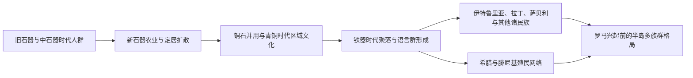

# 史前与意大利诸民族时期

## 时间

约前85万年-前8世纪

## 演变图

## 概括

意大利半岛的史前史不是某一民族连续发展的单线故事，而是冰期环境变化、地中海航行、跨阿尔卑斯迁徙与本地社群长期互动的结果。旧石器时代的人类活动遍及半岛，约前6000年以后农业和定居生活由亚得里亚海、南意大利逐步扩散；青铜时代形成区域性文化网络，铁器时代才出现可与后世伊特鲁里亚人、拉丁人、萨宾人、翁布里亚人、萨莫奈人、威尼托人等相联系的文化与语言格局。

## 分期与区域格局

| 阶段 | 大致时间 | 主要区域与文化 | 关键变化 |
|---|---|---|---|
| 旧石器时代 | 约前85万年-前1万年 | 半岛多处河谷、洞穴与海岸 | 早期人属、尼安德特人与后来的现代人先后活动；冰期海面变化反复改变海岸线。 |
| 中石器时代 | 约前1万年-前6000年 | 阿尔卑斯、亚平宁及沿海 | 气候转暖后，狩猎采集群体利用森林、河湖与海洋资源，聚落季节性增强。 |
| 新石器时代 | 约前6000年-前3500年 | 东南沿海先行，随后扩展到波河平原与中北部 | 农牧业、磨制石器、陶器和固定村落传播；并非完全替代本地人口，而是移民与文化吸收并行。 |
| 铜石并用时代 | 约前3500年-前2300年 | 北中意大利及岛屿 | 铜器、远距离交换、社会分化和武器随葬增多；钟形杯等跨欧洲网络进入半岛。 |
| 青铜时代 | 约前2300年-前950年 | 北部泰拉马雷、亚平宁文化、撒丁岛努拉吉文化等 | 防御聚落、畜牧迁徙、金属贸易与地区首领权力发展，爱琴海和中欧联系加强。 |
| 铁器时代早期 | 约前950年-前8世纪 | 维拉诺瓦、拉丁、埃斯特、皮切诺等文化区 | 铁器、火葬或土葬传统与原城市聚落形成，日后有文字记载的诸族群轮廓逐渐清晰。 |

## 社会演变机制

- **环境与交通**：阿尔卑斯山并非绝对屏障，山口连接中欧；亚平宁山脉促成山地畜牧与季节迁徙；漫长海岸又把半岛纳入亚得里亚海、爱琴海和西地中海交换圈。
- **农业扩散**：新石器化带来小麦、豆类、羊、山羊和牛等农牧组合，人口增长与固定村落扩大了土地、水源和防御组织的重要性。
- **金属与交换**：铜、锡、琥珀、黑曜石等物资的跨区流动，使少数社群控制贸易节点并形成更明显的等级差异。
- **区域分化**：波河平原、中部丘陵、南部沿海和撒丁岛的发展节奏不同，不能把一种考古文化直接等同于一个固定民族。
- **语言与人口互动**：前2千纪以后，印欧语支中的意大利语族逐渐扩散，但伊特鲁里亚语、雷蒂亚语等非印欧语言以及希腊语、腓尼基语后来仍共同存在。

## 重要事件与转折

1. 旧石器时代早期，半岛出现持续的人类活动遗迹；具体年代随遗址测年更新而调整。
2. 约前6000年，农牧业和陶器由南部、亚得里亚海沿岸向内陆与北部传播。
3. 前4千纪至前3千纪，铜器和远距离交换扩大，墓葬开始更明显地显示身份差异。
4. 前2千纪，泰拉马雷、亚平宁与努拉吉等区域文化成熟，半岛进入密集的青铜贸易网络。
5. 约前1200年前后，东地中海体系动荡影响意大利，但各地变化并不同步，部分聚落衰退，另一些中心重组。
6. 约前10-前9世纪，铁器使用、聚落集中和新的葬俗推动原城市中心成长。
7. 前9-前8世纪，维拉诺瓦文化在中北部发展；拉丁、萨宾、翁布里亚、萨莫奈、威尼托等群体逐渐进入可由语言、铭文和后世文献辨识的阶段。
8. 前8世纪起，腓尼基人与希腊殖民者加强西地中海活动，半岛史由史前阶段进入有文字记录的多文明竞争时代。

## 争议与辨析

- 考古文化是物质传统的分类，不必然等于单一“民族”；族群名称多来自较晚的希腊、罗马文献。
- “意大利诸民族”并非同时到达、边界固定的群体，而是在迁徙、通婚、战争、贸易和政治联盟中不断重组。
- 伊特鲁里亚人的起源不能用一次大规模东方迁徙简单解释；较稳妥的表述是当地铁器时代社群在长期区域与地中海互动中形成，其语言和文化来源仍有讨论。

## 演变关系

- 后一节点：[伊特鲁里亚与大希腊时期](/%E4%BA%BA%E6%96%87%E7%A7%91%E5%AD%A6/%E5%8E%86%E5%8F%B2/%E6%AC%A7%E6%B4%B2/%E6%84%8F%E5%A4%A7%E5%88%A9/%E4%BC%8A%E7%89%B9%E9%B2%81%E9%87%8C%E4%BA%9A%E4%B8%8E%E5%A4%A7%E5%B8%8C%E8%85%8A%E6%97%B6%E6%9C%9F.md)。
- 相关通史：[古希腊](/%E4%BA%BA%E6%96%87%E7%A7%91%E5%AD%A6/%E5%8E%86%E5%8F%B2/%E6%AC%A7%E6%B4%B2/_%E9%80%9A%E5%8F%B2/%E5%8F%A4%E5%B8%8C%E8%85%8A/README.md)、[古罗马](/%E4%BA%BA%E6%96%87%E7%A7%91%E5%AD%A6/%E5%8E%86%E5%8F%B2/%E6%AC%A7%E6%B4%B2/_%E9%80%9A%E5%8F%B2/%E5%8F%A4%E7%BD%97%E9%A9%AC/README.md)。
- 所属总览：[意大利历史](/%E4%BA%BA%E6%96%87%E7%A7%91%E5%AD%A6/%E5%8E%86%E5%8F%B2/%E6%AC%A7%E6%B4%B2/%E6%84%8F%E5%A4%A7%E5%88%A9/README.md)。
