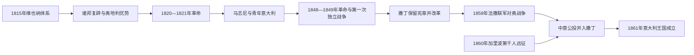

# 复辟与复兴运动时期

## 时间

1815年-1861年

## 别称

意大利复兴运动、Risorgimento、意大利统一运动

## 演变图

## 概括

维也纳会议恢复半岛诸王朝并强化奥地利影响，却无法抹去拿破仑时代的行政整合、平等法权和民族政治经验。1820、1831与1848年的起义先后暴露秘密社团、共和派和邦国君主各自的局限；1850年代以后，撒丁王国把宪政合法性、经济改革、法国联盟与战争结合起来，加里波第则以志愿军摧毁两西西里王国。1861年的统一因此是外交、王朝扩张、群众动员、战争与公投共同作用的结果，而非单一英雄完成。

## 王朝世系 / 统治结构

下表按各政体内部在位顺序列出1815-1861阶段的公认统治者；跨越本阶段的任期注明其后续。两西西里以前的诺曼、霍亨斯陶芬、安茹、阿拉贡与总督完整链见[南意大利与西西里统治者及总督表](/%E4%BA%BA%E6%96%87%E7%A7%91%E5%AD%A6/%E5%8E%86%E5%8F%B2/%E6%AC%A7%E6%B4%B2/%E6%84%8F%E5%A4%A7%E5%88%A9/%E5%8D%97%E6%84%8F%E5%A4%A7%E5%88%A9%E4%B8%8E%E8%A5%BF%E8%A5%BF%E9%87%8C%E7%BB%9F%E6%B2%BB%E8%80%85%E5%8F%8A%E6%80%BB%E7%9D%A3%E8%A1%A8.md)。撒丁王国之前的萨伏依伯爵、公爵和王号转换完整顺序见[萨伏依—撒丁王朝世系表](/%E4%BA%BA%E6%96%87%E7%A7%91%E5%AD%A6/%E5%8E%86%E5%8F%B2/%E6%AC%A7%E6%B4%B2/%E6%84%8F%E5%A4%A7%E5%88%A9/%E8%90%A8%E4%BC%8F%E4%BE%9D%E2%80%94%E6%92%92%E4%B8%81%E7%8E%8B%E6%9C%9D%E4%B8%96%E7%B3%BB%E8%A1%A8.md)。

| 政体 | 顺序 | 统治者 | 在位 / 实际统治 | 与前任关系及关键说明 |
|---|---:|---|---|---|
| 撒丁王国 | 1 | 维托里奥·埃马努埃莱一世 | 1802-1821；1814年复辟本土 | 萨伏依王朝；1821年革命中退位。 |
| 撒丁王国 | 2 | 卡洛·费利切 | 1821-1831 | 前王之弟；依靠奥地利镇压革命，无子嗣。 |
| 撒丁王国 | 3 | **卡洛·阿尔贝托** | 1831-1849 | 萨伏依—卡里尼亚诺支系；1848年颁《阿尔贝蒂诺宪章》，第一次独立战争败后退位。 |
| 撒丁王国 | 4 | **维托里奥·埃马努埃莱二世** | 1849-1861；其后为意大利国王 | 卡洛·阿尔贝托之子；保留宪章，与加富尔推进统一。 |
| 伦巴第—威尼西亚王国 | 1 | 弗朗茨一世 | 1815-1835 | 奥地利皇帝兼国王；由维也纳派总督治理。 |
| 伦巴第—威尼西亚王国 | 2 | 斐迪南一世 | 1835-1848 | 弗朗茨一世之子；1848年革命后退位。 |
| 伦巴第—威尼西亚王国 | 3 | 弗朗茨·约瑟夫一世 | 1848-1866 | 斐迪南之侄；1859年失伦巴第，1866年失威尼西亚。 |
| 两西西里王国 | 1 | 费迪南多一世 | 1816-1825 | 合并那不勒斯与西西里王号；1820年被迫接受宪法，随后借奥军恢复专制。 |
| 两西西里王国 | 2 | 弗朗切斯科一世 | 1825-1830 | 费迪南多一世之子；延续保守统治。 |
| 两西西里王国 | 3 | 费迪南多二世 | 1830-1859 | 弗朗切斯科一世之子；早期改革，1848年后严厉镇压。 |
| 两西西里王国 | 4 | 弗朗切斯科二世 | 1859-1861 | 费迪南多二世之子；加里波第远征与撒丁军进攻中失国。 |
| 托斯卡纳大公国 | 1 | 费迪南多三世 | 1790-1801、1814-1824 | 哈布斯堡—洛林家族；拿破仑后复位。 |
| 托斯卡纳大公国 | 2 | 利奥波多二世 | 1824-1859 | 费迪南多三世之子；1848年短暂立宪，1859年出走。 |
| 托斯卡纳大公国 | 3 | 费迪南多四世 | 1859-1860，名义 | 利奥波多二世之子；未能实际复位，托斯卡纳经公投并入撒丁。 |
| 帕尔马公国 | 1 | 玛丽亚·路易莎 | 1814/1815-1847 | 拿破仑前妻、奥地利公主；终身领有帕尔马。 |
| 帕尔马公国 | 2 | 卡洛二世 | 1847-1849 | 波旁—帕尔马家族；革命中退位。 |
| 帕尔马公国 | 3 | 卡洛三世 | 1849-1854 | 卡洛二世之子；遇刺身亡。 |
| 帕尔马公国 | 4 | 罗贝托一世 | 1854-1859/1860 | 卡洛三世幼子，由母亲路易丝·玛丽摄政；1859年出走，次年并入撒丁。 |
| 摩德纳与雷焦公国 | 1 | 弗朗切斯科四世 | 1814-1846 | 奥地利—埃斯特家族；镇压1821、1831年运动。 |
| 摩德纳与雷焦公国 | 2 | 弗朗切斯科五世 | 1846-1859 | 弗朗切斯科四世之子；1859年随奥军失败而出走。 |
| 卢卡公国 | 1 | 玛丽亚·路易莎 | 1815-1824 | 波旁—帕尔马家族；以终身安排获得卢卡。 |
| 卢卡公国 | 2 | 卡洛·路多维科 | 1824-1847 | 前任之子；1847年把卢卡让与托斯卡纳，后成为帕尔马的卡洛二世。 |
| 教皇国 | 1 | 庇护七世 | 1800-1823；1814年恢复世俗统治 | 拿破仑后返回罗马，重建教皇行政。 |
| 教皇国 | 2 | 利奥十二世 | 1823-1829 | 选举继任；推行保守宗教与行政政策。 |
| 教皇国 | 3 | 庇护八世 | 1829-1830 | 选举继任；任期短。 |
| 教皇国 | 4 | 格列高利十六世 | 1831-1846 | 在1831年动乱中即位，依赖奥地利干预维持秩序。 |
| 教皇国 | 5 | 庇护九世 | 1846-1878 | 初期改革引发自由派期待；1848年出走，后在法军保护下恢复，1860年失去大部分领地。 |

半岛还包括圣马力诺共和国等小型政体；它们不是君主制，故不列入王表。教皇国从形成到终结的完整公认教宗顺序另见[教皇国教宗世系表](/%E4%BA%BA%E6%96%87%E7%A7%91%E5%AD%A6/%E5%8E%86%E5%8F%B2/%E6%AC%A7%E6%B4%B2/%E6%84%8F%E5%A4%A7%E5%88%A9/%E6%95%99%E7%9A%87%E5%9B%BD%E6%95%99%E5%AE%97%E4%B8%96%E7%B3%BB%E8%A1%A8.md)。

## 复辟秩序与反对力量

维也纳体系把伦巴第—威尼西亚直接交给奥地利，并通过哈布斯堡亲族统治托斯卡纳、摩德纳等地；两西西里、教皇国和撒丁王国恢复旧王朝。奥地利驻军和条约同盟成为秩序保障。与此同时，拿破仑法制、官僚、道路和统一市场经验仍在，地方精英不愿完全恢复封建割裂。

烧炭党等秘密社团最初要求宪法与驱逐外国势力，组织却分散且缺乏公开群众基础。马志尼1831年创建“青年意大利”，把目标明确为统一、独立的共和国；其起义多失败，却塑造跨邦民族语言。温和自由派则设想教皇联盟或萨伏依王朝领导的君主统一。

## 从革命失败到王朝统一

1848年革命迫使多个统治者颁宪，米兰和威尼斯反抗奥地利，卡洛·阿尔贝托发动第一次独立战争。撒丁军于库斯托扎、诺瓦拉失败，诸邦宪法多被撤销，罗马共和国也被法国军队推翻。失败说明仅靠同时起义、缺乏统一军令和外援难以战胜奥地利。

撒丁王国却保留《阿尔贝蒂诺宪章》。加富尔任首相后推动铁路、贸易和财政改革，参加克里米亚战争以进入大国外交。1858年普隆比耶尔会谈换取拿破仑三世支持；1859年战争取得伦巴第，中意诸邦临时政府再经公投并入撒丁。1860年加里波第“千人远征”夺取西西里和那不勒斯，维托里奥·埃马努埃莱二世的军队同时越过教皇领地，防止南部形成独立革命政权。公投与特阿诺会师把南部交给萨伏依王朝。

## 重要事件

1. 1815年，维也纳会议恢复意大利诸邦并确立奥地利优势。
2. 1820-1821年，那不勒斯、皮埃蒙特革命要求宪法，遭奥地利干预镇压。
3. 1831年，中意公国和教皇领地起义失败；马志尼随后创建“青年意大利”。
4. 1846年，庇护九世早期改革引发意大利自由派期待。
5. 1848年，西西里革命、米兰“五日”、威尼斯共和国复兴与诸邦立宪同时发生。
6. 1848-1849年，第一次独立战争以撒丁失败结束；卡洛·阿尔贝托退位。
7. 1849年，马志尼、萨菲、阿尔梅利尼领导罗马共和国，后被法军推翻。
8. 1852年，加富尔成为撒丁王国首相，国家建设与外交统一路线成形。
9. 1855年，撒丁参加克里米亚战争；1856年在巴黎和会上提出意大利问题。
10. 1858年，普隆比耶尔密约奠定法撒联手对奥战略。
11. 1859年，第二次独立战争后撒丁取得伦巴第；中意多地驱逐旧君主。
12. 1860年，中意公投并入撒丁；加里波第千人远征推翻两西西里王国。
13. 1860年10月，特阿诺会面象征加里波第把南部交给维托里奥·埃马努埃莱二世。
14. 1861年3月17日，意大利王国宣告成立。

## 统一成功的条件与局限

成功来自撒丁的宪政声誉、较有效官僚与军队、皮埃蒙特经济基础、法国军事介入、奥地利外交孤立、民族社团长期宣传和加里波第的群众动员。直接触发是1859年法撒战争与1860年南部王国军事崩溃。

统一仍不完整：威尼西亚到1866年才并入，罗马到1870年才成为王国领土；南部并吞后爆发大规模反抗与“匪患”战争。新国家沿用撒丁宪法、王号编号与中央机构，显示1861年既是民族统一，也是萨伏依王国的领土扩张。

## 演变关系

- 前一节点：[拿破仑意大利时期](/%E4%BA%BA%E6%96%87%E7%A7%91%E5%AD%A6/%E5%8E%86%E5%8F%B2/%E6%AC%A7%E6%B4%B2/%E6%84%8F%E5%A4%A7%E5%88%A9/%E6%8B%BF%E7%A0%B4%E4%BB%91%E6%84%8F%E5%A4%A7%E5%88%A9%E6%97%B6%E6%9C%9F.md)。
- 后一节点：[意大利王国自由主义时期](/%E4%BA%BA%E6%96%87%E7%A7%91%E5%AD%A6/%E5%8E%86%E5%8F%B2/%E6%AC%A7%E6%B4%B2/%E6%84%8F%E5%A4%A7%E5%88%A9/%E6%84%8F%E5%A4%A7%E5%88%A9%E7%8E%8B%E5%9B%BD%E8%87%AA%E7%94%B1%E4%B8%BB%E4%B9%89%E6%97%B6%E6%9C%9F.md)。
- 王国完整领导表：[意大利王国君主与政府首脑表](/%E4%BA%BA%E6%96%87%E7%A7%91%E5%AD%A6/%E5%8E%86%E5%8F%B2/%E6%AC%A7%E6%B4%B2/%E6%84%8F%E5%A4%A7%E5%88%A9/%E6%84%8F%E5%A4%A7%E5%88%A9%E7%8E%8B%E5%9B%BD%E5%90%9B%E4%B8%BB%E4%B8%8E%E6%94%BF%E5%BA%9C%E9%A6%96%E8%84%91%E8%A1%A8.md)。
- 所属总览：[意大利历史](/%E4%BA%BA%E6%96%87%E7%A7%91%E5%AD%A6/%E5%8E%86%E5%8F%B2/%E6%AC%A7%E6%B4%B2/%E6%84%8F%E5%A4%A7%E5%88%A9/README.md)。
