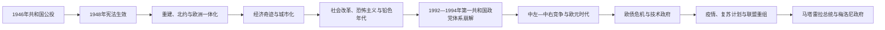

# 意大利共和国

## 时间

1946年至今（核验截至2026年7月14日）

## 别称

战后意大利、Italian Republic

## 演变图

## 概括

1946年公投废除君主制，制宪会议建立议会共和国。意大利在战后重建、经济奇迹和欧洲一体化中成为工业化民主国家，也经历冷战党争、恐怖主义、黑手党暴力、系统性腐败调查、欧元与债务危机、移民和人口老龄化。政党体系在1990年代重构，此后联盟更迭频繁，但宪法机关、两院议会、总统调解和欧洲制度共同维持政体连续性。

## 国家元首与政府首脑

完整12位总统、重要代行元首及全部45段连续总理任期见[意大利共和国总统与政府首脑表](/%E4%BA%BA%E6%96%87%E7%A7%91%E5%AD%A6/%E5%8E%86%E5%8F%B2/%E6%AC%A7%E6%B4%B2/%E6%84%8F%E5%A4%A7%E5%88%A9/%E6%84%8F%E5%A4%A7%E5%88%A9%E5%85%B1%E5%92%8C%E5%9B%BD%E6%80%BB%E7%BB%9F%E4%B8%8E%E6%94%BF%E5%BA%9C%E9%A6%96%E8%84%91%E8%A1%A8.md)。本页只保留制度与当前权力结构。

### 宪法结构

| 机构 | 产生方式 | 核心权力 | 实际制衡 |
|---|---|---|---|
| 共和国总统 | 议会两院联席会议及地区代表选举，任期七年 | 任命总理、公布法律、统帅武装力量名义职能、在条件具备时解散议会 | 多数日常政策由政府负责；在组阁、议会僵局和危机时期影响显著。 |
| 部长会议主席与内阁 | 总统任命，总理提名部长；必须获两院信任 | 领导政府、协调部长、提出预算和法案、执行欧盟与外交政策 | 联合政党、议会两院、总统、法院和地区共同制约。 |
| 众议院与共和国参议院 | 普选产生 | 两院权力基本对等，均可立法并决定政府信任 | “完全两院制”提高代表性，也可能延长立法与组阁。 |
| 宪法法院与普通司法 | 依宪法分别产生和组织 | 宪法审查、司法独立、追究公职犯罪 | 法官政治责任、司法改革与审判效率长期存在争论。 |
| 地区与地方政府 | 普选议会和行政首长 | 医疗、交通、区域规划等广泛事务；五个特别自治地区权限更大 | 财政依赖和南北能力差异限制均衡。 |
| 欧洲联盟层级 | 条约与欧盟机构 | 共同市场、欧元、预算和监管框架 | 国内政策受共同规则约束，意大利也参与制定欧盟决策。 |

### 截至核验日的主要在任者

| 职位 | 人物 | 任期起点 | 说明 |
|---|---|---|---|
| 共和国总统 | **塞尔焦·马塔雷拉** | 2015年2月3日；2022年2月3日开始第二任期 | 国家元首。 |
| 部长会议主席 | **乔治娅·梅洛尼** | 2022年10月22日 | 右翼联盟政府首脑，意大利首位女性总理。 |
| 参议院议长 | 伊尼亚齐奥·拉鲁萨 | 2022年10月13日 | 总统不能履职时的宪法代行顺位。 |
| 众议院议长 | 洛伦佐·丰塔纳 | 2022年10月14日 | 主持众议院。 |

## 分阶段发展

1. **过渡、制宪与重建（1945-1948）**：反法西斯诸党联合，公投与制宪会议确立共和国；冷战开始后共产党、社会党退出中央政府。
2. **中间派统治与西方结盟（1948-1963）**：天主教民主党居核心，意大利加入北约、欧洲煤钢共同体和欧洲经济共同体；马歇尔援助与国内投资支持恢复。
3. **经济奇迹与中左改革（1950年代后期-1968）**：工业三角、汽车和家电扩张，大量南方人口迁往北部城市；学校、养老金、国有企业和基础设施扩展。
4. **社会运动与“铅色年代”（1968-1982）**：学生运动、“热秋”罢工、极右爆炸和极左绑架交织，国家同时推进工人权利、离婚和地区制度。
5. **五党联盟与债务累积（1980年代）**：社会消费与政治世俗化增强，天民党不再垄断总理职位；公共债务、政党融资和庇护网络扩大。
6. **第一共和国危机（1992-1994）**：“净手运动”、里拉危机、黑手党刺杀和选举制度改变使传统政党解体。
7. **中右—中左竞争（1994-2011）**：贝卢斯科尼联盟与中左联盟交替，政党个人化和媒体权力成为争议；意大利进入欧元区。
8. **欧债危机与多重联盟（2011-2018）**：技术政府、紧缩和劳工改革后，传统左右阵营进一步碎片化。
9. **民粹联盟、疫情与广泛政府（2018-2022）**：五星运动先后同联盟党、民主党组阁；2020年疫情重创医疗和经济，德拉吉政府推进欧盟复苏计划。
10. **梅洛尼政府时期（2022年至核验日）**：意大利兄弟党领导右翼联盟，延续欧盟与北约框架，同时围绕移民、司法、地区自治、经济和制度改革展开竞争。

## 重要事件

1. 1946年6月2日，男性与女性公民在全国公投中选择共和国，并同时选举制宪会议。
2. 1947年《巴黎和约》处理战后边界与殖民地；1948年1月1日共和国宪法生效。
3. 1948年大选确立天主教民主党主导，冷战阵营分化固定。
4. 1949年意大利加入北约；1951年参与建立欧洲煤钢共同体。
5. 1957年在罗马签署建立欧洲经济共同体与原子能共同体的条约。
6. 1950年代后期至1960年代，“经济奇迹”推动工业化、城市化和大众消费，也扩大无序城市增长和区域差距。
7. 1968年学生运动与1969年“热秋”工潮推动教育、劳动与社会关系改变。
8. 1969年丰塔纳广场爆炸开启持续多年的政治恐怖；1978年红色旅绑架并杀害阿尔多·莫罗。
9. 1970年普通地区制度正式运行；1974年公投维持离婚法，显示社会世俗化。
10. 1980年博洛尼亚车站爆炸造成重大伤亡；国家随后逐步压制主要恐怖组织。
11. 1981年P2秘密组织名册曝光，揭示政商、军警和媒体关系的阴影。
12. 1992年“净手运动”调查系统性政党融资；同年法尔科内、博尔塞利诺两位反黑手党法官遇刺，国家加强反黑手党行动。
13. 1993年选举制度转向带多数制成分；1994年贝卢斯科尼组阁，旧党体系被新联盟取代。
14. 1999年意大利成为欧元创始成员之一，2002年欧元现金启用。
15. 2008年全球金融危机和2011年主权债务压力导致贝卢斯科尼辞职、蒙蒂技术政府成立。
16. 2016年修宪公投失败，伦齐辞职；制度改革再次显示需要广泛共识。
17. 2018年五星运动与联盟党组阁，打破传统中右—中左轮替。
18. 2020年意大利成为欧洲最早遭受新冠疫情重创的国家之一，实施全国限制并扩充医疗、财政支持。
19. 2021年德拉吉领导广泛联合政府，执行欧盟“下一代欧盟”复苏资金计划。
20. 2022年大选后乔治娅·梅洛尼组阁；截至2026年7月14日，该政府仍在任。

## 战后崛起条件

战后恢复受益于美国援助、欧洲市场、低起点投资需求、充足劳动力、国家控股企业、家族型中小企业和出口制造。共同市场使意大利北部工业融入欧洲供应链；基础教育、医疗和社会保障提高生活水平。天主教民主党、共产党、工会和企业协会虽竞争激烈，却在反法西斯宪法与议会程序内组织大众政治。

## 长期结构问题与韧性

- **区域差异**：南部基础设施、就业和行政能力总体弱于中北部，反黑手党治理与发展政策成效不均。
- **财政与人口**：高公共债务、低生产率增长、老龄化和青年外流限制政策空间。
- **政治机制**：比例代表、联盟政党和两院对等信任制容易产生短命政府；总统和技术型内阁常在危机中承担调解。
- **社会转型**：移民使意大利从人口输出国转为移入国，公民身份、边境治理与劳动力整合成为持续议题。
- **制度韧性**：尽管政府频繁更替，宪法法院、司法、地方自治、欧盟规则和定期选举维持了共和国连续性；这与法西斯时期权力集中形成根本区别。

## 演变关系

- 前一节点：[法西斯统治与第二次世界大战时期](/%E4%BA%BA%E6%96%87%E7%A7%91%E5%AD%A6/%E5%8E%86%E5%8F%B2/%E6%AC%A7%E6%B4%B2/%E6%84%8F%E5%A4%A7%E5%88%A9/%E6%B3%95%E8%A5%BF%E6%96%AF%E7%BB%9F%E6%B2%BB%E4%B8%8E%E7%AC%AC%E4%BA%8C%E6%AC%A1%E4%B8%96%E7%95%8C%E5%A4%A7%E6%88%98%E6%97%B6%E6%9C%9F.md)。
- 领导专表：[意大利共和国总统与政府首脑表](/%E4%BA%BA%E6%96%87%E7%A7%91%E5%AD%A6/%E5%8E%86%E5%8F%B2/%E6%AC%A7%E6%B4%B2/%E6%84%8F%E5%A4%A7%E5%88%A9/%E6%84%8F%E5%A4%A7%E5%88%A9%E5%85%B1%E5%92%8C%E5%9B%BD%E6%80%BB%E7%BB%9F%E4%B8%8E%E6%94%BF%E5%BA%9C%E9%A6%96%E8%84%91%E8%A1%A8.md)。
- 所属总览：[意大利历史](/%E4%BA%BA%E6%96%87%E7%A7%91%E5%AD%A6/%E5%8E%86%E5%8F%B2/%E6%AC%A7%E6%B4%B2/%E6%84%8F%E5%A4%A7%E5%88%A9/README.md)。
