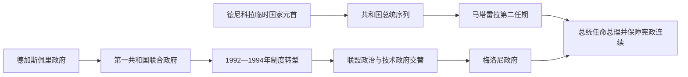

# 意大利共和国总统与政府首脑表

## 时间

1946年至今（核验截至2026年7月14日）

## 演变图

## 概括

意大利共和国是议会共和制。总统由议会两院联席会议及地区代表选举，任期七年，承担国家元首、任命总理、公布法律和在宪法条件下解散议会等职责；部长会议主席即总理，必须同内阁共同取得两院信任。本表分别维护完整总统序列、重要宪法代行和全部政府首脑的连续任期。

## 共和国总统完整表

| 顺序 | 总统 / 国家元首 | 任期 | 生卒 | 产生与继承 | 关键事件 / 备注 |
|---:|---|---|---|---|---|
| 1 | **恩里科·德尼科拉** | 1946年6月28日-1948年5月11日 | 1877-1959 | 制宪会议选为临时国家元首；1948年1月1日起依宪法过渡条款行使总统职务 | 主持君主制向共和国过渡。 |
| 2 | 路易吉·埃伊纳乌迪 | 1948年5月12日-1955年5月11日 | 1874-1961 | 首位按宪法程序选出的总统 | 战后重建、稳定财政和西方结盟时期。 |
| 3 | 乔瓦尼·格隆基 | 1955年5月11日-1962年5月11日 | 1887-1978 | 议会选举 | 经济奇迹与中左开放的探索阶段。 |
| 4 | 安东尼奥·塞尼 | 1962年5月11日-1964年12月6日 | 1891-1972 | 议会选举 | 1964年病重，后辞职；其间由参议院议长代行。 |
| 5 | 朱塞佩·萨拉盖特 | 1964年12月29日-1971年12月29日 | 1898-1988 | 议会选举 | 中左政府与社会冲突扩大的时期。 |
| 6 | 乔瓦尼·莱昂内 | 1971年12月29日-1978年6月15日 | 1908-2001 | 议会选举 | “铅色年代”与莫罗遇害后，在政治压力下提前辞职。 |
| 7 | **桑德罗·佩尔蒂尼** | 1978年7月9日-1985年6月29日 | 1896-1990 | 议会选举 | 反法西斯象征，强化总统的公共道德权威。 |
| 8 | 弗朗切斯科·科西加 | 1985年7月3日-1992年4月28日 | 1928-2010 | 议会选举 | 冷战终结和政党体系危机前夜；提前辞职。 |
| 9 | 奥斯卡·路易吉·斯卡尔法罗 | 1992年5月28日-1999年5月15日 | 1918-2012 | 议会选举 | “净手运动”、黑手党袭击与政府体系重组时期。 |
| 10 | 卡洛·阿泽利奥·钱皮 | 1999年5月18日-2006年5月15日 | 1920-2016 | 议会选举 | 欧元启用并强调共和与欧洲认同。 |
| 11 | **乔治·纳波利塔诺** | 2006年5月15日-2015年1月14日 | 1925-2023 | 2006年当选，2013年成为首位连任总统，后辞职 | 金融与欧债危机、多次政府重组。 |
| 12 | **塞尔焦·马塔雷拉** | 2015年2月3日至今 | 1941- | 2015年当选，2022年连任 | 应对政府危机、疫情和欧洲安全环境变化；截至核验日仍在任。 |

## 重要宪法代行

总统辞职、病重或职位暂缺时，参议院议长依宪法代行。以下列职位长期空缺或总统无法履职的主要情况，不把总统出访期间的短期代行列入正式总统序号。

| 代行者 | 时间 | 原职务 | 原因 |
|---|---|---|---|
| 切萨雷·梅尔扎戈拉 | 1964年8月10日-12月29日 | 参议院议长 | 塞尼病重及随后辞职。 |
| 阿明托雷·范范尼 | 1978年6月15日-7月8日 | 参议院议长 | 莱昂内辞职至佩尔蒂尼就职。 |
| 弗朗切斯科·科西加 | 1985年6月29日-7月3日 | 参议院议长、已当选下任总统 | 佩尔蒂尼提前辞职至本人宣誓。 |
| 乔瓦尼·斯帕多利尼 | 1992年4月28日-5月28日 | 参议院议长 | 科西加辞职至斯卡尔法罗就职。 |
| 尼科拉·曼奇诺 | 1999年5月15日-5月18日 | 参议院议长 | 斯卡尔法罗卸任至钱皮就职。 |
| 彼得罗·格拉索 | 2015年1月14日-2月3日 | 参议院议长 | 纳波利塔诺辞职至马塔雷拉就职。 |

## 政府首脑完整表

同一总理连续领导多届内阁时合并为一段；非连续任职分别列出。首届德加斯佩里任期开始于王国，表中保留其跨制度连续性。

| 顺序 | 部长会议主席 / 总理 | 连续任期 | 政治阶段 / 关键说明 |
|---:|---|---|---|
| 1 | **阿尔契德·德加斯佩里** | 1945年12月10日-1953年8月17日 | 主持共和国建立、重建、马歇尔计划、北约与欧洲共同体起步。 |
| 2 | 朱塞佩·佩拉 | 1953年8月17日-1954年1月18日 | 技术与中间派过渡。 |
| 3 | 阿明托雷·范范尼 | 1954年1月18日-2月10日 | 首次短期任职。 |
| 4 | 马里奥·谢尔巴 | 1954年2月10日-1955年7月6日 | 中间派政府，冷战治安政治。 |
| 5 | 安东尼奥·塞尼 | 1955年7月6日-1957年5月19日 | 首次任职。 |
| 6 | 阿多内·佐利 | 1957年5月19日-1958年7月1日 | 罗马条约签署后的过渡。 |
| 7 | 阿明托雷·范范尼 | 1958年7月1日-1959年2月15日 | 第二段任职。 |
| 8 | 安东尼奥·塞尼 | 1959年2月15日-1960年3月25日 | 第二段任职。 |
| 9 | 费尔南多·坦布罗尼 | 1960年3月25日-7月26日 | 依靠新法西斯议员支持，引发抗议后辞职。 |
| 10 | 阿明托雷·范范尼 | 1960年7月26日-1963年6月21日 | 第三段任职，为有机中左联盟铺路。 |
| 11 | 乔瓦尼·莱昂内 | 1963年6月21日-12月4日 | 首次看守式政府。 |
| 12 | **阿尔多·莫罗** | 1963年12月4日-1968年6月24日 | 中左联合、社会改革和经济转型。 |
| 13 | 乔瓦尼·莱昂内 | 1968年6月24日-12月12日 | 第二次过渡政府。 |
| 14 | 马里亚诺·鲁莫尔 | 1968年12月12日-1970年8月6日 | 学生、工人运动与恐怖主义开端。 |
| 15 | 埃米利奥·科隆博 | 1970年8月6日-1972年2月17日 | 中左联盟与经济压力。 |
| 16 | 朱利奥·安德烈奥蒂 | 1972年2月17日-1973年7月7日 | 首段任职，中间偏右重组。 |
| 17 | 马里亚诺·鲁莫尔 | 1973年7月7日-1974年11月23日 | 第二段任职，石油危机。 |
| 18 | 阿尔多·莫罗 | 1974年11月23日-1976年7月29日 | 第二段任职，寻求更广政治合作。 |
| 19 | 朱利奥·安德烈奥蒂 | 1976年7月29日-1979年8月4日 | “民族团结”与共产党外部支持；莫罗遇害。 |
| 20 | 弗朗切斯科·科西加 | 1979年8月4日-1980年10月18日 | 两届内阁，恐怖主义与博洛尼亚爆炸时期。 |
| 21 | 阿纳尔多·福拉尼 | 1980年10月18日-1981年6月28日 | P2秘密组织丑闻后辞职。 |
| 22 | 乔瓦尼·斯帕多利尼 | 1981年6月28日-1982年12月1日 | 首位非天民党总理，五党联盟形成。 |
| 23 | 阿明托雷·范范尼 | 1982年12月1日-1983年8月4日 | 第四段任职。 |
| 24 | **贝蒂诺·克拉克西** | 1983年8月4日-1987年4月17日 | 首位社会党总理，任期较长。 |
| 25 | 阿明托雷·范范尼 | 1987年4月17日-7月28日 | 第五段短期任职。 |
| 26 | 乔瓦尼·戈里亚 | 1987年7月28日-1988年4月13日 | 五党联盟政府。 |
| 27 | 奇里亚科·德米塔 | 1988年4月13日-1989年7月22日 | 天民党领导的联合政府。 |
| 28 | 朱利奥·安德烈奥蒂 | 1989年7月22日-1992年6月28日 | 冷战结束、欧洲联盟谈判和第一共和国危机。 |
| 29 | 朱利亚诺·阿马托 | 1992年6月28日-1993年4月28日 | 金融危机、紧缩和“净手运动”。 |
| 30 | 卡洛·阿泽利奥·钱皮 | 1993年4月28日-1994年5月10日 | 前央行行长，技术—跨党派政府。 |
| 31 | 西尔维奥·贝卢斯科尼 | 1994年5月10日-1995年1月17日 | 首次中右政府，第二共和国党系开启。 |
| 32 | 兰贝托·迪尼 | 1995年1月17日-1996年5月17日 | 技术政府，养老金改革。 |
| 33 | 罗马诺·普罗迪 | 1996年5月17日-1998年10月21日 | 首次中左政府，推动进入欧元。 |
| 34 | 马西莫·达莱马 | 1998年10月21日-2000年4月25日 | 两届中左内阁，科索沃战争时期。 |
| 35 | 朱利亚诺·阿马托 | 2000年4月25日-2001年6月11日 | 第二段任职。 |
| 36 | 西尔维奥·贝卢斯科尼 | 2001年6月11日-2006年5月17日 | 第二段任职，连续两届中右内阁。 |
| 37 | 罗马诺·普罗迪 | 2006年5月17日-2008年5月8日 | 第二段中左政府，参议院多数脆弱。 |
| 38 | 西尔维奥·贝卢斯科尼 | 2008年5月8日-2011年11月16日 | 第三段任职，金融与欧债危机中辞职。 |
| 39 | 马里奥·蒙蒂 | 2011年11月16日-2013年4月28日 | 技术政府，财政与养老金紧缩改革。 |
| 40 | 恩里科·莱塔 | 2013年4月28日-2014年2月22日 | 大联合政府。 |
| 41 | 马泰奥·伦齐 | 2014年2月22日-2016年12月12日 | 劳工与制度改革；修宪公投失败后辞职。 |
| 42 | 保罗·真蒂洛尼 | 2016年12月12日-2018年6月1日 | 中左过渡与银行、移民议题。 |
| 43 | 朱塞佩·孔特 | 2018年6月1日-2021年2月13日 | 先后领导五星运动—联盟党、五星运动—民主党两种联盟；应对疫情初期。 |
| 44 | 马里奥·德拉吉 | 2021年2月13日-2022年10月22日 | 广泛联合政府，执行欧盟复苏计划。 |
| 45 | **乔治娅·梅洛尼** | 2022年10月22日至今 | 右翼联盟政府；意大利首位女性总理，截至核验日仍在任。 |

## 现任领导核验

截至2026年7月14日：

- 共和国总统：塞尔焦·马塔雷拉，第二任期。
- 部长会议主席：乔治娅·梅洛尼，自2022年10月22日起在任。

## 双向链接

- 历史过程与制度分期：[意大利共和国](/%E4%BA%BA%E6%96%87%E7%A7%91%E5%AD%A6/%E5%8E%86%E5%8F%B2/%E6%AC%A7%E6%B4%B2/%E6%84%8F%E5%A4%A7%E5%88%A9/%E6%84%8F%E5%A4%A7%E5%88%A9%E5%85%B1%E5%92%8C%E5%9B%BD.md)。
- 前一政体：[法西斯统治与第二次世界大战时期](/%E4%BA%BA%E6%96%87%E7%A7%91%E5%AD%A6/%E5%8E%86%E5%8F%B2/%E6%AC%A7%E6%B4%B2/%E6%84%8F%E5%A4%A7%E5%88%A9/%E6%B3%95%E8%A5%BF%E6%96%AF%E7%BB%9F%E6%B2%BB%E4%B8%8E%E7%AC%AC%E4%BA%8C%E6%AC%A1%E4%B8%96%E7%95%8C%E5%A4%A7%E6%88%98%E6%97%B6%E6%9C%9F.md)。
- 所属总览：[意大利历史](/%E4%BA%BA%E6%96%87%E7%A7%91%E5%AD%A6/%E5%8E%86%E5%8F%B2/%E6%AC%A7%E6%B4%B2/%E6%84%8F%E5%A4%A7%E5%88%A9/README.md)。
