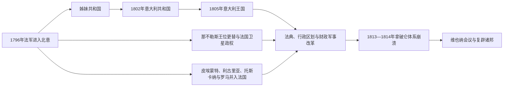

# 拿破仑意大利时期

## 时间

1796年-1815年

## 别称

法国革命与拿破仑统治下的意大利

## 演变图

## 概括

1796年起，法国军队击败撒丁和奥地利，把半岛重组为姊妹共和国、法国直属省、意大利王国和那不勒斯王国。改革废除许多封建与身份特权，引入法典、统一行政和世俗化，却伴随征税、征兵、艺术品征集及对法国战争的服从。旧邦边界被大幅简化，“意大利”作为行政和政治共同体更具体，但民族主义也在反法抵抗与亲法改革两端同时成长。

## 政权与完整短统治序列

那不勒斯与西西里在法国占领、波旁留岛和缪拉统治下的分叉见[南意大利与西西里统治者及总督表](/%E4%BA%BA%E6%96%87%E7%A7%91%E5%AD%A6/%E5%8E%86%E5%8F%B2/%E6%AC%A7%E6%B4%B2/%E6%84%8F%E5%A4%A7%E5%88%A9/%E5%8D%97%E6%84%8F%E5%A4%A7%E5%88%A9%E4%B8%8E%E8%A5%BF%E8%A5%BF%E9%87%8C%E7%BB%9F%E6%B2%BB%E8%80%85%E5%8F%8A%E6%80%BB%E7%9D%A3%E8%A1%A8.md)。拿破仑入侵前米兰从公国到外国总督的连续权力链见[米兰公国统治者与总督表](/%E4%BA%BA%E6%96%87%E7%A7%91%E5%AD%A6/%E5%8E%86%E5%8F%B2/%E6%AC%A7%E6%B4%B2/%E6%84%8F%E5%A4%A7%E5%88%A9/%E7%B1%B3%E5%85%B0%E5%85%AC%E5%9B%BD%E7%BB%9F%E6%B2%BB%E8%80%85%E4%B8%8E%E6%80%BB%E7%9D%A3%E8%A1%A8.md)。

| 政权 | 时间 | 国家元首 / 实际统治者 | 政府与说明 |
|---|---|---|---|
| 奇斯帕达纳共和国 | 1796-1797 | 集体共和国机构，受法国军方支配 | 摩德纳、雷焦、博洛尼亚等地组成，采用绿白红旗；后并入奇萨尔皮纳共和国。 |
| 奇萨尔皮纳共和国 | 1797-1799、1800-1802 | 五人督政府等共和机构；法国军事保护 | 伦巴第及北意多地组成，1799年被奥俄军推翻，1800年法国胜利后恢复。 |
| 利古里亚共和国 | 1797-1805 | 执政委员会 / 总督制共和国，法国影响决定性 | 取代热那亚旧贵族共和国，1805年并入法国。 |
| 罗马共和国 | 1798-1799 | 执政官式集体政府，法国驻军掌握安全 | 教皇庇护六世被逐，反法军进入后崩溃。 |
| 帕特诺佩共和国 | 1799年1-6月 | 临时共和政府，依赖法国军队 | 在那不勒斯建立；法军撤退后遭保王军镇压。 |
| 意大利共和国 | 1802-1805 | **拿破仑·波拿巴任总统**；弗朗切斯科·梅尔齐·德里尔任副总统 | 以米兰为中心，建立国务机构和集中行政。 |
| 意大利王国 | 1805-1814 | **拿破仑一世任国王**；欧仁·德·博阿尔内任副王 | 采用《拿破仑法典》和省—县体系，为法国战争提供军队与财政。 |
| 那不勒斯王国 | 1806-1808 | **约瑟夫·波拿巴** | 法军推翻大陆波旁统治，废除封建制度；波旁王室仍控制西西里。 |
| 那不勒斯王国 | 1808-1815 | **若阿尚·缪拉** | 继约瑟夫为王，继续行政与军事改革；1814年转向盟国，1815年再支持拿破仑后败亡。 |
| 法国直属省 | 1802/1805-1814 | 法国皇帝拿破仑；巴黎任命省长 | 皮埃蒙特、利古里亚、托斯卡纳、帕尔马及罗马等先后并入法国。 |
| 西西里波旁政权 | 1799-1815 | 费迪南多三世（那不勒斯称费迪南多四世） | 在英国海军保护下保有西西里，1812年被迫接受宪法；1815年恢复大陆。 |

## 军事征服与国家重组

拿破仑在1796年利用机动作战分割撒丁与奥地利军队，迫使撒丁停战后沿波河东进。亲法精英建立共和国，却在土地、宗教、征兵和法国征收问题上与乡村社会发生冲突。1799年法军因第二次反法同盟撤退，多数共和国迅速垮台；1800年马伦哥战役后法国重新控制北意。

1802年以后，共和外壳逐渐转为拿破仑个人统治。1805年意大利王国建立，法国又直接吞并西北与中部大片地区；南部由波拿巴家族和缪拉统治，西西里仍由波旁家族与英国控制。因此所谓“拿破仑意大利”从未是统一国家。

## 改革与社会影响

- 废除或削弱封建领主司法、行会壁垒和部分教会特权，出售修道院财产。
- 推行《拿破仑法典》、民事登记、度量衡改革和较统一的法院体系。
- 以省、县、市镇组织行政，职业官僚、警察和征税能力增强。
- 修筑道路、改善地籍和公共卫生，但财政目标首先服务战争。
- 征兵让数十万意大利人进入跨欧洲军队，也造成逃亡、反抗和人口损失。
- 本地官员在新制度中积累经验，复辟后即使王朝回归，也难完全恢复1796年前的治理方式。

## 重要事件

1. 1796年4月，拿破仑发动第一次意大利战役，迫使撒丁停战并击败奥地利。
2. 1797年，奇萨尔皮纳共和国建立；《坎波福尔米奥条约》把威尼斯领地在法国与奥地利之间瓜分。
3. 1798年，法军占领罗马并建立罗马共和国。
4. 1799年，帕特诺佩共和国在那不勒斯短暂成立；奥俄反攻和本地保王运动使意大利诸共和国覆亡。
5. 1800年，马伦哥战役后法国重新掌控北意。
6. 1802年，奇萨尔皮纳共和国改为意大利共和国，拿破仑任总统。
7. 1805年，拿破仑在米兰加冕为意大利国王；利古里亚并入法国。
8. 1806年，法国占领那不勒斯大陆，约瑟夫·波拿巴即位并启动废封建改革。
9. 1808年，缪拉成为那不勒斯国王；1809年教皇国大部并入法国，庇护七世被拘。
10. 1812年，意大利军队随拿破仑远征俄国并遭受重大损失。
11. 1813-1814年，奥地利与反法同盟进入意大利，意大利王国瓦解，欧仁副王投降。
12. 1815年，缪拉发布里米尼宣言试图号召意大利人支持其王位，随后在托伦蒂诺战败并被处决。
13. 1814-1815年，维也纳会议恢复多数旧王朝，但没有完全逆转行政和法律遗产。

## 崛起、统治危机与终结

拿破仑体系崛起依赖法国革命军的高动员、北意本地改革派合作和奥地利防线失败。其稳定来自集中官僚、法典与军事保护，困境则是缺乏自主外交、税役沉重、教会冲突和城乡政治参与有限。1812年俄国远征损失与第六次反法同盟形成是结构转折；1813-1814年奥军推进、地方精英转向和法国本土失败直接终结北意王国。缪拉1815年的再次转向和军事失败结束南意拿破仑政权。

## 演变关系

- 前一节点：[西班牙与奥地利支配时期](/%E4%BA%BA%E6%96%87%E7%A7%91%E5%AD%A6/%E5%8E%86%E5%8F%B2/%E6%AC%A7%E6%B4%B2/%E6%84%8F%E5%A4%A7%E5%88%A9/%E8%A5%BF%E7%8F%AD%E7%89%99%E4%B8%8E%E5%A5%A5%E5%9C%B0%E5%88%A9%E6%94%AF%E9%85%8D%E6%97%B6%E6%9C%9F.md)。
- 后一节点：[复辟与复兴运动时期](/%E4%BA%BA%E6%96%87%E7%A7%91%E5%AD%A6/%E5%8E%86%E5%8F%B2/%E6%AC%A7%E6%B4%B2/%E6%84%8F%E5%A4%A7%E5%88%A9/%E5%A4%8D%E8%BE%9F%E4%B8%8E%E5%A4%8D%E5%85%B4%E8%BF%90%E5%8A%A8%E6%97%B6%E6%9C%9F.md)。
- 对读：[法兰西第一帝国](/%E4%BA%BA%E6%96%87%E7%A7%91%E5%AD%A6/%E5%8E%86%E5%8F%B2/%E6%AC%A7%E6%B4%B2/%E6%B3%95%E5%9B%BD/%E6%B3%95%E5%85%B0%E8%A5%BF%E7%AC%AC%E4%B8%80%E5%B8%9D%E5%9B%BD.md)。
- 所属总览：[意大利历史](/%E4%BA%BA%E6%96%87%E7%A7%91%E5%AD%A6/%E5%8E%86%E5%8F%B2/%E6%AC%A7%E6%B4%B2/%E6%84%8F%E5%A4%A7%E5%88%A9/README.md)。
