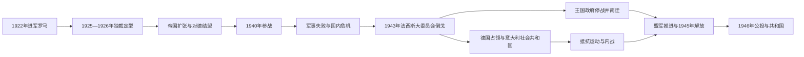

# 法西斯统治与第二次世界大战时期

## 时间

1922年-1945年（王国至1946年正式终结）

## 别称

法西斯意大利、墨索里尼时期、意大利社会共和国时期

## 演变图

## 概括

法西斯主义并非1922年一次政变后立即完成独裁。墨索里尼先经国王合法任命领导联合政府，再利用选举法、行动队暴力、警察和紧急法于1925-1926年摧毁反对党与新闻自由。政权通过民族主义动员、社会组织、教廷和解及殖民战争争取支持，却从未消除君主、军队、教会和传统官僚的并存。二战军事失败导致1943年宫廷政变；停战后德国占领北中意大利并建立社会共和国，意大利陷入占领、抵抗与内战，至1945年法西斯政权彻底覆亡。

## 国家元首、政府首脑与实际权力

意大利王国完整君主和政府首脑顺序见[意大利王国君主与政府首脑表](/%E4%BA%BA%E6%96%87%E7%A7%91%E5%AD%A6/%E5%8E%86%E5%8F%B2/%E6%AC%A7%E6%B4%B2/%E6%84%8F%E5%A4%A7%E5%88%A9/%E6%84%8F%E5%A4%A7%E5%88%A9%E7%8E%8B%E5%9B%BD%E5%90%9B%E4%B8%BB%E4%B8%8E%E6%94%BF%E5%BA%9C%E9%A6%96%E8%84%91%E8%A1%A8.md)。本阶段按角色分列：

### 国家元首与王权代行

| 人物 | 时间 | 法定身份 | 实际作用 |
|---|---|---|---|
| 维托里奥·埃马努埃莱三世 | 1900-1946；本阶段1922-1944年仍行使王权 | 意大利国王 | 1922年拒签戒严并任命墨索里尼；独裁期保留军队效忠与任免权，1943年罢免并逮捕墨索里尼。 |
| 翁贝托王储 | 1944年6月-1946年5月 | 王国中将 / 王权代行者 | 罗马解放后代行国家元首职能，试图把王室同法西斯责任切割。 |

### 王国政府首脑

| 政府首脑 | 任期 | 权力性质 | 关键说明 |
|---|---|---|---|
| **贝尼托·墨索里尼** | 1922年10月-1943年7月 | 首相，1925年后为独裁者和法西斯领袖 | 兼任多个部，控制国家法西斯党、警察、宣传和大委员会。 |
| 皮埃特罗·巴多格里奥 | 1943年7月-1944年6月 | 国王任命的军政府首脑 | 秘密谈判停战；9月南迁，政府在盟军监督下由南向北恢复管辖。 |
| 伊万诺埃·博诺米 | 1944年6月-1945年6月 | 反法西斯政党联合政府首脑 | 以民族解放委员会诸党为基础，协调战后过渡。 |
| 费鲁乔·帕里 | 1945年6月-12月 | 战后联合政府首脑 | 来自抵抗运动，处理清算法西斯与重建。 |
| 阿尔契德·德加斯佩里 | 1945年12月起 | 联合政府首脑 | 任期跨越1946年公投，主持由王国向共和国过渡。 |

### 1943-1945年北中部的并立权力

| 权力 | 领导 / 机构 | 实际控制 |
|---|---|---|
| 意大利社会共和国 | 墨索里尼任领袖和政府首脑 | 名义统治德国占领下的北中部；军队、警察和经济高度受德方制约。 |
| 德国占领当局 | 德军司令、党卫队及直接管制区官员 | 掌握军事、交通、劳工和镇压；东北部分地区甚至脱离社会共和国日常管辖。 |
| 民族解放委员会与游击队 | 共产党、社会党、行动党、天民党、自由党等 | 在山区、城市地下网络和罢工中组织抵抗；北意民族解放委员会在1945年发动总起义。 |
| 盟军军事政府 | 英美等盟国 | 随战线推进管理占领区，再逐步向意大利政府移交行政。 |

## 独裁建立过程

1. **准军事扩张（1919-1922）**：法西斯行动队袭击社会主义者、工会、合作社和地方政府，得到部分地主、工商界及国家人员支持。
2. **合法入阁（1922-1924）**：进军罗马制造压力，国王任命墨索里尼；《阿切尔博法》把相对多数转化为议会绝对多数，1924年选举在暴力和恐吓中进行。
3. **公开独裁（1925-1929）**：马泰奥蒂遇害引发危机后，墨索里尼承担“政治责任”并清除反对派；法西斯特别法、特别法庭和警察监控建立一党国家。
4. **制度化与社会动员（1929-1935）**：《拉特兰条约》同教廷和解；工会被国家法团替代，青年、妇女、休闲和教育组织传播法西斯价值，但工资、企业和地方精英并未真正由劳动者共同管理。
5. **帝国、种族与轴心化（1935-1940）**：侵略埃塞俄比亚、干预西班牙内战、吞并阿尔巴尼亚，外交上依附德国；1938年种族法剥夺犹太人权利。
6. **总体战争与崩溃（1940-1943）**：军备、燃料、工业和指挥不足，希腊、北非、东非和苏联战场连续受挫，德国救援加深从属。

## 重要事件

1. 1922年10月，法西斯进军罗马；国王任命墨索里尼为首相。
2. 1923年《阿切尔博法》通过，为法西斯控制议会创造制度条件。
3. 1924年社会主义议员马泰奥蒂遭绑架杀害，政权陷入合法性危机。
4. 1925年1月墨索里尼公开承担政治责任；1925-1926年反对党、自由工会和独立报刊被取缔。
5. 1926年以后，特别法庭、流放制度和秘密警察网络压制异议。
6. 1929年《拉特兰条约》承认梵蒂冈城国，并解决王国与教廷的长期冲突。
7. 1935-1936年意大利侵略并吞埃塞俄比亚，使用包括化学武器在内的暴力。
8. 1936年形成“罗马—柏林轴心”，意军随后深度介入西班牙内战。
9. 1938年颁布反犹种族法，犹太人被逐出学校、公职和众多经济领域。
10. 1939年吞并阿尔巴尼亚并同德国签订《钢铁条约》。
11. 1940年6月，意大利在法国败局已定时参战；同年进攻希腊失败。
12. 1941-1943年，北非、东非、巴尔干和苏联战场损失扩大，国内配给、轰炸与罢工加剧。
13. 1943年7月盟军登陆西西里；法西斯大委员会通过格兰迪议案，国王罢免并拘押墨索里尼。
14. 1943年9月8日停战公开，王室和政府撤往南部；德军解除意军武装、占领北中部并救出墨索里尼。
15. 1943年9月，意大利社会共和国建立；犹太人遭逮捕、遣送，德军和法西斯部队同游击队展开残酷镇压与报复。
16. 1944年罗马解放，王权交由翁贝托代行；古斯塔夫防线和哥特防线战斗持续。
17. 1945年4月25日北意总起义，德军撤退；墨索里尼被捕并于4月28日处决，社会共和国崩溃。
18. 1945年5月，意大利境内德军投降，战争阶段结束。

## 政权支持与统治局限

法西斯得以巩固，既因行动队暴力，也因国王、军队、行政官僚、工商与地主精英相信墨索里尼能恢复秩序。控制媒体、青年教育、公共工程和福利组织制造认同，《拉特兰条约》和埃塞俄比亚战争一度提升声望。但国家法团没有消除阶级利益，王室与军队保留独立权威，秘密警察也无法根除地下反对。

## 衰落因素与直接灭亡过程

- **结构因素**：工业与能源基础不足以支撑大国战争，殖民扩张和自给政策耗费财政；军种协调、装备和后勤落后。
- **政治因素**：个人独裁压制真实信息和专业判断，党、军队、王室和官僚之间权责重叠；同德国结盟使外交自主缩小。
- **外部压力**：盟军制海权、战略轰炸和西西里登陆，加上德军对意大利资源的控制，使社会和军队信心崩溃。
- **直接触发**：1943年7月大委员会倒戈和国王行使任免权终结墨索里尼王国政府；9月停战准备不足造成军队瓦解和德国占领。
- **最终灭亡**：1943-1945年社会共和国依靠德军生存。盟军突破、德国撤退、工人罢工和游击队总起义共同摧毁其控制，领导层被捕或逃亡，法西斯国家失去领土与武装基础。

## 演变关系

- 前一节点：[意大利王国自由主义时期](/%E4%BA%BA%E6%96%87%E7%A7%91%E5%AD%A6/%E5%8E%86%E5%8F%B2/%E6%AC%A7%E6%B4%B2/%E6%84%8F%E5%A4%A7%E5%88%A9/%E6%84%8F%E5%A4%A7%E5%88%A9%E7%8E%8B%E5%9B%BD%E8%87%AA%E7%94%B1%E4%B8%BB%E4%B9%89%E6%97%B6%E6%9C%9F.md)。
- 后一节点：[意大利共和国](/%E4%BA%BA%E6%96%87%E7%A7%91%E5%AD%A6/%E5%8E%86%E5%8F%B2/%E6%AC%A7%E6%B4%B2/%E6%84%8F%E5%A4%A7%E5%88%A9/%E6%84%8F%E5%A4%A7%E5%88%A9%E5%85%B1%E5%92%8C%E5%9B%BD.md)。
- 领导专表：[意大利王国君主与政府首脑表](/%E4%BA%BA%E6%96%87%E7%A7%91%E5%AD%A6/%E5%8E%86%E5%8F%B2/%E6%AC%A7%E6%B4%B2/%E6%84%8F%E5%A4%A7%E5%88%A9/%E6%84%8F%E5%A4%A7%E5%88%A9%E7%8E%8B%E5%9B%BD%E5%90%9B%E4%B8%BB%E4%B8%8E%E6%94%BF%E5%BA%9C%E9%A6%96%E8%84%91%E8%A1%A8.md)。
- 所属总览：[意大利历史](/%E4%BA%BA%E6%96%87%E7%A7%91%E5%AD%A6/%E5%8E%86%E5%8F%B2/%E6%AC%A7%E6%B4%B2/%E6%84%8F%E5%A4%A7%E5%88%A9/README.md)。
