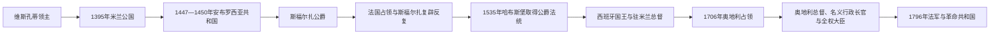

# 米兰公国统治者与总督表

## 时间

1277年-1796年

## 概括

米兰的统治链经历了维斯孔蒂领主、世袭公爵、安布罗西亚共和国、斯福尔扎王朝、法国占领和哈布斯堡复合君主制。1535年斯福尔扎绝嗣后，皇帝或西班牙、奥地利君主兼有米兰公爵法统，但日常军政通常由驻米兰总督、国务会议、参议院和大法官共同运作。本表把主权称号、驻地行政首脑和实际代行分开。

## 演变图

## 维斯孔蒂领主与公爵完整表

多人并列时表示家族领地和职权共治，并不意味着各人始终控制同一范围。1395年以前主要称“米兰领主”，此后为帝国授予或家族继承的公爵。

| 顺序 | 统治者 | 家族 / 称号 | 统治时间 | 继承与关键说明 |
|---:|---|---|---|---|
| 1 | 奥托内·维斯孔蒂 | 米兰大主教、家族领袖 | 1277-1295 | 在德西奥击败德拉托雷家族，建立维斯孔蒂优势；日常军政逐渐交给侄孙马泰奥。 |
| 2 | 马泰奥一世·维斯孔蒂 | 米兰领主、帝国代理 | 1287-1302、1311-1322 | 奥托内亲族；被逐后依靠皇帝亨利七世复位。 |
| 3 | 加莱亚佐一世·维斯孔蒂 | 米兰领主 | 1322-1327 | 马泰奥一世之子；与教廷和地方敌对联盟冲突。 |
| 4 | 阿佐内·维斯孔蒂 | 米兰领主 | 1329-1339 | 加莱亚佐一世之子；整顿财政并扩大领土。 |
| 5 | 卢基诺·维斯孔蒂 | 共治领主 | 1339-1349 | 马泰奥一世之子；与兄弟乔万尼共同继承。 |
| 6 | 乔万尼·维斯孔蒂 | 米兰大主教、共治领主 | 1339-1354 | 卢基诺之弟；1349年后单独统治并扩张博洛尼亚等地。 |
| 7 | 马泰奥二世·维斯孔蒂 | 共治领主 | 1354-1355 | 乔万尼侄子；与贝尔纳博、加莱亚佐二世分治。 |
| 8 | 贝尔纳博·维斯孔蒂 | 共治领主 | 1354-1385 | 马泰奥二世之弟；控制东部，后被侄子吉安·加莱亚佐夺权。 |
| 9 | 加莱亚佐二世·维斯孔蒂 | 共治领主 | 1354-1378 | 马泰奥二世之弟；以帕维亚为中心。 |
| 10 | **吉安·加莱亚佐·维斯孔蒂** | 米兰领主；1395年起首任公爵 | 1378/1385-1402 | 加莱亚佐二世之子；吞并贝尔纳博领地并向中意扩张。 |
| 11 | 乔万尼·玛丽亚·维斯孔蒂 | 米兰公爵 | 1402-1412 | 吉安·加莱亚佐长子；幼年继位，国家分裂，遇刺身亡。 |
| 12 | 菲利波·玛丽亚·维斯孔蒂 | 米兰公爵 | 1412-1447 | 前任之弟；恢复大部领地，无合法男性继承人。 |

## 安布罗西亚共和国与斯福尔扎公爵完整表

| 顺序 | 政权 / 统治者 | 身份 | 时间 | 继承与关键说明 |
|---:|---|---|---|---|
| — | 金色安布罗西亚共和国 | 城市精英组成的共和国 | 1447-1450 | 维斯孔蒂绝嗣后成立；派系冲突、战争和饥荒削弱政权。 |
| 1 | **弗朗切斯科一世·斯福尔扎** | 米兰公爵 | 1450-1466 | 菲利波·玛丽亚女婿、雇佣军统帅；围困米兰后获承认。 |
| 2 | 加莱亚佐·玛丽亚·斯福尔扎 | 米兰公爵 | 1466-1476 | 前任之子；遇刺。 |
| 3 | 吉安·加莱亚佐·斯福尔扎 | 米兰公爵 | 1476-1494 | 前任幼子；母亲博娜和叔父卢多维科先后摄政，实权最终落入卢多维科。 |
| 4 | **卢多维科·斯福尔扎** | 米兰公爵 | 1494-1499、1500 | 前任叔父；引法国势力入意，后被法国俘获。 |
| — | 路易十二与法国总督 | 法国国王兼米兰公爵 | 1499-1512 | 依据维斯孔蒂血缘主张占领米兰，由驻地总督治理。 |
| 5 | 马西米利亚诺·斯福尔扎 | 米兰公爵 | 1512-1515 | 卢多维科之子；在瑞士支持下复位，马里尼亚诺战败后退位。 |
| — | 弗朗索瓦一世与法国总督 | 法国国王兼米兰公爵 | 1515-1521 | 马里尼亚诺胜利后统治；帝国军队驱逐法国。 |
| 6 | 弗朗切斯科二世·斯福尔扎 | 米兰公爵 | 1521-1524、1525-1526、1529-1535 | 卢多维科之子；在法军与帝国干预之间数次复位，死后绝嗣。 |
| — | 查理五世 | 皇帝、米兰公爵宗主 | 1535-1554/1556 | 以帝国采邑回收为依据控制米兰，1540年秘密授予其子腓力。 |
| — | 腓力二世至卡洛斯二世 | 西班牙国王兼米兰公爵 | 1554/1556-1700 | 公爵法统属于复合君主，驻地总督负责日常军政。 |
| — | 腓力五世与哈布斯堡查理争位 | 西班牙王位继承战争 | 1700-1706 | 米兰名义归属与军事实控分离；1706年奥军占领。 |
| — | 奥地利哈布斯堡君主 | 米兰公爵 | 1706-1796 | 1713—1714年和约确认；维也纳通过总督、行政长官与全权大臣治理。 |

## 西班牙时期米兰总督与实际代行完整表

表中只把实际到任、代行或确实行使权力者列入顺序；“被任命但未到任”的阿方索·佩雷斯·德·古斯曼、费尔南多·阿凡·德·里韦拉、阿尔瓦罗·德·巴赞和伊尼戈·贝莱斯等人在备注说明，不占实际执政序号。1628—1631年战争与瘟疫造成任命、名义职位和实权明显重叠。

| 顺序 | 总督 / 代行者 | 任期 | 性质与实际权力 |
|---:|---|---|---|
| 1 | Antonio de Leyva | 1535-1536 | 查理五世任命的首位哈布斯堡总督，任内去世。 |
| 2 | Marino Caracciolo | 1536-1538 | 负责政治财政；军事权由德尔瓦斯托侯爵掌握。 |
| 3 | Alfonso d’Avalos d’Aquino | 1538-1546 | 兼掌军事与政务，颁布新宪制。 |
| 4 | Álvaro de Luna | 1546 | 城堡长官，临时代行。 |
| 5 | Ferrante Gonzaga | 1546-1555 | 总督兼统帅，强化防御与王室控制。 |
| 6 | Fernando Álvarez de Toledo | 1555-1556 | 阿尔瓦公爵，任期短。 |
| 7 | Cristoforo Madruzzo | 1556-1557 | 枢机，处理政务。 |
| 8 | Juan de Figueroa | 1557-1558 | 代行过渡。 |
| 9 | Gonzalo Fernández de Córdoba | 1558-1560 | 第一次实际任职。 |
| 10 | Francisco d’Avalos | 1560-1563 | 佩斯卡拉侯爵。 |
| 11 | Gonzalo Fernández de Córdoba | 1563-1564 | 第二次任职。 |
| 12 | Gabriel de la Cueva | 1564-1571 | 阿尔布开克公爵。 |
| 13 | Álvaro de Sande | 1571 | 临时军政代行。 |
| 14 | Luis de Requesens y Zúñiga | 1572-1573 | 后调任尼德兰。 |
| 15 | Antonio de Guzmán | 1573-1580 | 任内去世。 |
| 16 | Sancho de Guevara y Padilla | 1580-1581 | 城堡长官，临时代行。 |
| 17 | Carlo d’Aragona Tagliavia | 1581-1592 | 长期任职，后因专断争议被撤。 |
| 18 | Juan Fernández de Velasco | 1592-1600 | 第一次任职。 |
| 19 | Diego Salazar | 1600年1月-4月 | 大法官，第一次临时代行。 |
| 20 | Pedro Enríquez de Acevedo | 1600-1610 | 富恩特斯伯爵，任内去世。 |
| 21 | Diego Salazar | 1610年7月-10月 | 第二次临时代行。 |
| 22 | Diego Portugal y Pimentel | 1610年10月-12月 | 以统帅、总督与城堡长官身份过渡。 |
| 23 | Juan Fernández de Velasco | 1610-1612 | 再次实际任职。 |
| 24 | Juan de Mendoza y Velasco | 1612-1615 | 伊诺霍萨侯爵。 |
| 25 | Pedro de Toledo | 1615-1618 | 维拉弗兰卡侯爵。 |
| 26 | Gómez Suárez de Figueroa y Córdoba | 1618-1626 | 第一次任职。 |
| 27 | Gonzalo Fernández de Córdoba | 1626-1627 | 马拉泰亚亲王。 |
| 28 | Antonio Ferrer | 1628-1631 | 战争与鼠疫期间两度代行并实际掌权；数名获任者未到任。 |
| 29 | Ambrogio Spinola | 1629-1630 | 名义总督；因战争与疾病，日常权力仍由费雷尔行使。 |
| 30 | Gómez Suárez de Figueroa y Córdoba | 1631-1633 | 第二次任职。 |
| 31 | 枢机亲王费迪南多·德·哈布斯堡 | 1633 | 短期总督。 |
| 32 | 枢机 Gil Carrillo de Albornoz | 1633-1635 | 先代行后正式任职。 |
| 33 | Diego Felipe de Guzmán | 1635-1640 | 莱加内斯侯爵。 |
| 34 | Juan de Velasco de la Cueva | 1640-1643 | 西尔韦拉伯爵。 |
| 35 | Antonio Sancho Dávila | 1643-1645 | 贝拉达侯爵。 |
| 36 | Bernardino Fernández de Velasco | 1645-1647 | 弗里亚斯公爵。 |
| 37 | Íñigo Fernández de Velasco | 1647-1648 | 临时接替其父。 |
| 38 | Luis de Benavides Carrillo | 1648-1655 | 卡拉塞纳侯爵。 |
| 39 | 枢机 Teodoro Trivulzio | 1655-1656 | 任内去世。 |
| 40 | Alfonso Pérez de Vivero | 1656-1660 | 富恩萨尔达尼亚伯爵；已获任的伊尼戈·贝莱斯去世而未到任。 |
| 41 | Francesco Caetani | 1660-1662 | 塞尔莫内塔公爵。 |
| 42 | Luis de Guzmán Ponce de León | 1662-1668 | 任内去世。 |
| 43 | Paolo Spinola | 1668、1669 | 两次短期任职。 |
| 44 | Francisco de Orozco | 1668年6月-12月 | 任内去世。 |
| 45 | Gaspar Téllez-Girón | 1669-1673/1674 | 奥苏纳公爵；末期军权另有分掌。 |
| 46 | Claude Lamoral de Ligne | 1673-1678 | 利涅亲王。 |
| 47 | Juan Tomás Enríquez de Cabrera | 1678-1686 | 先代行后正式任职。 |
| 48 | Antonio López de Ayala y Velasco | 1686-1691 | 曾任军事长官。 |
| 49 | Diego Dávila Mesía y Guzmán | 1691-1698 | 莱加内斯侯爵。 |
| 50 | Vicente Pérez de Araciel y Rada | 1698年1月-4月 | 大法官，临时代行。 |
| 51 | Charles Henri de Lorraine | 1698-1706 | 沃代蒙亲王；奥军占领米兰后离任。 |

## 奥地利时期总督、行政长官与实际执政者完整表

奥地利阶段经常由高位亲王担任名义总督，驻地政务交给实际代行、摄政或全权大臣。下表因此按权力角色分别列示，重叠任期不是错误。

| 顺序 | 人物 / 状态 | 任期 | 角色与实际权力 |
|---:|---|---|---|
| 1 | **欧根亲王** | 1706-1716 | 名义总督；1710年后长期不驻米兰。 |
| 1a | Pirro Visconti | 1710-1716 | 在欧根亲王名下实际代行。 |
| 2 | Maximilian Karl zu Löwenstein-Wertheim-Rochefort | 1717-1718 | 总督，任内去世。 |
| 3 | Girolamo Colloredo-Waldsee | 1719-1725 | 总督。 |
| 4 | Wirich Philipp von Daun | 1725-1733 | 总督。 |
| — | 撒丁占领 | 1733-1736 | 卡洛·埃马努埃莱三世军队实际控制，奥地利总督链中断。 |
| 5 | Otto Ferdinand von Abensperg und Traun | 1736-1743 | 奥地利复归后的总督。 |
| 6 | Johann Georg Christian von Lobkowitz | 1743-1745 | 名义总督。 |
| 6a | Giovanni Luca Pallavicini | 1744-1745 | 在洛布科维茨名下实际掌权。 |
| — | 西班牙波旁占领 | 1745-1746 | 腓力亲王军队短期控制。 |
| 7 | Giovanni Luca Pallavicini | 1745/1746-1747 | 奥地利复归后的实际总督。 |
| 8 | Ferdinand Bonaventura von Harrach | 1747-1750 | 总督。 |
| 9 | Giovanni Luca Pallavicini | 1750-1754 | 再次任职。 |
| 10 | 弗朗切斯科三世·德斯特 | 1754-1771 | 摩德纳公爵兼奥属伦巴第行政长官，主要为名义职位。 |
| 10a | 彼得罗·利奥波尔多（奥地利大公） | 1754-1765 | 名义层级；未直接主持日常行政。 |
| 10b | Beltramo Cristiani | 1754-1758 | 摄政与实际行政首脑。 |
| 10c | Manuel Amor de Soria | 1759 | 临时代行。 |
| 10d | **Karl Joseph von Firmian** | 1759-1771 | 全权大臣、实际行政首脑；推动特蕾西亚改革。 |
| 11 | 斐迪南大公 | 1765年起名义、1771-1796年正式总督 | 哈布斯堡—埃斯特支系；以米兰宫廷代表王朝。 |
| 11a | Karl Joseph von Firmian | 1771-1782 | 在斐迪南大公名下继续实际执政。 |
| 11b | Johann Joseph Wilczek | 1782-1796 | 全权大臣与实际行政首脑。 |
| — | 法军占领与革命共和国 | 1796年起 | 米兰公国总督制度终结。 |

## 名义宗主权与实际控制

- 1395年公爵号来自神圣罗马皇帝授封，但皇帝并未因此持续驻军治理米兰。
- 1499—1529年，法国国王的维斯孔蒂血缘主张、斯福尔扎继承和皇帝的帝国采邑权彼此竞争；战场控制往往先于正式条约。
- 1554/1556年后，西班牙国王兼任米兰公爵；总督拥有军政号令权，但参议院、大法官、秘密会议和地方精英可制约其命令。
- 1706年奥军先取得事实控制，1713—1714年和约才完成国际法确认。
- 1754年以后“总督—行政长官—全权大臣”多层并存，判断实际权力必须看谁驻米兰、主持会议并签发日常政令。

## 双向链接

- 城邦到领土公国的形成：[中世纪城邦与海上共和国时期](/%E4%BA%BA%E6%96%87%E7%A7%91%E5%AD%A6/%E5%8E%86%E5%8F%B2/%E6%AC%A7%E6%B4%B2/%E6%84%8F%E5%A4%A7%E5%88%A9/%E4%B8%AD%E4%B8%96%E7%BA%AA%E5%9F%8E%E9%82%A6%E4%B8%8E%E6%B5%B7%E4%B8%8A%E5%85%B1%E5%92%8C%E5%9B%BD%E6%97%B6%E6%9C%9F.md)。
- 斯福尔扎、法国与哈布斯堡争夺：[文艺复兴与意大利战争时期](/%E4%BA%BA%E6%96%87%E7%A7%91%E5%AD%A6/%E5%8E%86%E5%8F%B2/%E6%AC%A7%E6%B4%B2/%E6%84%8F%E5%A4%A7%E5%88%A9/%E6%96%87%E8%89%BA%E5%A4%8D%E5%85%B4%E4%B8%8E%E6%84%8F%E5%A4%A7%E5%88%A9%E6%88%98%E4%BA%89%E6%97%B6%E6%9C%9F.md)。
- 西班牙和奥地利复合统治：[西班牙与奥地利支配时期](/%E4%BA%BA%E6%96%87%E7%A7%91%E5%AD%A6/%E5%8E%86%E5%8F%B2/%E6%AC%A7%E6%B4%B2/%E6%84%8F%E5%A4%A7%E5%88%A9/%E8%A5%BF%E7%8F%AD%E7%89%99%E4%B8%8E%E5%A5%A5%E5%9C%B0%E5%88%A9%E6%94%AF%E9%85%8D%E6%97%B6%E6%9C%9F.md)。
- 拿破仑重组：[拿破仑意大利时期](/%E4%BA%BA%E6%96%87%E7%A7%91%E5%AD%A6/%E5%8E%86%E5%8F%B2/%E6%AC%A7%E6%B4%B2/%E6%84%8F%E5%A4%A7%E5%88%A9/%E6%8B%BF%E7%A0%B4%E4%BB%91%E6%84%8F%E5%A4%A7%E5%88%A9%E6%97%B6%E6%9C%9F.md)。
- 所属总览：[意大利历史](/%E4%BA%BA%E6%96%87%E7%A7%91%E5%AD%A6/%E5%8E%86%E5%8F%B2/%E6%AC%A7%E6%B4%B2/%E6%84%8F%E5%A4%A7%E5%88%A9/README.md)。
