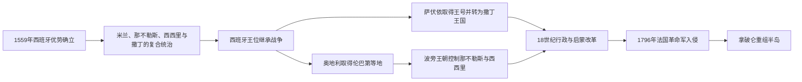

# 西班牙与奥地利支配时期

## 时间

1559年-1796年（部分旧政权延续至1797年）

## 别称

哈布斯堡主导时期、旧制度后期

## 演变图

## 概括

1559年后，西班牙王室直接控制米兰、那不勒斯、西西里和撒丁，借驻军、总督与地方精英维持半岛优势；18世纪欧洲王位继承战争重新分配领地，奥地利取得伦巴第等北意核心，而波旁家族建立相对独立的那不勒斯—西西里王国。意大利仍非统一殖民地：威尼斯、热那亚、教皇国、托斯卡纳、萨伏依和若干公国保有不同程度主权，并在启蒙改革与旧制度阻力之间发展。

## 统治结构与区域变化

那不勒斯与西西里君主、两套外国总督及岛陆实际控制完整顺序见[南意大利与西西里统治者及总督表](/%E4%BA%BA%E6%96%87%E7%A7%91%E5%AD%A6/%E5%8E%86%E5%8F%B2/%E6%AC%A7%E6%B4%B2/%E6%84%8F%E5%A4%A7%E5%88%A9/%E5%8D%97%E6%84%8F%E5%A4%A7%E5%88%A9%E4%B8%8E%E8%A5%BF%E8%A5%BF%E9%87%8C%E7%BB%9F%E6%B2%BB%E8%80%85%E5%8F%8A%E6%80%BB%E7%9D%A3%E8%A1%A8.md)。萨伏依公爵取得西西里、再交换撒丁王号的完整继承见[萨伏依—撒丁王朝世系表](/%E4%BA%BA%E6%96%87%E7%A7%91%E5%AD%A6/%E5%8E%86%E5%8F%B2/%E6%AC%A7%E6%B4%B2/%E6%84%8F%E5%A4%A7%E5%88%A9/%E8%90%A8%E4%BC%8F%E4%BE%9D%E2%80%94%E6%92%92%E4%B8%81%E7%8E%8B%E6%9C%9D%E4%B8%96%E7%B3%BB%E8%A1%A8.md)。米兰的西班牙与奥地利总督、代行者和实际执政者完整顺序见[米兰公国统治者与总督表](/%E4%BA%BA%E6%96%87%E7%A7%91%E5%AD%A6/%E5%8E%86%E5%8F%B2/%E6%AC%A7%E6%B4%B2/%E6%84%8F%E5%A4%A7%E5%88%A9/%E7%B1%B3%E5%85%B0%E5%85%AC%E5%9B%BD%E7%BB%9F%E6%B2%BB%E8%80%85%E4%B8%8E%E6%80%BB%E7%9D%A3%E8%A1%A8.md)。教皇国的世俗统治与宗教职务相互重叠，但不能等同；完整公认教宗顺序见[教皇国教宗世系表](/%E4%BA%BA%E6%96%87%E7%A7%91%E5%AD%A6/%E5%8E%86%E5%8F%B2/%E6%AC%A7%E6%B4%B2/%E6%84%8F%E5%A4%A7%E5%88%A9/%E6%95%99%E7%9A%87%E5%9B%BD%E6%95%99%E5%AE%97%E4%B8%96%E7%B3%BB%E8%A1%A8.md)。

| 地区 / 政权 | 1559年后格局 | 18世纪变化 | 实际治理 |
|---|---|---|---|
| 米兰公国 | 西班牙国王兼公爵 | 1714年后由奥地利哈布斯堡控制 | 总督、枢密与财政机构同本地贵族、城市合作，驻军地位重要。 |
| 那不勒斯与西西里 | 西班牙国王统治，两地各设总督 | 1707/1713后短暂分配给奥地利或萨伏依；1734年起由波旁旁支建立本地王朝 | 封建贵族、教会地产和城市特权制约中央改革。 |
| 撒丁岛 | 西班牙控制 | 1713年归奥地利，1720年与萨伏依的西西里交换，成为撒丁王国 | 萨伏依君主以都灵和皮埃蒙特为行政核心，岛屿地位相对边缘。 |
| 托斯卡纳大公国 | 美第奇家族 | 1737年美第奇绝嗣，转归哈布斯堡—洛林家族 | 大公与官僚推动土地、税收和司法改革，1786年废除死刑最具象征性。 |
| 威尼斯共和国 | 独立贵族共和国 | 海上版图受奥斯曼压力，转向大陆与中立外交 | 大议会和元老院控制政治，地方领地由贵族官员管理。 |
| 热那亚共和国 | 独立共和国，金融家为西班牙王室提供信贷 | 受法国、奥地利和萨伏依压力；1768年将科西嘉权利转让法国 | 贵族寡头与银行网络主导，领土军力有限。 |
| 教皇国 | 教皇世俗统治 | 改革受教会特权与地方差异限制 | 罗马教廷、使节和地方贵族共同治理。 |
| 萨伏依公国 / 撒丁王国 | 阿尔卑斯两侧的萨伏依家族 | 1713年获王号，1720年起为撒丁国王 | 建立较集中军政官僚，是日后统一的制度核心。 |
| 帕尔马、摩德纳、卢卡等 | 法尔内塞、埃斯特等家族和共和国 | 王位继承战争中频繁换属 | 依赖大国保护，在宫廷改革和地方特权间求存。 |

## 西班牙主导的运作

西班牙并未把各领地合并为一个行政区，而是由同一君主统治不同法统的国家。米兰总督负责北意战略通道，那不勒斯、西西里和撒丁总督代表国王；地方议会、贵族和教会继续掌握税收、司法与土地。西班牙驻军及战争税加重负担，但来自美洲和欧洲的王室网络也为热那亚金融、伦巴第制造和南意粮食提供市场。

## 18世纪重组与改革

西班牙王位继承战争后，奥地利取代西班牙控制米兰和一度控制那不勒斯；萨伏依家族先获西西里王号，再以西西里换取撒丁。1734年西班牙波旁王子卡洛夺取那不勒斯和西西里，建立与马德里分开的王朝。1748年后版图相对稳定。伦巴第、托斯卡纳、帕尔马与那不勒斯的统治者尝试整顿税制、限制教会特权、普查土地、促进农业和行政理性化，但改革常受贵族、教会、地方法和财政能力约束。

## 重要事件

1. 1559年，《卡托—康布雷西和约》确认西班牙在意大利的优势。
2. 1571年，威尼斯、西班牙与教皇等组成神圣同盟，在勒班陀海战争胜奥斯曼；胜利未逆转威尼斯东方领地长期收缩。
3. 1606-1607年，威尼斯与教廷因司法和教会特权发生“禁令之争”。
4. 1628-1631年，战争、饥荒与鼠疫重创伦巴第和北意城市。
5. 1647年，那不勒斯马萨涅洛起义和西西里巴勒莫动乱反映粮价、税负与地方权力矛盾。
6. 1690年代至1714年，欧洲大战把意大利再次变为战略战场。
7. 1713-1714年，《乌得勒支和约》《拉施塔特和约》将米兰、那不勒斯等交给奥地利，萨伏依获西西里王号。
8. 1720年，萨伏依以西西里换取撒丁，自此称撒丁王国。
9. 1734年，波旁军夺取那不勒斯和西西里；1737年美第奇绝嗣，托斯卡纳转归洛林家族。
10. 1748年，《亚琛和约》稳定奥地利伦巴第、波旁南意和诸小公国的格局。
11. 1764年，南意严重饥荒暴露农业、运输和行政脆弱性。
12. 1768年，热那亚把科西嘉主权权利转让法国，显示小国难以承担长期军事成本。
13. 1786年，托斯卡纳刑法改革废除死刑和酷刑，成为启蒙专制改革代表。
14. 1796年，拿破仑率法军进入北意；1797年威尼斯共和国覆亡，旧均势解体。

## 强盛条件、结构困境与终结

西班牙和奥地利的优势来自跨欧洲王朝资源、常备军和对米兰—阿尔卑斯战略通道的控制。本地政权则凭借金融、港口、外交中立或行政改革维持自主。结构困境包括封建和教会地产集中、各地关税与法律割裂、财政依赖间接税、南北农业生产率差异，以及统治者常把领地纳入大国战争。

法国革命不是旧制度危机的唯一原因，却提供了直接军事触发。1796年法军击败撒丁和奥地利军队，借本地雅各宾派建立共和国并征收军费；次年威尼斯被法奥瓜分。王朝法统、贵族寡头和多邦边界由此进入连续重组。

## 演变关系

- 前一节点：[文艺复兴与意大利战争时期](/%E4%BA%BA%E6%96%87%E7%A7%91%E5%AD%A6/%E5%8E%86%E5%8F%B2/%E6%AC%A7%E6%B4%B2/%E6%84%8F%E5%A4%A7%E5%88%A9/%E6%96%87%E8%89%BA%E5%A4%8D%E5%85%B4%E4%B8%8E%E6%84%8F%E5%A4%A7%E5%88%A9%E6%88%98%E4%BA%89%E6%97%B6%E6%9C%9F.md)。
- 后一节点：[拿破仑意大利时期](/%E4%BA%BA%E6%96%87%E7%A7%91%E5%AD%A6/%E5%8E%86%E5%8F%B2/%E6%AC%A7%E6%B4%B2/%E6%84%8F%E5%A4%A7%E5%88%A9/%E6%8B%BF%E7%A0%B4%E4%BB%91%E6%84%8F%E5%A4%A7%E5%88%A9%E6%97%B6%E6%9C%9F.md)。
- 对读：[奥地利历史](/%E4%BA%BA%E6%96%87%E7%A7%91%E5%AD%A6/%E5%8E%86%E5%8F%B2/%E6%AC%A7%E6%B4%B2/%E5%BE%B7%E6%84%8F%E5%BF%97/%E5%A5%A5%E5%9C%B0%E5%88%A9/README.md)。
- 所属总览：[意大利历史](/%E4%BA%BA%E6%96%87%E7%A7%91%E5%AD%A6/%E5%8E%86%E5%8F%B2/%E6%AC%A7%E6%B4%B2/%E6%84%8F%E5%A4%A7%E5%88%A9/README.md)。
