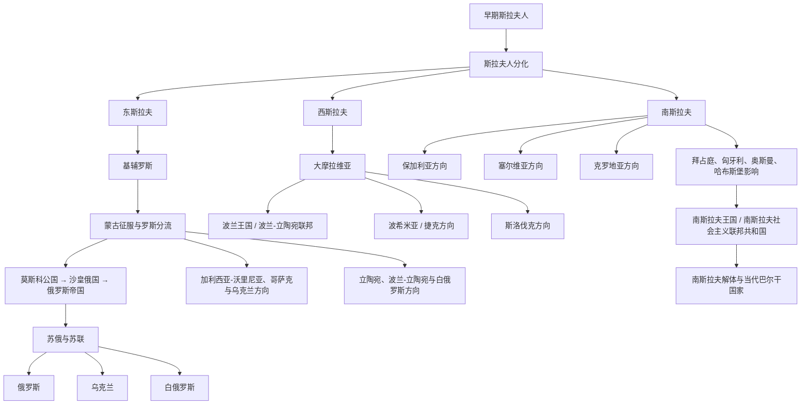

# 斯拉夫历史

## 历史主线

斯拉夫历史可以先按“早期斯拉夫人共同背景 → 6世纪前后向东、西、南三大方向分化 → 中世纪国家形成 → 近现代帝国支配、民族复兴与民族国家形成”来理解。东斯拉夫方向以基辅罗斯、蒙古征服后的罗斯分流、莫斯科—俄罗斯和乌克兰、白俄罗斯方向为主；西斯拉夫方向以波兰、波希米亚 / 捷克、斯洛伐克以及中欧帝国体系为主；南斯拉夫方向以巴尔干半岛的保加利亚、塞尔维亚、克罗地亚、斯洛文尼亚、波黑、黑山、北马其顿和南斯拉夫国家实验为主。

## 斯拉夫历史演变脉络图

## 核心分支导航

| 分支 | 入口 | 主线提示 |
|---|---|---|
| 共同源流 | [早期斯拉夫人](/%E4%BA%BA%E6%96%87%E7%A7%91%E5%AD%A6/%E5%8E%86%E5%8F%B2/%E6%AC%A7%E6%B4%B2/%E6%96%AF%E6%8B%89%E5%A4%AB/%E6%97%A9%E6%9C%9F%E6%96%AF%E6%8B%89%E5%A4%AB%E4%BA%BA.md)、[斯拉夫人分化](/%E4%BA%BA%E6%96%87%E7%A7%91%E5%AD%A6/%E5%8E%86%E5%8F%B2/%E6%AC%A7%E6%B4%B2/%E6%96%AF%E6%8B%89%E5%A4%AB/%E6%96%AF%E6%8B%89%E5%A4%AB%E4%BA%BA%E5%88%86%E5%8C%96.md) | 先理解斯拉夫人的中东欧空间背景，以及东、西、南三大方向的形成。 |
| 东斯拉夫 | [东斯拉夫](/%E4%BA%BA%E6%96%87%E7%A7%91%E5%AD%A6/%E5%8E%86%E5%8F%B2/%E6%AC%A7%E6%B4%B2/%E6%96%AF%E6%8B%89%E5%A4%AB/%E4%B8%9C%E6%96%AF%E6%8B%89%E5%A4%AB/README.md) | 从基辅罗斯、蒙古征服后的罗斯分流，到俄罗斯、乌克兰、白俄罗斯三条现代国家线。 |
| 西斯拉夫 | [西斯拉夫](/%E4%BA%BA%E6%96%87%E7%A7%91%E5%AD%A6/%E5%8E%86%E5%8F%B2/%E6%AC%A7%E6%B4%B2/%E6%96%AF%E6%8B%89%E5%A4%AB/%E8%A5%BF%E6%96%AF%E6%8B%89%E5%A4%AB/README.md) | 从大摩拉维亚、波希米亚、波兰王国到波兰、捷克、斯洛伐克等中欧国家。 |
| 南斯拉夫 | [南斯拉夫](/%E4%BA%BA%E6%96%87%E7%A7%91%E5%AD%A6/%E5%8E%86%E5%8F%B2/%E6%AC%A7%E6%B4%B2/%E6%96%AF%E6%8B%89%E5%A4%AB/%E5%8D%97%E6%96%AF%E6%8B%89%E5%A4%AB/README.md) | 从巴尔干南迁、中世纪保加利亚 / 塞尔维亚 / 克罗地亚，到奥斯曼、哈布斯堡、南斯拉夫和当代巴尔干。 |

## 关键差异

| 分支 | 主要空间 | 代表国家 / 历史方向 | 易混点 |
|---|---|---|---|
| 东斯拉夫 | 东欧平原、第聂伯河、伏尔加河、东北罗斯、西罗斯 | 俄罗斯、乌克兰、白俄罗斯 | “罗斯”不是现代俄罗斯的简单等同；基辅罗斯遗产被多个东斯拉夫国家共同追溯。 |
| 西斯拉夫 | 中欧、维斯瓦河、奥得河、波希米亚盆地、喀尔巴阡北侧 | 波兰、捷克、斯洛伐克等 | 西斯拉夫长期受神圣罗马帝国、哈布斯堡、波兰-立陶宛联邦、普鲁士和俄罗斯共同影响。 |
| 南斯拉夫 | 巴尔干半岛、多瑙河下游、亚得里亚海东岸 | 保加利亚、塞尔维亚、克罗地亚、斯洛文尼亚、波黑、黑山、北马其顿等 | 南斯拉夫既是族群 / 语言文化概念，也是20世纪国家实验，二者不能混同。 |

## 相关欧洲历史

- 斯拉夫历史与[欧洲历史](/%E4%BA%BA%E6%96%87%E7%A7%91%E5%AD%A6/%E5%8E%86%E5%8F%B2/%E6%AC%A7%E6%B4%B2/README.md)总览中的中世纪、民族国家形成、两次世界大战和冷战格局密切相关。
- 西斯拉夫与中欧历史应和[德意志](/%E4%BA%BA%E6%96%87%E7%A7%91%E5%AD%A6/%E5%8E%86%E5%8F%B2/%E6%AC%A7%E6%B4%B2/%E5%BE%B7%E6%84%8F%E5%BF%97/README.md)、[奥地利](/%E4%BA%BA%E6%96%87%E7%A7%91%E5%AD%A6/%E5%8E%86%E5%8F%B2/%E6%AC%A7%E6%B4%B2/%E5%BE%B7%E6%84%8F%E5%BF%97/%E5%A5%A5%E5%9C%B0%E5%88%A9/README.md)对读。
- 南斯拉夫方向与[东罗马 / 拜占庭](/%E4%BA%BA%E6%96%87%E7%A7%91%E5%AD%A6/%E5%8E%86%E5%8F%B2/%E6%AC%A7%E6%B4%B2/_%E9%80%9A%E5%8F%B2/%E5%8F%A4%E7%BD%97%E9%A9%AC/%E4%B8%9C%E7%BD%97%E9%A9%AC%E5%B8%9D%E5%9B%BD%E4%B8%8E%E6%8B%9C%E5%8D%A0%E5%BA%AD%E5%B8%9D%E5%9B%BD.md)和[奥斯曼帝国](/%E4%BA%BA%E6%96%87%E7%A7%91%E5%AD%A6/%E5%8E%86%E5%8F%B2/%E8%A5%BF%E4%BA%9A/%E5%9C%9F%E8%80%B3%E5%85%B6/%E5%A5%A5%E6%96%AF%E6%9B%BC%E5%B8%9D%E5%9B%BD/README.md)关系密切。
