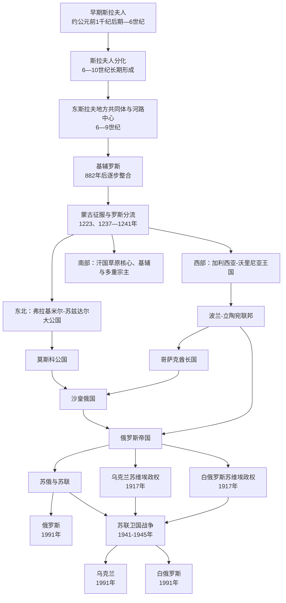

# 东斯拉夫历史演变

[返回斯拉夫历史](/%E4%BA%BA%E6%96%87%E7%A7%91%E5%AD%A6/%E5%8E%86%E5%8F%B2/%E6%AC%A7%E6%B4%B2/%E6%96%AF%E6%8B%89%E5%A4%AB/README.md)

| 顺序 | 名称 | 时间 | 简要概括 |
| --- | --- | --- | --- |
| 1 | [早期斯拉夫人](/%E4%BA%BA%E6%96%87%E7%A7%91%E5%AD%A6/%E5%8E%86%E5%8F%B2/%E6%AC%A7%E6%B4%B2/%E6%96%AF%E6%8B%89%E5%A4%AB/%E6%97%A9%E6%9C%9F%E6%96%AF%E6%8B%89%E5%A4%AB%E4%BA%BA.md) | 公元前1千纪后期—6世纪 | 语言、考古和6世纪文字资料共同显示早期斯拉夫共同体；精确原乡与古典族名对应仍有争议。 |
| 2 | [斯拉夫人分化](/%E4%BA%BA%E6%96%87%E7%A7%91%E5%AD%A6/%E5%8E%86%E5%8F%B2/%E6%AC%A7%E6%B4%B2/%E6%96%AF%E6%8B%89%E5%A4%AB/%E6%96%AF%E6%8B%89%E5%A4%AB%E4%BA%BA%E5%88%86%E5%8C%96.md) | 6—10世纪 | 东、西、南三大语言历史方向在迁徙、国家和教会网络中逐步形成。 |
| 3 | [东斯拉夫准国家组织](/%E4%BA%BA%E6%96%87%E7%A7%91%E5%AD%A6/%E5%8E%86%E5%8F%B2/%E6%AC%A7%E6%B4%B2/%E6%96%AF%E6%8B%89%E5%A4%AB/%E4%B8%9C%E6%96%AF%E6%8B%89%E5%A4%AB/%E4%B8%9C%E6%96%AF%E6%8B%89%E5%A4%AB%E5%87%86%E5%9B%BD%E5%AE%B6%E7%BB%84%E7%BB%87.md) | 6—9世纪 | 地方共同体、堡垒、贡赋和河路中心发展；库雅巴、斯拉维亚、阿尔萨尼亚是较晚外部地理传统，不能简化为两个固定国家。 |
| 4 | [基辅罗斯](/%E4%BA%BA%E6%96%87%E7%A7%91%E5%AD%A6/%E5%8E%86%E5%8F%B2/%E6%AC%A7%E6%B4%B2/%E6%96%AF%E6%8B%89%E5%A4%AB/%E4%B8%9C%E6%96%AF%E6%8B%89%E5%A4%AB/%E5%9F%BA%E8%BE%85%E7%BD%97%E6%96%AF.md) | 9世纪—13世纪 | 留里克王朝传统与地方社会、瓦里亚格河路网络结合；奥列格于882年控制基辅后逐步整合罗斯诸中心。 |
| 5 | [蒙古征服与罗斯分流](/%E4%BA%BA%E6%96%87%E7%A7%91%E5%AD%A6/%E5%8E%86%E5%8F%B2/%E6%AC%A7%E6%B4%B2/%E6%96%AF%E6%8B%89%E5%A4%AB/%E4%B8%9C%E6%96%AF%E6%8B%89%E5%A4%AB/%E8%92%99%E5%8F%A4%E5%BE%81%E6%9C%8D%E4%B8%8E%E7%BD%97%E6%96%AF%E5%88%86%E6%B5%81.md) | 1223年、1237—1241年以后 | 蒙古征服分裂的罗斯诸公国，以诏书和贡赋间接统治多地；东北、西南、西部和草原区走向并不相同。 |
| 6 | [弗拉基米尔-苏兹达尔大公国](/%E4%BA%BA%E6%96%87%E7%A7%91%E5%AD%A6/%E5%8E%86%E5%8F%B2/%E6%AC%A7%E6%B4%B2/%E6%96%AF%E6%8B%89%E5%A4%AB/%E4%B8%9C%E6%96%AF%E6%8B%89%E5%A4%AB/%E5%BC%97%E6%8B%89%E5%9F%BA%E7%B1%B3%E5%B0%94-%E8%8B%8F%E5%85%B9%E8%BE%BE%E5%B0%94%E5%A4%A7%E5%85%AC%E5%9B%BD.md) | 13世纪以后 | 东北罗斯一支，后来发展出莫斯科公国，被视为俄罗斯前身。 |
| 7 | [加利西亚-沃里尼亚王国](/%E4%BA%BA%E6%96%87%E7%A7%91%E5%AD%A6/%E5%8E%86%E5%8F%B2/%E6%AC%A7%E6%B4%B2/%E6%96%AF%E6%8B%89%E5%A4%AB/%E4%B8%9C%E6%96%AF%E6%8B%89%E5%A4%AB/%E5%8A%A0%E5%88%A9%E8%A5%BF%E4%BA%9A-%E6%B2%83%E9%87%8C%E5%B0%BC%E4%BA%9A%E7%8E%8B%E5%9B%BD.md) | 13世纪以后 | 西部罗斯一支，又称卢森尼亚王国，被视为乌克兰前身。 |
| 8 | [莫斯科公国](/%E4%BA%BA%E6%96%87%E7%A7%91%E5%AD%A6/%E5%8E%86%E5%8F%B2/%E6%AC%A7%E6%B4%B2/%E6%96%AF%E6%8B%89%E5%A4%AB/%E4%B8%9C%E6%96%AF%E6%8B%89%E5%A4%AB/%E8%8E%AB%E6%96%AF%E7%A7%91%E5%85%AC%E5%9B%BD.md) | 15世纪以后 | 1480年伊凡三世推翻蒙古统治，莫斯科公国获得独立并持续扩张。 |
| 9 | [波兰-立陶宛联邦](/%E4%BA%BA%E6%96%87%E7%A7%91%E5%AD%A6/%E5%8E%86%E5%8F%B2/%E6%AC%A7%E6%B4%B2/%E6%96%AF%E6%8B%89%E5%A4%AB/%E8%A5%BF%E6%96%AF%E6%8B%89%E5%A4%AB/%E6%B3%A2%E5%85%B0-%E7%AB%8B%E9%99%B6%E5%AE%9B%E8%81%94%E9%82%A6.md) | 16-18世纪 | 西罗斯和部分乌克兰地区进入波兰-立陶宛体系，后来衰落并被俄、普、奥三次瓜分。 |
| 10 | [哥萨克酋长国](/%E4%BA%BA%E6%96%87%E7%A7%91%E5%AD%A6/%E5%8E%86%E5%8F%B2/%E6%AC%A7%E6%B4%B2/%E6%96%AF%E6%8B%89%E5%A4%AB/%E4%B8%9C%E6%96%AF%E6%8B%89%E5%A4%AB/%E5%93%A5%E8%90%A8%E5%85%8B%E9%85%8B%E9%95%BF%E5%9B%BD.md) | 1648年-18世纪 | 赫梅利尼茨基起义后建立，1654年与沙皇俄国结盟，后来被俄罗斯帝国吞并。 |
| 11 | [沙皇俄国](/%E4%BA%BA%E6%96%87%E7%A7%91%E5%AD%A6/%E5%8E%86%E5%8F%B2/%E6%AC%A7%E6%B4%B2/%E6%96%AF%E6%8B%89%E5%A4%AB/%E4%B8%9C%E6%96%AF%E6%8B%89%E5%A4%AB/%E6%B2%99%E7%9A%87%E4%BF%84%E5%9B%BD.md) | 16世纪-1721年 | 莫斯科国家扩张形成沙皇俄国，并吸纳东乌克兰和哥萨克酋长国。 |
| 12 | [俄罗斯帝国](/%E4%BA%BA%E6%96%87%E7%A7%91%E5%AD%A6/%E5%8E%86%E5%8F%B2/%E6%AC%A7%E6%B4%B2/%E6%96%AF%E6%8B%89%E5%A4%AB/%E4%B8%9C%E6%96%AF%E6%8B%89%E5%A4%AB/%E4%BF%84%E7%BD%97%E6%96%AF%E5%B8%9D%E5%9B%BD.md) | 1721年-1917年 | 在东欧持续扩张，白俄罗斯和西乌克兰等旧罗斯地区先后并入其版图。 |
| 13 | [乌克兰苏维埃政权](/%E4%BA%BA%E6%96%87%E7%A7%91%E5%AD%A6/%E5%8E%86%E5%8F%B2/%E6%AC%A7%E6%B4%B2/%E6%96%AF%E6%8B%89%E5%A4%AB/%E4%B8%9C%E6%96%AF%E6%8B%89%E5%A4%AB/%E4%B9%8C%E5%85%8B%E5%85%B0%E8%8B%8F%E7%BB%B4%E5%9F%83%E6%94%BF%E6%9D%83.md) | 1917年-1991年 | 1917年乌克兰苏维埃政权成立，西乌克兰在1939年并入乌克兰苏维埃社会主义共和国。 |
| 14 | [白俄罗斯苏维埃政权](/%E4%BA%BA%E6%96%87%E7%A7%91%E5%AD%A6/%E5%8E%86%E5%8F%B2/%E6%AC%A7%E6%B4%B2/%E6%96%AF%E6%8B%89%E5%A4%AB/%E4%B8%9C%E6%96%AF%E6%8B%89%E5%A4%AB/%E7%99%BD%E4%BF%84%E7%BD%97%E6%96%AF%E8%8B%8F%E7%BB%B4%E5%9F%83%E6%94%BF%E6%9D%83.md) | 1917年-1991年 | 1917年白俄罗斯苏维埃政权建立，西白俄罗斯在1939年并入白俄罗斯苏维埃社会主义共和国。 |
| 15 | [苏俄与苏联](/%E4%BA%BA%E6%96%87%E7%A7%91%E5%AD%A6/%E5%8E%86%E5%8F%B2/%E6%AC%A7%E6%B4%B2/%E6%96%AF%E6%8B%89%E5%A4%AB/%E4%B8%9C%E6%96%AF%E6%8B%89%E5%A4%AB/%E8%8B%8F%E4%BF%84%E4%B8%8E%E8%8B%8F%E8%81%94.md) | 1917年-1991年 | 1917年苏俄成立，1922年苏联成立，俄罗斯苏维埃联邦成为苏联核心加盟共和国。 |
| 16 | [苏联卫国战争](/%E4%BA%BA%E6%96%87%E7%A7%91%E5%AD%A6/%E5%8E%86%E5%8F%B2/%E6%AC%A7%E6%B4%B2/%E6%96%AF%E6%8B%89%E5%A4%AB/%E4%B8%9C%E6%96%AF%E6%8B%89%E5%A4%AB/%E8%8B%8F%E8%81%94%E5%8D%AB%E5%9B%BD%E6%88%98%E4%BA%89.md) | 1941-1945年 | 乌克兰和白俄罗斯在1941年被德国占领，1944年分别解放。 |
| 17 | [乌克兰](/%E4%BA%BA%E6%96%87%E7%A7%91%E5%AD%A6/%E5%8E%86%E5%8F%B2/%E6%AC%A7%E6%B4%B2/%E6%96%AF%E6%8B%89%E5%A4%AB/%E4%B8%9C%E6%96%AF%E6%8B%89%E5%A4%AB/%E4%B9%8C%E5%85%8B%E5%85%B0.md) | 1991年至今 | 1991年8月24日宣布脱离苏联独立。 |
| 18 | [俄罗斯](/%E4%BA%BA%E6%96%87%E7%A7%91%E5%AD%A6/%E5%8E%86%E5%8F%B2/%E6%AC%A7%E6%B4%B2/%E6%96%AF%E6%8B%89%E5%A4%AB/%E4%B8%9C%E6%96%AF%E6%8B%89%E5%A4%AB/%E4%BF%84%E7%BD%97%E6%96%AF.md) | 1991年至今 | 俄罗斯联邦承续苏联联合国席位和多数中央机构，但苏联解体产生多个平等主权继承国家。 |
| 19 | [白俄罗斯](/%E4%BA%BA%E6%96%87%E7%A7%91%E5%AD%A6/%E5%8E%86%E5%8F%B2/%E6%AC%A7%E6%B4%B2/%E6%96%AF%E6%8B%89%E5%A4%AB/%E4%B8%9C%E6%96%AF%E6%8B%89%E5%A4%AB/%E7%99%BD%E4%BF%84%E7%BD%97%E6%96%AF.md) | 1991年至今 | 1991年8月25日宣布国家主权宣言具有宪法法律地位，12月参与终结苏联的别洛韦日协议。 |

## 世系与国家领导专表

| 范围 | 专表 | 覆盖内容 |
| --- | --- | --- |
| 基辅罗斯 | [基辅罗斯大公世系表](/%E4%BA%BA%E6%96%87%E7%A7%91%E5%AD%A6/%E5%8E%86%E5%8F%B2/%E6%AC%A7%E6%B4%B2/%E6%96%AF%E6%8B%89%E5%A4%AB/%E4%B8%9C%E6%96%AF%E6%8B%89%E5%A4%AB/%E5%9F%BA%E8%BE%85%E7%BD%97%E6%96%AF%E5%A4%A7%E5%85%AC%E4%B8%96%E7%B3%BB%E8%A1%A8.md) | 逐一列出大公、摄政、多次复位、共治和蒙古征服后的名义延续。 |
| 东北罗斯 | [东北罗斯与弗拉基米尔大公世系表](/%E4%BA%BA%E6%96%87%E7%A7%91%E5%AD%A6/%E5%8E%86%E5%8F%B2/%E6%AC%A7%E6%B4%B2/%E6%96%AF%E6%8B%89%E5%A4%AB/%E4%B8%9C%E6%96%AF%E6%8B%89%E5%A4%AB/%E4%B8%9C%E5%8C%97%E7%BD%97%E6%96%AF%E4%B8%8E%E5%BC%97%E6%8B%89%E5%9F%BA%E7%B1%B3%E5%B0%94%E5%A4%A7%E5%85%AC%E4%B8%96%E7%B3%BB%E8%A1%A8.md) | 罗斯托夫—苏兹达尔至弗拉基米尔大公号并入莫斯科。 |
| 莫斯科 | [莫斯科大公世系表](/%E4%BA%BA%E6%96%87%E7%A7%91%E5%AD%A6/%E5%8E%86%E5%8F%B2/%E6%AC%A7%E6%B4%B2/%E6%96%AF%E6%8B%89%E5%A4%AB/%E4%B8%9C%E6%96%AF%E6%8B%89%E5%A4%AB/%E8%8E%AB%E6%96%AF%E7%A7%91%E5%A4%A7%E5%85%AC%E4%B8%96%E7%B3%BB%E8%A1%A8.md) | 丹尼尔至伊凡四世，含1425—1453年内战与幼主摄政。 |
| 俄国君主制 | [俄罗斯沙皇与皇帝世系表](/%E4%BA%BA%E6%96%87%E7%A7%91%E5%AD%A6/%E5%8E%86%E5%8F%B2/%E6%AC%A7%E6%B4%B2/%E6%96%AF%E6%8B%89%E5%A4%AB/%E4%B8%9C%E6%96%AF%E6%8B%89%E5%A4%AB/%E4%BF%84%E7%BD%97%E6%96%AF%E6%B2%99%E7%9A%87%E4%B8%8E%E7%9A%87%E5%B8%9D%E4%B8%96%E7%B3%BB%E8%A1%A8.md) | 1547—1917年全部沙皇、皇帝、共治、摄政、废立与争位。 |
| 哥萨克国家 | [哥萨克酋长世系表](/%E4%BA%BA%E6%96%87%E7%A7%91%E5%AD%A6/%E5%8E%86%E5%8F%B2/%E6%AC%A7%E6%B4%B2/%E6%96%AF%E6%8B%89%E5%A4%AB/%E4%B8%9C%E6%96%AF%E6%8B%89%E5%A4%AB/%E5%93%A5%E8%90%A8%E5%85%8B%E9%85%8B%E9%95%BF%E4%B8%96%E7%B3%BB%E8%A1%A8.md) | 统一期、左右岸、流亡酋长和无酋长行政机构。 |
| 苏联 | [苏联国家领导表](/%E4%BA%BA%E6%96%87%E7%A7%91%E5%AD%A6/%E5%8E%86%E5%8F%B2/%E6%AC%A7%E6%B4%B2/%E6%96%AF%E6%8B%89%E5%A4%AB/%E4%B8%9C%E6%96%AF%E6%8B%89%E5%A4%AB/%E8%8B%8F%E8%81%94%E5%9B%BD%E5%AE%B6%E9%A2%86%E5%AF%BC%E8%A1%A8.md) | 法定国家元首、政府首脑与党内实际领导分别整理。 |
| 俄罗斯联邦 | [俄罗斯国家领导表](/%E4%BA%BA%E6%96%87%E7%A7%91%E5%AD%A6/%E5%8E%86%E5%8F%B2/%E6%AC%A7%E6%B4%B2/%E6%96%AF%E6%8B%89%E5%A4%AB/%E4%B8%9C%E6%96%AF%E6%8B%89%E5%A4%AB/%E4%BF%84%E7%BD%97%E6%96%AF%E5%9B%BD%E5%AE%B6%E9%A2%86%E5%AF%BC%E8%A1%A8.md) | 正式 / 代理总统、全部政府首脑及争议状态。 |
| 乌克兰 | [乌克兰国家领导表](/%E4%BA%BA%E6%96%87%E7%A7%91%E5%AD%A6/%E5%8E%86%E5%8F%B2/%E6%AC%A7%E6%B4%B2/%E6%96%AF%E6%8B%89%E5%A4%AB/%E4%B8%9C%E6%96%AF%E6%8B%89%E5%A4%AB/%E4%B9%8C%E5%85%8B%E5%85%B0%E5%9B%BD%E5%AE%B6%E9%A2%86%E5%AF%BC%E8%A1%A8.md) | 正式 / 代理总统和总理，含2026年7月政府过渡。 |
| 白俄罗斯 | [白俄罗斯国家领导表](/%E4%BA%BA%E6%96%87%E7%A7%91%E5%AD%A6/%E5%8E%86%E5%8F%B2/%E6%AC%A7%E6%B4%B2/%E6%96%AF%E6%8B%89%E5%A4%AB/%E4%B8%9C%E6%96%AF%E6%8B%89%E5%A4%AB/%E7%99%BD%E4%BF%84%E7%BD%97%E6%96%AF%E5%9B%BD%E5%AE%B6%E9%A2%86%E5%AF%BC%E8%A1%A8.md) | 议会元首、总统与全部正式 / 代理总理。 |

## 相关欧洲历史

- 东斯拉夫与中东欧的波兰、立陶宛、普鲁士、奥地利长期交错，可与[波兰-立陶宛联邦](/%E4%BA%BA%E6%96%87%E7%A7%91%E5%AD%A6/%E5%8E%86%E5%8F%B2/%E6%AC%A7%E6%B4%B2/%E6%96%AF%E6%8B%89%E5%A4%AB/%E8%A5%BF%E6%96%AF%E6%8B%89%E5%A4%AB/%E6%B3%A2%E5%85%B0-%E7%AB%8B%E9%99%B6%E5%AE%9B%E8%81%94%E9%82%A6.md)、[德意志](/%E4%BA%BA%E6%96%87%E7%A7%91%E5%AD%A6/%E5%8E%86%E5%8F%B2/%E6%AC%A7%E6%B4%B2/%E5%BE%B7%E6%84%8F%E5%BF%97/README.md)和[奥地利](/%E4%BA%BA%E6%96%87%E7%A7%91%E5%AD%A6/%E5%8E%86%E5%8F%B2/%E6%AC%A7%E6%B4%B2/%E5%BE%B7%E6%84%8F%E5%BF%97/%E5%A5%A5%E5%9C%B0%E5%88%A9/README.md)对读。
- 罗斯正教化和基辅罗斯外交与[东罗马帝国与拜占庭帝国](/%E4%BA%BA%E6%96%87%E7%A7%91%E5%AD%A6/%E5%8E%86%E5%8F%B2/%E6%AC%A7%E6%B4%B2/_%E9%80%9A%E5%8F%B2/%E5%8F%A4%E7%BD%97%E9%A9%AC/%E4%B8%9C%E7%BD%97%E9%A9%AC%E5%B8%9D%E5%9B%BD%E4%B8%8E%E6%8B%9C%E5%8D%A0%E5%BA%AD%E5%B8%9D%E5%9B%BD.md)有关。
- 近现代俄国 / 苏联影响欧洲均势和两次世界大战，应回连[欧洲历史](/%E4%BA%BA%E6%96%87%E7%A7%91%E5%AD%A6/%E5%8E%86%E5%8F%B2/%E6%AC%A7%E6%B4%B2/README.md)总览。
