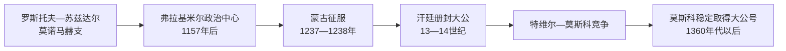

# 东北罗斯与弗拉基米尔大公世系表

[返回弗拉基米尔-苏兹达尔大公国](/%E4%BA%BA%E6%96%87%E7%A7%91%E5%AD%A6/%E5%8E%86%E5%8F%B2/%E6%AC%A7%E6%B4%B2/%E6%96%AF%E6%8B%89%E5%A4%AB/%E4%B8%9C%E6%96%AF%E6%8B%89%E5%A4%AB/%E5%BC%97%E6%8B%89%E5%9F%BA%E7%B1%B3%E5%B0%94-%E8%8B%8F%E5%85%B9%E8%BE%BE%E5%B0%94%E5%A4%A7%E5%85%AC%E5%9B%BD.md)

## 范围

本表从罗斯托夫—苏兹达尔的莫诺马赫支统治者写起，覆盖1157年弗拉基米尔成为核心以后至1389年弗拉基米尔大公号稳定并入莫斯科王朝的过程。1238年以后，“弗拉基米尔大公”通常须由金帐汗颁发诏书确认；因此王朝血缘、实际控制区与大公号持有人并不总是相同。

## 统治者完整表

| 顺序 | 统治者 | 在位 / 持有大公号 | 与前任关系及统治基础 | 关键事件与备注 |
| --- | --- | --- | --- | --- |
| 1 | 弗拉基米尔・莫诺马赫 | 1093—1125年在罗斯托夫—苏兹达尔有宗主地位 | 弗谢沃洛德一世之子 | 主要活动中心仍在南方；把东北领地交由诸子，是后续王朝支系的起点。 |
| 2 | **尤里・多尔戈鲁基** | 约1125—1157年 | 莫诺马赫之子 | 经营苏兹达尔与罗斯托夫，并多次争夺基辅；1157年死于基辅。 |
| 3 | **安德烈・博戈柳布斯基** | 1157—1174年 | 尤里之子 | 把核心移至弗拉基米尔；1169年组织联军洗劫基辅而未迁往当地，显示权力重心北移；后被近臣刺杀。 |
| 4 | 米哈伊尔・尤里耶维奇 | 1174年、1175—1176年 | 尤里之子、安德烈之弟 | 安德烈死后内战中的一方；首次即位很短，复位后不久病死。 |
| 5 | 亚罗波尔克・罗斯季斯拉维奇 | 1174—1175年 | 尤里之孙，罗斯季斯拉夫支 | 与兄弟姆斯季斯拉夫在罗斯托夫波雅尔支持下掌权，后被米哈伊尔、弗谢沃洛德击败。 |
| 6 | **弗谢沃洛德三世“大巢”** | 1176—1212年 | 尤里幼子、米哈伊尔之弟 | 扩大东北罗斯影响，众多儿子却使继承竞争加剧。 |
| 7 | 尤里二世 | 1212—1216年、1218—1238年 | 弗谢沃洛德三世之子 | 与兄康斯坦丁争位；1238年在锡季河战役中被蒙古军击杀。 |
| 8 | 康斯坦丁・弗谢沃洛多维奇 | 1216—1218年 | 弗谢沃洛德三世长子 | 在利皮察战役后夺位；死前把大公位归还弟弟尤里。 |
| 9 | **雅罗斯拉夫二世・弗谢沃洛多维奇** | 1238—1246年 | 尤里二世之弟 | 蒙古征服后重建秩序，赴蒙古帝国中心获确认；1246年死于归途，是否遭毒杀未有定论。 |
| 10 | 斯维亚托斯拉夫三世 | 1246—1248年 | 雅罗斯拉夫二世之弟 | 按旧轮转原则继位，后被侄儿米哈伊尔驱逐。 |
| 11 | 米哈伊尔・雅罗斯拉维奇“勇敢者” | 1248年 | 雅罗斯拉夫二世之子 | 驱逐叔父后不久在与立陶宛军作战中战死。 |
| 12 | 安德烈二世・雅罗斯拉维奇 | 1249—1252年 | 雅罗斯拉夫二世之子 | 从大汗系统取得大公号；因反对拔都系安排或未能纳贡遭“涅夫留伊军”讨伐，逃往瑞典。 |
| 13 | **亚历山大・涅夫斯基** | 1252—1263年 | 安德烈之兄 | 在金帐宗主权下取得大公号，维持诺夫哥罗德与东北罗斯秩序；对西方作战与对汗廷妥协并行。 |
| 14 | 雅罗斯拉夫三世・雅罗斯拉维奇 | 1264—1271年 | 亚历山大之弟，特维尔公 | 弗拉基米尔大公与特维尔支结合；与诺夫哥罗德关系反复。 |
| 15 | 瓦西里・雅罗斯拉维奇 | 1272—1276年 | 雅罗斯拉夫三世之弟，科斯特罗马公 | 依汗廷确认取得大公号；无子，死后亚历山大诸子争位。 |
| 16 | 德米特里・亚历山德罗维奇 | 1276—1281年、1283—1293/1294年 | 亚历山大・涅夫斯基长子，佩列亚斯拉夫尔公 | 与弟安德烈借不同金帐派系反复争夺；1293年“杜登军”重创东北城市。 |
| 17 | 安德烈三世・亚历山德罗维奇 | 1281—1283年、1293/1294—1304年 | 德米特里之弟，戈罗杰茨公 | 依靠金帐军事支持复位；其死后特维尔与莫斯科竞争公开化。 |
| 18 | **米哈伊尔・雅罗斯拉维奇** | 1304—1318年 | 特维尔公，雅罗斯拉夫三世之子 | 初期占优；与莫斯科尤里争夺汗诏，赴汗廷后被处死。 |
| 19 | 尤里・丹尼洛维奇 | 1318—1322年 | 莫斯科公，亚历山大・涅夫斯基之孙 | 娶乌兹别克汗之妹并取得大公号；后失宠，1325年被特维尔的德米特里杀死。 |
| 20 | 德米特里・米哈伊洛维奇“可怖之眼” | 1322—1326年 | 米哈伊尔之子，特维尔公 | 在汗廷杀死尤里，随后被乌兹别克汗处决。 |
| 21 | 亚历山大・米哈伊洛维奇 | 1326—1327年 | 德米特里之弟，特维尔公 | 1327年特维尔反金帐起事后逃亡；后来获赦，1339年仍在汗廷被处死。 |
| 22 | **伊凡一世・卡利塔** | 1328—1340年 | 莫斯科公，尤里之弟 | 协助镇压特维尔并取得大公权；1328年初可能与苏兹达尔的亚历山大分掌范围，1331年后独占。 |
| 23 | 亚历山大・瓦西里耶维奇 | 1328—1331年约 | 苏兹达尔公 | 乌兹别克汗在特维尔危机后分授权力的短期持有人；具体辖区和称号译法存在差异。 |
| 24 | 谢苗・伊凡诺维奇“骄傲者” | 1340—1353年 | 伊凡一世长子，莫斯科公 | 延续莫斯科对大公号的控制；死于黑死病，无存活男嗣。 |
| 25 | 伊凡二世“温和者” | 1353—1359年 | 谢苗之弟 | 莫斯科内部由都主教阿列克谢等辅政；死后幼子继承受挑战。 |
| 26 | 德米特里・康斯坦丁诺维奇 | 1359—1362/1363年 | 苏兹达尔—下诺夫哥罗德支 | 从汗廷取得大公号；后在莫斯科与教会压力下让位，并与德米特里・顿斯科伊联姻。 |
| 27 | **德米特里・伊凡诺维奇“顿斯科伊”** | 1362/1363—1389年 | 伊凡二世之子，莫斯科公 | 1378年沃扎河与1380年库里科沃战役获胜；1382年脱脱迷失焚毁莫斯科，但其遗嘱把大公号直接传给儿子，标志莫斯科世袭化。 |

## 册封、共治与年代异文

- 13—14世纪的“在位年”可能按获得汗诏、实际进入弗拉基米尔、前任死亡或编年年首计算，因此相邻记录常有一年差。
- 1328年前后的分授制度最具争议：伊凡・卡利塔掌握诺夫哥罗德等收益最丰地区，亚历山大・瓦西里耶维奇可能持有弗拉基米尔东部或苏兹达尔部分。表中将二人并列，避免抹去短暂共治。
- 1389年后“弗拉基米尔大公”仍是正式头衔的一部分，但已与莫斯科大公同属一人，不再作为独立世系重复维护。

## 相关笔记

- 政权过程与兴衰分析见[弗拉基米尔-苏兹达尔大公国](/%E4%BA%BA%E6%96%87%E7%A7%91%E5%AD%A6/%E5%8E%86%E5%8F%B2/%E6%AC%A7%E6%B4%B2/%E6%96%AF%E6%8B%89%E5%A4%AB/%E4%B8%9C%E6%96%AF%E6%8B%89%E5%A4%AB/%E5%BC%97%E6%8B%89%E5%9F%BA%E7%B1%B3%E5%B0%94-%E8%8B%8F%E5%85%B9%E8%BE%BE%E5%B0%94%E5%A4%A7%E5%85%AC%E5%9B%BD.md)。
- 蒙古宗主权的机制见[蒙古征服与罗斯分流](/%E4%BA%BA%E6%96%87%E7%A7%91%E5%AD%A6/%E5%8E%86%E5%8F%B2/%E6%AC%A7%E6%B4%B2/%E6%96%AF%E6%8B%89%E5%A4%AB/%E4%B8%9C%E6%96%AF%E6%8B%89%E5%A4%AB/%E8%92%99%E5%8F%A4%E5%BE%81%E6%9C%8D%E4%B8%8E%E7%BD%97%E6%96%AF%E5%88%86%E6%B5%81.md)。
- 1389年后的王朝连续性见[莫斯科大公世系表](/%E4%BA%BA%E6%96%87%E7%A7%91%E5%AD%A6/%E5%8E%86%E5%8F%B2/%E6%AC%A7%E6%B4%B2/%E6%96%AF%E6%8B%89%E5%A4%AB/%E4%B8%9C%E6%96%AF%E6%8B%89%E5%A4%AB/%E8%8E%AB%E6%96%AF%E7%A7%91%E5%A4%A7%E5%85%AC%E4%B8%96%E7%B3%BB%E8%A1%A8.md)。
