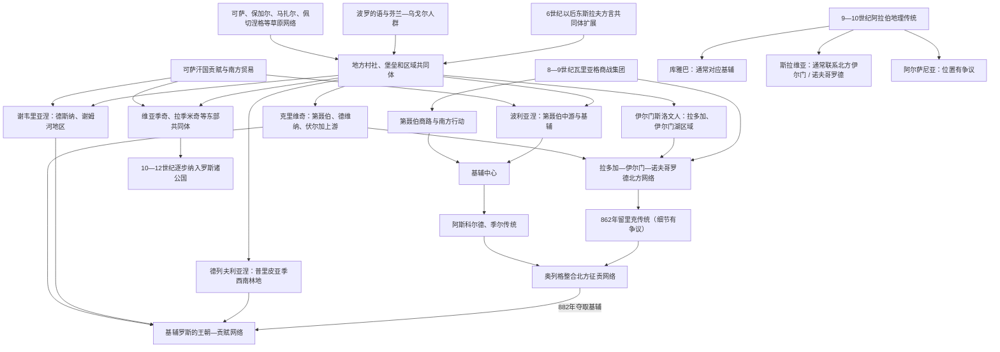

# 东斯拉夫准国家组织

## 时间

约6—9世纪；“库雅巴、斯拉维亚、阿尔萨尼亚”主要见于9—10世纪阿拉伯地理传统，不能直接当作7—8世纪两个已有固定边界的国家

## 概括

基辅罗斯形成前，东欧平原上的斯拉夫语社群以地方部落联盟、堡垒聚落、贡赋网络和河道贸易中心组织。波利亚涅、德列夫利亚涅、谢韦里亚涅、克里维奇、伊尔门斯洛文人、维亚季奇、拉季米奇等名称见于后来的《往年纪事》等资料；它们既可能是地理政治共同体，也包含后世编年者对过去的整理，不能视为血缘封闭、边界永久的“民族部落”。

8—9世纪，连接波罗的海、伏尔加河、里海、黑海和拜占庭的河路扩大。北欧瓦里亚格商战集团、斯拉夫和芬兰—乌戈尔地方精英围绕征贡、奴隶、毛皮、蜂蜡和银币贸易建立武装中心。基辅控制第聂伯中游和南方草原入口，拉多加—诺夫哥罗德方向控制北部水路；此外还有斯摩棱斯克、波洛茨克、切尔尼戈夫等中心。

阿拉伯作者后来把“罗斯”分为库雅巴、斯拉维亚和阿尔萨尼亚／阿尔塔尼亚等区域。库雅巴通常对应基辅，斯拉维亚常联系伊尔门湖和诺夫哥罗德地区，阿尔萨尼亚位置不明。它们是外部商旅地理知识中的大区或中心，并不证明存在两个或三个制度一致的民族国家。约862年的留里克传统、基辅的阿斯科尔德与季尔，以及奥列格于882年控制基辅，代表多个地方网络逐步被留里克王朝征贡体系连接。

## 政治聚合图

## 史料问题

### 《往年纪事》

《往年纪事》在12世纪初编成，保存更早编年、口述、条约和修道院传统，是研究罗斯起源的核心文本。它叙述斯拉夫和芬兰—乌戈尔部族先向瓦里亚格人纳贡，后驱逐他们，又因内乱邀请留里克及其兄弟统治；奥列格随后自诺夫哥罗德南下，于882年杀死阿斯科尔德和季尔并以基辅为“罗斯诸城之母”。

该叙事距9世纪已有两百多年，包含王朝合法性、圣经式年代和地方传统整合。862、882等日期是重要传统纪年，却不能像现代档案般逐日证实。学界争论“邀请瓦里亚格”是否真实事件、王朝记忆或解释多族国家来源的文学结构。

### 拜占庭和西欧资料

拜占庭资料记录罗斯人在830年代以后出现在黑海、君士坦丁堡和外交场合。839年一批自称“罗斯”的使节经法兰克宫廷返回，法兰克方面认出其为“瑞典人”来源，这说明北欧精英已参与某个罗斯政治团体。860年罗斯船队攻击君士坦丁堡，显示第聂伯—黑海方向已有大规模远征能力。

这些材料证明“罗斯”政治军事名称在留里克传统纪年前后出现，却未说明所有成员都是北欧人。斯拉夫、芬兰—乌戈尔、波罗的和草原人口很快共同构成罗斯社会。

### 阿拉伯和波斯地理传统

伊本·胡尔达兹比赫、伊本·鲁斯塔、马苏第等作者通过商旅报告描述罗斯贸易、习俗和地区。部分传统列出三个中心：

| 名称 | 常见对应 | 证据与问题 |
|---|---|---|
| 库雅巴（Kuyāba） | 基辅 | 对应最广为接受，可能反映第聂伯中游商业政治中心。 |
| 斯拉维亚（al-Slāwiya） | 伊尔门斯洛文人区域、诺夫哥罗德或其前身聚落 | 诺夫哥罗德考古城市层主要自10世纪发展，早期中心也可能是留里科沃镇、拉多加等北方网络。 |
| 阿尔萨尼亚／阿尔塔尼亚（al-Arsāniya） | 位置不明；曾被推测为罗斯东南、梁赞、罗斯托夫、塔曼或其他中心 | 没有共识，不应从总览中删除，也不应武断定位。 |

这些名称出现于较晚文献的商贸地理分类，不应反推成“7世纪已经建立三个罗斯国家”。有的作者区分“罗斯”和“斯拉夫人”，反映商战集团、职业或统治层身份，而非简单现代民族对立。

### 考古与钱币

拉多加、留里科沃镇、格涅兹多沃、基辅、切尔尼戈夫、什切卡维察等遗址显示堡垒、手工业、远距离商品和多种葬俗。大量阿拉伯迪拉姆银币经伏尔加和第聂伯商路进入北欧与东欧，证明贸易规模。北欧式武器和饰物与斯拉夫、芬兰—乌戈尔器物并存，支持多来源精英和人口融合。

器物不能单独确定某座城的政治首都。诺夫哥罗德名称在编年史中地位突出，但9世纪北方核心可能分布在拉多加、伊尔门湖沿岸和留里科沃镇等多个地点。

## 地方共同体

### 波利亚涅与基辅

波利亚涅被《往年纪事》置于第聂伯中游开阔地，基辅传说由基伊、谢克、霍里夫和莉比季创建。城市位于从森林地带通往黑海、草原和拜占庭的要冲，能够控制渡口、船运和贡赋。可萨势力可能曾向波利亚涅等收贡，具体时间和程度不清。

阿斯科尔德和季尔在纪事中是脱离留里克集团、占领基辅的瓦里亚格人，后于882年被奥列格杀死。拜占庭资料并不直接确认二人姓名；他们是否共同统治、是否属本地王朝、与860年君士坦丁堡远征关系均有争议。

### 伊尔门斯洛文人与北方中心

伊尔门斯洛文人居于伊尔门湖、沃尔霍夫河和拉多加周边，同楚德人、梅里亚人、维西人等芬兰—乌戈尔社群共同参与北方贸易。拉多加在8世纪已有多族商贸聚落，沃尔霍夫河通往伊尔门湖，继而可经河流陆运进入伏尔加和第聂伯水系。

留里克被纪事记为862年来统治北方，最初地点版本有拉多加或诺夫哥罗德差异。“留里克王朝”后来真实统治罗斯诸公国，但创始故事具体人物和亲属细节仍需谨慎。所谓兄弟西涅乌斯、特鲁沃尔可能是人名，也有语言解释争议。

### 克里维奇、波洛茨克与斯摩棱斯克

克里维奇分布广，覆盖第聂伯、德维纳和伏尔加上游。波洛茨克控制西德维纳通往波罗的海路线，后来发展独立王朝传统；格涅兹多沃—斯摩棱斯克区域控制第聂伯上游和陆路转运，是连接北方与基辅的关键节点。

奥列格和后继者需要逐一控制或结盟这些中心，说明罗斯不是简单将两个城市合并，而是把多个河路共同体纳入征贡和王朝据点。

### 德列夫利亚涅、谢韦里亚涅和东部群体

德列夫利亚涅居森林区，保有强势地方首领；945年伊戈尔向其重复征贡被杀的故事显示中央征贡仍需武力谈判。谢韦里亚涅、维亚季奇和拉季米奇一度向可萨纳贡，基辅统治者在9—10世纪逐步转移其贡赋。

这些共同体并非“落后部落等待建国”，而有自己的堡垒、首领和外部关系。罗斯扩张是对既有政治网络的征服、合作和再组织。

## “罗斯”名称与瓦里亚格争论

### 名称可能来源

主流语言学多把“罗斯”同北欧语、芬兰语中指瑞典划船者的词联系，认为最初指瓦里亚格商战集团，后成为统治国家和居民名称。另有斯拉夫河名、伊朗语或本地起源假说。名称来源争论曾被近代民族政治放大，但无论最初词源如何，9—10世纪罗斯社会很快以东斯拉夫语和本地人口为主体。

### 诺曼说与反诺曼说

“诺曼说”强调北欧人对王朝、贸易和国家组织的作用；“反诺曼说”强调斯拉夫社会自身已具国家形成条件，并质疑外来者决定论。二者若走向极端都会失真：

- 地方堡垒、贡赋、社会分层和贸易在瓦里亚格王朝前已存在。
- 北欧来源人物、物质文化、名字和国际资料又说明瓦里亚格确有关键军事商业作用。
- 国家形成不是某个民族单独“创造文明”，而是地方社会、河路贸易、草原和北欧集团长期融合的结果。

## 经济基础

### 河路贸易

“从瓦里亚格人到希腊人之路”连接波罗的海、涅瓦河、拉多加、沃尔霍夫、伊尔门湖、第聂伯和黑海，途中需多次陆上拖船并面对急流、草原袭击。另一条路线经伏尔加河通往里海、阿拔斯世界和中亚。

主要商品包括毛皮、蜂蜡、蜂蜜、奴隶、武器和林产品，输入银币、丝绸、玻璃、酒及奢侈品。控制河口、陆运点和冬季征贡区是早期统治者权力来源。

### 征贡与巡行

罗斯统治者后来实行冬季巡行征贡，称“波柳季耶”。这一做法可能延续瓦里亚格商战集团与地方共同体的贡赋关系。贡物用于维持武装随从、对外贸易和外交馈赠。地方负担、重复征收和首领分配容易引发反抗。

奥丽加在伊戈尔死后设置固定征贡点和数额的纪事叙述，反映王朝从流动征收向更稳定行政发展；这已进入基辅罗斯阶段。

## 宗教与文化

建国前后社群保留多神信仰、祖先和地方祭仪。瓦里亚格与斯拉夫神祇可能共同进入武士誓约，拜占庭条约中罗斯人按武器和神灵宣誓。考古葬俗从火葬、船葬、土丘到土葬多样，不能按一种墓葬简单划民族。

基督教通过克里米亚、拜占庭商人、俘虏和传教士传播。860年攻击君士坦丁堡后可能有部分罗斯受洗，阿斯科尔德也在后世传统中被视为基督徒，但国家系统基督教化要到弗拉基米尔988年前后。

## 已知人物与权力口径

| 人物 / 集团 | 大致时间 | 所在中心与地位 | 史料可信度与备注 |
|---|---|---|---|
| 基伊、谢克、霍里夫、莉比季 | 传说时代 | 基辅建城祖先 | 主要见《往年纪事》，可能保存地方首领记忆，也有明显建城传说结构。 |
| 戈斯托梅斯尔 | 9世纪传说 | 诺夫哥罗德长老或首领 | 见较晚资料，不宜列为确证君主。 |
| **留里克** | 传统为862—879年 | 拉多加／诺夫哥罗德一带统治者，留里克王朝祖先 | 王朝存在无疑，创始人生平主要来自后世纪事；具体统治范围不详。 |
| 西涅乌斯、特鲁沃尔 | 传统为862—864年 | 白湖、伊兹博尔斯克等地 | 被称留里克兄弟，姓名和独立统治真实性有争议。 |
| 阿斯科尔德、季尔 | 传统至882年 | 基辅统治者 | 纪事称其为瓦里亚格人并被奥列格杀死；是否共治及与860年远征关系不确定。 |
| **奥列格** | 传统自879年摄政，882年后在基辅掌权 | 连接北方和基辅的留里克王朝代表 | 882年通常作为基辅罗斯政治起点；其完整统治见基辅罗斯笔记。 |

本页列的是建国前后关键人物，不把传说首领强行排列成连续王朝。留里克王朝完整序列应在[基辅罗斯](/%E4%BA%BA%E6%96%87%E7%A7%91%E5%AD%A6/%E5%8E%86%E5%8F%B2/%E6%AC%A7%E6%B4%B2/%E6%96%AF%E6%8B%89%E5%A4%AB/%E4%B8%9C%E6%96%AF%E6%8B%89%E5%A4%AB/%E5%9F%BA%E8%BE%85%E7%BD%97%E6%96%AF.md)及后续罗斯诸公国专页维护。

## 重要事件与阶段

| 时间 | 事件或过程 | 结果与意义 |
|---|---|---|
| 6—7世纪 | 东斯拉夫语社群向东欧平原扩展 | 同波罗的、芬兰—乌戈尔和草原人群形成地方共同体。 |
| 7—8世纪 | 堡垒、区域联盟和贡赋关系发展 | 国家形成的地方基础出现，但没有统一中心。 |
| 8世纪中后期 | 拉多加等河路商贸中心发展 | 北欧、斯拉夫和芬兰—乌戈尔网络连接。 |
| 8—9世纪 | 阿拉伯银币大量进入东欧和北欧 | 伏尔加、里海贸易扩张，武装商团和征贡中心壮大。 |
| 约830年代 | “罗斯”使节和政治名称见于西方资料 | 北欧来源精英参与东欧政治组织。 |
| 860年 | 罗斯船队攻击君士坦丁堡 | 第聂伯—黑海集团具有大规模军事远征能力。 |
| 传统纪年862年 | 邀请留里克 | 后世王朝合法性起点，细节有争议。 |
| 传统纪年882年 | 奥列格夺取基辅 | 北方和第聂伯中游贡赋网络连接，通常视为基辅罗斯起点。 |
| 9—10世纪 | 阿拉伯地理传统记录库雅巴、斯拉维亚、阿尔萨尼亚 | 反映外部认知的多个罗斯中心，不是7世纪固定国家清单。 |
| 10世纪 | 基辅王朝逐步征服德列夫利亚涅、谢韦里亚涅、维亚季奇等 | 地方共同体被纳入更大罗斯国家，但自治和反抗延续。 |

## 国家形成机制

### 地方基础

农业剩余、堡垒、手工业和区域首领早于统一王朝存在，说明东斯拉夫社会内部已产生分层与组织。可萨贡赋和草原威胁又迫使地方形成防御与外交。

### 外部贸易和军事集团

远距离贸易需要护卫、船队、冬季征贡和对港口的控制。瓦里亚格随从提供跨区域军事网络，但其生存依赖本地人口、食物、向导和河路知识。商战集团与地方精英通婚和语言同化，逐步由职业共同体转为王朝国家核心。

### 战略中心

基辅接近拜占庭和草原，适合作为南方贸易与征战中心；北方拉多加—伊尔门网络连接波罗的海和伏尔加；斯摩棱斯克控制转运；切尔尼戈夫、波洛茨克等有自己的区域基础。奥列格的成功来自连接一系列节点，而非仅把“两个准国家”合并。

### 王朝和贡赋制度

留里克家族把亲族或随从派驻各城，要求地方纳贡、参军和参加对拜占庭远征。共同战争与条约创造“罗斯之地”政治身份，东斯拉夫语和教会文化随后把多族人口进一步整合。

## 关键辨析

- 7—8世纪不能简单写成“基辅库雅巴和诺夫哥罗德斯拉维亚两个准国家已经建立”。
- 库雅巴、斯拉维亚和阿尔萨尼亚主要来自较晚阿拉伯地理传统，性质和边界不明。
- 诺夫哥罗德城市考古层主要自10世纪显著发展，9世纪北方中心还包括拉多加和留里科沃镇。
- “部落”名称可能是政治—地理分类，不代表纯血缘或现代民族。
- 可萨收贡不是把全部东斯拉夫地区直接并入同一行政国家，控制程度因地区而异。
- 瓦里亚格人在王朝和贸易中作用重要，东斯拉夫地方社会也已有国家化基础；两者不是非此即彼。
- “罗斯”最初可能是商战集团或政治名称，后来才扩展为国家和居民称谓。
- 俄罗斯、乌克兰和白俄罗斯民族尚未在9世纪形成，均不能独占这些早期共同体。
- 882年是传统政治分界，基辅罗斯仍需数代统治者逐步征服和整合地方联盟。
- 传说人物应标明史料距离和争议，不能同有多源同时代证据的人物一律处理。

## 演变关系

- 前一节点：[斯拉夫人分化](/%E4%BA%BA%E6%96%87%E7%A7%91%E5%AD%A6/%E5%8E%86%E5%8F%B2/%E6%AC%A7%E6%B4%B2/%E6%96%AF%E6%8B%89%E5%A4%AB/%E6%96%AF%E6%8B%89%E5%A4%AB%E4%BA%BA%E5%88%86%E5%8C%96.md)。
- 后一节点：[基辅罗斯](/%E4%BA%BA%E6%96%87%E7%A7%91%E5%AD%A6/%E5%8E%86%E5%8F%B2/%E6%AC%A7%E6%B4%B2/%E6%96%AF%E6%8B%89%E5%A4%AB/%E4%B8%9C%E6%96%AF%E6%8B%89%E5%A4%AB/%E5%9F%BA%E8%BE%85%E7%BD%97%E6%96%AF.md)。
- 后续分流：[蒙古征服与罗斯分流](/%E4%BA%BA%E6%96%87%E7%A7%91%E5%AD%A6/%E5%8E%86%E5%8F%B2/%E6%AC%A7%E6%B4%B2/%E6%96%AF%E6%8B%89%E5%A4%AB/%E4%B8%9C%E6%96%AF%E6%8B%89%E5%A4%AB/%E8%92%99%E5%8F%A4%E5%BE%81%E6%9C%8D%E4%B8%8E%E7%BD%97%E6%96%AF%E5%88%86%E6%B5%81.md)。
- 返回：[东斯拉夫历史演变](/%E4%BA%BA%E6%96%87%E7%A7%91%E5%AD%A6/%E5%8E%86%E5%8F%B2/%E6%AC%A7%E6%B4%B2/%E6%96%AF%E6%8B%89%E5%A4%AB/%E4%B8%9C%E6%96%AF%E6%8B%89%E5%A4%AB/README.md)。
