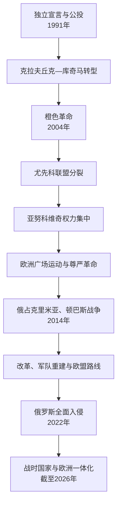

# 乌克兰

## 时间

1991年8月24日至今；本页事实核验截止2026年7月14日。

## 概括

乌克兰以苏维埃加盟共和国边界、机关和社会经济为直接国家基础，经1991年独立公投取得广泛合法性。独立后在总统、议会、寡头经济、地区利益和公民社会之间反复调整。2004年橙色革命维护重新投票，2013—2014年“尊严革命”推翻亚努科维奇政治秩序；俄罗斯随后占领并吞并克里米亚、支持顿巴斯战争。2022年俄罗斯全面入侵未能摧毁乌克兰中央国家，反而强化公民认同、军队和欧洲一体化。截止2026年7月，泽连斯基继续任总统，斯维里坚科已提交总理辞呈但官方继任程序尚未完成；战争、部分领土被占和戒严仍持续。

## 独立与国家建构：1991—2004年

### 独立合法性

1991年8月24日最高拉达宣布独立，12月1日公投约九成投赞成，所有州和克里米亚均为多数。公投不是某一地区或单一民族决定，而是共和国范围共同授权。乌克兰继承联合国席位、行政边界、军工和大量苏军；经布达佩斯备忘录等安排放弃境内核武，俄罗斯、美国和英国承诺尊重独立、主权和既有边界。

### 经济转型

苏联供应链瓦解、能源价格转为世界水平、货币和财政不稳导致产出深跌和恶性通胀。私有化形成以钢铁、煤炭、能源和媒体为基础的寡头集团。1996年采用格里夫纳并通过新宪法，国家制度逐步稳定；农业土地、工业重组和社会保障改革迟缓。

### 库奇马政治

库奇马在俄欧之间实行多向外交，签俄乌友好条约和黑海舰队安排，又推进同欧盟、北约合作。总统办公厅、地方行政和寡头媒体影响选举。记者格奥尔基・贡加泽2000年被杀及“录音门”引发抗议，削弱政府合法性。

## 橙色革命与制度竞争：2004—2010年

2004年总统选举第二轮被广泛指控舞弊，数十万人在基辅和各地和平抗议。最高法院裁定重投，尤先科获胜。事件确立公民动员和司法可改变选举结果，但没有消除寡头、腐败和制度冲突。

2004年宪法修正把部分权力从总统转向议会—政府。尤先科与总理季莫申科联盟很快分裂，议会联盟频繁变化。语言、历史记忆和外交方向被政治精英动员，但“东部亲俄、西部亲欧”的二分法过度简化：城市、阶级、世代和具体议题同样重要，2014、2022年后的社会选择也显著变化。

## 亚努科维奇与尊严革命：2010—2014年

亚努科维奇2010年当选，宪法法院恢复更强总统制，执政党通过行政、司法和经济资源集中权力。2013年政府在俄方压力和经济考量下暂停签署欧盟联系国协定，学生抗议遭暴力驱散，运动扩大为反腐败和反专断抗议。2014年2月冲突造成大量死亡；亚努科维奇离开基辅，最高拉达认定其不能履职并组织提前选举。

“尊严革命”得到广泛公民支持，也有民族主义团体参与；俄罗斯将其描述为西方支持政变。法律程序、街头暴力和权力真空均需讨论，但不能由此否认随后全国选举和政府连续性。

## 2014年战争与改革

### 克里米亚和顿巴斯

无标识俄军2014年2—3月控制克里米亚，在俄军占领和乌克兰宪法不允许地方单独改边界的条件下组织公投，俄罗斯宣布吞并。联合国大会不承认。顿涅茨克、卢甘斯克部分武装夺取机关，俄方提供人员、装备和政治支持；乌克兰发动“反恐行动”。马航MH17被击落、伊洛瓦伊斯克和杰巴利采韦战役显示冲突国际化。

2014、2015年明斯克协议规定停火、撤重武器、地方地位和边界控制顺序，各方解释不同，战斗强度下降但未停止。约一百多万人流离失所，前线地区经济社会被分割。

### 改革与国家重建

波罗申科政府重建军队、警察和国防工业，推进地方分权、公共采购、银行清理、反腐机关和天然气定价改革。2014年签欧盟联系协定，2017年获免签。2019年东正教会获得君士坦丁堡承认的自主地位，宗教和国家认同关系重组。改革有真实制度成果，也受寡头、司法和腐败阻碍。

泽连斯基2019年以反建制、反腐和求和承诺当选，其政党取得议会多数。土地市场、数字政府和基础设施推进；与寡头、宪法法院和反腐机构的冲突持续。2021年俄军在边境大规模集结。

## 2022年至今：全面战争

### 入侵与初期转折

2022年2月24日俄罗斯从北、东、南及白俄罗斯方向全面入侵，试图迅速控制基辅和主要城市。乌克兰军队、领土防卫、地方政府和民众抵抗，俄军3—4月撤出北部。布恰等地发现平民遇害和酷刑证据；俄罗斯否认蓄意犯罪，国际刑事与联合国机制持续调查。马里乌波尔被围占，南部和东部大片领土被占。

乌克兰2022年秋在哈尔科夫方向反攻并收复赫尔松市；战争随后转入阵地、炮兵、无人机和远程打击消耗。俄罗斯动员并把四州写入本国宪制，乌克兰和联合国不承认。卡霍夫卡大坝2023年毁坏造成洪灾，各方相互指责，确切直接责任仍需依据调查表述。

### 战时国家

全国戒严和总动员使选举暂停，媒体、政党和劳动力政策收紧。总统依据宪法继续任职至继任者就任；这不等于取消宪法，也不能忽略战争条件下权力集中、反腐与问责的现实争论。地方军事行政机构接管部分职能，仍属统一国家体系。

西方国家提供武器、财政和人道援助，乌克兰本国税收、军工、无人机创新和社会志愿网络同样关键。能源设施、住宅和城市遭持续导弹与无人机攻击，人口外流、伤亡、残疾、教育中断和重建债务影响将跨越数十年。

### 欧洲一体化

乌克兰2022年获欧盟候选国地位，之后启动入盟谈判与法治、司法、少数群体和经济改革。战争推动同欧盟和北约事实整合，但正式成员资格需另行完成政治和法律程序，不能把支持承诺写成已经入盟。

### 2026年状态

截至2026年7月14日，俄罗斯战争和对部分乌克兰领土的占领仍持续，联合国再次确认乌克兰国际承认边界内的主权和领土完整。前线每日变化，本笔记不固定写某一村镇控制。泽连斯基仍为总统。尤利娅・斯维里坚科已提出辞呈；最高拉达公开程序在核验时尚未完成新总理任命，因此不将媒体候选人写作现任。

## 国家与社会结构

| 层次 | 作用 |
| --- | --- |
| 总统 | 国家元首、最高统帅，主导外交国防并提名总理。 |
| 最高拉达 | 立法、预算、任命政府和监督；戒严下仍运作。 |
| 内阁与总理 | 经济、社会、能源、重建和国际财政协调。 |
| 地方自治与军事行政 | 2014年后分权增强；战时在前线和戒严地区叠加军事行政。 |
| 武装力量与安全机构 | 2022年后规模扩大，文官监督、动员公平与采购反腐是持续议题。 |
| 公民社会与媒体 | 革命、志愿支援、监督和战时信息动员的重要力量，同时面对安全限制。 |
| 语言与宗教 | 乌克兰语公共地位加强，俄语仍为许多公民日常语言；语言使用不等同政治忠诚。 |

## 重要事件

| 时间 | 事件 | 影响 |
| --- | --- | --- |
| 1991年8、12月 | 独立宣言与公投 | 现代国家合法性基础。 |
| 1994年 | 克拉夫丘克败选、核裁军安排 | 和平轮替与国际安全承诺。 |
| 1996年 | 宪法、格里夫纳 | 国家制度与货币稳定。 |
| 2004年 | 橙色革命 | 重新投票并维护选举竞争。 |
| 2013—2014年 | 欧洲广场运动 / 尊严革命 | 政权更替与欧盟路线转折。 |
| 2014年 | 俄占克里米亚、顿巴斯战争 | 主权和安全危机。 |
| 2014—2019年 | 分权、军队与反腐改革 | 国家能力重建。 |
| 2019年 | 泽连斯基当选 | 反建制和平改革授权。 |
| 2022年2月 | 俄罗斯全面入侵 | 战时国家、全民抵抗和大规模破坏。 |
| 2022年6月 | 欧盟候选国 | 欧洲一体化制度化。 |
| 2022年9—11月 | 哈尔科夫反攻、收复赫尔松市 | 入侵初期后最大战场转折。 |
| 2026年7月 | 总理辞职程序 | 战时内阁过渡，继任未在截止时完成。 |

## 发展与风险分析

乌克兰独立的支撑来自公投边界、共和国机关、教育文化、公民社会和多次竞争选举。长期困难包括寡头经济、司法与腐败、人口下降、区域战争创伤和能源依赖。俄罗斯军事压力是决定性外部因素；国内改革质量、盟友支持持续性、动员公平和战后安全安排将决定未来。不能用“东西文明冲突”单因解释三十余年变化。

## 国家领导

全部正式、代理总统和政府首脑，以及2026年7月辞职程序，见[乌克兰国家领导表](/%E4%BA%BA%E6%96%87%E7%A7%91%E5%AD%A6/%E5%8E%86%E5%8F%B2/%E6%AC%A7%E6%B4%B2/%E6%96%AF%E6%8B%89%E5%A4%AB/%E4%B8%9C%E6%96%AF%E6%8B%89%E5%A4%AB/%E4%B9%8C%E5%85%8B%E5%85%B0%E5%9B%BD%E5%AE%B6%E9%A2%86%E5%AF%BC%E8%A1%A8.md)。

## 演变关系

- 前一节点：[乌克兰苏维埃政权](/%E4%BA%BA%E6%96%87%E7%A7%91%E5%AD%A6/%E5%8E%86%E5%8F%B2/%E6%AC%A7%E6%B4%B2/%E6%96%AF%E6%8B%89%E5%A4%AB/%E4%B8%9C%E6%96%AF%E6%8B%89%E5%A4%AB/%E4%B9%8C%E5%85%8B%E5%85%B0%E8%8B%8F%E7%BB%B4%E5%9F%83%E6%94%BF%E6%9D%83.md)。
- 历史锚点：[基辅罗斯](/%E4%BA%BA%E6%96%87%E7%A7%91%E5%AD%A6/%E5%8E%86%E5%8F%B2/%E6%AC%A7%E6%B4%B2/%E6%96%AF%E6%8B%89%E5%A4%AB/%E4%B8%9C%E6%96%AF%E6%8B%89%E5%A4%AB/%E5%9F%BA%E8%BE%85%E7%BD%97%E6%96%AF.md)、[哥萨克酋长国](/%E4%BA%BA%E6%96%87%E7%A7%91%E5%AD%A6/%E5%8E%86%E5%8F%B2/%E6%AC%A7%E6%B4%B2/%E6%96%AF%E6%8B%89%E5%A4%AB/%E4%B8%9C%E6%96%AF%E6%8B%89%E5%A4%AB/%E5%93%A5%E8%90%A8%E5%85%8B%E9%85%8B%E9%95%BF%E5%9B%BD.md)。
- 战争对照：[俄罗斯](/%E4%BA%BA%E6%96%87%E7%A7%91%E5%AD%A6/%E5%8E%86%E5%8F%B2/%E6%AC%A7%E6%B4%B2/%E6%96%AF%E6%8B%89%E5%A4%AB/%E4%B8%9C%E6%96%AF%E6%8B%89%E5%A4%AB/%E4%BF%84%E7%BD%97%E6%96%AF.md)。
