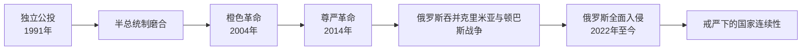

# 乌克兰国家领导表

[返回乌克兰](/%E4%BA%BA%E6%96%87%E7%A7%91%E5%AD%A6/%E5%8E%86%E5%8F%B2/%E6%AC%A7%E6%B4%B2/%E6%96%AF%E6%8B%89%E5%A4%AB/%E4%B8%9C%E6%96%AF%E6%8B%89%E5%A4%AB/%E4%B9%8C%E5%85%8B%E5%85%B0.md)

## 范围与核验日期

本表覆盖1991年独立前后连续任职的国家元首和政府首脑，截止2026年7月14日。乌克兰在戒严期间依法暂停全国选举；总统任期与继续履职的宪法问题、总理辞职程序和领土占领状态分别说明，不把俄罗斯扶植的占领当局列为乌克兰合法国家领导。

## 国家元首完整表

| 顺序 | 国家元首 | 任期 | 地位与关键事件 |
| --- | --- | --- | --- |
| 1 | **列昂尼德・克拉夫丘克** | 1991年8月24日—12月5日以最高拉达主席履行元首职能；1991年12月5日—1994年7月19日任总统 | 主持独立宣言、公投与别洛韦日协议；提前选举中败给库奇马，实现首次总统和平轮替。 |
| 2 | 列昂尼德・库奇马 | 1994年7月19日—2005年1月23日 | 两届总统；推动新宪法、货币改革和多向外交，后期因权力集中、腐败争议和选举危机受抗议。 |
| 3 | 维克托・尤先科 | 2005年1月23日—2010年2月25日 | 橙色革命后重新投票当选；亲欧路线、宪制分权与执政联盟内斗并存。 |
| 4 | 维克托・亚努科维奇 | 2010年2月25日—2014年2月22日 | 暂停签署欧盟联系国协定引发抗议；离开基辅后，最高拉达认定其不能履职并提前选举。其称被政变推翻，法律与政治评价存在对立。 |
| 5 | 亚历山大・图尔奇诺夫 | 2014年2月23日—6月7日代理总统 | 最高拉达主席依法代行；任内发生俄罗斯占领并吞并克里米亚、顿巴斯武装冲突开始。 |
| 6 | 彼得罗・波罗申科 | 2014年6月7日—2019年5月20日 | 战时重建军队、签署欧盟联系协定并推动东正教会自主；明斯克协议未能终结战争。 |
| 7 | **弗拉基米尔・泽连斯基** | 2019年5月20日至今 | 2019年当选；2022年俄罗斯全面入侵后领导战时国家。截止2026年7月14日仍任总统；在戒严与战争状态下未举行原定总统选举，依宪法继续履职至新总统就任。 |

## 政府首脑完整表

| 顺序 | 政府首脑 | 任期 | 正式 / 代理及说明 |
| --- | --- | --- | --- |
| 1 | 维托尔德・福金 | 1990年10月23日—1992年10月1日 | 由乌克兰苏维埃政府首脑过渡为独立国家首任总理。 |
| 2 | 瓦连京・西蒙年科 | 1992年10月2—13日代理 | 第一副总理短期代行。 |
| 3 | 列昂尼德・库奇马 | 1992年10月13日—1993年9月22日 | 推动扩大政府经济权限，辞职后次年当选总统。 |
| 4 | 叶菲姆・兹维亚吉利斯基 | 1993年9月22日—1994年6月16日代理 | 第一副总理代行，未作为正式总理获完整任命。 |
| 5 | 维塔利・马索尔 | 1994年6月16日—1995年3月6日 | 曾任苏维埃乌克兰政府首脑，独立后再次组阁。 |
| 6 | 叶夫亨・马尔丘克 | 1995年3月6日代理、6月8日正式—1996年5月27日 | 安全部门出身；1996年宪法制定前夕离任。 |
| 7 | 帕夫洛・拉扎连科 | 1996年5月28日—1997年7月2日 | 经济寡头化时期总理，后在美国因洗钱等罪被定罪。 |
| 8 | 瓦西里・杜尔迪涅茨 | 1997年7月2—30日代理 | 第一副总理代行。 |
| 9 | 瓦列里・普斯托沃伊坚科 | 1997年7月16/30日—1999年12月22日 | 正式任命与前任代理交接在不同名录中按提名、批准或内阁就职记日略有差别。 |
| 10 | 维克托・尤先科 | 1999年12月22日—2001年5月29日 | 金融改革与能源结算整顿；后成为反对派和总统。 |
| 11 | 阿纳托利・基纳赫 | 2001年5月29日—2002年11月21日 | 库奇马时期总理。 |
| 12 | 维克托・亚努科维奇 | 2002年11月21日—2005年1月5日；2006年8月4日—2007年12月18日 | 两次组阁；2004年选举危机时由米科拉・阿扎罗夫短期代行部分职务，后任总统。 |
| 13 | 尤利娅・季莫申科 | 2005年1月24日代理、2月4日—9月8日正式；2007年12月18日—2010年3月11日 | 橙色革命联盟领袖，两次任总理；与总统关系反复。 |
| 14 | 尤里・叶哈努罗夫 | 2005年9月8日代理、9月22日—2006年8月4日正式 | 橙色联盟第一次分裂后的政府首脑。 |
| 15 | 亚历山大・图尔奇诺夫 | 2010年3月4—11日代理 | 季莫申科政府被不信任后短期代行。 |
| 16 | 米科拉・阿扎罗夫 | 2010年3月11日—2014年1月28日 | 亚努科维奇时期总理；大规模抗议中辞职。 |
| 17 | 谢尔希・阿尔布佐夫 | 2014年1月28日—2月27日代理 | 第一副总理代行；亚努科维奇政权崩溃后离境。 |
| 18 | 阿尔谢尼・亚采纽克 | 2014年2月27日—2016年4月14日 | 尊严革命后组阁；应对克里米亚危机、顿巴斯战争和紧缩改革。 |
| 19 | 弗拉基米尔・格罗伊斯曼 | 2016年4月14日—2019年8月29日 | 推动地方分权、公共采购和医疗等改革。 |
| 20 | 奥列克西・洪恰鲁克 | 2019年8月29日—2020年3月4日 | 泽连斯基任内首位总理，任期约半年。 |
| 21 | 杰尼斯・什梅加尔 | 2020年3月4日—2025年7月17日 | 新冠疫情与2022年全面入侵时期长期政府首脑；维持战时财政与国际援助协调。 |
| 22 | **尤利娅・斯维里坚科** | 2025年7月17日至2026年7月14日核验时 | 最高拉达于2025年任命。2026年7月已提交辞呈；截至7月14日可核的最高拉达公开程序显示辞职议案仍在审议链中，新总理尚未获任命，因此本表不提前写入继任者。 |

## 2026年7月政府过渡说明

- 总理辞职若获最高拉达接受，将引起内阁总辞；按宪法，原内阁在新内阁开始工作前继续履行职权。
- 截止核验时，官方议案记录与即时新闻更新存在时间差。本表采用“已提交辞呈、正式继任未完成”的保守写法；不把媒体报道的候选人当作已任命总理。
- 这项过渡不改变总统、最高拉达、武装力量和地方军事行政机构的法定连续性。

## 战争、主权与实际控制

- 2014年俄罗斯占领并宣布吞并克里米亚；乌克兰和联合国大会多数国家不承认该变更。顿涅茨克、卢甘斯克部分地区随后由俄支持的武装控制。
- 2022年2月24日俄罗斯发动全面入侵。俄罗斯在2022年又宣布吞并顿涅茨克、卢甘斯克、扎波罗热和赫尔松四州，但并未完整控制所主张的领土，联合国继续确认乌克兰在国际承认边界内的主权与领土完整。
- 截止2026年7月14日，战争和俄罗斯对乌克兰部分领土的占领仍在持续。前线和实际控制可变，笔记不以某日战线替代法定主权判断。
- 乌克兰在战争期间实行戒严和总动员；中央政府仍在基辅运作，地方军政机关不构成独立政权。

## 权力结构

- 乌克兰为半总统制共和国。总统主导外交、国防和国家安全，并提名总理；最高拉达任命总理和多数内阁成员、立法和监督政府。
- 总理负责经济、预算、公共服务和行政协调。战争时期总统、安全与国防委员会、总参谋部、内阁和议会共同运作，实际决策比和平时期更集中。
- 总统办公室影响显著，但不等于宪法上的独立国家机关；分析人物权力时应与正式职位分开。

## 相关笔记

- 国家过程、革命与战争见[乌克兰](/%E4%BA%BA%E6%96%87%E7%A7%91%E5%AD%A6/%E5%8E%86%E5%8F%B2/%E6%AC%A7%E6%B4%B2/%E6%96%AF%E6%8B%89%E5%A4%AB/%E4%B8%9C%E6%96%AF%E6%8B%89%E5%A4%AB/%E4%B9%8C%E5%85%8B%E5%85%B0.md)。
- 苏维埃前置阶段见[乌克兰苏维埃政权](/%E4%BA%BA%E6%96%87%E7%A7%91%E5%AD%A6/%E5%8E%86%E5%8F%B2/%E6%AC%A7%E6%B4%B2/%E6%96%AF%E6%8B%89%E5%A4%AB/%E4%B8%9C%E6%96%AF%E6%8B%89%E5%A4%AB/%E4%B9%8C%E5%85%8B%E5%85%B0%E8%8B%8F%E7%BB%B4%E5%9F%83%E6%94%BF%E6%9D%83.md)。
- 与俄罗斯关系对照见[俄罗斯](/%E4%BA%BA%E6%96%87%E7%A7%91%E5%AD%A6/%E5%8E%86%E5%8F%B2/%E6%AC%A7%E6%B4%B2/%E6%96%AF%E6%8B%89%E5%A4%AB/%E4%B8%9C%E6%96%AF%E6%8B%89%E5%A4%AB/%E4%BF%84%E7%BD%97%E6%96%AF.md)和[俄罗斯国家领导表](/%E4%BA%BA%E6%96%87%E7%A7%91%E5%AD%A6/%E5%8E%86%E5%8F%B2/%E6%AC%A7%E6%B4%B2/%E6%96%AF%E6%8B%89%E5%A4%AB/%E4%B8%9C%E6%96%AF%E6%8B%89%E5%A4%AB/%E4%BF%84%E7%BD%97%E6%96%AF%E5%9B%BD%E5%AE%B6%E9%A2%86%E5%AF%BC%E8%A1%A8.md)。
