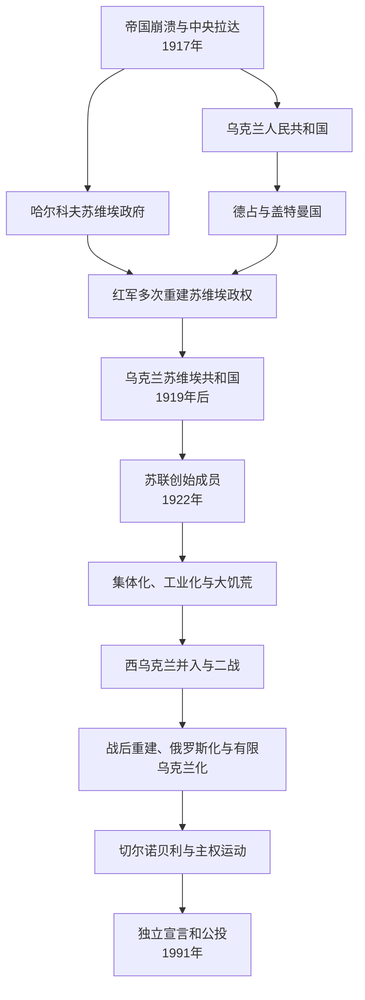

# 乌克兰苏维埃政权

## 时间

1917年12月—1991年8/12月。1919年后以乌克兰社会主义苏维埃共和国为稳定名号，1936年改称乌克兰苏维埃社会主义共和国；1991年8月24日宣布独立、12月1日公投确认。

## 概括

乌克兰苏维埃政权不是1917年一次建成。中央拉达、乌克兰人民共和国、哈尔科夫苏维埃政府、德军支持的盖特曼国、恢复的人民共和国、地方农民军、白军和波兰军在1917—1921年反复争夺。布尔什维克最终以红军、城市工业和中央资源建立乌克兰苏维埃共和国，1922年成为苏联创始成员。工业化把顿巴斯和第聂伯河流域建成重工业核心，集体化和1932—1933年大饥荒造成巨大死亡；二战占领与大屠杀又摧毁社会。1939—1954年边界扩展形成今日大体疆域。战后乌克兰在苏联内兼具重要工业、农业、科技和政治地位，切尔诺贝利、语言文化与主权运动促成1991年独立。

## 1917—1921年：多政权战争

### 中央拉达与人民共和国

二月革命后，基辅中央拉达由米哈伊洛・赫鲁舍夫斯基等领导，先要求俄国内自治。十月革命后逐步宣布乌克兰人民共和国，1918年1月宣布完全独立。社会革命党、军队、农民和城市不同政治力量对土地、战争与国家形式意见分裂。

### 哈尔科夫苏维埃政府

布尔什维克在基辅苏维埃代表大会失利后转往哈尔科夫，1917年12月另开代表大会并建立苏维埃政府，请求红军支援。红军1918年初攻入基辅，随后因布列斯特和约被德奥军迫退。早期“乌克兰苏维埃共和国”名称、首都和机构多次变化，不应把1917年直接写成稳定加盟共和国。

### 盖特曼、督政府与各方战争

德奥占领支持帕夫洛・斯科罗帕茨基建立乌克兰国（盖特曼国），恢复私有土地和行政秩序但依赖占领军。德国战败后，西蒙・彼得留拉等督政府推翻盖特曼，恢复人民共和国。西部另有西乌克兰人民共和国，同波兰争夺东加利西亚，后名义联合。

红军、邓尼金和弗兰格尔白军、马赫诺无政府主义农民军、波兰和人民共和国军队在乌克兰反复推进。1920年彼得留拉与波兰结盟攻基辅，红军反攻至华沙失败；1921年《里加和约》使西沃里尼亚和东加利西亚归波兰，苏维埃乌克兰控制中东部。克里米亚1921年成为俄罗斯联邦内自治共和国，当时并非乌克兰领土。

## 1920年代：共和国与乌克兰化

1922年乌克兰以名义主权共和国身份参与创建苏联，外交、军队和重要经济逐步归联盟中央。1920年代“本土化”在乌克兰表现为乌克兰语教育、出版、行政和干部培养，城市文化迅速发展；同时新经济政策恢复农业与商业。

到1920年代末，斯大林转向中央集权，许多文化人物被指“民族主义”并遭镇压，“被处决的文艺复兴”概括1930年代知识界损失。共和国边界和行政仍保留，形成后来独立国家的机构框架。

## 集体化、工业化与大饥荒

- 顿巴斯煤炭、第聂伯水电站、冶金和机械成为苏联第一批五年计划核心。城市人口、技术教育和劳工迁移增长。
- 农村被强制集体化，“富农”家庭遭没收、流放。1932年高征粮、惩罚、封锁迁徙、黑名单和没收口粮在歉收与行政混乱上造成灾难。
- 1932—1933年数百万乌克兰居民死亡，精确人数因边界、超额死亡和资料方法不同。乌克兰及多国认定为针对乌克兰民族的种族灭绝；部分学者强调全苏农业政策及哈萨克斯坦、北高加索等地同时受灾，对特定灭绝意图的法律判断有争论。无论定性，国家政策对饥荒发生和扩大负有决定性责任。
- 1937—1938年大清洗打击党政干部、知识分子、军人和普通居民，共和国领导层被大规模更换。

## 边界变化与第二次世界大战

### 1939—1941年

苏德条约后，苏军进入波兰东部；西沃里尼亚和东加利西亚经苏联组织的程序并入乌克兰共和国。1940年从罗马尼亚取得北布科维纳、赫尔察地区和比萨拉比亚部分。当地进行国有化、土地重分和教育变化，也发生逮捕、驱逐和政治镇压。

### 德国及轴心国占领

1941年德国进攻后，乌克兰大部被占。纳粹以粮食、劳力和殖民空间为目标，制造饥饿、村庄报复、强迫劳动和战俘死亡；在巴比亚尔等地枪杀犹太人，罗马尼亚控制区也发生大屠杀。乌克兰辅助警察和民族主义组织部分成员参与迫害，另有乌克兰人救助受害者或在红军、游击队中作战，不能以集体民族责任替代个体和组织责任。

乌克兰民族主义者组织1941年在利沃夫宣布恢复国家，旋遭德方镇压；乌克兰反抗军此后同时与德军、苏军和波兰力量冲突，并卷入沃里尼亚对波兰平民的大规模屠杀及报复。1943—1944年红军收复乌克兰，战争详情见[苏联卫国战争](/%E4%BA%BA%E6%96%87%E7%A7%91%E5%AD%A6/%E5%8E%86%E5%8F%B2/%E6%AC%A7%E6%B4%B2/%E6%96%AF%E6%8B%89%E5%A4%AB/%E4%B8%9C%E6%96%AF%E6%8B%89%E5%A4%AB/%E8%8B%8F%E8%81%94%E5%8D%AB%E5%9B%BD%E6%88%98%E4%BA%89.md)。

### 战后边界

1945年外喀尔巴阡乌克兰由捷克斯洛伐克割让并入。1954年苏联最高机关把克里米亚州从俄罗斯共和国划入乌克兰共和国，当时是联盟内部行政调整；1991年后成为国际承认乌克兰疆域的一部分。边界形成不是“自古固定”，也不削弱现代国际法边界。

## 战后共和国

重建优先重工业和能源，农业恢复缓慢。西部对乌克兰反抗军的清剿延续至1950年代，伴随武装冲突、驱逐和集体化。赫鲁晓夫时期文化管控一度放松，乌克兰干部在联盟政治中影响上升。谢列斯特强调共和国经济文化利益，1972年被撤；谢尔比茨基时期工业稳定、俄罗斯语在城市和高等教育中扩张，持不同政见者遭监禁或流放。

乌克兰是核工业、航天、军工、煤钢和农业重地，也承受环境污染。1986年切尔诺贝利核电站事故造成疏散、辐射和长期健康环境影响；初期信息隐瞒强化对中央不信任。

## 走向独立

1989年人民运动把语言、历史记忆、环保和民主诉求结合。1990年最高拉达通过国家主权宣言；共和国共产党精英也逐步转向维护本地权力。1991年八一九事件失败后，最高拉达8月24日宣布独立。12月1日全共和国公投约九成支持，所有地区多数赞成，包括克里米亚和顿巴斯；同日克拉夫丘克当选总统。乌克兰公投使任何无乌克兰的新联盟难以成立。

## 统治结构

| 层次 | 实际作用 |
| --- | --- |
| 乌克兰共产党 | 第一书记是实际最高政治负责人，受苏共中央干部体系约束。 |
| 最高苏维埃主席团 / 最高拉达 | 长期为法定元首和立法机关，改革后取得真实主权决策能力。 |
| 人民委员会 / 部长会议 | 管理共和国工业、农业、教育和地方行政，核心计划受联盟部委控制。 |
| 联盟部委 | 直接管理军工、能源、交通等重要企业，使共和国经济跨区域一体化。 |
| 地方苏维埃 | 执行计划和社会服务，受同级党委领导。 |
| 文化与语言机关 | 教育、出版和科学院既培养乌克兰国家文化，也受意识形态和俄罗斯化政策约束。 |

## 重要事件

| 时间 | 事件 | 影响 |
| --- | --- | --- |
| 1917年12月 | 哈尔科夫苏维埃政府 | 乌克兰苏维埃国家线开端。 |
| 1918—1921年 | 多政权战争 | 红军最终控制中东部，西部归波兰等国。 |
| 1922年 | 加入苏联 | 成为创始共和国。 |
| 1920年代 | 乌克兰化 | 语言文化和共和国干部发展。 |
| 1932—1933年 | 大饥荒 | 国家政策造成数百万死亡。 |
| 1937—1938年 | 大清洗 | 政治文化精英遭系统镇压。 |
| 1939—1940年 | 西部领土并入 | 现代边界向西扩展并伴随镇压。 |
| 1941—1944年 | 轴心国占领 | 大屠杀、强迫劳动和毁灭性战争。 |
| 1945年 | 外喀尔巴阡并入 | 西南边界形成。 |
| 1954年 | 克里米亚州划入 | 联盟内部行政调整，1991年后具国际边界意义。 |
| 1986年 | 切尔诺贝利事故 | 环境灾难与政治信任危机。 |
| 1990—1991年 | 主权宣言、独立宣言和公投 | 苏维埃阶段终结。 |

## 兴衰与终结原因

苏维埃政权的建立依靠红军、城市工业、布尔什维克组织和俄国中央资源，也利用农民土地诉求；其稳定来自工业化、教育、城市化、社会保障和联盟市场。衰落源于经济停滞、语言文化不满、历史创伤、环境事故、党权合法性下降及联盟—共和国权力冲突。八一九事件是直接触发，公投提供无可替代的民主合法性，苏联解体则完成国际法上的独立。

## 领导结构

乌克兰共产党第一书记主线可保留为实际领导，但法定国家元首与政府首脑不应混入同表。为避免重复，联盟级完整三表见[苏联国家领导表](/%E4%BA%BA%E6%96%87%E7%A7%91%E5%AD%A6/%E5%8E%86%E5%8F%B2/%E6%AC%A7%E6%B4%B2/%E6%96%AF%E6%8B%89%E5%A4%AB/%E4%B8%9C%E6%96%AF%E6%8B%89%E5%A4%AB/%E8%8B%8F%E8%81%94%E5%9B%BD%E5%AE%B6%E9%A2%86%E5%AF%BC%E8%A1%A8.md)；乌克兰独立后完整领导表见[乌克兰国家领导表](/%E4%BA%BA%E6%96%87%E7%A7%91%E5%AD%A6/%E5%8E%86%E5%8F%B2/%E6%AC%A7%E6%B4%B2/%E6%96%AF%E6%8B%89%E5%A4%AB/%E4%B8%9C%E6%96%AF%E6%8B%89%E5%A4%AB/%E4%B9%8C%E5%85%8B%E5%85%B0%E5%9B%BD%E5%AE%B6%E9%A2%86%E5%AF%BC%E8%A1%A8.md)。

## 演变关系

- 前置：[俄罗斯帝国](/%E4%BA%BA%E6%96%87%E7%A7%91%E5%AD%A6/%E5%8E%86%E5%8F%B2/%E6%AC%A7%E6%B4%B2/%E6%96%AF%E6%8B%89%E5%A4%AB/%E4%B8%9C%E6%96%AF%E6%8B%89%E5%A4%AB/%E4%BF%84%E7%BD%97%E6%96%AF%E5%B8%9D%E5%9B%BD.md)、[哥萨克酋长国](/%E4%BA%BA%E6%96%87%E7%A7%91%E5%AD%A6/%E5%8E%86%E5%8F%B2/%E6%AC%A7%E6%B4%B2/%E6%96%AF%E6%8B%89%E5%A4%AB/%E4%B8%9C%E6%96%AF%E6%8B%89%E5%A4%AB/%E5%93%A5%E8%90%A8%E5%85%8B%E9%85%8B%E9%95%BF%E5%9B%BD.md)及1917—1921年非苏维埃乌克兰政权。
- 并列：[苏俄与苏联](/%E4%BA%BA%E6%96%87%E7%A7%91%E5%AD%A6/%E5%8E%86%E5%8F%B2/%E6%AC%A7%E6%B4%B2/%E6%96%AF%E6%8B%89%E5%A4%AB/%E4%B8%9C%E6%96%AF%E6%8B%89%E5%A4%AB/%E8%8B%8F%E4%BF%84%E4%B8%8E%E8%8B%8F%E8%81%94.md)、[白俄罗斯苏维埃政权](/%E4%BA%BA%E6%96%87%E7%A7%91%E5%AD%A6/%E5%8E%86%E5%8F%B2/%E6%AC%A7%E6%B4%B2/%E6%96%AF%E6%8B%89%E5%A4%AB/%E4%B8%9C%E6%96%AF%E6%8B%89%E5%A4%AB/%E7%99%BD%E4%BF%84%E7%BD%97%E6%96%AF%E8%8B%8F%E7%BB%B4%E5%9F%83%E6%94%BF%E6%9D%83.md)。
- 后续：[乌克兰](/%E4%BA%BA%E6%96%87%E7%A7%91%E5%AD%A6/%E5%8E%86%E5%8F%B2/%E6%AC%A7%E6%B4%B2/%E6%96%AF%E6%8B%89%E5%A4%AB/%E4%B8%9C%E6%96%AF%E6%8B%89%E5%A4%AB/%E4%B9%8C%E5%85%8B%E5%85%B0.md)。
