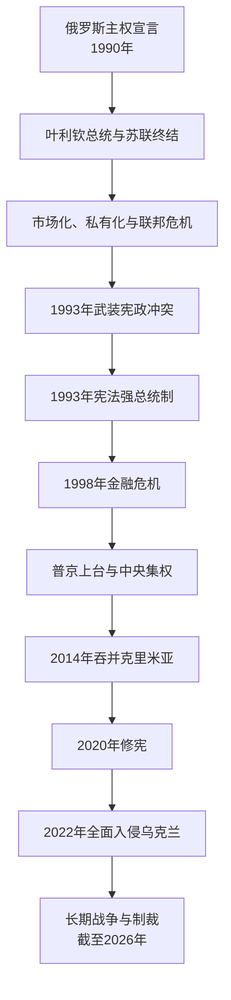

# 俄罗斯

## 时间

1991年12月25日至今；本页事实核验截止2026年7月14日。

## 概括

俄罗斯联邦由俄罗斯苏维埃联邦社会主义共和国转化而来。它承续苏联联合国席位、核武主要控制和多数中央机关资产安排，但其他前加盟共和国也各自继承本国领土、机关和国际义务，因此不宜笼统称俄罗斯为“苏联唯一继承国”。1990年代市场化、私有化、联邦冲突和1993年宪政危机重塑国家；1999年后普京政府集中总统、联邦和战略经济权力。2014年吞并克里米亚、2022年全面入侵乌克兰使国家进入长期战争、制裁和军事动员。截止2026年7月，普京任总统，米舒斯京任总理；战争仍持续，俄罗斯对乌克兰领土的吞并主张不获联合国承认。

## 国家形成与苏联遗产

1990年俄罗斯共和国通过主权宣言，1991年叶利钦成为首位民选总统。八一九事件失败后，俄罗斯政府接管许多联盟机构。12月俄、乌、白签署别洛韦日协议，苏联停止存在；戈尔巴乔夫辞职后，俄罗斯将国名改为俄罗斯联邦。

俄罗斯在各前加盟共和国同意或默认下承续苏联安理会常任席位，并承担主要外债、取得多数海外资产；白俄罗斯、乌克兰、哈萨克斯坦境内核武经协议转移给俄罗斯。但苏联解体产生十五个主权国家，边界原则上沿原加盟共和国行政界。俄语人口、黑海舰队、能源和军事基地使后续关系持续复杂。

## 叶利钦时期：1991—1999年

### 市场转型与社会代价

政府解除价格控制、紧缩财政并大规模私有化。商品短缺很快缓解，通胀、储蓄蒸发、失业和贫困却急升；凭证私有化和“贷款换股份”使少数金融工业集团取得战略资产。国家税收和工资支付困难，寿命、公共卫生与社会安全恶化。市场化并非单一政策失败：苏联供应体系瓦解、油价、机构薄弱和权力寻租共同作用。

### 1993年宪政危机

总统与人民代表大会围绕改革、任命和宪法权限冲突。叶利钦宣布解散议会，议会认定违宪并宣布副总统鲁茨科伊代理总统。街头冲突后军队炮击“白宫”，反对派投降。12月公投通过新宪法，确立总统可任命政府、发布法令、解散杜马的强权框架。危机以暴力解决，深刻影响后来的权力结构。

### 联邦与车臣战争

苏联解体后，民族共和国和地区争取“主权”。1992年联邦条约、双边协议与财政妥协维持多数地区。车臣领导人宣布独立，俄军1994年进入；第一次战争造成格罗兹尼毁灭和平民伤亡，1996年停火推迟地位问题。1999年达吉斯坦冲突和俄罗斯城市爆炸后第二次战争开始，联邦重新控制车臣，并以卡德罗夫家族地方政权换取效忠。

### 1998年金融危机与接班

财政赤字、短期债务、油价下跌和亚洲危机导致1998年违约、卢布贬值，政府频繁更换。经济随后因贬值和能源出口恢复。1999年叶利钦任命普京为总理，12月31日提前辞职，普京代理总统。

## 普京前两届与梅德韦杰夫时期：2000—2012年

### 中央集权和经济恢复

高油价、闲置产能、税制改革和较稳定财政带来增长、工资和消费恢复。联邦设大区总统代表，地区法律被统一；2004年后州长一度改为中央提名。政府打击不服从的寡头，尤科斯被拆分，战略能源企业重新由国家控制。媒体所有权、选举规则和政党门槛变化削弱竞争，安全机构出身精英影响扩大。

### 战争、安全与外交

第二次车臣战争逐步转为地方代理治理，恐怖袭击包括2002年剧院劫持和2004年别斯兰事件。2008年俄罗斯与格鲁吉亚战争后承认阿布哈兹和南奥塞梯独立，多数国家仍视其为格鲁吉亚领土。梅德韦杰夫任总统、普京任总理时期推进有限现代化和警察改革，同时总统任期改为六年；实际政治主导权在二人及共同精英网络间分配。

## 2012年以后：集中、民族主义与战争

### 国内政治

普京2012年重任总统，面对反选举舞弊抗议。政府加强对集会、非政府组织、媒体和网络的限制，以“外国代理人”等法律管控反对力量。阿列克谢・纳瓦利内等反对派遭刑事追诉；纳瓦利内2024年死于北极圈监狱，官方与反对派对责任解释尖锐对立。国家同时维持养老金、基建和数字公共服务，政治竞争空间则持续收缩。

### 2014年克里米亚与顿巴斯

乌克兰亚努科维奇离任后，俄罗斯军队控制克里米亚，组织未经乌克兰同意的公投并宣布吞并。联合国大会确认乌克兰领土完整、不承认公投改变地位。顿涅茨克和卢甘斯克武装在俄方支持下控制部分地区，明斯克协议未能解决战争。吞并在俄罗斯国内提升政府支持，也引发首轮长期制裁。

### 2020年修宪

宪法修订增加社会条款、调整政府和议会权限、强化国内法优先叙事，并“重置”普京既往总统任期，使其可继续参选。形式上杜马对总理和部长确认权增加，战略、安全和实际政治仍由总统主导。

### 2022年至今的俄乌战争

2022年2月24日俄罗斯以“特别军事行动”为名全面入侵乌克兰，从俄罗斯、白俄罗斯和被占区多线进攻。初期未能控制基辅，部队从北部撤退；布恰等地发现平民被杀，国际调查持续。战争转为东部和南部消耗战。俄罗斯2022年宣布吞并顿涅茨克、卢甘斯克、扎波罗热和赫尔松四州，但从未完整控制其声称边界，联合国大会谴责所谓公投和吞并。

俄罗斯实行“部分动员”，扩大合同兵、军工生产和战时预算；瓦格纳集团参与作战，其首领普里戈任2023年发动短暂兵变后在坠机中死亡。西方制裁限制金融、技术和能源交易，俄罗斯将贸易转向中国、印度等市场并通过第三国获取物资。经济在军费、资本管制与能源收入支持下避免即时崩溃，但通胀、劳动力短缺、技术依赖、地区伤亡差异和长期财政可持续性构成压力。

截至2026年7月14日，联合国仍称俄罗斯全面入侵和对乌克兰领土的占领持续，要求尊重乌克兰在国际承认边界内的主权。和平接触存在，但没有完成全面停火或国际承认的领土和约。本页不把俄方行政编制当作主权归属，也不以随时变化的前线替代法律地位。

## 统治结构

| 层次 | 权力与功能 |
| --- | --- |
| 总统 | 国家元首、最高统帅，主导外交、安全和战略任命；可发布法令并影响立法议程。 |
| 政府与总理 | 管理预算、经济、社会和行政；战争经济中负责产业和制裁应对。 |
| 联邦会议 | 国家杜马与联邦委员会立法、批准总理和条约；执政党“统一俄罗斯”长期占优势。 |
| 总统办公厅与安全会议 | 协调干部、政治管理和国家安全，实际影响超出公开法定流程。 |
| 联邦主体 | 有首脑和议会，但财政、检察和安全体系高度中央化；车臣享有特殊非正式安排。 |
| 国有与关联企业 | 能源、军工、金融和基础设施构成国家能力与精英网络。 |

## 重要事件

| 时间 | 事件 | 影响 |
| --- | --- | --- |
| 1991年 | 苏联解体、俄罗斯联邦形成 | 承续联合国席位和多数中央资源。 |
| 1992年 | 价格自由化与私有化 | 市场转型及巨大社会分化。 |
| 1993年 | 武装宪政冲突与新宪法 | 强总统制确立。 |
| 1994—1996年 | 第一次车臣战争 | 联邦控制和国家能力危机。 |
| 1998年 | 金融违约 | 叶利钦秩序转折。 |
| 1999—2000年 | 普京上台、第二次车臣战争 | 中央集权新阶段。 |
| 2003—2004年 | 尤科斯案与州长制度改变 | 国家控制战略经济、联邦集中。 |
| 2008年 | 俄格战争 | 后苏联边界冲突升级。 |
| 2014年 | 吞并克里米亚、顿巴斯战争 | 同乌克兰和西方关系根本转折。 |
| 2020年 | 修宪 | 权力结构和总统任期安排重置。 |
| 2022年 | 全面入侵乌克兰 | 国家转入长期战争与制裁。 |
| 2023年 | 瓦格纳兵变 | 暴露战争体系内部张力。 |
| 2024年 | 普京开始新任期 | 现行领导连续。 |

## 发展与风险分析

俄罗斯2000年代崛起依靠能源收入、国家能力恢复、低基数增长和社会对秩序的需求；军事、核武、资源和安理会席位保持国际大国地位。结构风险包括经济资源依赖、人口老龄化、地区不平等、政治纠错不足和战争长期成本。制裁和外部压力会放大问题，但国内制度和政策选择决定其具体后果。

## 国家领导

正式及代理总统、全部政府首脑、1993年争议代总统与2020年短期代理总理见[俄罗斯国家领导表](/%E4%BA%BA%E6%96%87%E7%A7%91%E5%AD%A6/%E5%8E%86%E5%8F%B2/%E6%AC%A7%E6%B4%B2/%E6%96%AF%E6%8B%89%E5%A4%AB/%E4%B8%9C%E6%96%AF%E6%8B%89%E5%A4%AB/%E4%BF%84%E7%BD%97%E6%96%AF%E5%9B%BD%E5%AE%B6%E9%A2%86%E5%AF%BC%E8%A1%A8.md)。截止核验日现任为总统弗拉基米尔・普京、总理米哈伊尔・米舒斯京。

## 演变关系

- 前一节点：[苏俄与苏联](/%E4%BA%BA%E6%96%87%E7%A7%91%E5%AD%A6/%E5%8E%86%E5%8F%B2/%E6%AC%A7%E6%B4%B2/%E6%96%AF%E6%8B%89%E5%A4%AB/%E4%B8%9C%E6%96%AF%E6%8B%89%E5%A4%AB/%E8%8B%8F%E4%BF%84%E4%B8%8E%E8%8B%8F%E8%81%94.md)。
- 并列后苏联国家：[乌克兰](/%E4%BA%BA%E6%96%87%E7%A7%91%E5%AD%A6/%E5%8E%86%E5%8F%B2/%E6%AC%A7%E6%B4%B2/%E6%96%AF%E6%8B%89%E5%A4%AB/%E4%B8%9C%E6%96%AF%E6%8B%89%E5%A4%AB/%E4%B9%8C%E5%85%8B%E5%85%B0.md)、[白俄罗斯](/%E4%BA%BA%E6%96%87%E7%A7%91%E5%AD%A6/%E5%8E%86%E5%8F%B2/%E6%AC%A7%E6%B4%B2/%E6%96%AF%E6%8B%89%E5%A4%AB/%E4%B8%9C%E6%96%AF%E6%8B%89%E5%A4%AB/%E7%99%BD%E4%BF%84%E7%BD%97%E6%96%AF.md)。
- 西伯利亚、远东和原住民族视角另见[北亚历史](/%E4%BA%BA%E6%96%87%E7%A7%91%E5%AD%A6/%E5%8E%86%E5%8F%B2/%E5%8C%97%E4%BA%9A/README.md)。
