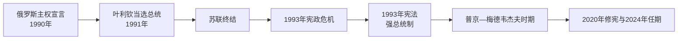

# 俄罗斯国家领导表

[返回俄罗斯](/%E4%BA%BA%E6%96%87%E7%A7%91%E5%AD%A6/%E5%8E%86%E5%8F%B2/%E6%AC%A7%E6%B4%B2/%E6%96%AF%E6%8B%89%E5%A4%AB/%E4%B8%9C%E6%96%AF%E6%8B%89%E5%A4%AB/%E4%BF%84%E7%BD%97%E6%96%AF.md)

## 范围与核验日期

本表覆盖俄罗斯苏维埃联邦社会主义共和国在苏联末期取得主权机构以后，到俄罗斯联邦的总统与政府首脑，截止2026年7月14日。总统、代理总统、总理和短期代理总理分别列出；1993年宪政危机中的相互罢免主张在备注中标明，不把争议夺权写成无争议继任。

## 国家元首完整表

| 顺序 | 国家元首 | 任期 | 地位与关键事件 |
| --- | --- | --- | --- |
| 1 | **鲍里斯・叶利钦** | 1991年7月10日—1999年12月31日 | 先为俄罗斯苏维埃联邦社会主义共和国首位民选总统，1991年12月后为俄罗斯联邦总统；推动市场转型，经历1993年武装宪政冲突和1996年连任，因健康与政治压力提前辞职。 |
| — | 亚历山大・鲁茨科伊 | 1993年9月22日—10月4日自称代总统 | 副总统；最高苏维埃认定叶利钦解散议会违宪后宣誓代行。叶利钦政府不承认，两套权力主张以军队攻占白宫终结；列为争议状态，不纳入正常总统编号。 |
| 2 | **弗拉基米尔・普京** | 1999年12月31日—2000年5月7日代理；2000年5月7日—2008年5月7日正式 | 叶利钦辞职后依宪法代理，2000、2004年当选；重建中央对地区和战略行业的控制，第二次车臣战争与安全机构影响扩大。 |
| 3 | 德米特里・梅德韦杰夫 | 2008年5月7日—2012年5月7日 | 总统；普京任总理。总统任期在其任内由四年改为六年，适用于后续当选者。 |
| 4 | **弗拉基米尔・普京** | 2012年5月7日至今 | 2012、2018、2024年当选并就任；2020年修宪重置既往任期计算。截止2026年7月14日仍为总统，现任期始于2024年5月7日。 |

## 政府首脑完整表

| 顺序 | 政府首脑 | 任期 | 正式 / 代理及说明 |
| --- | --- | --- | --- |
| 1 | 伊万・西拉耶夫 | 1990年6月15日—1991年9月26日 | 俄罗斯苏维埃联邦部长会议主席；联盟末期转任跨共和国经济协调职务。 |
| 2 | 奥列格・洛博夫 | 1991年9月26日—11月15日代理 | 第一副主席代理政府首脑。 |
| 3 | 鲍里斯・叶利钦 | 1991年11月6日—1992年6月15日兼任 | 总统直接领导经济改革政府。 |
| 4 | **叶戈尔・盖达尔** | 1992年6月15日—12月14日代理 | 第一副总理代行政府主席；价格自由化和私有化的“休克疗法”核心人物，未获议会正式确认。 |
| 5 | 维克托・切尔诺梅尔金 | 1992年12月14日—1998年3月23日 | 长期总理，推动能源部门与中央财政重组。 |
| 6 | 鲍里斯・叶利钦 | 1998年3月23日—5月8日临时兼理 | 解散切尔诺梅尔金政府后，在基里延科获确认前履行政府首脑职责。 |
| 7 | 谢尔盖・基里延科 | 1998年5月8日—8月23日 | 俄罗斯金融危机中政府违约并让卢布贬值，内阁被解散。 |
| 8 | 维克托・切尔诺梅尔金 | 1998年8月23日—9月11日代理 / 被提名 | 叶利钦两次提名复任均遭国家杜马反对，短期主持过渡。 |
| 9 | 叶夫根尼・普里马科夫 | 1998年9月11日—1999年5月12日 | 危机稳定政府，获跨党派支持，后与总统关系恶化。 |
| 10 | 谢尔盖・斯捷帕申 | 1999年5月12日—8月9日 | 任期短；第二次车臣战争前夕被撤换。 |
| 11 | 弗拉基米尔・普京 | 1999年8月9日代理、8月16日—2000年5月7日正式 | 由安全会议秘书升任；代理总统后总理职务由卡西亚诺夫代行。 |
| 12 | 米哈伊尔・卡西亚诺夫 | 2000年5月7日代理、5月17日—2004年2月24日正式 | 普京首任总统时期总理。 |
| 13 | 维克托・赫里斯坚科 | 2004年2月24日—3月5日代理 | 卡西亚诺夫政府解散后的短期代理。 |
| 14 | 米哈伊尔・弗拉德科夫 | 2004年3月5日—2007年9月14日 | 行政改革与能源收入上升时期。 |
| 15 | 维克托・祖布科夫 | 2007年9月14日—2008年5月8日 | 总统换届前过渡总理。 |
| 16 | **弗拉基米尔・普京** | 2008年5月8日—2012年5月7日 | 梅德韦杰夫任总统时期政府首脑；应对全球金融危机。 |
| 17 | 德米特里・梅德韦杰夫 | 2012年5月8日—2020年1月16日 | 普京重任总统后长期总理；2020年修宪方案公布时内阁总辞。 |
| 18 | **米哈伊尔・米舒斯京** | 2020年1月16日至今 | 2024年5月10日获再任；截止2026年7月14日仍为总理。 |
| — | 安德烈・别洛乌索夫 | 2020年4月30日—5月19日代理 | 米舒斯京感染新冠期间短期代行，不构成一次正式组阁。 |

## 实际权力结构

- 1993年宪法确立强总统制：总统任命总理须经国家杜马批准，并主导外交、安全和军队；政府负责行政和经济政策。
- 1999年以后，总统办公厅、安全会议、联邦安全系统、国有战略企业及执政党共同构成权力网络。总理重要但通常不独立决定政治路线。
- 2008—2012年梅德韦杰夫任总统、普京任总理，法定权力依宪法分立；实际政治影响需结合二人和执政精英网络判断，不能把总理自动写成国家元首。
- 联邦主体直选与任命制度多次变化，中央财政和法律监督加强，形成比1990年代更集中的联邦关系。

## 争议与核验说明

- 2022年俄罗斯宣布吞并乌克兰顿涅茨克、卢甘斯克、扎波罗热和赫尔松四州，并继续主张2014年吞并的克里米亚；联合国大会不承认这些领土变更。俄罗斯任命的占领区官员不列入俄罗斯联邦国家领导表。
- 总统与总理现任信息分别按俄罗斯总统和政府官方名录核验至2026年7月14日；职位事实与对选举、公民权利及战争合法性的评价分开陈述。

## 相关笔记

- 国家发展与重大事件见[俄罗斯](/%E4%BA%BA%E6%96%87%E7%A7%91%E5%AD%A6/%E5%8E%86%E5%8F%B2/%E6%AC%A7%E6%B4%B2/%E6%96%AF%E6%8B%89%E5%A4%AB/%E4%B8%9C%E6%96%AF%E6%8B%89%E5%A4%AB/%E4%BF%84%E7%BD%97%E6%96%AF.md)。
- 前置体制见[苏联国家领导表](/%E4%BA%BA%E6%96%87%E7%A7%91%E5%AD%A6/%E5%8E%86%E5%8F%B2/%E6%AC%A7%E6%B4%B2/%E6%96%AF%E6%8B%89%E5%A4%AB/%E4%B8%9C%E6%96%AF%E6%8B%89%E5%A4%AB/%E8%8B%8F%E8%81%94%E5%9B%BD%E5%AE%B6%E9%A2%86%E5%AF%BC%E8%A1%A8.md)。
- 对照乌克兰见[乌克兰国家领导表](/%E4%BA%BA%E6%96%87%E7%A7%91%E5%AD%A6/%E5%8E%86%E5%8F%B2/%E6%AC%A7%E6%B4%B2/%E6%96%AF%E6%8B%89%E5%A4%AB/%E4%B8%9C%E6%96%AF%E6%8B%89%E5%A4%AB/%E4%B9%8C%E5%85%8B%E5%85%B0%E5%9B%BD%E5%AE%B6%E9%A2%86%E5%AF%BC%E8%A1%A8.md)。
