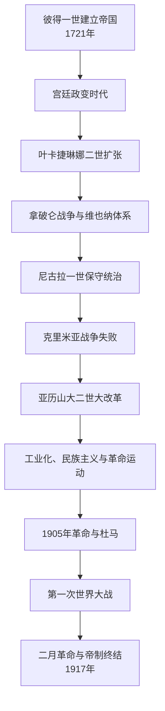

# 俄罗斯帝国

## 时间

1721年11月2日—1917年3月15/16日（新历）；二月革命中尼古拉二世退位、米哈伊尔拒绝立即受位后帝制终结。

## 概括

俄罗斯帝国是横跨东欧、北亚、高加索、中亚和北美一度拥有领地的多民族大陆帝国。它以皇帝、官僚、军队、东正教会和等级社会为支柱，依农奴农业、矿业、商业与19世纪后期工业化支撑扩张。彼得一世使俄国进入欧洲列强体系，叶卡捷琳娜二世和亚历山大一世时期达到军事外交高峰；克里米亚战争暴露制度落后后，亚历山大二世改革农奴、司法、地方自治和军队。改革不彻底、民族与土地问题、专制政治和快速工业化矛盾累积，第一次世界大战最终击穿运输、供应、军心和统治联盟。

## 帝国建立与制度

彼得一世在大北方战争后采用皇帝称号，建立参议院、院部、省制、等级表和神圣宗教会议。贵族须服役，国家以征兵、人头税和国营工场维持军队。改革借鉴欧洲制度，却由上而下强制推进；圣彼得堡是面向波罗的海的新首都，也以大量劳役和生命建成。

皇位继承在彼得1722年法令下可由君主任意指定，他却未指定继承者，造成近卫军、宫廷贵族和皇室女性影响继承。1725—1762年更替频繁，并不意味着国家机关停摆；军队、参议院和贵族服役体系继续运转。保罗一世1797年改为男性优先长子继承，之后王位交接较稳定。

## 分阶段发展

### 1725—1762年：宫廷政变与列强地位巩固

叶卡捷琳娜一世、彼得二世、安娜、幼主伊凡六世、伊丽莎白和彼得三世相继即位。近卫军和宫廷集团决定多次废立。帝国参加波兰王位继承战争、俄土战争和七年战争，军事实力增长；贵族逐步免除强制服役、扩大对农奴控制。

### 叶卡捷琳娜二世：扩张与贵族帝国

- 1762年政变后即位，以启蒙语言、立法委员会和教育文化塑造合法性，但没有废除农奴制。
- 对奥斯曼战争使俄国取得黑海北岸影响，1783年吞并克里米亚汗国；新城、港口和移民政策改变草原人口结构。
- 三次瓜分波兰使白俄罗斯、立陶宛、右岸乌克兰等地并入帝国。各地法律、宗教和土地制度并非立即统一。
- 1773—1775年普加乔夫起义汇集哥萨克、农民、工人和非俄罗斯族群不满；镇压后地方行政和贵族控制加强。
- 1764年废除左岸酋长职位，1775年摧毁扎波罗热塞契，1780年代把哥萨克自治分阶段纳入省制。

### 1801—1855年：拿破仑战争与保守秩序

亚历山大一世早期改革部制和教育，1809年吞并芬兰后保留大公国制度；对拿破仑战争经历1807年妥协、1812年入侵和1814年进入巴黎。维也纳体系后俄国成为欧洲秩序主要维护者。1825年继承秘密和军官不满引发十二月党人起义，尼古拉一世镇压并强化“东正教、专制、民族性”意识形态。

帝国继续进入高加索并压制波兰1830—1831年起义。官僚和军队庞大，但铁路、金融、教育与军事技术落后于西欧。1853—1856年克里米亚战争在后勤、武器和联盟上失败，证明农奴制国家难以维持现代战争。

### 1855—1881年：大改革

- 1861年农奴解放使约两千多万地主农民取得人身自由，但土地由村社分配并承担赎买，地主保留大量优质土地；改革既释放劳动力，也留下土地不足和债务。
- 地方自治会议、司法公开、陪审制度、军役普及和大学改革提高行政能力。
- 帝国完成高加索战争、进入中亚；扩张伴随迁徙、军事征服和差别治理。
- 波兰1863年起义后俄罗斯化加强；乌克兰语出版和教育受价值夫通令、埃姆斯法令限制。
- 民粹派认为改革不足，部分组织转向恐怖主义；1881年亚历山大二世被“民意党”刺杀。

### 1881—1905年：反改革与工业化

亚历山大三世收紧自治、大学和新闻，推行俄罗斯化。国家主导铁路、煤炭、冶金、石油和外资工业，西伯利亚大铁路连接帝国。城市工人增长、工作条件恶劣，农民土地压力和周期性饥荒持续。民族、宗教和地区政策差异很大，犹太人受定居区和配额限制，并遭暴力迫害。

### 1905—1914年：革命、杜马与有限宪政

日俄战争失败、1905年“流血星期日”、罢工、农民暴动和军队哗变迫使尼古拉二世发布十月宣言。国家杜马和政党合法化出现，但1906年基本法仍保留皇帝对政府、军队、外交和解散议会的强权。斯托雷平镇压革命同时推动土地改革，试图培育独立农户；改革在地区和社会层面成效不均，他1911年遇刺。

### 1914—1917年：世界大战与崩溃

战争初期爱国动员迅速转为巨大伤亡、难民、通胀和运输危机。军工业后期增产，却无法解决铁路、粮食分配和政治信任。1915年尼古拉二世亲任最高统帅，把军事失败直接同王权联系；首都政府频繁更换，皇后与拉斯普京影响的传闻削弱威望。1917年彼得格勒面包短缺、女工示威、总罢工和驻军哗变结合，杜马临时委员会与工兵代表苏维埃同时出现，军方高层建议皇帝退位。

## 帝国治理与地区差异

| 地区 / 结构 | 治理方式与影响 |
| --- | --- |
| 俄罗斯核心省 | 官僚省制、地主庄园和村社构成基层；农奴制1861年后仍留下土地共同体。 |
| 波兰王国 | 1815年有宪法和自治，1830、1863年起义后权利收缩并俄罗斯化。 |
| 芬兰大公国 | 保留法律、议会、货币等较多制度，19世纪末俄罗斯化引发抵抗。 |
| 波罗的海省 | 德意志贵族长期保留地方特权和路德宗传统，后期语言政策变化。 |
| 乌克兰地区 | 左岸自治被取消；南部殖民开发、工业化和城市多族群；乌克兰语言文化受限制但民族运动成长。 |
| 白俄罗斯与立陶宛 | 瓜分波兰后并入，土地贵族、天主教、东正教和语言政策交错；1863年后控制加强。 |
| 高加索与中亚 | 军事征服、总督制、保护国和地方法并存；土地迁移和殖民造成深远冲突。 |
| 西伯利亚与远东 | 堡垒、流放、移民、原住民贡赋和铁路扩张；与清朝、日本及太平洋贸易相关。 |

## 重要事件

| 时间 | 事件 | 影响 |
| --- | --- | --- |
| 1721年 | 帝国称号确立 | 进入欧洲列强体系。 |
| 1762年 | 叶卡捷琳娜政变 | 贵族—近卫军政治高峰。 |
| 1773—1775年 | 普加乔夫起义 | 边疆与农奴制矛盾集中爆发。 |
| 1772、1793、1795年 | 瓜分波兰 | 获白俄罗斯、立陶宛和右岸乌克兰等地。 |
| 1812年 | 拿破仑入侵 | 帝国动员和国际声望高峰。 |
| 1825年 | 十二月党人起义 | 军官立宪运动被镇压。 |
| 1853—1856年 | 克里米亚战争 | 制度落后暴露，推动改革。 |
| 1861年 | 废除农奴制 | 社会经济转型但土地问题未解。 |
| 1881年 | 亚历山大二世遇刺 | 政治反改革。 |
| 1904—1905年 | 日俄战争 | 军事失败触发革命。 |
| 1905年 | 十月宣言与杜马 | 有限代议制形成。 |
| 1914—1917年 | 第一次世界大战 | 供应、财政、军队和合法性崩溃。 |
| 1917年3月 | 二月革命与退位 | 帝制直接终结。 |

## 鼎盛与衰落原因

### 鼎盛条件

庞大人口与资源、服役贵族和征兵军队、国家财政、边疆对手分裂、欧洲军事技术吸收及灵活的差别治理，使帝国持续扩张。1812年后，俄军与外交联盟把帝国推到欧洲均势核心。

### 结构性衰落

- 农奴制和地主秩序阻碍农业生产率、社会流动与国内市场；
- 官僚规模扩大但责任机制弱，皇帝坚持任命政府而拒绝真正议会负责制；
- 工业化集中于少数城市，工人政治动员快于社会保障；
- 土地不足、民族权利、语言宗教政策和边疆殖民造成多重反对；
- 军队现代化和铁路后勤不足以支撑长期总体战。

### 外部压力与直接触发

日俄战争削弱威望，第一次世界大战造成决定性压力。1917年并非单纯因某个宫廷人物或一次面包短缺：前线伤亡、铁路拥堵、通胀、首都供应、政府失信和精英分裂长期积累；彼得格勒驻军拒绝镇压并倒戈，是直接权力转折。尼古拉退位、米哈伊尔有条件拒受皇位，使王朝法律连续性中止。

## 君主世系

完整皇帝、女皇、共治、摄政、宫廷政变和1917年继承危机见[俄罗斯沙皇与皇帝世系表](/%E4%BA%BA%E6%96%87%E7%A7%91%E5%AD%A6/%E5%8E%86%E5%8F%B2/%E6%AC%A7%E6%B4%B2/%E6%96%AF%E6%8B%89%E5%A4%AB/%E4%B8%9C%E6%96%AF%E6%8B%89%E5%A4%AB/%E4%BF%84%E7%BD%97%E6%96%AF%E6%B2%99%E7%9A%87%E4%B8%8E%E7%9A%87%E5%B8%9D%E4%B8%96%E7%B3%BB%E8%A1%A8.md)。

## 演变关系

- 前一节点：[沙皇俄国](/%E4%BA%BA%E6%96%87%E7%A7%91%E5%AD%A6/%E5%8E%86%E5%8F%B2/%E6%AC%A7%E6%B4%B2/%E6%96%AF%E6%8B%89%E5%A4%AB/%E4%B8%9C%E6%96%AF%E6%8B%89%E5%A4%AB/%E6%B2%99%E7%9A%87%E4%BF%84%E5%9B%BD.md)、[哥萨克酋长国](/%E4%BA%BA%E6%96%87%E7%A7%91%E5%AD%A6/%E5%8E%86%E5%8F%B2/%E6%AC%A7%E6%B4%B2/%E6%96%AF%E6%8B%89%E5%A4%AB/%E4%B8%9C%E6%96%AF%E6%8B%89%E5%A4%AB/%E5%93%A5%E8%90%A8%E5%85%8B%E9%85%8B%E9%95%BF%E5%9B%BD.md)。
- 后续不是单线：二月革命后的临时政府、各民族政权和内战并起；本目录主线见[苏俄与苏联](/%E4%BA%BA%E6%96%87%E7%A7%91%E5%AD%A6/%E5%8E%86%E5%8F%B2/%E6%AC%A7%E6%B4%B2/%E6%96%AF%E6%8B%89%E5%A4%AB/%E4%B8%9C%E6%96%AF%E6%8B%89%E5%A4%AB/%E8%8B%8F%E4%BF%84%E4%B8%8E%E8%8B%8F%E8%81%94.md)、[乌克兰苏维埃政权](/%E4%BA%BA%E6%96%87%E7%A7%91%E5%AD%A6/%E5%8E%86%E5%8F%B2/%E6%AC%A7%E6%B4%B2/%E6%96%AF%E6%8B%89%E5%A4%AB/%E4%B8%9C%E6%96%AF%E6%8B%89%E5%A4%AB/%E4%B9%8C%E5%85%8B%E5%85%B0%E8%8B%8F%E7%BB%B4%E5%9F%83%E6%94%BF%E6%9D%83.md)、[白俄罗斯苏维埃政权](/%E4%BA%BA%E6%96%87%E7%A7%91%E5%AD%A6/%E5%8E%86%E5%8F%B2/%E6%AC%A7%E6%B4%B2/%E6%96%AF%E6%8B%89%E5%A4%AB/%E4%B8%9C%E6%96%AF%E6%8B%89%E5%A4%AB/%E7%99%BD%E4%BF%84%E7%BD%97%E6%96%AF%E8%8B%8F%E7%BB%B4%E5%9F%83%E6%94%BF%E6%9D%83.md)。
