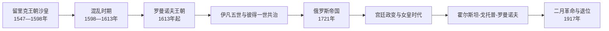

# 俄罗斯沙皇与皇帝世系表

[返回沙皇俄国](/%E4%BA%BA%E6%96%87%E7%A7%91%E5%AD%A6/%E5%8E%86%E5%8F%B2/%E6%AC%A7%E6%B4%B2/%E6%96%AF%E6%8B%89%E5%A4%AB/%E4%B8%9C%E6%96%AF%E6%8B%89%E5%A4%AB/%E6%B2%99%E7%9A%87%E4%BF%84%E5%9B%BD.md) · [返回俄罗斯帝国](/%E4%BA%BA%E6%96%87%E7%A7%91%E5%AD%A6/%E5%8E%86%E5%8F%B2/%E6%AC%A7%E6%B4%B2/%E6%96%AF%E6%8B%89%E5%A4%AB/%E4%B8%9C%E6%96%AF%E6%8B%89%E5%A4%AB/%E4%BF%84%E7%BD%97%E6%96%AF%E5%B8%9D%E5%9B%BD.md)

## 范围与称号

本表从伊凡四世1547年正式加冕“全罗斯沙皇”起，连续列至尼古拉二世1917年退位。彼得一世1721年改称“全俄罗斯皇帝”，但中文常把帝国时代君主继续称作“沙皇”。表中分别写明法定君主、共治、摄政、废立和空位政府，避免把“混乱时期”或“宫廷政变时代”合并为无主过渡。

## 沙皇俄国：1547—1721年

| 顺序 | 君主 / 统治机构 | 在位 | 王室、继承关系 | 关键事件与备注 |
| --- | --- | --- | --- | --- |
| 1 | **伊凡四世“雷帝”** | 1547—1584年 | 留里克王朝；瓦西里三世之子 | 首位正式加冕全罗斯沙皇；征服喀山、阿斯特拉罕，开启西伯利亚方向；特辖制、利沃尼亚战争和王朝继承危机削弱国家。 |
| 2 | 费奥多尔一世 | 1584—1598年 | 伊凡四世之子 | 名义统治，内兄鲍里斯・戈东诺夫掌握多数政务；无嗣而死，莫斯科留里克主支断绝。 |
| 3 | **鲍里斯・戈东诺夫** | 1598—1605年 | 非留里克王族；缙绅会议选举 | 饥荒、社会流动与伪德米特里挑战引发合法性崩溃；突然去世。 |
| 4 | 费奥多尔二世・戈东诺夫 | 1605年4—6月 | 鲍里斯之子 | 在位约两月，被倒戈者杀死。 |
| 5 | 伪德米特里一世 | 1605—1606年 | 自称伊凡四世幼子德米特里 | 借波兰—立陶宛贵族支持入主；宫廷政变中被杀，身份一般视为冒名者。 |
| 6 | 瓦西里四世・舒伊斯基 | 1606—1610年 | 留里克王朝舒伊斯基支；贵族拥立 | 面对波洛特尼科夫起事、第二伪德米特里及波兰干预；被贵族废黜并送往波兰。 |
| 7 | 七波雅尔政府 | 1610—1612/1613年 | 以费奥多尔・姆斯季斯拉夫斯基为首的贵族委员会 | 承认波兰王子瓦迪斯瓦夫为候选沙皇但未完成东正教加冕；莫斯科一度由波兰军控制。 |
| 8 | 瓦迪斯瓦夫・瓦萨（未加冕争位者） | 1610—1634年保留主张；未实际作为俄国沙皇统治 | 波兰国王齐格蒙特三世之子 | 部分波雅尔宣誓拥戴，但因宗教、驻军和父王政策未能即位；仅列争议主张，不计入正式顺序。 |
| 9 | **米哈伊尔・费奥多罗维奇** | 1613—1645年 | 罗曼诺夫王朝创立者；缙绅会议选举 | 重建财政和地方秩序；父亲菲拉列特牧首1619—1633年返国后作为“伟大君主”共同主持政务。 |
| 10 | 阿列克谢・米哈伊洛维奇 | 1645—1676年 | 米哈伊尔之子 | 1649年法典强化农奴制和中央官僚；教会改革导致旧礼仪派分裂；与哥萨克酋长国结盟并同联邦长期战争。 |
| 11 | 费奥多尔三世 | 1676—1682年 | 阿列克谢长子之一 | 废除军职门第制，尝试行政和军制改革；无存活子嗣。 |
| 12 | 伊凡五世与**彼得一世**共治 | 1682—1696年 | 阿列克谢两段婚姻所生的异母兄弟 | 射击军危机后并立两位沙皇；索菲娅・阿列克谢耶夫娜1682—1689年摄政，伊凡健康欠佳，彼得逐步掌权。 |
| 13 | **彼得一世“大帝”** | 1696—1721年单独为沙皇 | 伊凡五世去世后单独统治 | 使节团、军政税制与教会改革；大北方战争取得波罗的海出海口，迁建圣彼得堡；1721年改称皇帝。 |

## 俄罗斯帝国：1721—1917年

| 顺序 | 皇帝 / 女皇 | 在位 | 与前任关系、即位方式 | 关键事件与备注 |
| --- | --- | --- | --- | --- |
| 1 | **彼得一世** | 1721—1725年 | 由沙皇改称全俄罗斯皇帝 | 建立参议院、院部和等级表体系；未明确可持续的继承安排，死后进入多次宫廷政变。 |
| 2 | 叶卡捷琳娜一世 | 1725—1727年 | 彼得一世皇后；近卫军和缅希科夫拥立 | 最高秘密委员会掌握重要决策；指定彼得二世继位。 |
| 3 | 彼得二世 | 1727—1730年 | 彼得一世之孙、皇太子阿列克谢之子 | 幼年受缅希科夫及多尔戈鲁基家族影响；未婚无嗣，死于天花。 |
| 4 | 安娜・伊万诺芙娜 | 1730—1740年 | 伊凡五世之女；最高秘密委员会邀请 | 撕毁限制君权的“条件”，恢复专制；指定幼儿伊凡六世为继承人。 |
| 5 | 伊凡六世 | 1740—1741年 | 安娜的外甥女安娜・利奥波尔多芙娜之子 | 两月婴儿即位；比伦短期摄政，后由其母摄政；伊丽莎白政变废黜，此后长期囚禁并于1764年被杀。 |
| 6 | 伊丽莎白・彼得罗芙娜 | 1741—1762年 | 彼得一世之女；近卫军政变 | 对外参加七年战争，国内延续贵族特权和文化建设；无婚生子，指定外甥彼得继位。 |
| 7 | 彼得三世 | 1762年1—7月 | 彼得一世外孙，霍尔斯坦-戈托普家族 | 退出七年战争、发布贵族自由令；被妻子叶卡捷琳娜支持的政变推翻，随后死亡。 |
| 8 | **叶卡捷琳娜二世“大帝”** | 1762—1796年 | 彼得三世皇后；政变即位 | 扩张至黑海、克里米亚和波兰旧地；1775年撤销扎波罗热塞契，行政集中与贵族特权并进；普加乔夫起义暴露边疆矛盾。 |
| 9 | 保罗一世 | 1796—1801年 | 叶卡捷琳娜二世之子 | 1797年确立男性优先的王位继承法；军纪和贵族政策引发反弹，宫廷政变中被杀。 |
| 10 | 亚历山大一世 | 1801—1825年 | 保罗长子 | 1812年抵抗拿破仑并进入巴黎；维也纳体系重要君主；晚年继承文件秘密，死后引发空位误判。 |
| 11 | 康斯坦丁・巴甫洛维奇（放弃继承） | 1825年权利争议期 | 亚历山大之弟，早已秘密放弃 | 部分军政机关一度向其宣誓；本人未即位，不能列为正式皇帝，但其放弃未公开促成十二月党人危机。 |
| 12 | 尼古拉一世 | 1825—1855年 | 亚历山大之弟 | 镇压十二月党人；强化官僚、警察和意识形态控制；克里米亚战争中的制度弱点在其死时集中暴露。 |
| 13 | **亚历山大二世“解放者”** | 1855—1881年 | 尼古拉一世长子 | 1861年废除农奴制，推进司法、地方自治和军事改革；帝国扩张中亚；被民意党刺杀。 |
| 14 | 亚历山大三世 | 1881—1894年 | 亚历山大二世之子 | 收紧政治控制、推进俄罗斯化，同时工业化与铁路建设加速；未经历对外大战。 |
| 15 | **尼古拉二世** | 1894—1917年3月15日（新历） | 亚历山大三世之子 | 日俄战争、1905年革命、杜马体制和第一次世界大战；二月革命中退位。 |
| 16 | 米哈伊尔・亚历山德罗维奇（有条件拒受皇位） | 1917年3月15—16日继承危机 | 尼古拉二世之弟 | 尼古拉为自己和儿子退位并指向米哈伊尔；米哈伊尔声明须待制宪会议决定才接受权力，未加冕、未实际统治，通常不计正式皇帝。 |

## 摄政与实际权力表

| 时段 | 法定君主 | 摄政 / 实际权力核心 | 说明 |
| --- | --- | --- | --- |
| 1584—1598年 | 费奥多尔一世 | 鲍里斯・戈东诺夫及杜马集团 | 费奥多尔保留王权，戈东诺夫主导外交与行政。 |
| 1619—1633年 | 米哈伊尔 | 菲拉列特牧首 | 父子共同使用“伟大君主”礼仪，菲拉列特主导多项政务。 |
| 1682—1689年 | 伊凡五世、彼得一世 | 索菲娅公主摄政 | 1689年彼得阵营夺权；伊凡仍保留共治沙皇名义至1696年。 |
| 1725—1730年 | 叶卡捷琳娜一世、彼得二世 | 最高秘密委员会 | 宫廷贵族与近卫军影响继承。 |
| 1740—1741年 | 伊凡六世 | 比伦，后安娜・利奥波尔多芙娜 | 两次摄政均被政变终止。 |
| 1915—1917年 | 尼古拉二世 | 皇帝兼任最高统帅，首都政府频繁更换 | 宫廷、杜马、军方和社会组织并无单一摄政者，战争失灵扩大统治危机。 |

## 王朝终结的层次

- 结构因素：农民土地问题、民族与边疆治理、工业社会劳资冲突、专制制度与现代政治动员不匹配。
- 外部压力：日俄战争和第一次世界大战造成军队伤亡、运输崩溃、通货膨胀与供应危机。
- 直接触发：1917年彼得格勒罢工、面包短缺、驻军哗变和杜马临时委员会形成，使皇帝失去首都与军政精英支持。
- 法律终点：尼古拉退位、米哈伊尔拒绝立即受位，临时政府接管中央权力；并不是一名新沙皇被正常继承。

## 相关笔记

- 1547—1721年的过程见[沙皇俄国](/%E4%BA%BA%E6%96%87%E7%A7%91%E5%AD%A6/%E5%8E%86%E5%8F%B2/%E6%AC%A7%E6%B4%B2/%E6%96%AF%E6%8B%89%E5%A4%AB/%E4%B8%9C%E6%96%AF%E6%8B%89%E5%A4%AB/%E6%B2%99%E7%9A%87%E4%BF%84%E5%9B%BD.md)。
- 1721—1917年的制度与兴衰见[俄罗斯帝国](/%E4%BA%BA%E6%96%87%E7%A7%91%E5%AD%A6/%E5%8E%86%E5%8F%B2/%E6%AC%A7%E6%B4%B2/%E6%96%AF%E6%8B%89%E5%A4%AB/%E4%B8%9C%E6%96%AF%E6%8B%89%E5%A4%AB/%E4%BF%84%E7%BD%97%E6%96%AF%E5%B8%9D%E5%9B%BD.md)。
- 前置世系见[莫斯科大公世系表](/%E4%BA%BA%E6%96%87%E7%A7%91%E5%AD%A6/%E5%8E%86%E5%8F%B2/%E6%AC%A7%E6%B4%B2/%E6%96%AF%E6%8B%89%E5%A4%AB/%E4%B8%9C%E6%96%AF%E6%8B%89%E5%A4%AB/%E8%8E%AB%E6%96%AF%E7%A7%91%E5%A4%A7%E5%85%AC%E4%B8%96%E7%B3%BB%E8%A1%A8.md)；革命后见[苏俄与苏联](/%E4%BA%BA%E6%96%87%E7%A7%91%E5%AD%A6/%E5%8E%86%E5%8F%B2/%E6%AC%A7%E6%B4%B2/%E6%96%AF%E6%8B%89%E5%A4%AB/%E4%B8%9C%E6%96%AF%E6%8B%89%E5%A4%AB/%E8%8B%8F%E4%BF%84%E4%B8%8E%E8%8B%8F%E8%81%94.md)。
